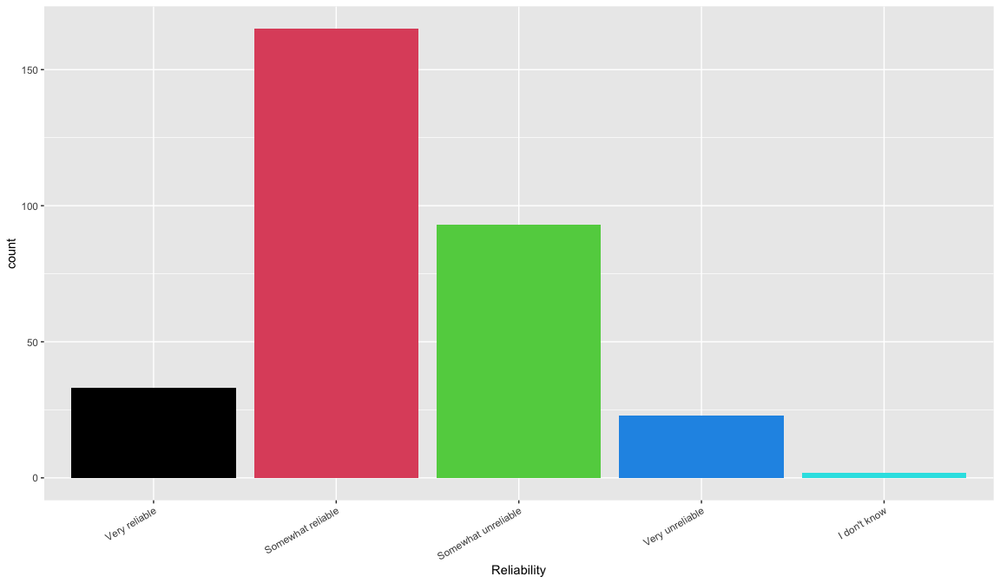
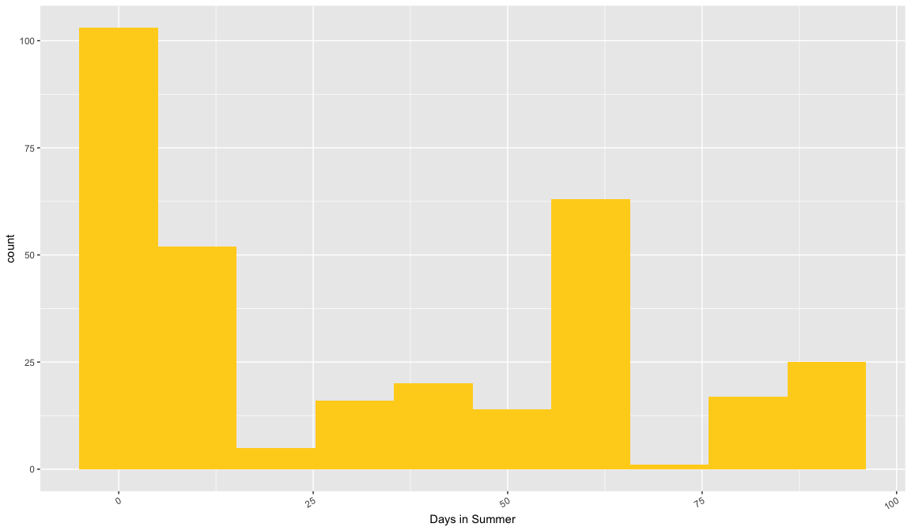
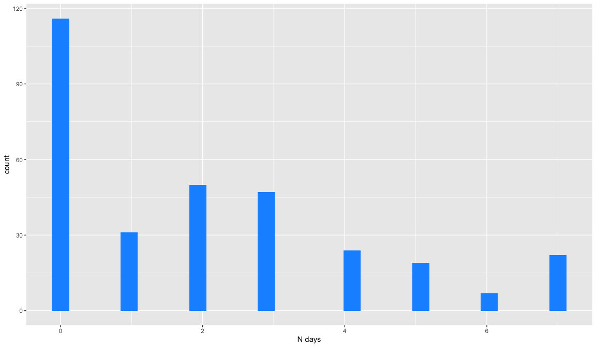

The INTErventions, Research, and Action in Cities Team (INTERACT) is a national research collaboration of scientists, urban planners, and engaged citizens uncovering how the design of our cities is shaping the health and wellbeing of Canadians (www.teaminteract.ca). INTERACT is conducting longitudinal, mixed-methods natural experiment studies in four Canadian cities, with the aim of providing evidence on the impacts of urban transformations on people's physical activity, social participation, and wellbeing, and inequalities in these outcomes. 

The Saskatoon study evaluates the impacts of a Bus Rapid Transit system (BRT) along three major roadways. Participants who rode the bus at least once in a typical month were eligible to participate. Exclusion criteria across all sites were being younger than 18 years old, not being able to read or write English (or English or French in Montreal) well enough to answer an online survey and any intention to move out of the region in the next two year.
Specific recruitment efforts were made to recruit participants who lived within a postal code that was within 800 m of the proposed BRT lines, but anyone in the city could participate. 

Recruitment ran from September 19th to December 27th, 2018 (100 days), using social media, partner networks, in-person recruitment at bus shelters, and media appearences. Participants received a $10 gift certificate upon completion of the Health Questionnaire. 

In Saskatoon, 316 participants completed the Health Questionnaire. 


## Section 1: Transportation 


### Which Saskatoon Transit Go Pass do you own?

```r
response_labels = c(
"Monthly adult pass",
"Eco Pass",
"UPass",
"Student Pass",
"Discounted Pass",
"Low Income Pass",
"I do not use a Go pass, I use a multi-use pass",
"I do not use a Go pass, I use cash",
"other"
)


ggplot(d, aes(x = factor(d$sask_bus_pass,
                         labels = response_labels))) + geom_bar(na.rm = TRUE, fill = 1:9, alpha = 0.65) + xlab("Pass type") + theme(axis.text.x = element_text(angle = 30, hjust = 1)) 
```

<!-- -->

```r
full_table <- table_maker(d,column_name = "sask_bus_pass", response_labels)
kable(full_table) %>%   kable_styling(bootstrap_options = "striped", full_width = T, position = "left") 
```

<table class="table table-striped" style="">
 <thead>
  <tr>
   <th style="text-align:left;"> Response </th>
   <th style="text-align:right;"> N </th>
   <th style="text-align:right;"> Percentage </th>
  </tr>
 </thead>
<tbody>
  <tr>
   <td style="text-align:left;"> Monthly adult pass </td>
   <td style="text-align:right;"> 60 </td>
   <td style="text-align:right;"> 18.99 </td>
  </tr>
  <tr>
   <td style="text-align:left;"> Eco Pass </td>
   <td style="text-align:right;"> 22 </td>
   <td style="text-align:right;"> 6.96 </td>
  </tr>
  <tr>
   <td style="text-align:left;"> UPass </td>
   <td style="text-align:right;"> 99 </td>
   <td style="text-align:right;"> 31.33 </td>
  </tr>
  <tr>
   <td style="text-align:left;"> Student Pass </td>
   <td style="text-align:right;"> 50 </td>
   <td style="text-align:right;"> 15.82 </td>
  </tr>
  <tr>
   <td style="text-align:left;"> Discounted Pass </td>
   <td style="text-align:right;"> 7 </td>
   <td style="text-align:right;"> 2.22 </td>
  </tr>
  <tr>
   <td style="text-align:left;"> Low Income Pass </td>
   <td style="text-align:right;"> 6 </td>
   <td style="text-align:right;"> 1.90 </td>
  </tr>
  <tr>
   <td style="text-align:left;"> I do not use a Go pass, I use a multi-use pass </td>
   <td style="text-align:right;"> 44 </td>
   <td style="text-align:right;"> 13.92 </td>
  </tr>
  <tr>
   <td style="text-align:left;"> I do not use a Go pass, I use cash </td>
   <td style="text-align:right;"> 18 </td>
   <td style="text-align:right;"> 5.70 </td>
  </tr>
  <tr>
   <td style="text-align:left;"> other </td>
   <td style="text-align:right;"> 10 </td>
   <td style="text-align:right;"> 3.16 </td>
  </tr>
</tbody>
</table>


### On a scale of 1 to 4, with 1 being 'very safe and 4 being 'very unsafe', overall, how safe do you think traveling by bus is in your city?


```r
response_labels <- c(
    "Very Safe",
    "Somewhat Safe",
    "Somewhat Unsafe",
    "Very Unsafe"
  )

ggplot(d, aes(x = factor(
  x = d$bus_safe,
  labels = response_labels
))) + geom_bar(na.rm = TRUE, fill = 1:4) + xlab("Safety") +
  theme(axis.text.x = element_text(angle = 30, hjust = 1))
```

<!-- -->

```r
full_table <- table_maker(d,column_name = "bus_safe", response_labels)

kable(full_table) %>%   kable_styling(bootstrap_options = "striped", full_width = T, position = "left")
```

<table class="table table-striped" style="">
 <thead>
  <tr>
   <th style="text-align:left;"> Response </th>
   <th style="text-align:right;"> N </th>
   <th style="text-align:right;"> Percentage </th>
  </tr>
 </thead>
<tbody>
  <tr>
   <td style="text-align:left;"> Very Safe </td>
   <td style="text-align:right;"> 137 </td>
   <td style="text-align:right;"> 43.35 </td>
  </tr>
  <tr>
   <td style="text-align:left;"> Somewhat Safe </td>
   <td style="text-align:right;"> 152 </td>
   <td style="text-align:right;"> 48.10 </td>
  </tr>
  <tr>
   <td style="text-align:left;"> Somewhat Unsafe </td>
   <td style="text-align:right;"> 21 </td>
   <td style="text-align:right;"> 6.65 </td>
  </tr>
  <tr>
   <td style="text-align:left;"> Very Unsafe </td>
   <td style="text-align:right;"> 6 </td>
   <td style="text-align:right;"> 1.90 </td>
  </tr>
</tbody>
</table>


### On a scale of 1 to 4, with 1 being 'very reliable' and 4 being 'very unreliable', overall, how reliable do you think traveling by bus is in your city?


```r
response_labels <- c(
    "Very reliable",
    "Somewhat reliable",
    "Somewhat unreliable",
    "Very unreliable",
    "I don't know"
  )
ggplot(d, aes(x = factor(
  x = d$bus_reliable,
  labels = response_labels
))) + geom_bar(na.rm = TRUE, fill = 1:5) + xlab("Reliability") +
  theme(axis.text.x = element_text(angle = 30, hjust = 1))
```

<!-- -->

```r
full_table <- table_maker(d,column_name = "bus_reliable", response_labels)

kable(full_table) %>%   kable_styling(bootstrap_options = "striped", full_width = T, position = "left")
```

<table class="table table-striped" style="">
 <thead>
  <tr>
   <th style="text-align:left;"> Response </th>
   <th style="text-align:right;"> N </th>
   <th style="text-align:right;"> Percentage </th>
  </tr>
 </thead>
<tbody>
  <tr>
   <td style="text-align:left;"> Very reliable </td>
   <td style="text-align:right;"> 33 </td>
   <td style="text-align:right;"> 10.44 </td>
  </tr>
  <tr>
   <td style="text-align:left;"> Somewhat reliable </td>
   <td style="text-align:right;"> 165 </td>
   <td style="text-align:right;"> 52.22 </td>
  </tr>
  <tr>
   <td style="text-align:left;"> Somewhat unreliable </td>
   <td style="text-align:right;"> 93 </td>
   <td style="text-align:right;"> 29.43 </td>
  </tr>
  <tr>
   <td style="text-align:left;"> Very unreliable </td>
   <td style="text-align:right;"> 23 </td>
   <td style="text-align:right;"> 7.28 </td>
  </tr>
  <tr>
   <td style="text-align:left;"> I don't know </td>
   <td style="text-align:right;"> 2 </td>
   <td style="text-align:right;"> 0.63 </td>
  </tr>
</tbody>
</table>


### On a scale of 1 to 4, with 1 being 'very convenient' and 4 being very inconvenient', overall, how convenient do you think traveling by bus is in your city?


```r
response_labels <- c(
      "Very convenient",
      "Somewhat convenient",
      "Somewhat inconvenient",
      "Very inconvenient",
      "I don't know"
      )
ggplot(d, aes(x = factor(x = d$bus_convenient, labels = response_labels))) +
      geom_bar(na.rm = TRUE, fill = 1:5) + xlab("Convenience") +
      theme(axis.text.x = element_text(angle = 30, hjust = 1))
```

<!-- -->

```r
full_table <- table_maker(d, column_name = "bus_reliable", response_labels)
kable(full_table) %>%   kable_styling(bootstrap_options = "striped", full_width = T, position = "left")
```

<table class="table table-striped" style="">
 <thead>
  <tr>
   <th style="text-align:left;"> Response </th>
   <th style="text-align:right;"> N </th>
   <th style="text-align:right;"> Percentage </th>
  </tr>
 </thead>
<tbody>
  <tr>
   <td style="text-align:left;"> Very convenient </td>
   <td style="text-align:right;"> 33 </td>
   <td style="text-align:right;"> 10.44 </td>
  </tr>
  <tr>
   <td style="text-align:left;"> Somewhat convenient </td>
   <td style="text-align:right;"> 165 </td>
   <td style="text-align:right;"> 52.22 </td>
  </tr>
  <tr>
   <td style="text-align:left;"> Somewhat inconvenient </td>
   <td style="text-align:right;"> 93 </td>
   <td style="text-align:right;"> 29.43 </td>
  </tr>
  <tr>
   <td style="text-align:left;"> Very inconvenient </td>
   <td style="text-align:right;"> 23 </td>
   <td style="text-align:right;"> 7.28 </td>
  </tr>
  <tr>
   <td style="text-align:left;"> I don't know </td>
   <td style="text-align:right;"> 2 </td>
   <td style="text-align:right;"> 0.63 </td>
  </tr>
</tbody>
</table>


### How often do you typically travel by bus during each season? {.tabset .tabset-fade}
   
#### Fall


```r
ggplot(d, aes(x = d$bus_freq_a
)) + geom_histogram(na.rm = TRUE,bins = 10, fill = "#E5364D") + xlab("Days in Fall") +
  theme(axis.text.x = element_text(angle = 30, hjust = 1))
```

<!-- -->

```r
summary(d$bus_freq_a)
```

```
##    Min. 1st Qu.  Median    Mean 3rd Qu.    Max. 
##    0.00   30.00   65.00   52.77   65.00   91.00
```
 
#### Winter
    

```r
ggplot(d, aes(x = d$bus_freq_b
)) + geom_histogram(na.rm = TRUE,bins = 10, fill = "#1596FF") + xlab("Days in Winter") +
  theme(axis.text.x = element_text(angle = 30, hjust = 1))
```

<!-- -->

```r
summary(d$bus_freq_b)
```

```
##    Min. 1st Qu.  Median    Mean 3rd Qu.    Max. 
##    0.00   39.00   65.00   55.65   65.00   91.00
```


#### Spring

```r
ggplot(d, aes(x = d$bus_freq_c
)) + geom_histogram(na.rm = TRUE,bins = 10, fill = "#76D24A") + xlab("Days in Spring") +
  theme(axis.text.x = element_text(angle = 30, hjust = 1))
```

<!-- -->

```r
summary(d$bus_freq_c)
```

```
##    Min. 1st Qu.  Median    Mean 3rd Qu.    Max. 
##    0.00   26.00   65.00   48.02   65.00   91.00
```


#### Summer

```r
ggplot(d, aes(x = d$bus_freq_d
)) + geom_histogram(na.rm = TRUE,bins = 10, fill = "#FFD21F") + xlab("Days in Summer") +
  theme(axis.text.x = element_text(angle = 30, hjust = 1))
```

<!-- -->

```r
summary(d$bus_freq_d)
```

```
##    Min. 1st Qu.  Median    Mean 3rd Qu.    Max. 
##     0.0     0.0    24.0    33.1    65.0    91.0
```


### Do you currently travel on any of the following streets when you travel by bus in Saskatoon? {.tabset .tabset-fade}

#### a. 8th street


```r
response_labels <- c("Yes",
                    "No",
                    "I don't know")
ggplot(d,
       aes(x = factor(
         x = d$saskroads_a,
         labels = response_labels))) +
      geom_bar(na.rm = TRUE, fill =3:1) + xlab("Response") +
      theme(axis.text.x = element_text(angle = 30, hjust = 1))
```

<!-- -->

```r
full_table <- table_maker(d, column_name = "saskroads_a", response_labels)
kable(full_table) %>%   kable_styling(bootstrap_options = "striped", full_width = T, position = "left")
```

<table class="table table-striped" style="">
 <thead>
  <tr>
   <th style="text-align:left;"> Response </th>
   <th style="text-align:right;"> N </th>
   <th style="text-align:right;"> Percentage </th>
  </tr>
 </thead>
<tbody>
  <tr>
   <td style="text-align:left;"> Yes </td>
   <td style="text-align:right;"> 182 </td>
   <td style="text-align:right;"> 57.59 </td>
  </tr>
  <tr>
   <td style="text-align:left;"> No </td>
   <td style="text-align:right;"> 127 </td>
   <td style="text-align:right;"> 40.19 </td>
  </tr>
  <tr>
   <td style="text-align:left;"> I don't know </td>
   <td style="text-align:right;"> 7 </td>
   <td style="text-align:right;"> 2.22 </td>
  </tr>
</tbody>
</table>


#### b. 22nd street


```r
response_labels <- c("Yes",
                    "No",
                    "I don't know")
ggplot(d,
       aes(x = factor(
         x = d$saskroads_b,
         labels =response_labels ))) +
      geom_bar(na.rm = TRUE, fill =3:1) + xlab("Response") +
      theme(axis.text.x = element_text(angle = 30, hjust = 1))
```

<!-- -->

```r
full_table <- table_maker(d, column_name = "saskroads_b", response_labels)
kable(full_table) %>%   kable_styling(bootstrap_options = "striped", full_width = T, position = "left")
```

<table class="table table-striped" style="">
 <thead>
  <tr>
   <th style="text-align:left;"> Response </th>
   <th style="text-align:right;"> N </th>
   <th style="text-align:right;"> Percentage </th>
  </tr>
 </thead>
<tbody>
  <tr>
   <td style="text-align:left;"> Yes </td>
   <td style="text-align:right;"> 111 </td>
   <td style="text-align:right;"> 35.13 </td>
  </tr>
  <tr>
   <td style="text-align:left;"> No </td>
   <td style="text-align:right;"> 192 </td>
   <td style="text-align:right;"> 60.76 </td>
  </tr>
  <tr>
   <td style="text-align:left;"> I don't know </td>
   <td style="text-align:right;"> 13 </td>
   <td style="text-align:right;"> 4.11 </td>
  </tr>
</tbody>
</table>


#### c. College Drive


```r
response_labels <- c("Yes",
                    "No",
                    "I don't know")
ggplot(d,
       aes(x = factor(
         x = d$saskroads_c,
         labels = response_labels ))) +
      geom_bar(na.rm = TRUE, fill =3:1) + xlab("Response") +
      theme(axis.text.x = element_text(angle = 30, hjust = 1))
```

<!-- -->

```r
full_table <- table_maker(d, column_name = "saskroads_c", response_labels)
kable(full_table) %>%   kable_styling(bootstrap_options = "striped", full_width = T, position = "left")
```

<table class="table table-striped" style="">
 <thead>
  <tr>
   <th style="text-align:left;"> Response </th>
   <th style="text-align:right;"> N </th>
   <th style="text-align:right;"> Percentage </th>
  </tr>
 </thead>
<tbody>
  <tr>
   <td style="text-align:left;"> Yes </td>
   <td style="text-align:right;"> 226 </td>
   <td style="text-align:right;"> 71.52 </td>
  </tr>
  <tr>
   <td style="text-align:left;"> No </td>
   <td style="text-align:right;"> 81 </td>
   <td style="text-align:right;"> 25.63 </td>
  </tr>
  <tr>
   <td style="text-align:left;"> I don't know </td>
   <td style="text-align:right;"> 9 </td>
   <td style="text-align:right;"> 2.85 </td>
  </tr>
</tbody>
</table>


#### d. Preston Avenue


```r
response_labels <- c("Yes",
                    "No",
                    "I don't know")
ggplot(d,
       aes(x = factor(
         x = d$saskroads_d,
         labels = response_labels ))) +
      geom_bar(na.rm = TRUE, fill =3:1) + xlab("Response") +
      theme(axis.text.x = element_text(angle = 30, hjust = 1))
```

<!-- -->

```r
full_table <- table_maker(d, column_name = "saskroads_d", response_labels)
kable(full_table) %>%   kable_styling(bootstrap_options = "striped", full_width = T, position = "left")
```

<table class="table table-striped" style="">
 <thead>
  <tr>
   <th style="text-align:left;"> Response </th>
   <th style="text-align:right;"> N </th>
   <th style="text-align:right;"> Percentage </th>
  </tr>
 </thead>
<tbody>
  <tr>
   <td style="text-align:left;"> Yes </td>
   <td style="text-align:right;"> 165 </td>
   <td style="text-align:right;"> 52.22 </td>
  </tr>
  <tr>
   <td style="text-align:left;"> No </td>
   <td style="text-align:right;"> 142 </td>
   <td style="text-align:right;"> 44.94 </td>
  </tr>
  <tr>
   <td style="text-align:left;"> I don't know </td>
   <td style="text-align:right;"> 9 </td>
   <td style="text-align:right;"> 2.85 </td>
  </tr>
</tbody>
</table>


#### e. Attridge Drive


```r
response_labels <- c("Yes",
                    "No",
                    "I don't know")
ggplot(d,
       aes(x = factor(
         x = d$saskroads_e,
         labels = response_labels ))) +
      geom_bar(na.rm = TRUE, fill =3:1) + xlab("Response") +
      theme(axis.text.x = element_text(angle = 30, hjust = 1))
```

<!-- -->

```r
full_table <- table_maker(d, column_name = "saskroads_e", response_labels)
kable(full_table) %>%   kable_styling(bootstrap_options = "striped", full_width = T, position = "left")
```

<table class="table table-striped" style="">
 <thead>
  <tr>
   <th style="text-align:left;"> Response </th>
   <th style="text-align:right;"> N </th>
   <th style="text-align:right;"> Percentage </th>
  </tr>
 </thead>
<tbody>
  <tr>
   <td style="text-align:left;"> Yes </td>
   <td style="text-align:right;"> 66 </td>
   <td style="text-align:right;"> 20.89 </td>
  </tr>
  <tr>
   <td style="text-align:left;"> No </td>
   <td style="text-align:right;"> 225 </td>
   <td style="text-align:right;"> 71.20 </td>
  </tr>
  <tr>
   <td style="text-align:left;"> I don't know </td>
   <td style="text-align:right;"> 25 </td>
   <td style="text-align:right;"> 7.91 </td>
  </tr>
</tbody>
</table>


#### f. Warman Rd


```r
response_labels <- c("Yes",
                    "No",
                    "I don't know")
ggplot(d,
       aes(x = factor(
         x = d$saskroads_f,
         labels = response_labels ))) +
      geom_bar(na.rm = TRUE, fill =3:1) + xlab("Response") +
      theme(axis.text.x = element_text(angle = 30, hjust = 1))
```

<!-- -->

```r
full_table <- table_maker(d, column_name = "saskroads_f", response_labels)
kable(full_table) %>%   kable_styling(bootstrap_options = "striped", full_width = T, position = "left")
```

<table class="table table-striped" style="">
 <thead>
  <tr>
   <th style="text-align:left;"> Response </th>
   <th style="text-align:right;"> N </th>
   <th style="text-align:right;"> Percentage </th>
  </tr>
 </thead>
<tbody>
  <tr>
   <td style="text-align:left;"> Yes </td>
   <td style="text-align:right;"> 50 </td>
   <td style="text-align:right;"> 15.82 </td>
  </tr>
  <tr>
   <td style="text-align:left;"> No </td>
   <td style="text-align:right;"> 251 </td>
   <td style="text-align:right;"> 79.43 </td>
  </tr>
  <tr>
   <td style="text-align:left;"> I don't know </td>
   <td style="text-align:right;"> 15 </td>
   <td style="text-align:right;"> 4.75 </td>
  </tr>
</tbody>
</table>


#### g. Idylwyld Dr N


```r
response_labels <- c("Yes",
                    "No",
                    "I don't know")
ggplot(d,
       aes(x = factor(
         x = d$saskroads_g,
         labels = response_labels ))) +
      geom_bar(na.rm = TRUE, fill =3:1) + xlab("Response") +
      theme(axis.text.x = element_text(angle = 30, hjust = 1))
```

<!-- -->

```r
full_table <- table_maker(d, column_name = "saskroads_g", response_labels)
kable(full_table) %>%   kable_styling(bootstrap_options = "striped", full_width = T, position = "left")
```

<table class="table table-striped" style="">
 <thead>
  <tr>
   <th style="text-align:left;"> Response </th>
   <th style="text-align:right;"> N </th>
   <th style="text-align:right;"> Percentage </th>
  </tr>
 </thead>
<tbody>
  <tr>
   <td style="text-align:left;"> Yes </td>
   <td style="text-align:right;"> 90 </td>
   <td style="text-align:right;"> 28.48 </td>
  </tr>
  <tr>
   <td style="text-align:left;"> No </td>
   <td style="text-align:right;"> 208 </td>
   <td style="text-align:right;"> 65.82 </td>
  </tr>
  <tr>
   <td style="text-align:left;"> I don't know </td>
   <td style="text-align:right;"> 18 </td>
   <td style="text-align:right;"> 5.70 </td>
  </tr>
</tbody>
</table>


#### h. 3rd Avenue N


```r
response_labels <- c("Yes",
                    "No",
                    "I don't know")
ggplot(d,
       aes(x = factor(
         x = d$saskroads_h,
         labels = response_labels ))) +
      geom_bar(na.rm = TRUE, fill =3:1) + xlab("Response") +
      theme(axis.text.x = element_text(angle = 30, hjust = 1))
```

<!-- -->

```r
full_table <- table_maker(d, column_name = "saskroads_h", response_labels)
kable(full_table) %>%   kable_styling(bootstrap_options = "striped", full_width = T, position = "left")
```

<table class="table table-striped" style="">
 <thead>
  <tr>
   <th style="text-align:left;"> Response </th>
   <th style="text-align:right;"> N </th>
   <th style="text-align:right;"> Percentage </th>
  </tr>
 </thead>
<tbody>
  <tr>
   <td style="text-align:left;"> Yes </td>
   <td style="text-align:right;"> 132 </td>
   <td style="text-align:right;"> 41.77 </td>
  </tr>
  <tr>
   <td style="text-align:left;"> No </td>
   <td style="text-align:right;"> 161 </td>
   <td style="text-align:right;"> 50.95 </td>
  </tr>
  <tr>
   <td style="text-align:left;"> I don't know </td>
   <td style="text-align:right;"> 23 </td>
   <td style="text-align:right;"> 7.28 </td>
  </tr>
</tbody>
</table>


#### i. Broadway Avenue


```r
response_labels <- c("Yes",
                    "No",
                    "I don't know")
ggplot(d,
       aes(x = factor(
         x = d$saskroads_i,
         labels = response_labels ))) +
      geom_bar(na.rm = TRUE, fill =3:1) + xlab("Response") +
      theme(axis.text.x = element_text(angle = 30, hjust = 1))
```

<!-- -->

```r
full_table <- table_maker(d, column_name = "saskroads_i", response_labels)
kable(full_table) %>%   kable_styling(bootstrap_options = "striped", full_width = T, position = "left")
```

<table class="table table-striped" style="">
 <thead>
  <tr>
   <th style="text-align:left;"> Response </th>
   <th style="text-align:right;"> N </th>
   <th style="text-align:right;"> Percentage </th>
  </tr>
 </thead>
<tbody>
  <tr>
   <td style="text-align:left;"> Yes </td>
   <td style="text-align:right;"> 151 </td>
   <td style="text-align:right;"> 47.78 </td>
  </tr>
  <tr>
   <td style="text-align:left;"> No </td>
   <td style="text-align:right;"> 156 </td>
   <td style="text-align:right;"> 49.37 </td>
  </tr>
  <tr>
   <td style="text-align:left;"> I don't know </td>
   <td style="text-align:right;"> 9 </td>
   <td style="text-align:right;"> 2.85 </td>
  </tr>
</tbody>
</table>

### How much would you agree with the following statement: "I would like to travel by bus in Saskatoon more than I do now"?


```r
response_labels <- c(
           "Strongly agree",
           "Somewhat agree",
           "Somewhat disagree",
           "Strongly disagree",
           "I don't know"
         )
ggplot(d,
       aes(x = factor(
         x = d$sask_bus_more,
         labels = response_labels))) +
      geom_bar(na.rm = TRUE, fill =1:5)+
      xlab("agreement")+
      theme(axis.text.x = element_text(angle = 30, hjust = 1))
```

<!-- -->

```r
full_table <- table_maker(d, column_name = "sask_bus_more", response_labels)
kable(full_table) %>%   kable_styling(bootstrap_options = "striped", full_width = T, position = "left")
```

<table class="table table-striped" style="">
 <thead>
  <tr>
   <th style="text-align:left;"> Response </th>
   <th style="text-align:right;"> N </th>
   <th style="text-align:right;"> Percentage </th>
  </tr>
 </thead>
<tbody>
  <tr>
   <td style="text-align:left;"> Strongly agree </td>
   <td style="text-align:right;"> 94 </td>
   <td style="text-align:right;"> 29.75 </td>
  </tr>
  <tr>
   <td style="text-align:left;"> Somewhat agree </td>
   <td style="text-align:right;"> 133 </td>
   <td style="text-align:right;"> 42.09 </td>
  </tr>
  <tr>
   <td style="text-align:left;"> Somewhat disagree </td>
   <td style="text-align:right;"> 53 </td>
   <td style="text-align:right;"> 16.77 </td>
  </tr>
  <tr>
   <td style="text-align:left;"> Strongly disagree </td>
   <td style="text-align:right;"> 25 </td>
   <td style="text-align:right;"> 7.91 </td>
  </tr>
  <tr>
   <td style="text-align:left;"> I don't know </td>
   <td style="text-align:right;"> 11 </td>
   <td style="text-align:right;"> 3.48 </td>
  </tr>
</tbody>
</table>


### How much more likely would you be to travel by bus more if? {.tabset .tabset-fade}

#### a. the bus on the main part of your route ran every 10 minutes or less?

```r
response_labels <- c(
           "Much more likely",
           "Somewhat more likely",
           "Not at all more likely",
           "I don't know"
         )
ggplot(d,
       aes(x = factor(
         x = d$bus_moti_a,
         labels = response_labels))) + 
      geom_bar(na.rm = TRUE, fill =1:4) +
      xlab("Likelihood") +
      theme(axis.text.x = element_text(angle = 30, hjust = 1))
```

<!-- -->

```r
full_table <- table_maker(d, column_name = "bus_moti_a", response_labels)
kable(full_table) %>%   kable_styling(bootstrap_options = "striped", full_width = T, position = "left")
```

<table class="table table-striped" style="">
 <thead>
  <tr>
   <th style="text-align:left;"> Response </th>
   <th style="text-align:right;"> N </th>
   <th style="text-align:right;"> Percentage </th>
  </tr>
 </thead>
<tbody>
  <tr>
   <td style="text-align:left;"> Much more likely </td>
   <td style="text-align:right;"> 233 </td>
   <td style="text-align:right;"> 73.73 </td>
  </tr>
  <tr>
   <td style="text-align:left;"> Somewhat more likely </td>
   <td style="text-align:right;"> 60 </td>
   <td style="text-align:right;"> 18.99 </td>
  </tr>
  <tr>
   <td style="text-align:left;"> Not at all more likely </td>
   <td style="text-align:right;"> 20 </td>
   <td style="text-align:right;"> 6.33 </td>
  </tr>
  <tr>
   <td style="text-align:left;"> I don't know </td>
   <td style="text-align:right;"> 3 </td>
   <td style="text-align:right;"> 0.95 </td>
  </tr>
</tbody>
</table>
#### b. the bus route took you closer to your destination?

```r
response_labels <- c(
           "Much more likely",
           "Somewhat more likely",
           "Not at all more likely",
           "I don't know"
         )
ggplot(d,
       aes(x = factor(
         x = d$bus_moti_b,
         labels = response_labels))) + 
      geom_bar(na.rm = TRUE, fill =1:4) +
      xlab("Likelihood") +
      theme(axis.text.x = element_text(angle = 30, hjust = 1))
```

<!-- -->

```r
full_table <- table_maker(d, column_name = "bus_moti_b", response_labels)
kable(full_table) %>%   kable_styling(bootstrap_options = "striped", full_width = T, position = "left")
```

<table class="table table-striped" style="">
 <thead>
  <tr>
   <th style="text-align:left;"> Response </th>
   <th style="text-align:right;"> N </th>
   <th style="text-align:right;"> Percentage </th>
  </tr>
 </thead>
<tbody>
  <tr>
   <td style="text-align:left;"> Much more likely </td>
   <td style="text-align:right;"> 184 </td>
   <td style="text-align:right;"> 58.23 </td>
  </tr>
  <tr>
   <td style="text-align:left;"> Somewhat more likely </td>
   <td style="text-align:right;"> 84 </td>
   <td style="text-align:right;"> 26.58 </td>
  </tr>
  <tr>
   <td style="text-align:left;"> Not at all more likely </td>
   <td style="text-align:right;"> 43 </td>
   <td style="text-align:right;"> 13.61 </td>
  </tr>
  <tr>
   <td style="text-align:left;"> I don't know </td>
   <td style="text-align:right;"> 5 </td>
   <td style="text-align:right;"> 1.58 </td>
  </tr>
</tbody>
</table>
#### c. the bus and shelters were cleaner and in better condition?

```r
response_labels <- c(
           "Much more likely",
           "Somewhat more likely",
           "Not at all more likely",
           "I don't know"
         )
ggplot(d,
       aes(x = factor(
         x = d$bus_moti_c,
         labels = response_labels))) +
      geom_bar(na.rm = TRUE, fill =1:4) + 
      xlab("Likelihood") +
      theme(axis.text.x = element_text(angle = 30, hjust = 1))
```

<!-- -->

```r
full_table <- table_maker(d, column_name = "bus_moti_c", response_labels)
kable(full_table) %>%   kable_styling(bootstrap_options = "striped", full_width = T, position = "left")
```

<table class="table table-striped" style="">
 <thead>
  <tr>
   <th style="text-align:left;"> Response </th>
   <th style="text-align:right;"> N </th>
   <th style="text-align:right;"> Percentage </th>
  </tr>
 </thead>
<tbody>
  <tr>
   <td style="text-align:left;"> Much more likely </td>
   <td style="text-align:right;"> 135 </td>
   <td style="text-align:right;"> 42.72 </td>
  </tr>
  <tr>
   <td style="text-align:left;"> Somewhat more likely </td>
   <td style="text-align:right;"> 99 </td>
   <td style="text-align:right;"> 31.33 </td>
  </tr>
  <tr>
   <td style="text-align:left;"> Not at all more likely </td>
   <td style="text-align:right;"> 68 </td>
   <td style="text-align:right;"> 21.52 </td>
  </tr>
  <tr>
   <td style="text-align:left;"> I don't know </td>
   <td style="text-align:right;"> 14 </td>
   <td style="text-align:right;"> 4.43 </td>
  </tr>
</tbody>
</table>
#### d. the buses were on time and transfers were more reliable?

```r
response_labels <- c(
           "Much more likely",
           "Somewhat more likely",
           "Not at all more likely",
           "I don't know"
         )
ggplot(d,
       aes(x = factor(
         x = d$bus_moti_d,
         labels = response_labels ))) + geom_bar(na.rm = TRUE, fill =1:4) + xlab("Likelihood") +
  theme(axis.text.x = element_text(angle = 30, hjust = 1))
```

<!-- -->

```r
full_table <- table_maker(d, column_name = "bus_moti_d", response_labels)
kable(full_table) %>%   kable_styling(bootstrap_options = "striped", full_width = T, position = "left")
```

<table class="table table-striped" style="">
 <thead>
  <tr>
   <th style="text-align:left;"> Response </th>
   <th style="text-align:right;"> N </th>
   <th style="text-align:right;"> Percentage </th>
  </tr>
 </thead>
<tbody>
  <tr>
   <td style="text-align:left;"> Much more likely </td>
   <td style="text-align:right;"> 241 </td>
   <td style="text-align:right;"> 76.27 </td>
  </tr>
  <tr>
   <td style="text-align:left;"> Somewhat more likely </td>
   <td style="text-align:right;"> 59 </td>
   <td style="text-align:right;"> 18.67 </td>
  </tr>
  <tr>
   <td style="text-align:left;"> Not at all more likely </td>
   <td style="text-align:right;"> 13 </td>
   <td style="text-align:right;"> 4.11 </td>
  </tr>
  <tr>
   <td style="text-align:left;"> I don't know </td>
   <td style="text-align:right;"> 3 </td>
   <td style="text-align:right;"> 0.95 </td>
  </tr>
</tbody>
</table>
#### e. the cost of bus passes or fare was lower?

```r
response_labels <- c(
           "Much more likely",
           "Somewhat more likely",
           "Not at all more likely",
           "I don't know"
         )
ggplot(d,
       aes(x = factor(
         x = d$bus_moti_e,
         labels = response_labels))) +
      geom_bar(na.rm = TRUE, fill =1:4) +
      xlab("Likelihood") +
      theme(axis.text.x = element_text(angle = 30, hjust = 1))
```

<!-- -->

```r
full_table <- table_maker(d, column_name = "bus_moti_e", response_labels)
kable(full_table) %>%   kable_styling(bootstrap_options = "striped", full_width = T, position = "left")
```

<table class="table table-striped" style="">
 <thead>
  <tr>
   <th style="text-align:left;"> Response </th>
   <th style="text-align:right;"> N </th>
   <th style="text-align:right;"> Percentage </th>
  </tr>
 </thead>
<tbody>
  <tr>
   <td style="text-align:left;"> Much more likely </td>
   <td style="text-align:right;"> 140 </td>
   <td style="text-align:right;"> 44.30 </td>
  </tr>
  <tr>
   <td style="text-align:left;"> Somewhat more likely </td>
   <td style="text-align:right;"> 88 </td>
   <td style="text-align:right;"> 27.85 </td>
  </tr>
  <tr>
   <td style="text-align:left;"> Not at all more likely </td>
   <td style="text-align:right;"> 71 </td>
   <td style="text-align:right;"> 22.47 </td>
  </tr>
  <tr>
   <td style="text-align:left;"> I don't know </td>
   <td style="text-align:right;"> 17 </td>
   <td style="text-align:right;"> 5.38 </td>
  </tr>
</tbody>
</table>


### Rank the following in order of how much they would influence your decision to use the bus. {.tabset .tabset-fade}

#### a. the bus on the main part of your route ran every 10 minutes or less?

```r
response_labels <-  c(
           "1",
           "2",
           "3",
           "4",
           "5",
           "6",
           "7"
         )
rank <- factor(
         x = d$bus_moti_rank_a,
         labels = response_labels)
ggplot(d,
       aes(x = rank 
       )) +
      geom_bar(na.rm = TRUE , fill =1:7 , alpha= 0.65) +
      xlab("Rank")
```

<!-- -->

```r
full_table <- table_maker(d, column_name = "bus_moti_rank_a", response_labels)
kable(full_table) %>%   kable_styling(bootstrap_options = "striped", full_width = T, position = "left")
```

<table class="table table-striped" style="">
 <thead>
  <tr>
   <th style="text-align:left;"> Response </th>
   <th style="text-align:right;"> N </th>
   <th style="text-align:right;"> Percentage </th>
  </tr>
 </thead>
<tbody>
  <tr>
   <td style="text-align:left;"> 1 </td>
   <td style="text-align:right;"> 106 </td>
   <td style="text-align:right;"> 33.54 </td>
  </tr>
  <tr>
   <td style="text-align:left;"> 2 </td>
   <td style="text-align:right;"> 50 </td>
   <td style="text-align:right;"> 15.82 </td>
  </tr>
  <tr>
   <td style="text-align:left;"> 3 </td>
   <td style="text-align:right;"> 42 </td>
   <td style="text-align:right;"> 13.29 </td>
  </tr>
  <tr>
   <td style="text-align:left;"> 4 </td>
   <td style="text-align:right;"> 23 </td>
   <td style="text-align:right;"> 7.28 </td>
  </tr>
  <tr>
   <td style="text-align:left;"> 5 </td>
   <td style="text-align:right;"> 33 </td>
   <td style="text-align:right;"> 10.44 </td>
  </tr>
  <tr>
   <td style="text-align:left;"> 6 </td>
   <td style="text-align:right;"> 11 </td>
   <td style="text-align:right;"> 3.48 </td>
  </tr>
  <tr>
   <td style="text-align:left;"> 7 </td>
   <td style="text-align:right;"> 51 </td>
   <td style="text-align:right;"> 16.14 </td>
  </tr>
</tbody>
</table>
#### b. the bus route took you closer to your destination?

```r
response_labels <-  c(
           "1",
           "2",
           "3",
           "4",
           "5",
           "6",
           "7"
         )
rank <- factor(
         x = d$bus_moti_rank_b,
         labels = response_labels)
ggplot(d,
       aes(x = rank 
       )) + geom_bar(na.rm = TRUE , fill =1:7 , alpha= 0.65) + xlab("Rank")
```

<!-- -->

```r
full_table <- table_maker(d, column_name = "bus_moti_rank_b", response_labels)
kable(full_table) %>%   kable_styling(bootstrap_options = "striped", full_width = T, position = "left")
```

<table class="table table-striped" style="">
 <thead>
  <tr>
   <th style="text-align:left;"> Response </th>
   <th style="text-align:right;"> N </th>
   <th style="text-align:right;"> Percentage </th>
  </tr>
 </thead>
<tbody>
  <tr>
   <td style="text-align:left;"> 1 </td>
   <td style="text-align:right;"> 43 </td>
   <td style="text-align:right;"> 13.61 </td>
  </tr>
  <tr>
   <td style="text-align:left;"> 2 </td>
   <td style="text-align:right;"> 57 </td>
   <td style="text-align:right;"> 18.04 </td>
  </tr>
  <tr>
   <td style="text-align:left;"> 3 </td>
   <td style="text-align:right;"> 61 </td>
   <td style="text-align:right;"> 19.30 </td>
  </tr>
  <tr>
   <td style="text-align:left;"> 4 </td>
   <td style="text-align:right;"> 64 </td>
   <td style="text-align:right;"> 20.25 </td>
  </tr>
  <tr>
   <td style="text-align:left;"> 5 </td>
   <td style="text-align:right;"> 40 </td>
   <td style="text-align:right;"> 12.66 </td>
  </tr>
  <tr>
   <td style="text-align:left;"> 6 </td>
   <td style="text-align:right;"> 21 </td>
   <td style="text-align:right;"> 6.65 </td>
  </tr>
  <tr>
   <td style="text-align:left;"> 7 </td>
   <td style="text-align:right;"> 30 </td>
   <td style="text-align:right;"> 9.49 </td>
  </tr>
</tbody>
</table>
#### c. the bus and shelters were cleaner and in better condition?

```r
response_labels <-  c(
           "1",
           "2",
           "3",
           "4",
           "5",
           "6",
           "7"
         )
rank <- factor(
         x = d$bus_moti_rank_c,
         labels = response_labels)
ggplot(d,
       aes(x = rank 
       )) + geom_bar(na.rm = TRUE , fill =1:7 , alpha= 0.65) + xlab("Rank")
```

<!-- -->

```r
full_table <- table_maker(d, column_name = "bus_moti_rank_c", response_labels)
kable(full_table) %>%   kable_styling(bootstrap_options = "striped", full_width = T, position = "left")
```

<table class="table table-striped" style="">
 <thead>
  <tr>
   <th style="text-align:left;"> Response </th>
   <th style="text-align:right;"> N </th>
   <th style="text-align:right;"> Percentage </th>
  </tr>
 </thead>
<tbody>
  <tr>
   <td style="text-align:left;"> 1 </td>
   <td style="text-align:right;"> 22 </td>
   <td style="text-align:right;"> 6.96 </td>
  </tr>
  <tr>
   <td style="text-align:left;"> 2 </td>
   <td style="text-align:right;"> 36 </td>
   <td style="text-align:right;"> 11.39 </td>
  </tr>
  <tr>
   <td style="text-align:left;"> 3 </td>
   <td style="text-align:right;"> 52 </td>
   <td style="text-align:right;"> 16.46 </td>
  </tr>
  <tr>
   <td style="text-align:left;"> 4 </td>
   <td style="text-align:right;"> 85 </td>
   <td style="text-align:right;"> 26.90 </td>
  </tr>
  <tr>
   <td style="text-align:left;"> 5 </td>
   <td style="text-align:right;"> 93 </td>
   <td style="text-align:right;"> 29.43 </td>
  </tr>
  <tr>
   <td style="text-align:left;"> 6 </td>
   <td style="text-align:right;"> 14 </td>
   <td style="text-align:right;"> 4.43 </td>
  </tr>
  <tr>
   <td style="text-align:left;"> 7 </td>
   <td style="text-align:right;"> 14 </td>
   <td style="text-align:right;"> 4.43 </td>
  </tr>
</tbody>
</table>
#### d. the buses were on time and transfers were more reliable?

```r
response_labels <-  c(
           "1",
           "2",
           "3",
           "4",
           "5",
           "6",
           "7"
         )
rank <- factor(
         x = d$bus_moti_rank_d,
         labels = response_labels)
ggplot(d,
       aes(x = rank 
       )) + geom_bar(na.rm = TRUE , fill =1:7 , alpha= 0.65) + xlab("Rank")
```

<!-- -->

```r
full_table <- table_maker(d, column_name = "bus_moti_rank_d", response_labels)
kable(full_table) %>%   kable_styling(bootstrap_options = "striped", full_width = T, position = "left")
```

<table class="table table-striped" style="">
 <thead>
  <tr>
   <th style="text-align:left;"> Response </th>
   <th style="text-align:right;"> N </th>
   <th style="text-align:right;"> Percentage </th>
  </tr>
 </thead>
<tbody>
  <tr>
   <td style="text-align:left;"> 1 </td>
   <td style="text-align:right;"> 72 </td>
   <td style="text-align:right;"> 22.78 </td>
  </tr>
  <tr>
   <td style="text-align:left;"> 2 </td>
   <td style="text-align:right;"> 76 </td>
   <td style="text-align:right;"> 24.05 </td>
  </tr>
  <tr>
   <td style="text-align:left;"> 3 </td>
   <td style="text-align:right;"> 58 </td>
   <td style="text-align:right;"> 18.35 </td>
  </tr>
  <tr>
   <td style="text-align:left;"> 4 </td>
   <td style="text-align:right;"> 28 </td>
   <td style="text-align:right;"> 8.86 </td>
  </tr>
  <tr>
   <td style="text-align:left;"> 5 </td>
   <td style="text-align:right;"> 21 </td>
   <td style="text-align:right;"> 6.65 </td>
  </tr>
  <tr>
   <td style="text-align:left;"> 6 </td>
   <td style="text-align:right;"> 20 </td>
   <td style="text-align:right;"> 6.33 </td>
  </tr>
  <tr>
   <td style="text-align:left;"> 7 </td>
   <td style="text-align:right;"> 41 </td>
   <td style="text-align:right;"> 12.97 </td>
  </tr>
</tbody>
</table>
#### e. the cost of bus passes or fare was lower?

```r
response_labels <-  c(
           "1",
           "2",
           "3",
           "4",
           "5",
           "6",
           "7"
         )
rank <- factor(
         x = d$bus_moti_rank_e,
         labels = response_labels)
ggplot(d,
       aes(x = rank 
       )) + geom_bar(na.rm = TRUE , fill =1:7 , alpha= 0.65) + xlab("Rank")
```

<!-- -->

```r
full_table <- table_maker(d, column_name = "bus_moti_rank_e", response_labels)
kable(full_table) %>%   kable_styling(bootstrap_options = "striped", full_width = T, position = "left")
```

<table class="table table-striped" style="">
 <thead>
  <tr>
   <th style="text-align:left;"> Response </th>
   <th style="text-align:right;"> N </th>
   <th style="text-align:right;"> Percentage </th>
  </tr>
 </thead>
<tbody>
  <tr>
   <td style="text-align:left;"> 1 </td>
   <td style="text-align:right;"> 57 </td>
   <td style="text-align:right;"> 18.04 </td>
  </tr>
  <tr>
   <td style="text-align:left;"> 2 </td>
   <td style="text-align:right;"> 36 </td>
   <td style="text-align:right;"> 11.39 </td>
  </tr>
  <tr>
   <td style="text-align:left;"> 3 </td>
   <td style="text-align:right;"> 41 </td>
   <td style="text-align:right;"> 12.97 </td>
  </tr>
  <tr>
   <td style="text-align:left;"> 4 </td>
   <td style="text-align:right;"> 63 </td>
   <td style="text-align:right;"> 19.94 </td>
  </tr>
  <tr>
   <td style="text-align:left;"> 5 </td>
   <td style="text-align:right;"> 75 </td>
   <td style="text-align:right;"> 23.73 </td>
  </tr>
  <tr>
   <td style="text-align:left;"> 6 </td>
   <td style="text-align:right;"> 18 </td>
   <td style="text-align:right;"> 5.70 </td>
  </tr>
  <tr>
   <td style="text-align:left;"> 7 </td>
   <td style="text-align:right;"> 26 </td>
   <td style="text-align:right;"> 8.23 </td>
  </tr>
</tbody>
</table>


### Place the slider between the following features of a future bus system, based on how important they are to you, with the slider closer to the more important feature.


```r
ggplot(d,
       aes(x = bus_moti_slider 
       )) + geom_histogram(na.rm = TRUE, bins = 15, fill= "#76D24A")  + xlab("Rank")
```

<!-- -->

```r
summary(d$bus_moti_slider)
```

```
##    Min. 1st Qu.  Median    Mean 3rd Qu.    Max. 
##    0.00   10.00   23.00   32.81   49.00  100.00
```


### Do you think Saskatoon Transit Service today is: {.tabset}


#### a. Reliable

```r
response_labels <- c("Very",
             "Moderately",
             "Slightly",
             "Not at all",
             "I don't know")
x <- factor(
  x = d$sask_bus_now_a,
  labels = response_labels)
ggplot(d,
       aes(x = x)) + geom_bar(na.rm = TRUE ,
                              fill = 1:5 ,
                              alpha = 0.65) + xlab("Reliability")
```

<!-- -->

```r
full_table <- table_maker(d, column_name = "sask_bus_now_a", response_labels)
kable(full_table) %>%   kable_styling(bootstrap_options = "striped", full_width = T, position = "left")
```

<table class="table table-striped" style="">
 <thead>
  <tr>
   <th style="text-align:left;"> Response </th>
   <th style="text-align:right;"> N </th>
   <th style="text-align:right;"> Percentage </th>
  </tr>
 </thead>
<tbody>
  <tr>
   <td style="text-align:left;"> Very </td>
   <td style="text-align:right;"> 30 </td>
   <td style="text-align:right;"> 9.49 </td>
  </tr>
  <tr>
   <td style="text-align:left;"> Moderately </td>
   <td style="text-align:right;"> 158 </td>
   <td style="text-align:right;"> 50.00 </td>
  </tr>
  <tr>
   <td style="text-align:left;"> Slightly </td>
   <td style="text-align:right;"> 85 </td>
   <td style="text-align:right;"> 26.90 </td>
  </tr>
  <tr>
   <td style="text-align:left;"> Not at all </td>
   <td style="text-align:right;"> 41 </td>
   <td style="text-align:right;"> 12.97 </td>
  </tr>
  <tr>
   <td style="text-align:left;"> I don't know </td>
   <td style="text-align:right;"> 2 </td>
   <td style="text-align:right;"> 0.63 </td>
  </tr>
</tbody>
</table>


#### b. Clean

```r
response_labels <- c("Very",
             "Moderately",
             "Slightly",
             "Not at all",
             "I don't know")
x <- factor(
  x = d$sask_bus_now_b,
  labels = response_labels)
ggplot(d,
       aes(x = x)) + geom_bar(na.rm = TRUE ,
                              fill = 1:5 ,
                              alpha = 0.65) + xlab("cleanness")
```

<!-- -->

```r
full_table <- table_maker(d, column_name = "sask_bus_now_b", response_labels)
kable(full_table) %>%   kable_styling(bootstrap_options = "striped", full_width = T, position = "left")
```

<table class="table table-striped" style="">
 <thead>
  <tr>
   <th style="text-align:left;"> Response </th>
   <th style="text-align:right;"> N </th>
   <th style="text-align:right;"> Percentage </th>
  </tr>
 </thead>
<tbody>
  <tr>
   <td style="text-align:left;"> Very </td>
   <td style="text-align:right;"> 51 </td>
   <td style="text-align:right;"> 16.14 </td>
  </tr>
  <tr>
   <td style="text-align:left;"> Moderately </td>
   <td style="text-align:right;"> 172 </td>
   <td style="text-align:right;"> 54.43 </td>
  </tr>
  <tr>
   <td style="text-align:left;"> Slightly </td>
   <td style="text-align:right;"> 66 </td>
   <td style="text-align:right;"> 20.89 </td>
  </tr>
  <tr>
   <td style="text-align:left;"> Not at all </td>
   <td style="text-align:right;"> 23 </td>
   <td style="text-align:right;"> 7.28 </td>
  </tr>
  <tr>
   <td style="text-align:left;"> I don't know </td>
   <td style="text-align:right;"> 4 </td>
   <td style="text-align:right;"> 1.27 </td>
  </tr>
</tbody>
</table>


#### c. Safe

```r
response_labels <- c("Very",
             "Moderately",
             "Slightly",
             "Not at all",
             "I don't know")
x <- factor(
  x = d$sask_bus_now_c,
  labels = response_labels)
ggplot(d,
       aes(x = x)) + geom_bar(na.rm = TRUE ,
                              fill = 1:5 ,
                              alpha = 0.65) + xlab("Safety")
```

<!-- -->

```r
full_table <- table_maker(d, column_name = "sask_bus_now_c", response_labels)
kable(full_table) %>%   kable_styling(bootstrap_options = "striped", full_width = T, position = "left")
```

<table class="table table-striped" style="">
 <thead>
  <tr>
   <th style="text-align:left;"> Response </th>
   <th style="text-align:right;"> N </th>
   <th style="text-align:right;"> Percentage </th>
  </tr>
 </thead>
<tbody>
  <tr>
   <td style="text-align:left;"> Very </td>
   <td style="text-align:right;"> 100 </td>
   <td style="text-align:right;"> 31.65 </td>
  </tr>
  <tr>
   <td style="text-align:left;"> Moderately </td>
   <td style="text-align:right;"> 160 </td>
   <td style="text-align:right;"> 50.63 </td>
  </tr>
  <tr>
   <td style="text-align:left;"> Slightly </td>
   <td style="text-align:right;"> 47 </td>
   <td style="text-align:right;"> 14.87 </td>
  </tr>
  <tr>
   <td style="text-align:left;"> Not at all </td>
   <td style="text-align:right;"> 7 </td>
   <td style="text-align:right;"> 2.22 </td>
  </tr>
  <tr>
   <td style="text-align:left;"> I don't know </td>
   <td style="text-align:right;"> 2 </td>
   <td style="text-align:right;"> 0.63 </td>
  </tr>
</tbody>
</table>


#### d. Convenient

```r
response_labels <- c("Very",
             "Moderately",
             "Slightly",
             "Not at all",
             "I don't know")
x <- factor(
  x = d$sask_bus_now_d,
  labels = response_labels )
ggplot(d,
       aes(x = x)) + geom_bar(na.rm = TRUE ,
                              fill = 1:5 ,
                              alpha = 0.65) + xlab("Convenience")
```

<!-- -->

```r
full_table <- table_maker(d, column_name = "sask_bus_now_d", response_labels)
kable(full_table) %>%   kable_styling(bootstrap_options = "striped", full_width = T, position = "left")
```

<table class="table table-striped" style="">
 <thead>
  <tr>
   <th style="text-align:left;"> Response </th>
   <th style="text-align:right;"> N </th>
   <th style="text-align:right;"> Percentage </th>
  </tr>
 </thead>
<tbody>
  <tr>
   <td style="text-align:left;"> Very </td>
   <td style="text-align:right;"> 28 </td>
   <td style="text-align:right;"> 8.86 </td>
  </tr>
  <tr>
   <td style="text-align:left;"> Moderately </td>
   <td style="text-align:right;"> 113 </td>
   <td style="text-align:right;"> 35.76 </td>
  </tr>
  <tr>
   <td style="text-align:left;"> Slightly </td>
   <td style="text-align:right;"> 116 </td>
   <td style="text-align:right;"> 36.71 </td>
  </tr>
  <tr>
   <td style="text-align:left;"> Not at all </td>
   <td style="text-align:right;"> 58 </td>
   <td style="text-align:right;"> 18.35 </td>
  </tr>
  <tr>
   <td style="text-align:left;"> I don't know </td>
   <td style="text-align:right;"> 1 </td>
   <td style="text-align:right;"> 0.32 </td>
  </tr>
</tbody>
</table>


#### e. Too expensive

```r
response_labels <- c("Very",
             "Moderately",
             "Slightly",
             "Not at all",
             "I don't know")
x <- factor(
  x = d$sask_bus_now_e,
  labels = response_labels)
ggplot(d,
       aes(x = x)) + geom_bar(na.rm = TRUE ,
                              fill = 1:5 ,
                              alpha = 0.65) + xlab("Too expensive")
```

<!-- -->

```r
full_table <- table_maker(d, column_name = "sask_bus_now_e", response_labels)
kable(full_table) %>%   kable_styling(bootstrap_options = "striped", full_width = T, position = "left")
```

<table class="table table-striped" style="">
 <thead>
  <tr>
   <th style="text-align:left;"> Response </th>
   <th style="text-align:right;"> N </th>
   <th style="text-align:right;"> Percentage </th>
  </tr>
 </thead>
<tbody>
  <tr>
   <td style="text-align:left;"> Very </td>
   <td style="text-align:right;"> 55 </td>
   <td style="text-align:right;"> 17.41 </td>
  </tr>
  <tr>
   <td style="text-align:left;"> Moderately </td>
   <td style="text-align:right;"> 84 </td>
   <td style="text-align:right;"> 26.58 </td>
  </tr>
  <tr>
   <td style="text-align:left;"> Slightly </td>
   <td style="text-align:right;"> 93 </td>
   <td style="text-align:right;"> 29.43 </td>
  </tr>
  <tr>
   <td style="text-align:left;"> Not at all </td>
   <td style="text-align:right;"> 53 </td>
   <td style="text-align:right;"> 16.77 </td>
  </tr>
  <tr>
   <td style="text-align:left;"> I don't know </td>
   <td style="text-align:right;"> 31 </td>
   <td style="text-align:right;"> 9.81 </td>
  </tr>
</tbody>
</table>


#### f. Too cheap

```r
response_labels <- c("Very",
             "Moderately",
             "Slightly",
             "Not at all")
x <- factor(
  x = d$sask_bus_now_f,
  labels = response_labels)
ggplot(d,
       aes(x = x)) + geom_bar(na.rm = TRUE ,
                              fill = 1:4 ,
                              alpha = 0.65) + xlab("Too cheap")
```

<!-- -->

```r
full_table <- table_maker(d, column_name = "sask_bus_now_f", response_labels)
kable(full_table) %>%   kable_styling(bootstrap_options = "striped", full_width = T, position = "left")
```

<table class="table table-striped" style="">
 <thead>
  <tr>
   <th style="text-align:left;"> Response </th>
   <th style="text-align:right;"> N </th>
   <th style="text-align:right;"> Percentage </th>
  </tr>
 </thead>
<tbody>
  <tr>
   <td style="text-align:left;"> Very </td>
   <td style="text-align:right;"> 8 </td>
   <td style="text-align:right;"> 2.53 </td>
  </tr>
  <tr>
   <td style="text-align:left;"> Moderately </td>
   <td style="text-align:right;"> 21 </td>
   <td style="text-align:right;"> 6.65 </td>
  </tr>
  <tr>
   <td style="text-align:left;"> Slightly </td>
   <td style="text-align:right;"> 241 </td>
   <td style="text-align:right;"> 76.27 </td>
  </tr>
  <tr>
   <td style="text-align:left;"> Not at all </td>
   <td style="text-align:right;"> 46 </td>
   <td style="text-align:right;"> 14.56 </td>
  </tr>
</tbody>
</table>


#### g. Professional

```r
response_labels <- c("Very",
             "Moderately",
             "Slightly",
             "Not at all",
             "I don't know")
x <- factor(
  x = d$sask_bus_now_g,
  labels = response_labels)
ggplot(d,
       aes(x = x)) + geom_bar(na.rm = TRUE ,
                              fill = 1:5 ,
                              alpha = 0.65) + xlab("Professional")
```

<!-- -->

```r
full_table <- table_maker(d, column_name = "sask_bus_now_g", response_labels)
kable(full_table) %>%   kable_styling(bootstrap_options = "striped", full_width = T, position = "left")
```

<table class="table table-striped" style="">
 <thead>
  <tr>
   <th style="text-align:left;"> Response </th>
   <th style="text-align:right;"> N </th>
   <th style="text-align:right;"> Percentage </th>
  </tr>
 </thead>
<tbody>
  <tr>
   <td style="text-align:left;"> Very </td>
   <td style="text-align:right;"> 45 </td>
   <td style="text-align:right;"> 14.24 </td>
  </tr>
  <tr>
   <td style="text-align:left;"> Moderately </td>
   <td style="text-align:right;"> 134 </td>
   <td style="text-align:right;"> 42.41 </td>
  </tr>
  <tr>
   <td style="text-align:left;"> Slightly </td>
   <td style="text-align:right;"> 102 </td>
   <td style="text-align:right;"> 32.28 </td>
  </tr>
  <tr>
   <td style="text-align:left;"> Not at all </td>
   <td style="text-align:right;"> 25 </td>
   <td style="text-align:right;"> 7.91 </td>
  </tr>
  <tr>
   <td style="text-align:left;"> I don't know </td>
   <td style="text-align:right;"> 10 </td>
   <td style="text-align:right;"> 3.16 </td>
  </tr>
</tbody>
</table>


#### h. Environmentally friendly

```r
response_labels <- c("Very",
             "Moderately",
             "Slightly",
             "Not at all",
             "I don't know")
x <- factor(
  x = d$sask_bus_now_h,
  labels = response_labels)
ggplot(d,
       aes(x = x)) + geom_bar(na.rm = TRUE ,
                              fill = 1:5 ,
                              alpha = 0.65) + xlab("Environmentally friendly")
```

<!-- -->

```r
full_table <- table_maker(d, column_name = "sask_bus_now_h", response_labels)
kable(full_table) %>%   kable_styling(bootstrap_options = "striped", full_width = T, position = "left")
```

<table class="table table-striped" style="">
 <thead>
  <tr>
   <th style="text-align:left;"> Response </th>
   <th style="text-align:right;"> N </th>
   <th style="text-align:right;"> Percentage </th>
  </tr>
 </thead>
<tbody>
  <tr>
   <td style="text-align:left;"> Very </td>
   <td style="text-align:right;"> 45 </td>
   <td style="text-align:right;"> 14.24 </td>
  </tr>
  <tr>
   <td style="text-align:left;"> Moderately </td>
   <td style="text-align:right;"> 131 </td>
   <td style="text-align:right;"> 41.46 </td>
  </tr>
  <tr>
   <td style="text-align:left;"> Slightly </td>
   <td style="text-align:right;"> 74 </td>
   <td style="text-align:right;"> 23.42 </td>
  </tr>
  <tr>
   <td style="text-align:left;"> Not at all </td>
   <td style="text-align:right;"> 26 </td>
   <td style="text-align:right;"> 8.23 </td>
  </tr>
  <tr>
   <td style="text-align:left;"> I don't know </td>
   <td style="text-align:right;"> 40 </td>
   <td style="text-align:right;"> 12.66 </td>
  </tr>
</tbody>
</table>


### Have you ever heard of the Bus Rapid Transit (BRT) Corridors in Saskatoon?


```r
response_labels <- c("Yes",
             "No")
x <- factor(
  x = d$brt_familiarity,
  labels = response_labels)
ggplot(d,
       aes(x = x)) + geom_bar(na.rm = TRUE ,
                              fill = 3:2 ,
                              alpha = 0.65) + xlab("Response")
```

<!-- -->

```r
full_table <- table_maker(d, column_name = "brt_familiarity", response_labels)
kable(full_table) %>%   kable_styling(bootstrap_options = "striped", full_width = T, position = "left")
```

<table class="table table-striped" style="">
 <thead>
  <tr>
   <th style="text-align:left;"> Response </th>
   <th style="text-align:right;"> N </th>
   <th style="text-align:right;"> Percentage </th>
  </tr>
 </thead>
<tbody>
  <tr>
   <td style="text-align:left;"> Yes </td>
   <td style="text-align:right;"> 173 </td>
   <td style="text-align:right;"> 54.75 </td>
  </tr>
  <tr>
   <td style="text-align:left;"> No </td>
   <td style="text-align:right;"> 143 </td>
   <td style="text-align:right;"> 45.25 </td>
  </tr>
</tbody>
</table>


### Do you think that the Bus Rapid Transit (BRT) corridors are a good or bad idea for Saskatoon? It is

```r
response_labels <-c(
    "Very good idea",
    "Somewhat good idea",
    "Somewhat bad idea",
    "Very bad idea",
    "I don't know"
  )
x <- factor(
  x = d$brt_idea,
  labels = response_labels)
ggplot(d,
       aes(x = x)) + geom_bar(na.rm = TRUE ,
                              fill = 1:5 ,
                              alpha = 0.65) + xlab("Response") +
  theme(axis.text.x = element_text(angle = 30, hjust = 1))
```

<!-- -->

```r
full_table <- table_maker(d, column_name = "brt_idea", response_labels)
kable(full_table) %>%   kable_styling(bootstrap_options = "striped", full_width = T, position = "left")
```

<table class="table table-striped" style="">
 <thead>
  <tr>
   <th style="text-align:left;"> Response </th>
   <th style="text-align:right;"> N </th>
   <th style="text-align:right;"> Percentage </th>
  </tr>
 </thead>
<tbody>
  <tr>
   <td style="text-align:left;"> Very good idea </td>
   <td style="text-align:right;"> 184 </td>
   <td style="text-align:right;"> 58.23 </td>
  </tr>
  <tr>
   <td style="text-align:left;"> Somewhat good idea </td>
   <td style="text-align:right;"> 109 </td>
   <td style="text-align:right;"> 34.49 </td>
  </tr>
  <tr>
   <td style="text-align:left;"> Somewhat bad idea </td>
   <td style="text-align:right;"> 9 </td>
   <td style="text-align:right;"> 2.85 </td>
  </tr>
  <tr>
   <td style="text-align:left;"> Very bad idea </td>
   <td style="text-align:right;"> 3 </td>
   <td style="text-align:right;"> 0.95 </td>
  </tr>
  <tr>
   <td style="text-align:left;"> I don't know </td>
   <td style="text-align:right;"> 11 </td>
   <td style="text-align:right;"> 3.48 </td>
  </tr>
</tbody>
</table>

### Do you think the BRT will be good for: {.tabset}

#### a. The Environment

```r
response_labels <-  c(
    "Very good",
    "Somewhat good",
    "Somewhat bad",
    "Very bad",
    "I don't know"
  )
x <- factor(
  x = d$brt_good_a,
  labels = response_labels)
ggplot(d,
       aes(x = x)) + geom_bar(na.rm = TRUE ,
                              fill = 1:5 ,
                              alpha = 0.65) + xlab("Response") +
  theme(axis.text.x = element_text(angle = 30, hjust = 1))
```

<!-- -->

```r
full_table <- table_maker(d, column_name = "brt_good_a", response_labels)
kable(full_table) %>%   kable_styling(bootstrap_options = "striped", full_width = T, position = "left")
```

<table class="table table-striped" style="">
 <thead>
  <tr>
   <th style="text-align:left;"> Response </th>
   <th style="text-align:right;"> N </th>
   <th style="text-align:right;"> Percentage </th>
  </tr>
 </thead>
<tbody>
  <tr>
   <td style="text-align:left;"> Very good </td>
   <td style="text-align:right;"> 98 </td>
   <td style="text-align:right;"> 31.01 </td>
  </tr>
  <tr>
   <td style="text-align:left;"> Somewhat good </td>
   <td style="text-align:right;"> 147 </td>
   <td style="text-align:right;"> 46.52 </td>
  </tr>
  <tr>
   <td style="text-align:left;"> Somewhat bad </td>
   <td style="text-align:right;"> 22 </td>
   <td style="text-align:right;"> 6.96 </td>
  </tr>
  <tr>
   <td style="text-align:left;"> Very bad </td>
   <td style="text-align:right;"> 4 </td>
   <td style="text-align:right;"> 1.27 </td>
  </tr>
  <tr>
   <td style="text-align:left;"> I don't know </td>
   <td style="text-align:right;"> 45 </td>
   <td style="text-align:right;"> 14.24 </td>
  </tr>
</tbody>
</table>

#### b. Increasing access to transportation

```r
response_labels <-  c(
    "Very good",
    "Somewhat good",
    "Somewhat bad",
    "Very bad",
    "I don't know"
  )
x <- factor(
  x = d$brt_good_b,
  labels = response_labels)
ggplot(d,
       aes(x = x)) + geom_bar(na.rm = TRUE ,
                              fill = 1:5 ,
                              alpha = 0.65) + xlab("Response") +
  theme(axis.text.x = element_text(angle = 30, hjust = 1))
```

<!-- -->

```r
full_table <- table_maker(d, column_name = "brt_good_b", response_labels)
kable(full_table) %>%   kable_styling(bootstrap_options = "striped", full_width = T, position = "left")
```

<table class="table table-striped" style="">
 <thead>
  <tr>
   <th style="text-align:left;"> Response </th>
   <th style="text-align:right;"> N </th>
   <th style="text-align:right;"> Percentage </th>
  </tr>
 </thead>
<tbody>
  <tr>
   <td style="text-align:left;"> Very good </td>
   <td style="text-align:right;"> 203 </td>
   <td style="text-align:right;"> 64.24 </td>
  </tr>
  <tr>
   <td style="text-align:left;"> Somewhat good </td>
   <td style="text-align:right;"> 93 </td>
   <td style="text-align:right;"> 29.43 </td>
  </tr>
  <tr>
   <td style="text-align:left;"> Somewhat bad </td>
   <td style="text-align:right;"> 8 </td>
   <td style="text-align:right;"> 2.53 </td>
  </tr>
  <tr>
   <td style="text-align:left;"> Very bad </td>
   <td style="text-align:right;"> 3 </td>
   <td style="text-align:right;"> 0.95 </td>
  </tr>
  <tr>
   <td style="text-align:left;"> I don't know </td>
   <td style="text-align:right;"> 9 </td>
   <td style="text-align:right;"> 2.85 </td>
  </tr>
</tbody>
</table>


#### c. Making Saskatoon a vibrant city

```r
response_labels <-  c(
    "Very good",
    "Somewhat good",
    "Somewhat bad",
    "Very bad",
    "I don't know"
  )
x <- factor(
  x = d$brt_good_c,
  labels = response_labels)
ggplot(d,
       aes(x = x)) + geom_bar(na.rm = TRUE ,
                              fill = 1:5 ,
                              alpha = 0.65) + xlab("Response") +
  theme(axis.text.x = element_text(angle = 30, hjust = 1))
```

<!-- -->

```r
full_table <- table_maker(d, column_name = "brt_good_c", response_labels)
kable(full_table) %>%   kable_styling(bootstrap_options = "striped", full_width = T, position = "left")
```

<table class="table table-striped" style="">
 <thead>
  <tr>
   <th style="text-align:left;"> Response </th>
   <th style="text-align:right;"> N </th>
   <th style="text-align:right;"> Percentage </th>
  </tr>
 </thead>
<tbody>
  <tr>
   <td style="text-align:left;"> Very good </td>
   <td style="text-align:right;"> 126 </td>
   <td style="text-align:right;"> 39.87 </td>
  </tr>
  <tr>
   <td style="text-align:left;"> Somewhat good </td>
   <td style="text-align:right;"> 136 </td>
   <td style="text-align:right;"> 43.04 </td>
  </tr>
  <tr>
   <td style="text-align:left;"> Somewhat bad </td>
   <td style="text-align:right;"> 8 </td>
   <td style="text-align:right;"> 2.53 </td>
  </tr>
  <tr>
   <td style="text-align:left;"> Very bad </td>
   <td style="text-align:right;"> 6 </td>
   <td style="text-align:right;"> 1.90 </td>
  </tr>
  <tr>
   <td style="text-align:left;"> I don't know </td>
   <td style="text-align:right;"> 40 </td>
   <td style="text-align:right;"> 12.66 </td>
  </tr>
</tbody>
</table>


#### d. Tourism

```r
response_labels <-  c(
    "Very good",
    "Somewhat good",
    "Somewhat bad",
    "Very bad",
    "I don't know"
  )
x <- factor(
  x = d$brt_good_d,
  labels = response_labels)
ggplot(d,
       aes(x = x)) + geom_bar(na.rm = TRUE ,
                              fill = 1:5 ,
                              alpha = 0.65) + xlab("Response") +
  theme(axis.text.x = element_text(angle = 30, hjust = 1))
```

<!-- -->

```r
full_table <- table_maker(d, column_name = "brt_good_d", response_labels)
kable(full_table) %>%   kable_styling(bootstrap_options = "striped", full_width = T, position = "left")
```

<table class="table table-striped" style="">
 <thead>
  <tr>
   <th style="text-align:left;"> Response </th>
   <th style="text-align:right;"> N </th>
   <th style="text-align:right;"> Percentage </th>
  </tr>
 </thead>
<tbody>
  <tr>
   <td style="text-align:left;"> Very good </td>
   <td style="text-align:right;"> 116 </td>
   <td style="text-align:right;"> 36.71 </td>
  </tr>
  <tr>
   <td style="text-align:left;"> Somewhat good </td>
   <td style="text-align:right;"> 127 </td>
   <td style="text-align:right;"> 40.19 </td>
  </tr>
  <tr>
   <td style="text-align:left;"> Somewhat bad </td>
   <td style="text-align:right;"> 14 </td>
   <td style="text-align:right;"> 4.43 </td>
  </tr>
  <tr>
   <td style="text-align:left;"> Very bad </td>
   <td style="text-align:right;"> 5 </td>
   <td style="text-align:right;"> 1.58 </td>
  </tr>
  <tr>
   <td style="text-align:left;"> I don't know </td>
   <td style="text-align:right;"> 54 </td>
   <td style="text-align:right;"> 17.09 </td>
  </tr>
</tbody>
</table>


#### e. Reducing traffic congestion

```r
response_labels <-  c(
    "Very good",
    "Somewhat good",
    "Somewhat bad",
    "Very bad",
    "I don't know"
  )
x <- factor(
  x = d$brt_good_e,
  labels = response_labels)
ggplot(d,
       aes(x = x)) + geom_bar(na.rm = TRUE ,
                              fill = 1:5 ,
                              alpha = 0.65) + xlab("Response") +
  theme(axis.text.x = element_text(angle = 30, hjust = 1))
```

<!-- -->

```r
full_table <- table_maker(d, column_name = "brt_good_e", response_labels)
kable(full_table) %>%   kable_styling(bootstrap_options = "striped", full_width = T, position = "left")
```

<table class="table table-striped" style="">
 <thead>
  <tr>
   <th style="text-align:left;"> Response </th>
   <th style="text-align:right;"> N </th>
   <th style="text-align:right;"> Percentage </th>
  </tr>
 </thead>
<tbody>
  <tr>
   <td style="text-align:left;"> Very good </td>
   <td style="text-align:right;"> 152 </td>
   <td style="text-align:right;"> 48.10 </td>
  </tr>
  <tr>
   <td style="text-align:left;"> Somewhat good </td>
   <td style="text-align:right;"> 109 </td>
   <td style="text-align:right;"> 34.49 </td>
  </tr>
  <tr>
   <td style="text-align:left;"> Somewhat bad </td>
   <td style="text-align:right;"> 21 </td>
   <td style="text-align:right;"> 6.65 </td>
  </tr>
  <tr>
   <td style="text-align:left;"> Very bad </td>
   <td style="text-align:right;"> 8 </td>
   <td style="text-align:right;"> 2.53 </td>
  </tr>
  <tr>
   <td style="text-align:left;"> I don't know </td>
   <td style="text-align:right;"> 26 </td>
   <td style="text-align:right;"> 8.23 </td>
  </tr>
</tbody>
</table>


#### f. Health

```r
response_labels <-  c(
    "Very good",
    "Somewhat good",
    "Somewhat bad",
    "Very bad",
    "I don't know"
  )
x <- factor(
  x = d$brt_good_f,
  labels = response_labels)
ggplot(d,
       aes(x = x)) + geom_bar(na.rm = TRUE ,
                              fill = 1:5 ,
                              alpha = 0.65) + xlab("Response") +
  theme(axis.text.x = element_text(angle = 30, hjust = 1))
```

<!-- -->

```r
full_table <- table_maker(d, column_name = "brt_good_f", response_labels)
kable(full_table) %>%   kable_styling(bootstrap_options = "striped", full_width = T, position = "left")
```

<table class="table table-striped" style="">
 <thead>
  <tr>
   <th style="text-align:left;"> Response </th>
   <th style="text-align:right;"> N </th>
   <th style="text-align:right;"> Percentage </th>
  </tr>
 </thead>
<tbody>
  <tr>
   <td style="text-align:left;"> Very good </td>
   <td style="text-align:right;"> 80 </td>
   <td style="text-align:right;"> 25.32 </td>
  </tr>
  <tr>
   <td style="text-align:left;"> Somewhat good </td>
   <td style="text-align:right;"> 138 </td>
   <td style="text-align:right;"> 43.67 </td>
  </tr>
  <tr>
   <td style="text-align:left;"> Somewhat bad </td>
   <td style="text-align:right;"> 14 </td>
   <td style="text-align:right;"> 4.43 </td>
  </tr>
  <tr>
   <td style="text-align:left;"> Very bad </td>
   <td style="text-align:right;"> 5 </td>
   <td style="text-align:right;"> 1.58 </td>
  </tr>
  <tr>
   <td style="text-align:left;"> I don't know </td>
   <td style="text-align:right;"> 79 </td>
   <td style="text-align:right;"> 25.00 </td>
  </tr>
</tbody>
</table>


#### g. Local business

```r
response_labels <- c(
    "Very good",
    "Somewhat good",
    "Somewhat bad",
    "Very bad",
    "I don't know"
  )
x <- factor(
  x = d$brt_good_g,
  labels =response_labels)
ggplot(d,
       aes(x = x)) + geom_bar(na.rm = TRUE ,
                              fill = 1:5 ,
                              alpha = 0.65) + xlab("Response") +
  theme(axis.text.x = element_text(angle = 30, hjust = 1))
```

<!-- -->

```r
full_table <- table_maker(d, column_name = "brt_good_g", response_labels)
kable(full_table) %>%   kable_styling(bootstrap_options = "striped", full_width = T, position = "left")
```

<table class="table table-striped" style="">
 <thead>
  <tr>
   <th style="text-align:left;"> Response </th>
   <th style="text-align:right;"> N </th>
   <th style="text-align:right;"> Percentage </th>
  </tr>
 </thead>
<tbody>
  <tr>
   <td style="text-align:left;"> Very good </td>
   <td style="text-align:right;"> 101 </td>
   <td style="text-align:right;"> 31.96 </td>
  </tr>
  <tr>
   <td style="text-align:left;"> Somewhat good </td>
   <td style="text-align:right;"> 135 </td>
   <td style="text-align:right;"> 42.72 </td>
  </tr>
  <tr>
   <td style="text-align:left;"> Somewhat bad </td>
   <td style="text-align:right;"> 17 </td>
   <td style="text-align:right;"> 5.38 </td>
  </tr>
  <tr>
   <td style="text-align:left;"> Very bad </td>
   <td style="text-align:right;"> 7 </td>
   <td style="text-align:right;"> 2.22 </td>
  </tr>
  <tr>
   <td style="text-align:left;"> I don't know </td>
   <td style="text-align:right;"> 56 </td>
   <td style="text-align:right;"> 17.72 </td>
  </tr>
</tbody>
</table>


### Will you likely travel by bus more than you currently do once the Bus Rapid Transit (BRT) corridors are in place?


```r
response_labels <- c("Yes",
                       "No")
x <- factor(
  x = d$brt_bus_more,
  labels = response_labels)
ggplot(d,
       aes(x = x)) + geom_bar(na.rm = TRUE ,
                              fill = 3:2 ,
                              alpha = 0.65) + xlab("Response")
```

<!-- -->

```r
full_table <- table_maker(d, column_name = "brt_bus_more", response_labels)
kable(full_table) %>%   kable_styling(bootstrap_options = "striped", full_width = T, position = "left")
```

<table class="table table-striped" style="">
 <thead>
  <tr>
   <th style="text-align:left;"> Response </th>
   <th style="text-align:right;"> N </th>
   <th style="text-align:right;"> Percentage </th>
  </tr>
 </thead>
<tbody>
  <tr>
   <td style="text-align:left;"> Yes </td>
   <td style="text-align:right;"> 254 </td>
   <td style="text-align:right;"> 80.38 </td>
  </tr>
  <tr>
   <td style="text-align:left;"> No </td>
   <td style="text-align:right;"> 62 </td>
   <td style="text-align:right;"> 19.62 </td>
  </tr>
</tbody>
</table>


### Do you currently have a valid driver's license?

```r
response_labels <- c("Yes",
                       "No")
x <- factor(
  x = d$license,
  labels = response_labels)
ggplot(d,
       aes(x = x)) + geom_bar(na.rm = TRUE ,
                              fill = 3:2 ,
                              alpha = 0.65) + xlab("Response")
```

<!-- -->

```r
full_table <- table_maker(d, column_name = "license", response_labels)
kable(full_table) %>%   kable_styling(bootstrap_options = "striped", full_width = T, position = "left")
```

<table class="table table-striped" style="">
 <thead>
  <tr>
   <th style="text-align:left;"> Response </th>
   <th style="text-align:right;"> N </th>
   <th style="text-align:right;"> Percentage </th>
  </tr>
 </thead>
<tbody>
  <tr>
   <td style="text-align:left;"> Yes </td>
   <td style="text-align:right;"> 240 </td>
   <td style="text-align:right;"> 75.95 </td>
  </tr>
  <tr>
   <td style="text-align:left;"> No </td>
   <td style="text-align:right;"> 76 </td>
   <td style="text-align:right;"> 24.05 </td>
  </tr>
</tbody>
</table>


### Do you have access to a car?


```r
response_labels <- c("Yes",
                       "No")

x <- factor(x = d$car_access,
            labels =  response_labels)
ggplot(d,
       aes(x = x)) + geom_bar(na.rm = TRUE ,
                              fill = 3:2 ,
                              alpha = 0.65) + xlab("Response")
```

<!-- -->

```r
full_table <- table_maker(d, column_name = "car_access", response_labels)
kable(full_table) %>%   kable_styling(bootstrap_options = "striped", full_width = T, position = "left")
```

<table class="table table-striped" style="">
 <thead>
  <tr>
   <th style="text-align:left;"> Response </th>
   <th style="text-align:right;"> N </th>
   <th style="text-align:right;"> Percentage </th>
  </tr>
 </thead>
<tbody>
  <tr>
   <td style="text-align:left;"> Yes </td>
   <td style="text-align:right;"> 222 </td>
   <td style="text-align:right;"> 70.25 </td>
  </tr>
  <tr>
   <td style="text-align:left;"> No </td>
   <td style="text-align:right;"> 94 </td>
   <td style="text-align:right;"> 29.75 </td>
  </tr>
</tbody>
</table>


### How do you most often access a vehicle? {.tabset}
#### Total

```r
response_labels <- c(
    "Not applicable",
    "My household owns a vehicle",
    "I borrow a friend's or relative's vehicle",
    "I am a member of a car-sharing program (Saskatoon CarShare Co-op, etc)",
    "I access a vehicle another way (Please specify)"
  )
#Modify the data
d$cars_access_where <- d$cars_access_where %>%
      as.character() 
d$cars_access_where[which(d$cars_access_where == "[1, 2]")] <- "[1]"
x <- factor(
  x = d$cars_access_where,
  labels = response_labels)
ggplot(d,
       aes(x = x)) + geom_bar(na.rm = TRUE ,
                              fill = 1:5 ,
                              alpha = 0.65) + xlab("Response") + 
  theme(axis.text.x = element_text(angle = 30, hjust = 1))
```

<!-- -->

```r
full_table <- table_maker(d,"cars_access_where",response_labels)

kable(full_table) %>%   kable_styling(bootstrap_options = "striped", full_width = T, position = "left")
```

<table class="table table-striped" style="">
 <thead>
  <tr>
   <th style="text-align:left;"> Response </th>
   <th style="text-align:right;"> N </th>
   <th style="text-align:right;"> Percentage </th>
  </tr>
 </thead>
<tbody>
  <tr>
   <td style="text-align:left;"> Not applicable </td>
   <td style="text-align:right;"> 94 </td>
   <td style="text-align:right;"> 29.75 </td>
  </tr>
  <tr>
   <td style="text-align:left;"> My household owns a vehicle </td>
   <td style="text-align:right;"> 196 </td>
   <td style="text-align:right;"> 62.03 </td>
  </tr>
  <tr>
   <td style="text-align:left;"> I borrow a friend's or relative's vehicle </td>
   <td style="text-align:right;"> 9 </td>
   <td style="text-align:right;"> 2.85 </td>
  </tr>
  <tr>
   <td style="text-align:left;"> I am a member of a car-sharing program (Saskatoon CarShare Co-op, etc) </td>
   <td style="text-align:right;"> 4 </td>
   <td style="text-align:right;"> 1.27 </td>
  </tr>
  <tr>
   <td style="text-align:left;"> I access a vehicle another way (Please specify) </td>
   <td style="text-align:right;"> 13 </td>
   <td style="text-align:right;"> 4.11 </td>
  </tr>
</tbody>
</table>
#### My household owns a vehicle

```r
response_labels <-  c(
    "Not applicable",
    "False",
    "True"
  )
x <- factor(
  x = d$cars_access_where_1,
  labels = response_labels
)
ggplot(d,
       aes(x = x)) + geom_bar(na.rm = TRUE ,
                              fill = 1:3 ,
                              alpha = 0.65) + xlab("Response") + 
  theme(axis.text.x = element_text(angle = 30, hjust = 1))
```

<!-- -->

```r
full_table <- table_maker(d, column_name = "cars_access_where_1", response_labels)
kable(full_table) %>%   kable_styling(bootstrap_options = "striped", full_width = T, position = "left")
```

<table class="table table-striped" style="">
 <thead>
  <tr>
   <th style="text-align:left;"> Response </th>
   <th style="text-align:right;"> N </th>
   <th style="text-align:right;"> Percentage </th>
  </tr>
 </thead>
<tbody>
  <tr>
   <td style="text-align:left;"> Not applicable </td>
   <td style="text-align:right;"> 94 </td>
   <td style="text-align:right;"> 29.75 </td>
  </tr>
  <tr>
   <td style="text-align:left;"> False </td>
   <td style="text-align:right;"> 26 </td>
   <td style="text-align:right;"> 8.23 </td>
  </tr>
  <tr>
   <td style="text-align:left;"> True </td>
   <td style="text-align:right;"> 196 </td>
   <td style="text-align:right;"> 62.03 </td>
  </tr>
</tbody>
</table>
#### I borrow a friend's or relative's vehicle

```r
response_labels <-  c(
    "Not applicable",
    "False",
    "True"
  )
x <- factor(
  x = d$cars_access_where_2,
  labels = response_labels)
ggplot(d,
       aes(x = x)) + geom_bar(na.rm = TRUE ,
                              fill = 1:3 ,
                              alpha = 0.65) + xlab("Response") + 
  theme(axis.text.x = element_text(angle = 30, hjust = 1))
```

<!-- -->

```r
full_table <- table_maker(d, column_name = "cars_access_where_2", response_labels)
kable(full_table) %>%   kable_styling(bootstrap_options = "striped", full_width = T, position = "left")
```

<table class="table table-striped" style="">
 <thead>
  <tr>
   <th style="text-align:left;"> Response </th>
   <th style="text-align:right;"> N </th>
   <th style="text-align:right;"> Percentage </th>
  </tr>
 </thead>
<tbody>
  <tr>
   <td style="text-align:left;"> Not applicable </td>
   <td style="text-align:right;"> 94 </td>
   <td style="text-align:right;"> 29.75 </td>
  </tr>
  <tr>
   <td style="text-align:left;"> False </td>
   <td style="text-align:right;"> 211 </td>
   <td style="text-align:right;"> 66.77 </td>
  </tr>
  <tr>
   <td style="text-align:left;"> True </td>
   <td style="text-align:right;"> 11 </td>
   <td style="text-align:right;"> 3.48 </td>
  </tr>
</tbody>
</table>
#### I am a member of a car-sharing program (Saskatoon CarShare Co-op, etc.)

```r
response_labels <-  c(
    "Not applicable",
    "False",
    "True"
  )
x <- factor(
  x = d$cars_access_where_3,
  labels =  response_labels)
ggplot(d,
       aes(x = x)) + geom_bar(na.rm = TRUE ,
                              fill = 1:3 ,
                              alpha = 0.65) + xlab("Response") + 
  theme(axis.text.x = element_text(angle = 30, hjust = 1))
```

<!-- -->

```r
full_table <- table_maker(d, column_name = "cars_access_where_3", response_labels)
kable(full_table) %>%   kable_styling(bootstrap_options = "striped", full_width = T, position = "left")
```

<table class="table table-striped" style="">
 <thead>
  <tr>
   <th style="text-align:left;"> Response </th>
   <th style="text-align:right;"> N </th>
   <th style="text-align:right;"> Percentage </th>
  </tr>
 </thead>
<tbody>
  <tr>
   <td style="text-align:left;"> Not applicable </td>
   <td style="text-align:right;"> 94 </td>
   <td style="text-align:right;"> 29.75 </td>
  </tr>
  <tr>
   <td style="text-align:left;"> False </td>
   <td style="text-align:right;"> 218 </td>
   <td style="text-align:right;"> 68.99 </td>
  </tr>
  <tr>
   <td style="text-align:left;"> True </td>
   <td style="text-align:right;"> 4 </td>
   <td style="text-align:right;"> 1.27 </td>
  </tr>
</tbody>
</table>


### How many cars, trucks, or vans are kept in your household?

```r
response_labels <-  c("Not applicable",
             "0", "1", "2", "3", "4", "5", "6")
#set na values to 0
d$cars_household[which(is.na(d$cars_household))] <- 0
x <- factor(
  x = d$cars_household,
   labels= response_labels)
ggplot(d,
       aes(x = x)) + geom_bar(na.rm = TRUE ,
                              alpha = 0.65 , fill = 1:8) + xlab("Response") +
  theme(axis.text.x = element_text(angle = 30, hjust = 1))
```

<!-- -->

```r
full_table <- table_maker(d, column_name = "cars_household", response_labels)
kable(full_table) %>%   kable_styling(bootstrap_options = "striped", full_width = T, position = "left")
```

<table class="table table-striped" style="">
 <thead>
  <tr>
   <th style="text-align:left;"> Response </th>
   <th style="text-align:right;"> N </th>
   <th style="text-align:right;"> Percentage </th>
  </tr>
 </thead>
<tbody>
  <tr>
   <td style="text-align:left;"> Not applicable </td>
   <td style="text-align:right;"> 120 </td>
   <td style="text-align:right;"> 37.97 </td>
  </tr>
  <tr>
   <td style="text-align:left;"> 0 </td>
   <td style="text-align:right;"> 4 </td>
   <td style="text-align:right;"> 1.27 </td>
  </tr>
  <tr>
   <td style="text-align:left;"> 1 </td>
   <td style="text-align:right;"> 82 </td>
   <td style="text-align:right;"> 25.95 </td>
  </tr>
  <tr>
   <td style="text-align:left;"> 2 </td>
   <td style="text-align:right;"> 69 </td>
   <td style="text-align:right;"> 21.84 </td>
  </tr>
  <tr>
   <td style="text-align:left;"> 3 </td>
   <td style="text-align:right;"> 22 </td>
   <td style="text-align:right;"> 6.96 </td>
  </tr>
  <tr>
   <td style="text-align:left;"> 4 </td>
   <td style="text-align:right;"> 15 </td>
   <td style="text-align:right;"> 4.75 </td>
  </tr>
  <tr>
   <td style="text-align:left;"> 5 </td>
   <td style="text-align:right;"> 3 </td>
   <td style="text-align:right;"> 0.95 </td>
  </tr>
  <tr>
   <td style="text-align:left;"> 6 </td>
   <td style="text-align:right;"> 1 </td>
   <td style="text-align:right;"> 0.32 </td>
  </tr>
</tbody>
</table>


### How much do you enjoy using each transportation mode? {.tabset}
#### a. Walking

```r
response_labels <- c("1.A lot", "2", "3", "4.Not at all ", "Not applicable")
x <- factor(
  x = d$preferred_mode_a,
  labels = response_labels)
ggplot(d,
       aes(x = x)) + geom_bar(na.rm = TRUE ,
                              alpha = 0.65 ,
                              fill = 1:5) + xlab("Response") +
  theme(axis.text.x = element_text(angle = 30, hjust = 1))
```

<!-- -->

```r
full_table <- table_maker(d, column_name = "preferred_mode_a", response_labels)
kable(full_table) %>%   kable_styling(bootstrap_options = "striped", full_width = T, position = "left")
```

<table class="table table-striped" style="">
 <thead>
  <tr>
   <th style="text-align:left;"> Response </th>
   <th style="text-align:right;"> N </th>
   <th style="text-align:right;"> Percentage </th>
  </tr>
 </thead>
<tbody>
  <tr>
   <td style="text-align:left;"> 1.A lot </td>
   <td style="text-align:right;"> 139 </td>
   <td style="text-align:right;"> 43.99 </td>
  </tr>
  <tr>
   <td style="text-align:left;"> 2 </td>
   <td style="text-align:right;"> 86 </td>
   <td style="text-align:right;"> 27.22 </td>
  </tr>
  <tr>
   <td style="text-align:left;"> 3 </td>
   <td style="text-align:right;"> 69 </td>
   <td style="text-align:right;"> 21.84 </td>
  </tr>
  <tr>
   <td style="text-align:left;"> 4.Not at all </td>
   <td style="text-align:right;"> 20 </td>
   <td style="text-align:right;"> 6.33 </td>
  </tr>
  <tr>
   <td style="text-align:left;"> Not applicable </td>
   <td style="text-align:right;"> 2 </td>
   <td style="text-align:right;"> 0.63 </td>
  </tr>
</tbody>
</table>

#### b. Biking

```r
response_labels <- c("1.A lot", "2", "3", "4.Not at all ", "Not applicable")
x <- factor(
  x = d$preferred_mode_b,
  labels = response_labels)
ggplot(d,
       aes(x = x)) + geom_bar(na.rm = TRUE ,
                              alpha = 0.65 ,
                              fill = 1:5) + xlab("Response") +
  theme(axis.text.x = element_text(angle = 30, hjust = 1))
```

<!-- -->

```r
full_table <- table_maker(d, column_name = "preferred_mode_b", response_labels)
kable(full_table) %>%   kable_styling(bootstrap_options = "striped", full_width = T, position = "left")
```

<table class="table table-striped" style="">
 <thead>
  <tr>
   <th style="text-align:left;"> Response </th>
   <th style="text-align:right;"> N </th>
   <th style="text-align:right;"> Percentage </th>
  </tr>
 </thead>
<tbody>
  <tr>
   <td style="text-align:left;"> 1.A lot </td>
   <td style="text-align:right;"> 89 </td>
   <td style="text-align:right;"> 28.16 </td>
  </tr>
  <tr>
   <td style="text-align:left;"> 2 </td>
   <td style="text-align:right;"> 73 </td>
   <td style="text-align:right;"> 23.10 </td>
  </tr>
  <tr>
   <td style="text-align:left;"> 3 </td>
   <td style="text-align:right;"> 45 </td>
   <td style="text-align:right;"> 14.24 </td>
  </tr>
  <tr>
   <td style="text-align:left;"> 4.Not at all </td>
   <td style="text-align:right;"> 64 </td>
   <td style="text-align:right;"> 20.25 </td>
  </tr>
  <tr>
   <td style="text-align:left;"> Not applicable </td>
   <td style="text-align:right;"> 45 </td>
   <td style="text-align:right;"> 14.24 </td>
  </tr>
</tbody>
</table>

#### c. Public Transit

```r
response_labels <- c("1.A lot", "2", "3", "4.Not at all ")
x <- factor(
  x = d$preferred_mode_c,
  labels = response_labels)
ggplot(d,
       aes(x = x)) + geom_bar(na.rm = TRUE ,
                              alpha = 0.65 ,
                              fill = 1:4) + xlab("Response") +
  theme(axis.text.x = element_text(angle = 30, hjust = 1))
```

<!-- -->

```r
full_table <- table_maker(d, column_name = "preferred_mode_c", response_labels)
kable(full_table) %>%   kable_styling(bootstrap_options = "striped", full_width = T, position = "left")
```

<table class="table table-striped" style="">
 <thead>
  <tr>
   <th style="text-align:left;"> Response </th>
   <th style="text-align:right;"> N </th>
   <th style="text-align:right;"> Percentage </th>
  </tr>
 </thead>
<tbody>
  <tr>
   <td style="text-align:left;"> 1.A lot </td>
   <td style="text-align:right;"> 51 </td>
   <td style="text-align:right;"> 16.14 </td>
  </tr>
  <tr>
   <td style="text-align:left;"> 2 </td>
   <td style="text-align:right;"> 138 </td>
   <td style="text-align:right;"> 43.67 </td>
  </tr>
  <tr>
   <td style="text-align:left;"> 3 </td>
   <td style="text-align:right;"> 95 </td>
   <td style="text-align:right;"> 30.06 </td>
  </tr>
  <tr>
   <td style="text-align:left;"> 4.Not at all </td>
   <td style="text-align:right;"> 32 </td>
   <td style="text-align:right;"> 10.13 </td>
  </tr>
</tbody>
</table>

#### d. Car

```r
response_labels <- c("1.A lot", "2", "3", "4.Not at all ", "Not applicable")
x <- factor(
  x = d$preferred_mode_d,
  labels = response_labels
)
ggplot(d,
       aes(x = x)) + geom_bar(na.rm = TRUE ,
                              alpha = 0.65 ,
                              fill = 1:5) + xlab("Response") +
  theme(axis.text.x = element_text(angle = 30, hjust = 1))
```

<!-- -->

```r
full_table <- table_maker(d, column_name = "preferred_mode_d", response_labels)
kable(full_table) %>%   kable_styling(bootstrap_options = "striped", full_width = T, position = "left")
```

<table class="table table-striped" style="">
 <thead>
  <tr>
   <th style="text-align:left;"> Response </th>
   <th style="text-align:right;"> N </th>
   <th style="text-align:right;"> Percentage </th>
  </tr>
 </thead>
<tbody>
  <tr>
   <td style="text-align:left;"> 1.A lot </td>
   <td style="text-align:right;"> 130 </td>
   <td style="text-align:right;"> 41.14 </td>
  </tr>
  <tr>
   <td style="text-align:left;"> 2 </td>
   <td style="text-align:right;"> 86 </td>
   <td style="text-align:right;"> 27.22 </td>
  </tr>
  <tr>
   <td style="text-align:left;"> 3 </td>
   <td style="text-align:right;"> 54 </td>
   <td style="text-align:right;"> 17.09 </td>
  </tr>
  <tr>
   <td style="text-align:left;"> 4.Not at all </td>
   <td style="text-align:right;"> 14 </td>
   <td style="text-align:right;"> 4.43 </td>
  </tr>
  <tr>
   <td style="text-align:left;"> Not applicable </td>
   <td style="text-align:right;"> 32 </td>
   <td style="text-align:right;"> 10.13 </td>
  </tr>
</tbody>
</table>

#### e. Motorcycle or scooter

```r
response_labels <- c("1.A lot", "2", "3", "4.Not at all ", "Not applicable")
x <- factor(
  x = d$preferred_mode_e,
  labels = response_labels)
ggplot(d,
       aes(x = x)) + geom_bar(na.rm = TRUE ,
                              alpha = 0.65 ,
                              fill = 1:5) + xlab("Response") +
  theme(axis.text.x = element_text(angle = 30, hjust = 1))
```

<!-- -->

```r
full_table <- table_maker(d, column_name = "preferred_mode_e", response_labels)
kable(full_table) %>%   kable_styling(bootstrap_options = "striped", full_width = T, position = "left")
```

<table class="table table-striped" style="">
 <thead>
  <tr>
   <th style="text-align:left;"> Response </th>
   <th style="text-align:right;"> N </th>
   <th style="text-align:right;"> Percentage </th>
  </tr>
 </thead>
<tbody>
  <tr>
   <td style="text-align:left;"> 1.A lot </td>
   <td style="text-align:right;"> 5 </td>
   <td style="text-align:right;"> 1.58 </td>
  </tr>
  <tr>
   <td style="text-align:left;"> 2 </td>
   <td style="text-align:right;"> 13 </td>
   <td style="text-align:right;"> 4.11 </td>
  </tr>
  <tr>
   <td style="text-align:left;"> 3 </td>
   <td style="text-align:right;"> 16 </td>
   <td style="text-align:right;"> 5.06 </td>
  </tr>
  <tr>
   <td style="text-align:left;"> 4.Not at all </td>
   <td style="text-align:right;"> 68 </td>
   <td style="text-align:right;"> 21.52 </td>
  </tr>
  <tr>
   <td style="text-align:left;"> Not applicable </td>
   <td style="text-align:right;"> 214 </td>
   <td style="text-align:right;"> 67.72 </td>
  </tr>
</tbody>
</table>

#### f. Other (Please specify)

```r
response_labels <- c( "Not applicable","1.A lot", "2", "3", "4.Not at all ")
x <- factor(
  x = d$preferred_mode_f,
  labels = response_labels)
ggplot(d,
       aes(x = x)) + geom_bar(na.rm = TRUE ,
                              alpha = 0.65 ,
                              fill = 1:5) + xlab("Response") +
  theme(axis.text.x = element_text(angle = 30, hjust = 1))
```

<!-- -->

```r
full_table <- table_maker(d, column_name = "preferred_mode_f", response_labels)
kable(full_table) %>%   kable_styling(bootstrap_options = "striped", full_width = T, position = "left")
```

<table class="table table-striped" style="">
 <thead>
  <tr>
   <th style="text-align:left;"> Response </th>
   <th style="text-align:right;"> N </th>
   <th style="text-align:right;"> Percentage </th>
  </tr>
 </thead>
<tbody>
  <tr>
   <td style="text-align:left;"> Not applicable </td>
   <td style="text-align:right;"> 5 </td>
   <td style="text-align:right;"> 1.58 </td>
  </tr>
  <tr>
   <td style="text-align:left;"> 1.A lot </td>
   <td style="text-align:right;"> 1 </td>
   <td style="text-align:right;"> 0.32 </td>
  </tr>
  <tr>
   <td style="text-align:left;"> 2 </td>
   <td style="text-align:right;"> 1 </td>
   <td style="text-align:right;"> 0.32 </td>
  </tr>
  <tr>
   <td style="text-align:left;"> 3 </td>
   <td style="text-align:right;"> 1 </td>
   <td style="text-align:right;"> 0.32 </td>
  </tr>
  <tr>
   <td style="text-align:left;"> 4.Not at all </td>
   <td style="text-align:right;"> 308 </td>
   <td style="text-align:right;"> 97.47 </td>
  </tr>
</tbody>
</table>


## Section 2: Physical Activity

### During the last 7 days, on how many days did you do vigorous physical activities like heavy lifting, digging, heavy construction, or climbing up stairs as part of your work? Think about only those physical activities that you did for at least 10 minutes at a time.


```r
#work_vigpa

ggplot(d, aes(x = d$work_vigpa)) + geom_histogram(na.rm = TRUE, fill = "#1596FF") + xlab("N days vigorous job-related physical activity")
```

<!-- -->

```r
kable(data.frame(Days = 0:7, N = as.numeric(table(d$work_vigpa)), Percentage = round(as.numeric(prop.table(table(d$work_vigpa)))*100,2))) %>% kable_styling(bootstrap_options = "striped", full_width = T, position = "left")
```

<table class="table table-striped" style="">
 <thead>
  <tr>
   <th style="text-align:right;"> Days </th>
   <th style="text-align:right;"> N </th>
   <th style="text-align:right;"> Percentage </th>
  </tr>
 </thead>
<tbody>
  <tr>
   <td style="text-align:right;"> 0 </td>
   <td style="text-align:right;"> 194 </td>
   <td style="text-align:right;"> 61.39 </td>
  </tr>
  <tr>
   <td style="text-align:right;"> 1 </td>
   <td style="text-align:right;"> 16 </td>
   <td style="text-align:right;"> 5.06 </td>
  </tr>
  <tr>
   <td style="text-align:right;"> 2 </td>
   <td style="text-align:right;"> 26 </td>
   <td style="text-align:right;"> 8.23 </td>
  </tr>
  <tr>
   <td style="text-align:right;"> 3 </td>
   <td style="text-align:right;"> 17 </td>
   <td style="text-align:right;"> 5.38 </td>
  </tr>
  <tr>
   <td style="text-align:right;"> 4 </td>
   <td style="text-align:right;"> 24 </td>
   <td style="text-align:right;"> 7.59 </td>
  </tr>
  <tr>
   <td style="text-align:right;"> 5 </td>
   <td style="text-align:right;"> 22 </td>
   <td style="text-align:right;"> 6.96 </td>
  </tr>
  <tr>
   <td style="text-align:right;"> 6 </td>
   <td style="text-align:right;"> 6 </td>
   <td style="text-align:right;"> 1.90 </td>
  </tr>
  <tr>
   <td style="text-align:right;"> 7 </td>
   <td style="text-align:right;"> 11 </td>
   <td style="text-align:right;"> 3.48 </td>
  </tr>
</tbody>
</table>

### How much time did you usually spend on one of those days doing vigorous physical activities as part of your work?


```r
#work_vigpa_freq

d$work_vigpa_freq[d$work_vigpa_freq==-7] <- NA

ggplot(d, aes(x = d$work_vigpa_freq)) + geom_histogram(na.rm = TRUE, binwidth = 20, fill= "#35AAC2") + xlab("Minutes vigorous job-related physical activity") 
```

<!-- -->

```r
summary(d$work_vigpa_freq)
```

```
##    Min. 1st Qu.  Median    Mean 3rd Qu.    Max.    NA's 
##     0.0    60.0   120.0   136.1   180.0   960.0     194
```

### Again, think about only those physical activities that you did for at least 10 minutes at a time. During the last 7 days, on how many days did you do moderate physical activities like carrying light loads as part of your work? Please do not include walking.


```r
#work_modpa

ggplot(d, aes(x = d$work_modpa)) + geom_histogram(na.rm = TRUE, fill="#1596FF") + xlab("N days moderate job-related physical activity")
```

<!-- -->

```r
kable(data.frame(Days = 0:7, N = as.numeric(table(d$work_modpa)), Percentage = round(as.numeric(prop.table(table(d$work_modpa)))*100,2))) %>% kable_styling(bootstrap_options = "striped", full_width = T, position = "left")
```

<table class="table table-striped" style="">
 <thead>
  <tr>
   <th style="text-align:right;"> Days </th>
   <th style="text-align:right;"> N </th>
   <th style="text-align:right;"> Percentage </th>
  </tr>
 </thead>
<tbody>
  <tr>
   <td style="text-align:right;"> 0 </td>
   <td style="text-align:right;"> 142 </td>
   <td style="text-align:right;"> 44.94 </td>
  </tr>
  <tr>
   <td style="text-align:right;"> 1 </td>
   <td style="text-align:right;"> 30 </td>
   <td style="text-align:right;"> 9.49 </td>
  </tr>
  <tr>
   <td style="text-align:right;"> 2 </td>
   <td style="text-align:right;"> 34 </td>
   <td style="text-align:right;"> 10.76 </td>
  </tr>
  <tr>
   <td style="text-align:right;"> 3 </td>
   <td style="text-align:right;"> 25 </td>
   <td style="text-align:right;"> 7.91 </td>
  </tr>
  <tr>
   <td style="text-align:right;"> 4 </td>
   <td style="text-align:right;"> 23 </td>
   <td style="text-align:right;"> 7.28 </td>
  </tr>
  <tr>
   <td style="text-align:right;"> 5 </td>
   <td style="text-align:right;"> 39 </td>
   <td style="text-align:right;"> 12.34 </td>
  </tr>
  <tr>
   <td style="text-align:right;"> 6 </td>
   <td style="text-align:right;"> 3 </td>
   <td style="text-align:right;"> 0.95 </td>
  </tr>
  <tr>
   <td style="text-align:right;"> 7 </td>
   <td style="text-align:right;"> 20 </td>
   <td style="text-align:right;"> 6.33 </td>
  </tr>
</tbody>
</table>

### How much time did you usually spend on one of those days doing moderate physical activities as part of your work?


```r
#work_modpa_freq

d$work_modpa_freq[d$work_modpa_freq==-7] <- NA
ggplot(d, aes(x = d$work_modpa_freq)) + geom_histogram(na.rm = TRUE, binwidth = 20, fill= "#35AAC2") + xlab("Minutes moderate job-related physical activity") 
```

<!-- -->

```r
summary(d$work_modpa_freq)
```

```
##    Min. 1st Qu.  Median    Mean 3rd Qu.    Max.    NA's 
##     0.0    30.0    60.0   121.2   180.0   480.0     142
```

### During the last 7 days, on how many days did you travel in a motor vehicle like a train, bus, car, or metro?


```r
#travel_motor

ggplot(d, aes(x = d$travel_motor)) + geom_histogram(na.rm = TRUE, fill="#1596FF") + xlab("N days")
```

<!-- -->

```r
kable(data.frame(Days = 0:7, N = as.numeric(table(d$travel_motor)), Percentage = round(as.numeric(prop.table(table(d$travel_motor)))*100,2))) %>% kable_styling(bootstrap_options = "striped", full_width = T, position = "left")
```

<table class="table table-striped" style="">
 <thead>
  <tr>
   <th style="text-align:right;"> Days </th>
   <th style="text-align:right;"> N </th>
   <th style="text-align:right;"> Percentage </th>
  </tr>
 </thead>
<tbody>
  <tr>
   <td style="text-align:right;"> 0 </td>
   <td style="text-align:right;"> 4 </td>
   <td style="text-align:right;"> 1.27 </td>
  </tr>
  <tr>
   <td style="text-align:right;"> 1 </td>
   <td style="text-align:right;"> 4 </td>
   <td style="text-align:right;"> 1.27 </td>
  </tr>
  <tr>
   <td style="text-align:right;"> 2 </td>
   <td style="text-align:right;"> 10 </td>
   <td style="text-align:right;"> 3.16 </td>
  </tr>
  <tr>
   <td style="text-align:right;"> 3 </td>
   <td style="text-align:right;"> 21 </td>
   <td style="text-align:right;"> 6.65 </td>
  </tr>
  <tr>
   <td style="text-align:right;"> 4 </td>
   <td style="text-align:right;"> 23 </td>
   <td style="text-align:right;"> 7.28 </td>
  </tr>
  <tr>
   <td style="text-align:right;"> 5 </td>
   <td style="text-align:right;"> 49 </td>
   <td style="text-align:right;"> 15.51 </td>
  </tr>
  <tr>
   <td style="text-align:right;"> 6 </td>
   <td style="text-align:right;"> 60 </td>
   <td style="text-align:right;"> 18.99 </td>
  </tr>
  <tr>
   <td style="text-align:right;"> 7 </td>
   <td style="text-align:right;"> 145 </td>
   <td style="text-align:right;"> 45.89 </td>
  </tr>
</tbody>
</table>

### How much time did you usually spend on one of those days travelling in a train, bus, car, metro, or other kind of motor vehicle?

```r
#travel_motor_freq

d$travel_motor_freq[d$travel_motor_freq==-7] <- NA
ggplot(d, aes(x = d$travel_motor_freq)) + geom_histogram(na.rm = TRUE, binwidth = 20, fill= "#35AAC2") + xlab("Minutes travel time") 
```

<!-- -->

```r
summary(d$travel_motor_freq)
```

```
##    Min. 1st Qu.  Median    Mean 3rd Qu.    Max.    NA's 
##    1.00   30.00   60.00   77.64  120.00  900.00       4
```

### During the last 7 days, on how many days did you bicycle for at least 10 minutes at a time to go from place to place?


```r
#travel_bike

ggplot(d, aes(x = d$travel_bike)) + geom_histogram(na.rm = TRUE, fill="#1596FF") + xlab("N days")
```

<!-- -->

```r
kable(data.frame(Days = 0:7, N = as.numeric(table(d$travel_bike)), Percentage = round(as.numeric(prop.table(table(d$travel_bike)))*100,2))) %>% kable_styling(bootstrap_options = "striped", full_width = T, position = "left")
```

<table class="table table-striped" style="">
 <thead>
  <tr>
   <th style="text-align:right;"> Days </th>
   <th style="text-align:right;"> N </th>
   <th style="text-align:right;"> Percentage </th>
  </tr>
 </thead>
<tbody>
  <tr>
   <td style="text-align:right;"> 0 </td>
   <td style="text-align:right;"> 259 </td>
   <td style="text-align:right;"> 81.96 </td>
  </tr>
  <tr>
   <td style="text-align:right;"> 1 </td>
   <td style="text-align:right;"> 15 </td>
   <td style="text-align:right;"> 4.75 </td>
  </tr>
  <tr>
   <td style="text-align:right;"> 2 </td>
   <td style="text-align:right;"> 7 </td>
   <td style="text-align:right;"> 2.22 </td>
  </tr>
  <tr>
   <td style="text-align:right;"> 3 </td>
   <td style="text-align:right;"> 8 </td>
   <td style="text-align:right;"> 2.53 </td>
  </tr>
  <tr>
   <td style="text-align:right;"> 4 </td>
   <td style="text-align:right;"> 7 </td>
   <td style="text-align:right;"> 2.22 </td>
  </tr>
  <tr>
   <td style="text-align:right;"> 5 </td>
   <td style="text-align:right;"> 11 </td>
   <td style="text-align:right;"> 3.48 </td>
  </tr>
  <tr>
   <td style="text-align:right;"> 6 </td>
   <td style="text-align:right;"> 2 </td>
   <td style="text-align:right;"> 0.63 </td>
  </tr>
  <tr>
   <td style="text-align:right;"> 7 </td>
   <td style="text-align:right;"> 7 </td>
   <td style="text-align:right;"> 2.22 </td>
  </tr>
</tbody>
</table>
### How much time did you usually spend on one of those days to bicycle from place to place?


```r
#travel_bike_freq

d$travel_bike_freq[d$travel_bike_freq==-7] <- NA
ggplot(d, aes(x = d$travel_bike_freq)) + geom_histogram(na.rm = TRUE, binwidth = 20, fill= "#35AAC2") + xlab("Minutes travel time") 
```

<!-- -->

```r
summary(d$travel_bike_freq)
```

```
##    Min. 1st Qu.  Median    Mean 3rd Qu.    Max.    NA's 
##    0.00   30.00   35.00   58.07   60.00  420.00     259
```

### During the last 7 days, on how many days did you walk for at least 10 minutes at a time to go from place to place?


```r
#travel_walk

ggplot(d, aes(x = d$travel_walk)) + geom_histogram(na.rm = TRUE, fill="#1596FF") + xlab("# of days in the last 7 days")
```

<!-- -->

```r
kable(data.frame(Days = 0:7, N = as.numeric(table(d$travel_walk)), Percentage = round(as.numeric(prop.table(table(d$travel_walk)))*100,2))) %>% kable_styling(bootstrap_options = "striped", full_width = T, position = "left")
```

<table class="table table-striped" style="">
 <thead>
  <tr>
   <th style="text-align:right;"> Days </th>
   <th style="text-align:right;"> N </th>
   <th style="text-align:right;"> Percentage </th>
  </tr>
 </thead>
<tbody>
  <tr>
   <td style="text-align:right;"> 0 </td>
   <td style="text-align:right;"> 40 </td>
   <td style="text-align:right;"> 12.66 </td>
  </tr>
  <tr>
   <td style="text-align:right;"> 1 </td>
   <td style="text-align:right;"> 20 </td>
   <td style="text-align:right;"> 6.33 </td>
  </tr>
  <tr>
   <td style="text-align:right;"> 2 </td>
   <td style="text-align:right;"> 35 </td>
   <td style="text-align:right;"> 11.08 </td>
  </tr>
  <tr>
   <td style="text-align:right;"> 3 </td>
   <td style="text-align:right;"> 36 </td>
   <td style="text-align:right;"> 11.39 </td>
  </tr>
  <tr>
   <td style="text-align:right;"> 4 </td>
   <td style="text-align:right;"> 32 </td>
   <td style="text-align:right;"> 10.13 </td>
  </tr>
  <tr>
   <td style="text-align:right;"> 5 </td>
   <td style="text-align:right;"> 64 </td>
   <td style="text-align:right;"> 20.25 </td>
  </tr>
  <tr>
   <td style="text-align:right;"> 6 </td>
   <td style="text-align:right;"> 26 </td>
   <td style="text-align:right;"> 8.23 </td>
  </tr>
  <tr>
   <td style="text-align:right;"> 7 </td>
   <td style="text-align:right;"> 63 </td>
   <td style="text-align:right;"> 19.94 </td>
  </tr>
</tbody>
</table>

### How much time did you usually spend on one of those days walking from place to place?


```r
#travel_walk_freq

d$travel_walk_freq[d$travel_walk_freq==-7] <- NA

ggplot(d, aes(x = d$travel_walk_freq)) + geom_histogram(na.rm = TRUE, binwidth = 20, fill= "#35AAC2") + xlab("Minutes travel time") 
```

<!-- -->

```r
summary(d$travel_walk_freq)
```

```
##    Min. 1st Qu.  Median    Mean 3rd Qu.    Max.    NA's 
##    1.00   20.00   30.00   43.85   60.00  420.00      40
```

### Not counting any walking for transportation that you have already mentioned, during the last 7 days, on how many days did you walk for at least 10 minutes at a time in your leisure time?


```r
#leisure_walk

ggplot(d, aes(x = d$leisure_walk)) + geom_histogram(na.rm = TRUE, fill="#1596FF") + xlab("N days")
```

<!-- -->

```r
kable(data.frame(Days = 0:7, N = as.numeric(table(d$leisure_walk)), Percentage = round(as.numeric(prop.table(table(d$leisure_walk))*100,2)))) %>% kable_styling(bootstrap_options = "striped", full_width = T, position = "left")
```

<table class="table table-striped" style="">
 <thead>
  <tr>
   <th style="text-align:right;"> Days </th>
   <th style="text-align:right;"> N </th>
   <th style="text-align:right;"> Percentage </th>
  </tr>
 </thead>
<tbody>
  <tr>
   <td style="text-align:right;"> 0 </td>
   <td style="text-align:right;"> 116 </td>
   <td style="text-align:right;"> 37 </td>
  </tr>
  <tr>
   <td style="text-align:right;"> 1 </td>
   <td style="text-align:right;"> 31 </td>
   <td style="text-align:right;"> 10 </td>
  </tr>
  <tr>
   <td style="text-align:right;"> 2 </td>
   <td style="text-align:right;"> 50 </td>
   <td style="text-align:right;"> 16 </td>
  </tr>
  <tr>
   <td style="text-align:right;"> 3 </td>
   <td style="text-align:right;"> 47 </td>
   <td style="text-align:right;"> 15 </td>
  </tr>
  <tr>
   <td style="text-align:right;"> 4 </td>
   <td style="text-align:right;"> 24 </td>
   <td style="text-align:right;"> 8 </td>
  </tr>
  <tr>
   <td style="text-align:right;"> 5 </td>
   <td style="text-align:right;"> 19 </td>
   <td style="text-align:right;"> 6 </td>
  </tr>
  <tr>
   <td style="text-align:right;"> 6 </td>
   <td style="text-align:right;"> 7 </td>
   <td style="text-align:right;"> 2 </td>
  </tr>
  <tr>
   <td style="text-align:right;"> 7 </td>
   <td style="text-align:right;"> 22 </td>
   <td style="text-align:right;"> 7 </td>
  </tr>
</tbody>
</table>

### How much time did you usually spend on one of those days walking in your leisure time?

```r
#leisure_walk_freq

d$leisure_walk_freq[d$leisure_walk_freq==-7] <- NA

ggplot(d, aes(x = d$leisure_walk_freq)) + geom_histogram(na.rm = TRUE, binwidth = 20, fill= "#35AAC2") + xlab("Minutes leisure time") 
```

<!-- -->

```r
summary(d$leisure_walk_freq)
```

```
##    Min. 1st Qu.  Median    Mean 3rd Qu.    Max.    NA's 
##    1.00   20.00   30.00   56.16   60.00  900.00     116
```

### Think about only those physical activities that you did for at least 10 minutes at a time, not counting any activity for transportation or work that you have already mentioned. During the last 7 days, on how many days did you do vigorous physical activities like aerobics, running, fast bicycling, or fast swimming in your leisure time?


```r
#leisure_vigpa

ggplot(d, aes(x = d$leisure_vigpa)) + geom_histogram(na.rm = TRUE, fill="#1596FF") + xlab("N days")
```

<!-- -->

```r
kable(data.frame(Days = 0:7, N = as.numeric(table(d$leisure_vigpa)), Percentage = round(as.numeric(prop.table(table(d$leisure_vigpa))*100,2)))) %>% kable_styling(bootstrap_options = "striped", full_width = T, position = "left")
```

<table class="table table-striped" style="">
 <thead>
  <tr>
   <th style="text-align:right;"> Days </th>
   <th style="text-align:right;"> N </th>
   <th style="text-align:right;"> Percentage </th>
  </tr>
 </thead>
<tbody>
  <tr>
   <td style="text-align:right;"> 0 </td>
   <td style="text-align:right;"> 175 </td>
   <td style="text-align:right;"> 55 </td>
  </tr>
  <tr>
   <td style="text-align:right;"> 1 </td>
   <td style="text-align:right;"> 31 </td>
   <td style="text-align:right;"> 10 </td>
  </tr>
  <tr>
   <td style="text-align:right;"> 2 </td>
   <td style="text-align:right;"> 48 </td>
   <td style="text-align:right;"> 15 </td>
  </tr>
  <tr>
   <td style="text-align:right;"> 3 </td>
   <td style="text-align:right;"> 24 </td>
   <td style="text-align:right;"> 8 </td>
  </tr>
  <tr>
   <td style="text-align:right;"> 4 </td>
   <td style="text-align:right;"> 12 </td>
   <td style="text-align:right;"> 4 </td>
  </tr>
  <tr>
   <td style="text-align:right;"> 5 </td>
   <td style="text-align:right;"> 15 </td>
   <td style="text-align:right;"> 5 </td>
  </tr>
  <tr>
   <td style="text-align:right;"> 6 </td>
   <td style="text-align:right;"> 9 </td>
   <td style="text-align:right;"> 3 </td>
  </tr>
  <tr>
   <td style="text-align:right;"> 7 </td>
   <td style="text-align:right;"> 2 </td>
   <td style="text-align:right;"> 1 </td>
  </tr>
</tbody>
</table>

### How much time did you usually spend on one of those days doing vigorous physical activities in your leisure time?


```r
#leisure_vigpa_freq

d$leisure_vigpa_freq[d$leisure_vigpa_freq==-7] <- NA

ggplot(d, aes(x = d$leisure_vigpa_freq)) + geom_histogram(na.rm = TRUE, binwidth = 20, fill= "#35AAC2") + xlab("Minutes leisure time") 
```

<!-- -->

```r
summary(d$leisure_vigpa_freq)
```

```
##    Min. 1st Qu.  Median    Mean 3rd Qu.    Max.    NA's 
##    5.00   40.00   60.00   63.89   60.00  420.00     175
```

### During the last 7 days, on how many days did you do moderate physical activities like bicycling at a regular pace, swimming at a regular pace, or doubles tennis in your leisure time?


```r
#leisure_modpa

ggplot(d, aes(x = d$leisure_modpa)) + geom_histogram(na.rm = TRUE, fill="#1596FF") + xlab("N days")
```

<!-- -->

```r
kable(data.frame(Days = 0:7, N = as.numeric(table(d$leisure_modpa)), Percentage = round(as.numeric(prop.table(table(d$leisure_modpa))*100,2)))) %>% kable_styling(bootstrap_options = "striped", full_width = T, position = "left")
```

<table class="table table-striped" style="">
 <thead>
  <tr>
   <th style="text-align:right;"> Days </th>
   <th style="text-align:right;"> N </th>
   <th style="text-align:right;"> Percentage </th>
  </tr>
 </thead>
<tbody>
  <tr>
   <td style="text-align:right;"> 0 </td>
   <td style="text-align:right;"> 205 </td>
   <td style="text-align:right;"> 65 </td>
  </tr>
  <tr>
   <td style="text-align:right;"> 1 </td>
   <td style="text-align:right;"> 35 </td>
   <td style="text-align:right;"> 11 </td>
  </tr>
  <tr>
   <td style="text-align:right;"> 2 </td>
   <td style="text-align:right;"> 32 </td>
   <td style="text-align:right;"> 10 </td>
  </tr>
  <tr>
   <td style="text-align:right;"> 3 </td>
   <td style="text-align:right;"> 16 </td>
   <td style="text-align:right;"> 5 </td>
  </tr>
  <tr>
   <td style="text-align:right;"> 4 </td>
   <td style="text-align:right;"> 19 </td>
   <td style="text-align:right;"> 6 </td>
  </tr>
  <tr>
   <td style="text-align:right;"> 5 </td>
   <td style="text-align:right;"> 6 </td>
   <td style="text-align:right;"> 2 </td>
  </tr>
  <tr>
   <td style="text-align:right;"> 6 </td>
   <td style="text-align:right;"> 1 </td>
   <td style="text-align:right;"> 0 </td>
  </tr>
  <tr>
   <td style="text-align:right;"> 7 </td>
   <td style="text-align:right;"> 2 </td>
   <td style="text-align:right;"> 1 </td>
  </tr>
</tbody>
</table>

### How much time did you usually spend on one of those days doing moderate physical activities in your leisure time?


```r
#leisure_modpa_freq

d$leisure_modpa_freq[d$leisure_modpa_freq==-7] <- NA

ggplot(d, aes(x = d$leisure_modpa_freq)) + geom_histogram(na.rm = TRUE, binwidth = 20, fill= "#35AAC2") + xlab("Minutes leisure time") 
```

<!-- -->

```r
summary(d$leisure_modpa_freq)
```

```
##    Min. 1st Qu.  Median    Mean 3rd Qu.    Max.    NA's 
##     2.0    30.0    45.0    56.9    60.0   480.0     205
```

### During the last 7 days, how much time did you usually spend sitting on a weekday?


```r
#sit_weekday

ggplot(d, aes(x = d$sit_weekday/60)) + geom_histogram(na.rm = TRUE, binwidth = 1, fill= "#35AAC2") + xlab("Hours sitting, weekday") 
```

<!-- -->

```r
summary(d$sit_weekday)
```

```
##    Min. 1st Qu.  Median    Mean 3rd Qu.    Max. 
##     0.0   240.0   360.0   394.1   540.0   960.0
```

### During the last 7 days, how much time did you usually spend sitting on a weekend day?


```r
#sit_weekend

ggplot(d, aes(x = d$sit_weekend/60)) + geom_histogram(na.rm = TRUE, binwidth = 1, fill= "#35AAC2") + xlab("Hours sitting, weekend") 
```

<!-- -->

```r
summary(d$sit_weekend)
```

```
##    Min. 1st Qu.  Median    Mean 3rd Qu.    Max. 
##     0.0   240.0   300.0   367.9   480.0   960.0
```

## Section 3: General Health 

### How tall are you?


```r
#height

#exclude outliers?

ggplot(d, aes(x = d$height)) + geom_histogram(na.rm = TRUE, binwidth = 2, fill="#1596FF") + xlab("Height (cm)") 
```

<!-- -->

```r
summary(d$height)
```

```
##    Min. 1st Qu.  Median    Mean 3rd Qu.    Max. 
##   100.0   163.0   168.0   168.4   175.0   224.0
```

### How much do you weigh?


```r
#weight

ggplot(d, aes(x = d$weight)) + geom_histogram(na.rm = TRUE, binwidth = 2, fill="#1596FF") + xlab("Weight (kg)") 
```

<!-- -->

```r
summary(d$weight)
```

```
##    Min. 1st Qu.  Median    Mean 3rd Qu.    Max. 
##   30.00   60.00   73.00   76.06   86.00  181.00
```


### In general, would you say your health is:


```r
#sf1

# Create proportional table
sf1 <- round(prop.table(table(d$sf1))*100,2)
sf1 <- as.data.frame(sf1)
sf1$group <- substring(rownames(sf1), 1)
# or use colnames(sf1)[1] <- "group" : 

# Change category values and transform in factor
## as.character(sf1$group) is because as.data.frame transform character into factor
sf1$group <- revalue(as.character(sf1$group), c("1" = "Excellent", "2" = "Very good", "3" = "Good", "4" = "Fair", "5" = "Poor"))

# Create plot
sf1$plot <- factor(sf1$group, sf1$group) ## Necessary to order x-axis in ggplot

sf1.plot <- ggplot(sf1, aes(x = group, y = Freq, fill = plot)) + theme(axis.text.x  = element_text(size= 12, angle=0, vjust=.6))  + scale_x_discrete(labels = function(plot) str_wrap(plot, width = 10)) +
      guides(fill = FALSE) +
      scale_fill_manual(values=INTERACTPalette3) +
      ylab("Percent of total") +
      xlab("")
      
sf1.plot + geom_histogram(aes(x = plot), data = sf1, stat = "identity")
```

<!-- -->

```r
# make a clean summary table 
## make a dataframe on count 
sf1.tb <- as.factor(d$sf1)
sf1.tb <- summary(sf1.tb)
sf1.tb <- as.data.frame(sf1.tb)
sf1.tb$Var1 <- substring(row.names(sf1.tb), 1)
sf1.tb$group <- revalue(as.character(sf1.tb$Var1), c("1" = "Excellent", "2" = "Very good", "3" = "Good", "4" = "Fair", "5" = "Poor"))


## merge with existing prop table data used for plot above 
## order doesn't work
plot.sf1.tb <- merge(sf1, sf1.tb, by = "group")
plot.sf1.tb <- plot.sf1.tb[-c(2, 4, 6)]
plot.sf1.tb <- setcolorder(plot.sf1.tb, c("group", "sf1.tb", "Freq"))

plot.sf1.tb$order <- c(1, 4, 3, 5, 2)
plot.sf1.tb <- plot.sf1.tb %>% arrange(order)
plot.sf1.tb <- plot.sf1.tb[-c(4)]
colnames(plot.sf1.tb) <- c("Response", "N", "Percentage")

kable(plot.sf1.tb) %>%   kable_styling(bootstrap_options = "striped", full_width = T, position = "left") 
```

<table class="table table-striped" style="">
 <thead>
  <tr>
   <th style="text-align:left;"> Response </th>
   <th style="text-align:right;"> N </th>
   <th style="text-align:right;"> Percentage </th>
  </tr>
 </thead>
<tbody>
  <tr>
   <td style="text-align:left;"> Excellent </td>
   <td style="text-align:right;"> 28 </td>
   <td style="text-align:right;"> 8.86 </td>
  </tr>
  <tr>
   <td style="text-align:left;"> Very good </td>
   <td style="text-align:right;"> 119 </td>
   <td style="text-align:right;"> 37.66 </td>
  </tr>
  <tr>
   <td style="text-align:left;"> Good </td>
   <td style="text-align:right;"> 113 </td>
   <td style="text-align:right;"> 35.76 </td>
  </tr>
  <tr>
   <td style="text-align:left;"> Fair </td>
   <td style="text-align:right;"> 48 </td>
   <td style="text-align:right;"> 15.19 </td>
  </tr>
  <tr>
   <td style="text-align:left;"> Poor </td>
   <td style="text-align:right;"> 8 </td>
   <td style="text-align:right;"> 2.53 </td>
  </tr>
</tbody>
</table>


### The following questions are about activities you might do during a typical day. Does your health now limit you in these activities? If so, how much? {.tabset}

#### a. Moderate activities such as moving a table, pushing a vacuum cleaner, bowling, or playing golf


```r
sf2 <- round(prop.table(table(factor(d$sf2, levels = c("1", "2", "3")), exclude = NULL))*100,2)
sf2 <- as.data.frame(sf2)
sf2$group <- substring(row.names(sf2), 1)
sf2$group <- revalue(as.character(sf2$group), c("1" = "Yes, limited a lot",  "2" = "Yes, limited a little", "3" = "No, not at all"))

sf2$plot <- factor(sf2$group, sf2$group)

sf2.plot <- ggplot(sf2, aes(x = group, y = Freq, fill = plot)) + theme(axis.text.x  = element_text(size= 12, angle=0, vjust=.6))  + scale_x_discrete(labels = function(plot) str_wrap(plot, width = 10)) +
      guides(fill = FALSE) +
      scale_fill_manual(values=INTERACTshorterfade) +
      ylab("Percent of total") +
      xlab("")
sf2.plot + geom_histogram(aes(x = plot), data = sf2, stat = "identity")
```

<!-- -->

```r
sf2.tb <- as.factor(d$sf2)
sf2.tb <- summary(sf2.tb)
sf2.tb <- as.data.frame(sf2.tb)
sf2.tb$Var1 <- substring(row.names(sf2.tb), 1)
sf2.tb$group <- revalue(as.character(sf2.tb$Var1), c("1" = "Yes, limited a lot",  "2" = "Yes, limited a little", "3" = "No, not at all"))
plot.sf2.tb <- merge(sf2, sf2.tb, by = "group")
plot.sf2.tb <- plot.sf2.tb[-c(2, 4, 6)]
plot.sf2.tb <- setcolorder(plot.sf2.tb, c("group", "sf2.tb", "Freq"))
plot.sf2.tb$order <- c(3, 2, 1)
plot.sf2.tb <- plot.sf2.tb %>% arrange(order)
plot.sf2.tb <- plot.sf2.tb[-c(4)]
colnames(plot.sf2.tb) <- c("Response", "N", "Percentage")

kable(plot.sf2.tb) %>%   kable_styling(bootstrap_options = "striped", full_width = T, position = "left")
```

<table class="table table-striped" style="">
 <thead>
  <tr>
   <th style="text-align:left;"> Response </th>
   <th style="text-align:right;"> N </th>
   <th style="text-align:right;"> Percentage </th>
  </tr>
 </thead>
<tbody>
  <tr>
   <td style="text-align:left;"> Yes, limited a lot </td>
   <td style="text-align:right;"> 9 </td>
   <td style="text-align:right;"> 2.85 </td>
  </tr>
  <tr>
   <td style="text-align:left;"> Yes, limited a little </td>
   <td style="text-align:right;"> 47 </td>
   <td style="text-align:right;"> 14.87 </td>
  </tr>
  <tr>
   <td style="text-align:left;"> No, not at all </td>
   <td style="text-align:right;"> 260 </td>
   <td style="text-align:right;"> 82.28 </td>
  </tr>
</tbody>
</table>

#### b. Climbing several flights of stairs


```r
# sf3 

sf3 <- round(prop.table(table(factor(d$sf3, levels = c("1", "2", "3")), exclude = NULL))*100,2)
sf3 <- as.data.frame(sf3)
sf3$group <- substring(row.names(sf3), 1)
sf3$group <- revalue(as.character(sf3$group), c("1" = "Yes, limited a lot",  "2" = "Yes, limited a little", "3" = "No, not at all"))

sf3$plot <- factor(sf3$group, sf3$group)

sf3.plot <- ggplot(sf3, aes(x = group, y = Freq, fill = plot)) + theme(axis.text.x  = element_text(size= 12, angle=0, vjust=.6))  + scale_x_discrete(labels = function(plot) str_wrap(plot, width = 10)) +
      guides(fill = FALSE) +
      scale_fill_manual(values=INTERACTshorterfade) +
      ylab("Percent of total") +
      xlab("")
      
sf3.plot + geom_histogram(aes(x = plot), data = sf3, stat = "identity") 
```

<!-- -->

```r
# summary table

sf3.tb <- as.factor(d$sf3)
sf3.tb <- summary(sf3.tb)
sf3.tb <- as.data.frame(sf3.tb)
sf3.tb$Var1 <- substring(row.names(sf3.tb), 1)
sf3.tb$group <- revalue(as.character(sf3.tb$Var1), c("1" = "Yes, limited a lot",  "2" = "Yes, limited a little", "3" = "No, not at all"))
plot.sf3.tb <- merge(sf3, sf3.tb, by = "group")
plot.sf3.tb <- plot.sf3.tb[-c(2, 4, 6)]
plot.sf3.tb <- setcolorder(plot.sf3.tb, c("group", "sf3.tb", "Freq"))
plot.sf3.tb$order <- c(3, 2, 1)
plot.sf3.tb <- plot.sf3.tb %>% arrange(order)
plot.sf3.tb <- plot.sf3.tb[-c(4)]
colnames(plot.sf3.tb) <- c("Response", "N", "Percentage")

kable(plot.sf3.tb) %>%   kable_styling(bootstrap_options = "striped", full_width = T, position = "left")
```

<table class="table table-striped" style="">
 <thead>
  <tr>
   <th style="text-align:left;"> Response </th>
   <th style="text-align:right;"> N </th>
   <th style="text-align:right;"> Percentage </th>
  </tr>
 </thead>
<tbody>
  <tr>
   <td style="text-align:left;"> Yes, limited a lot </td>
   <td style="text-align:right;"> 18 </td>
   <td style="text-align:right;"> 5.70 </td>
  </tr>
  <tr>
   <td style="text-align:left;"> Yes, limited a little </td>
   <td style="text-align:right;"> 72 </td>
   <td style="text-align:right;"> 22.78 </td>
  </tr>
  <tr>
   <td style="text-align:left;"> No, not at all </td>
   <td style="text-align:right;"> 226 </td>
   <td style="text-align:right;"> 71.52 </td>
  </tr>
</tbody>
</table>

### During the past 4 weeks, have you had any of the following problems with your work or other regular daily activities as a result of your physical health? {.tabset}

#### a. Accomplished less than you would like


```r
#sf4 

sf4<- round(prop.table(table(factor(d$sf4, levels = c("1", "2")), exclude = NULL))*100,2)
sf4 <- as.data.frame(sf4)
sf4$group <- substring(row.names(sf4), 1)
sf4$group <- revalue(as.character(sf4$group), c("1" = "Yes",  "2" = "No"))

sf4$plot <- factor(sf4$group, sf4$group)

sf4.plot <- ggplot(sf4, aes(x = group, y = Freq, fill = plot)) + theme(axis.text.x  = element_text(size= 12, angle=0, vjust=.6))  + scale_x_discrete(labels = function(plot) str_wrap(plot, width = 10)) 

sf4.plot + geom_histogram(aes(x = plot), data = sf4, stat = "identity") +
      guides(fill = FALSE) +
      scale_fill_manual(values=INTERACTPaletteYN) +
      ylab("Percent of total") +
      xlab("Response")
```

<!-- -->

```r
sf4.tb <- as.factor(d$sf4)
sf4.tb <- summary(sf4.tb)
sf4.tb <- as.data.frame(sf4.tb)
sf4.tb$Var1 <- substring(row.names(sf4.tb), 1)
sf4.tb$group <- revalue(as.character(sf4.tb$Var1), c("1" = "Yes", "2" = "No"))
plot.sf4.tb <- merge(sf4, sf4.tb, by = "group")
plot.sf4.tb <- plot.sf4.tb[-c(2, 4, 6)]
plot.sf4.tb <- setcolorder(plot.sf4.tb, c("group", "sf4.tb", "Freq"))
plot.sf4.tb$order <- c(2, 1)
plot.sf4.tb <- plot.sf4.tb %>% arrange(order)
plot.sf4.tb <- plot.sf4.tb[-c(4)]
colnames(plot.sf4.tb) <- c("Response", "N", "Percentage")

kable(plot.sf4.tb) %>%   kable_styling(bootstrap_options = "striped", full_width = T, position = "left")
```

<table class="table table-striped" style="">
 <thead>
  <tr>
   <th style="text-align:left;"> Response </th>
   <th style="text-align:right;"> N </th>
   <th style="text-align:right;"> Percentage </th>
  </tr>
 </thead>
<tbody>
  <tr>
   <td style="text-align:left;"> Yes </td>
   <td style="text-align:right;"> 92 </td>
   <td style="text-align:right;"> 29.11 </td>
  </tr>
  <tr>
   <td style="text-align:left;"> No </td>
   <td style="text-align:right;"> 224 </td>
   <td style="text-align:right;"> 70.89 </td>
  </tr>
</tbody>
</table>

#### b. Were limited in the kind of work or other activities


```r
#sf5
sf5<- round(prop.table(table(factor(d$sf5, levels = c("1", "2")), exclude = NULL))*100,2)
sf5 <- as.data.frame(sf5)
sf5$group <- substring(row.names(sf5), 1)
sf5$group <- revalue(as.character(sf5$group), c("1" = "Yes",  "2" = "No"))

sf5$plot <- factor(sf5$group, sf5$group)

sf5.plot <- ggplot(sf5, aes(x = group, y = Freq, fill = plot)) + theme(axis.text.x  = element_text(size= 12, angle=0, vjust=.6))  + scale_x_discrete(labels = function(plot) str_wrap(plot, width = 10)) 

sf5.plot + geom_histogram(aes(x = plot), data = sf5, stat = "identity") +
      guides(fill = FALSE) +
      scale_fill_manual(values=INTERACTPaletteYN) +
      ylab("Percent of total") +
      xlab("Response")
```

<!-- -->

```r
sf5.tb <- as.factor(d$sf5)
sf5.tb <- summary(sf5.tb)
sf5.tb <- as.data.frame(sf5.tb)
sf5.tb$Var1 <- substring(row.names(sf5.tb), 1)
sf5.tb$group <- revalue(as.character(sf5.tb$Var1), c("1" = "Yes", "2" = "No"))
plot.sf5.tb <- merge(sf5, sf5.tb, by = "group")
plot.sf5.tb <- plot.sf5.tb[-c(2, 4, 6)]
plot.sf5.tb <- setcolorder(plot.sf5.tb, c("group", "sf5.tb", "Freq"))
plot.sf5.tb$order <- c(2, 1)
plot.sf5.tb <- plot.sf5.tb %>% arrange(order)
plot.sf5.tb <- plot.sf5.tb[-c(4)]
colnames(plot.sf5.tb) <- c("Response", "N", "Percentage")

kable(plot.sf5.tb) %>%   kable_styling(bootstrap_options = "striped", full_width = T, position = "left")
```

<table class="table table-striped" style="">
 <thead>
  <tr>
   <th style="text-align:left;"> Response </th>
   <th style="text-align:right;"> N </th>
   <th style="text-align:right;"> Percentage </th>
  </tr>
 </thead>
<tbody>
  <tr>
   <td style="text-align:left;"> Yes </td>
   <td style="text-align:right;"> 63 </td>
   <td style="text-align:right;"> 19.94 </td>
  </tr>
  <tr>
   <td style="text-align:left;"> No </td>
   <td style="text-align:right;"> 253 </td>
   <td style="text-align:right;"> 80.06 </td>
  </tr>
</tbody>
</table>

### During the past 4 weeks, have you had any of the following problems with your work or other regular daily activities as a result of any emotional problems (such as feeling depressed or anxious)? {.tabset}

#### a. Accomplished less than you would like


```r
#sf6

sf6<- round(prop.table(table(factor(d$sf6, levels = c("1", "2")), exclude = NULL))*100,2)
sf6 <- as.data.frame(sf6)
sf6$group <- substring(row.names(sf6), 1)
sf6$group <- revalue(as.character(sf6$group), c("1" = "Yes",  "2" = "No"))

sf6$plot <- factor(sf6$group, sf6$group)

sf6.plot <- ggplot(sf6, aes(x = group, y = Freq, fill = plot)) + theme(axis.text.x  = element_text(size= 12, angle=0, vjust=.6))  + scale_x_discrete(labels = function(plot) str_wrap(plot, width = 10)) 

sf6.plot + geom_histogram(aes(x = plot), data = sf6, stat = "identity") +
      guides(fill = FALSE) +
      scale_fill_manual(values=INTERACTPaletteYN) +
      ylab("Percent of total") +
      xlab("Response")
```

<!-- -->

```r
# summary table

sf6.tb <- as.factor(d$sf6)
sf6.tb <- summary(sf6.tb)
sf6.tb <- as.data.frame(sf6.tb)
sf6.tb$Var1 <- substring(row.names(sf6.tb), 1)
sf6.tb$group <- revalue(as.character(sf6.tb$Var1), c("1" = "Yes", "2" = "No"))
plot.sf6.tb <- merge(sf6, sf6.tb, by = "group")
plot.sf6.tb <- plot.sf6.tb[-c(2, 4, 6)]
plot.sf6.tb <- setcolorder(plot.sf6.tb, c("group", "sf6.tb", "Freq"))
plot.sf6.tb$order <- c(2, 1)
plot.sf6.tb <- plot.sf6.tb %>% arrange(order)
plot.sf6.tb <- plot.sf6.tb[-c(4)]
colnames(plot.sf6.tb) <- c("Response", "N", "Percentage")

kable(plot.sf6.tb) %>%   kable_styling(bootstrap_options = "striped", full_width = T, position = "left")
```

<table class="table table-striped" style="">
 <thead>
  <tr>
   <th style="text-align:left;"> Response </th>
   <th style="text-align:right;"> N </th>
   <th style="text-align:right;"> Percentage </th>
  </tr>
 </thead>
<tbody>
  <tr>
   <td style="text-align:left;"> Yes </td>
   <td style="text-align:right;"> 162 </td>
   <td style="text-align:right;"> 51.27 </td>
  </tr>
  <tr>
   <td style="text-align:left;"> No </td>
   <td style="text-align:right;"> 154 </td>
   <td style="text-align:right;"> 48.73 </td>
  </tr>
</tbody>
</table>

#### b. Did work or activities less carefully than usual


```r
#sf7

sf7<- round(prop.table(table(factor(d$sf7, levels = c("1", "2")), exclude = NULL))*100,2)
sf7 <- as.data.frame(sf7)
sf7$group <- substring(row.names(sf7), 1)
sf7$group <- revalue(as.character(sf7$group), c("1" = "Yes",  "2" = "No"))

sf7$plot <- factor(sf7$group, sf7$group)

sf7.plot <- ggplot(sf7, aes(x = group, y = Freq, fill = plot)) + theme(axis.text.x  = element_text(size= 12, angle=0, vjust=.6))  + scale_x_discrete(labels = function(plot) str_wrap(plot, width = 10)) 

sf7.plot + geom_histogram(aes(x = plot), data = sf7, stat = "identity") +
      guides(fill = FALSE) +
      scale_fill_manual(values=INTERACTPaletteYN) +
      ylab("Percent of total") +
      xlab("Response")
```

<!-- -->

```r
sf7.tb <- as.factor(d$sf7)
sf7.tb <- summary(sf7.tb)
sf7.tb <- as.data.frame(sf7.tb)
sf7.tb$Var1 <- substring(row.names(sf7.tb), 1)
sf7.tb$group <- revalue(as.character(sf7.tb$Var1), c("1" = "Yes", "2" = "No"))
plot.sf7.tb <- merge(sf7, sf7.tb, by = "group")
plot.sf7.tb <- plot.sf7.tb[-c(2, 4, 6)]
plot.sf7.tb <- setcolorder(plot.sf7.tb, c("group", "sf7.tb", "Freq"))
plot.sf7.tb$order <- c(2, 1)
plot.sf7.tb <- plot.sf7.tb %>% arrange(order)
plot.sf7.tb <- plot.sf7.tb[-c(4)]
colnames(plot.sf7.tb) <- c("Response", "N", "Percentage")

kable(plot.sf7.tb) %>%   kable_styling(bootstrap_options = "striped", full_width = T, position = "left")
```

<table class="table table-striped" style="">
 <thead>
  <tr>
   <th style="text-align:left;"> Response </th>
   <th style="text-align:right;"> N </th>
   <th style="text-align:right;"> Percentage </th>
  </tr>
 </thead>
<tbody>
  <tr>
   <td style="text-align:left;"> Yes </td>
   <td style="text-align:right;"> 105 </td>
   <td style="text-align:right;"> 33.23 </td>
  </tr>
  <tr>
   <td style="text-align:left;"> No </td>
   <td style="text-align:right;"> 211 </td>
   <td style="text-align:right;"> 66.77 </td>
  </tr>
</tbody>
</table>

### During the past 4 weeks, how much did pain interfere with your normal work (including work outside the home and housework)?


```r
#sf8

sf8 <- round(prop.table(table(factor(d$sf8, levels = c("1", "2", "3", "4", "5")), exclude = NULL))*100,2)
sf8 <- as.data.frame(sf8)
sf8$group <- substring(row.names(sf8), 1)
sf8$group <- revalue(as.character(sf8$group), c("1" = "Not at all",  "2" = "Slightly", "3" = "Moderately", "4" =  "Quite a bit", "5" = "Extremely"))

sf8$plot <- factor(sf8$group, sf8$group)

sf8.plot <- ggplot(sf8, aes(x = group, y = Freq, fill = plot)) + theme(axis.text.x  = element_text(size= 12, angle=0, vjust=.6))  + scale_x_discrete(labels = function(plot) str_wrap(plot, width = 10)) +
      guides(fill = FALSE) +
      scale_fill_manual(values=rev(INTERACTshortfade)) +
      ylab("Percent of total") +
      xlab("")
      
sf8.plot + geom_histogram(aes(x = plot), data = sf8, stat = "identity") 
```

<!-- -->

```r
sf8.tb <- as.factor(d$sf8)
sf8.tb <- summary(sf8.tb)
sf8.tb <- as.data.frame(sf8.tb)
sf8.tb$Var1 <- substring(row.names(sf8.tb), 1)
sf8.tb$group <- revalue(as.character(sf8.tb$Var1), c("1" = "Not at all",  "2" = "Slightly", "3" = "Moderately", "4" =  "Quite a bit", "5" = "Extremely"))
plot.sf8 <- merge(sf8, sf8.tb, by = "group")
plot.sf8 <- plot.sf8[-c(2, 4, 6)]
plot.sf8 <- setcolorder(plot.sf8, c("group", "sf8.tb", "Freq"))
plot.sf8$order <- c(5,3,1,4,2)
plot.sf8 <- plot.sf8 %>% arrange(order)
plot.sf8 <- plot.sf8[-c(4)]
colnames(plot.sf8) <- c("Response", "N", "Percentage")

kable(plot.sf8) %>%   kable_styling(bootstrap_options = "striped", full_width = T, position = "left")
```

<table class="table table-striped" style="">
 <thead>
  <tr>
   <th style="text-align:left;"> Response </th>
   <th style="text-align:right;"> N </th>
   <th style="text-align:right;"> Percentage </th>
  </tr>
 </thead>
<tbody>
  <tr>
   <td style="text-align:left;"> Not at all </td>
   <td style="text-align:right;"> 149 </td>
   <td style="text-align:right;"> 47.15 </td>
  </tr>
  <tr>
   <td style="text-align:left;"> Slightly </td>
   <td style="text-align:right;"> 97 </td>
   <td style="text-align:right;"> 30.70 </td>
  </tr>
  <tr>
   <td style="text-align:left;"> Moderately </td>
   <td style="text-align:right;"> 40 </td>
   <td style="text-align:right;"> 12.66 </td>
  </tr>
  <tr>
   <td style="text-align:left;"> Quite a bit </td>
   <td style="text-align:right;"> 22 </td>
   <td style="text-align:right;"> 6.96 </td>
  </tr>
  <tr>
   <td style="text-align:left;"> Extremely </td>
   <td style="text-align:right;"> 8 </td>
   <td style="text-align:right;"> 2.53 </td>
  </tr>
</tbody>
</table>

### How much of the time during the past 4 weeks. {.tabset}

#### a. Have you felt calm and peaceful?

```r
#sf9 

sf9 <- round(prop.table(table(factor(d$sf9, levels = c("1", "2", "3", "4", "5", "6")), exclude = NULL))*100,2)
sf9 <- as.data.frame(sf9)
sf9$group <- substring(row.names(sf9), 1)
sf9$group <- revalue(as.character(sf9$group), c("1" = "All of the time",  "2" = "Most of the time", "3" = "A good bit of the time", "4" =  "Some of the time", "5" = "A little of the time", "6" = "None of the time"))

sf9$plot <- factor(sf9$group, sf9$group)

sf9.plot <- ggplot(sf9, aes(x = group, y = Freq, fill = plot)) + theme(axis.text.x  = element_text(size= 12, angle=0, vjust=.6))  + scale_x_discrete(labels = function(plot) str_wrap(plot, width = 10)) +
      guides(fill = FALSE) +
      scale_fill_manual(values=INTERACTshortfade) +
      ylab("Percent of total") +
      xlab("")
      
sf9.plot + geom_histogram(aes(x = plot), data = sf9, stat = "identity") 
```

<!-- -->

```r
sf9.tb <- as.factor(d$sf9)
sf9.tb <- summary(sf9.tb)
sf9.tb <- as.data.frame(sf9.tb)
sf9.tb$Var1 <- substring(row.names(sf9.tb), 1)
sf9.tb$group <- revalue(as.character(sf9.tb$Var1), c("1" = "All of the time",  "2" = "Most of the time", "3" = "A good bit of the time", "4" =  "Some of the time", "5" = "A little of the time", "6" = "None of the time"))
plot.sf9 <- merge(sf9, sf9.tb, by = "group")
plot.sf9 <- plot.sf9[-c(2, 4, 6)]
plot.sf9 <- setcolorder(plot.sf9, c("group", "sf9.tb", "Freq"))
plot.sf9$order <- c(3,5,1,2,6,4)
plot.sf9 <- plot.sf9 %>% arrange(order)
plot.sf9 <- plot.sf9[-c(4)]
colnames(plot.sf9) <- c("Response", "N", "Percentage")

kable(plot.sf9) %>%   kable_styling(bootstrap_options = "striped", full_width = T, position = "left")
```

<table class="table table-striped" style="">
 <thead>
  <tr>
   <th style="text-align:left;"> Response </th>
   <th style="text-align:right;"> N </th>
   <th style="text-align:right;"> Percentage </th>
  </tr>
 </thead>
<tbody>
  <tr>
   <td style="text-align:left;"> All of the time </td>
   <td style="text-align:right;"> 11 </td>
   <td style="text-align:right;"> 3.48 </td>
  </tr>
  <tr>
   <td style="text-align:left;"> Most of the time </td>
   <td style="text-align:right;"> 86 </td>
   <td style="text-align:right;"> 27.22 </td>
  </tr>
  <tr>
   <td style="text-align:left;"> A good bit of the time </td>
   <td style="text-align:right;"> 91 </td>
   <td style="text-align:right;"> 28.80 </td>
  </tr>
  <tr>
   <td style="text-align:left;"> Some of the time </td>
   <td style="text-align:right;"> 72 </td>
   <td style="text-align:right;"> 22.78 </td>
  </tr>
  <tr>
   <td style="text-align:left;"> A little of the time </td>
   <td style="text-align:right;"> 50 </td>
   <td style="text-align:right;"> 15.82 </td>
  </tr>
  <tr>
   <td style="text-align:left;"> None of the time </td>
   <td style="text-align:right;"> 6 </td>
   <td style="text-align:right;"> 1.90 </td>
  </tr>
</tbody>
</table>

#### b. Did you have a lot of energy?


```r
sf10 <- round(prop.table(table(factor(d$sf10, levels = c("1", "2", "3", "4", "5", "6")), exclude = NULL))*100,2)
sf10 <- as.data.frame(sf10)
sf10$group <- substring(row.names(sf10), 1)
sf10$group <- revalue(as.character(sf10$group), c("1" = "All of the time",  "2" = "Most of the time", "3" = "A good bit of the time", "4" =  "Some of the time", "5" = "A little of the time", "6" = "None of the time"))

sf10$plot <- factor(sf10$group, sf10$group)

sf10.plot <- ggplot(sf10, aes(x = group, y = Freq, fill = plot)) + theme(axis.text.x  = element_text(size= 12, angle=0, vjust=.6))  + scale_x_discrete(labels = function(plot) str_wrap(plot, width = 10)) +
      guides(fill = FALSE) +
      scale_fill_manual(values=INTERACTshortfade) +
      ylab("Percent of total") +
      xlab("")
      
sf10.plot + geom_histogram(aes(x = plot), data = sf10, stat = "identity") 
```

<!-- -->

```r
sf10.tb <- as.factor(d$sf10)
sf10.tb <- summary(sf10.tb)
sf10.tb <- as.data.frame(sf10.tb)
sf10.tb$Var1 <- substring(row.names(sf10.tb), 1)
sf10.tb$group <- revalue(as.character(sf10.tb$Var1), c("1" = "All of the time",  "2" = "Most of the time", "3" = "A good bit of the time", "4" =  "Some of the time", "5" = "A little of the time", "6" = "None of the time"))
plot.sf10 <- merge(sf10, sf10.tb, by = "group")
plot.sf10 <- plot.sf10[-c(2, 4, 6)]
plot.sf10 <- setcolorder(plot.sf10, c("group", "sf10.tb", "Freq"))
plot.sf10$order <- c(3,5,1,2,6,4)
plot.sf10 <- plot.sf10 %>% arrange(order)
plot.sf10 <- plot.sf10[-c(4)]
colnames(plot.sf10) <- c("Response", "N", "Percentage")

kable(plot.sf10) %>%   kable_styling(bootstrap_options = "striped", full_width = T, position = "left")
```

<table class="table table-striped" style="">
 <thead>
  <tr>
   <th style="text-align:left;"> Response </th>
   <th style="text-align:right;"> N </th>
   <th style="text-align:right;"> Percentage </th>
  </tr>
 </thead>
<tbody>
  <tr>
   <td style="text-align:left;"> All of the time </td>
   <td style="text-align:right;"> 8 </td>
   <td style="text-align:right;"> 2.53 </td>
  </tr>
  <tr>
   <td style="text-align:left;"> Most of the time </td>
   <td style="text-align:right;"> 65 </td>
   <td style="text-align:right;"> 20.57 </td>
  </tr>
  <tr>
   <td style="text-align:left;"> A good bit of the time </td>
   <td style="text-align:right;"> 107 </td>
   <td style="text-align:right;"> 33.86 </td>
  </tr>
  <tr>
   <td style="text-align:left;"> Some of the time </td>
   <td style="text-align:right;"> 80 </td>
   <td style="text-align:right;"> 25.32 </td>
  </tr>
  <tr>
   <td style="text-align:left;"> A little of the time </td>
   <td style="text-align:right;"> 45 </td>
   <td style="text-align:right;"> 14.24 </td>
  </tr>
  <tr>
   <td style="text-align:left;"> None of the time </td>
   <td style="text-align:right;"> 11 </td>
   <td style="text-align:right;"> 3.48 </td>
  </tr>
</tbody>
</table>


#### c. Have you felt downhearted and blue?


```r
#check all of the time is 0 

#sf11

sf11 <- round(prop.table(table(factor(d$sf11, levels = c("1", "2", "3", "4", "5", "6")), exclude = NULL))*100,2)
sf11 <- as.data.frame(sf11)
sf11$group <- substring(row.names(sf11), 1)
sf11$group <- revalue(as.character(sf11$group), c("1" = "All of the time",  "2" = "Most of the time", "3" = "A good bit of the time", "4" =  "Some of the time", "5" = "A little of the time", "6" = "None of the time"))

sf11$plot <- factor(sf11$group, sf11$group)

sf11.plot <- ggplot(sf11, aes(x = group, y = Freq, fill = plot)) + theme(axis.text.x  = element_text(size= 12, angle=0, vjust=.6))  + scale_x_discrete(labels = function(plot) str_wrap(plot, width = 10)) +
      guides(fill = FALSE) +
      scale_fill_manual(values=INTERACTshortfade) +
      ylab("Percent of total") +
      xlab("")
      
sf11.plot + geom_histogram(aes(x = plot), data = sf11, stat = "identity") 
```

<!-- -->

```r
sf11.tb <- as.factor(d$sf11)
sf11.tb <- summary(sf11.tb)
sf11.tb <- as.data.frame(sf11.tb)
sf11.tb$Var1 <- substring(row.names(sf11.tb), 1)


sf11.tb$group <- revalue(as.character(sf11.tb$Var1), c("1" = "All of the time",  "2" = "Most of the time", "3" = "A good bit of the time", "4" =  "Some of the time", "5" = "A little of the time", "6" = "None of the time"))
plot.sf11 <- merge(sf11, sf11.tb, by = "group")
plot.sf11 <- plot.sf11[-c(2, 4, 6)]
plot.sf11 <- setcolorder(plot.sf11, c("group", "sf11.tb", "Freq"))
plot.sf11$order <- c(3,5,1,2,6,4)
plot.sf11 <- plot.sf11 %>% arrange(order)
plot.sf11 <- plot.sf11[-c(4)]
colnames(plot.sf11) <- c("Response", "N", "Percentage")


kable(plot.sf11) %>%   kable_styling(bootstrap_options = "striped", full_width = T, position = "left")
```

<table class="table table-striped" style="">
 <thead>
  <tr>
   <th style="text-align:left;"> Response </th>
   <th style="text-align:right;"> N </th>
   <th style="text-align:right;"> Percentage </th>
  </tr>
 </thead>
<tbody>
  <tr>
   <td style="text-align:left;"> All of the time </td>
   <td style="text-align:right;"> 5 </td>
   <td style="text-align:right;"> 1.58 </td>
  </tr>
  <tr>
   <td style="text-align:left;"> Most of the time </td>
   <td style="text-align:right;"> 30 </td>
   <td style="text-align:right;"> 9.49 </td>
  </tr>
  <tr>
   <td style="text-align:left;"> A good bit of the time </td>
   <td style="text-align:right;"> 51 </td>
   <td style="text-align:right;"> 16.14 </td>
  </tr>
  <tr>
   <td style="text-align:left;"> Some of the time </td>
   <td style="text-align:right;"> 76 </td>
   <td style="text-align:right;"> 24.05 </td>
  </tr>
  <tr>
   <td style="text-align:left;"> A little of the time </td>
   <td style="text-align:right;"> 112 </td>
   <td style="text-align:right;"> 35.44 </td>
  </tr>
  <tr>
   <td style="text-align:left;"> None of the time </td>
   <td style="text-align:right;"> 42 </td>
   <td style="text-align:right;"> 13.29 </td>
  </tr>
</tbody>
</table>

### During the past 4 weeks, how much of the time has your physical health or emotional problems interfered with your social activities (like visiting friends, relatives, etc.)? 


```r
#sf12

sf12 <- round(prop.table(table(factor(d$sf12, levels = c("1", "2", "3", "4", "5", "6")), exclude = NULL))*100,2)
sf12 <- as.data.frame(sf12)
sf12$group <- substring(row.names(sf12), 1)
sf12$group <- revalue(as.character(sf12$group), c("1" = "All of the time",  "2" = "Most of the time", "3" = "A good bit of the time", "4" =  "Some of the time", "5" = "A little of the time", "6" = "None of the time"))

sf12$plot <- factor(sf12$group, sf12$group)

sf12.plot <- ggplot(sf12, aes(x = group, y = Freq, fill = plot)) + theme(axis.text.x  = element_text(size= 12, angle=0, vjust=.6))  + scale_x_discrete(labels = function(plot) str_wrap(plot, width = 10)) +
      guides(fill = FALSE) +
      scale_fill_manual(values=INTERACTshortfade) +
      ylab("Percent of total") +
      xlab("")
      
sf12.plot + geom_histogram(aes(x = plot), data = sf12, stat = "identity") 
```

<!-- -->

```r
sf12.tb <- as.factor(d$sf12)
sf12.tb <- summary(sf12.tb)
sf12.tb <- as.data.frame(sf12.tb)
sf12.tb$Var1 <- substring(row.names(sf12.tb), 1)
sf12.tb$group <- revalue(as.character(sf12.tb$Var1), c("1" = "All of the time",  "2" = "Most of the time", "3" = "A good bit of the time", "4" =  "Some of the time", "5" = "A little of the time", "6" = "None of the time"))
plot.sf12 <- merge(sf12, sf12.tb, by = "group")
plot.sf12 <- plot.sf12[-c(2, 4, 6)]
plot.sf12 <- setcolorder(plot.sf12, c("group", "sf12.tb", "Freq"))
plot.sf12$order <- c(3,5,1,2,6,4)
plot.sf12 <- plot.sf12 %>% arrange(order)
plot.sf12 <- plot.sf12[-c(4)]
colnames(plot.sf12) <- c("Response", "N", "Percentage")

kable(plot.sf12) %>%   kable_styling(bootstrap_options = "striped", full_width = T, position = "left")
```

<table class="table table-striped" style="">
 <thead>
  <tr>
   <th style="text-align:left;"> Response </th>
   <th style="text-align:right;"> N </th>
   <th style="text-align:right;"> Percentage </th>
  </tr>
 </thead>
<tbody>
  <tr>
   <td style="text-align:left;"> All of the time </td>
   <td style="text-align:right;"> 6 </td>
   <td style="text-align:right;"> 1.90 </td>
  </tr>
  <tr>
   <td style="text-align:left;"> Most of the time </td>
   <td style="text-align:right;"> 24 </td>
   <td style="text-align:right;"> 7.59 </td>
  </tr>
  <tr>
   <td style="text-align:left;"> A good bit of the time </td>
   <td style="text-align:right;"> 25 </td>
   <td style="text-align:right;"> 7.91 </td>
  </tr>
  <tr>
   <td style="text-align:left;"> Some of the time </td>
   <td style="text-align:right;"> 54 </td>
   <td style="text-align:right;"> 17.09 </td>
  </tr>
  <tr>
   <td style="text-align:left;"> A little of the time </td>
   <td style="text-align:right;"> 103 </td>
   <td style="text-align:right;"> 32.59 </td>
  </tr>
  <tr>
   <td style="text-align:left;"> None of the time </td>
   <td style="text-align:right;"> 104 </td>
   <td style="text-align:right;"> 32.91 </td>
  </tr>
</tbody>
</table>

## Section 4: Well-being 

### Thinking about your own life and personal circumstances, how satisfied are you.{.tabset}

#### a. With your life as a whole?


```r
#pwb_a

pwb_a <- round(prop.table(table(factor(d$pwb_a)))*100,2)

pwb_a <- as.data.frame(pwb_a)
pwb_a$group <- substring(row.names(pwb_a), 1)
pwb_a$group <- revalue(as.character(pwb_a$group), c("1" = "0- Completely dissatisfied", "2" = "1", "3" = "2", "4" = "3", "5" = "4", "6" = "5", "7" = "6", "8" = "7", "9" = "8", "10" = "9", "11" = "10-Completely satisfied"))

#cols <- c((brewer.pal(11,"RdYlGn")))
pwb_a$plot <- factor(pwb_a$group, pwb_a$group)
pwb_a.plot <- ggplot(pwb_a, aes(x = group, y = Freq, fill = plot)) + theme(axis.text.x  = element_text(size= 12, angle=0, vjust=.6))  + scale_x_discrete(labels = function(plot) str_wrap(plot, width = 10)) +
      guides(fill = FALSE) +
      scale_fill_manual(values = rev(INTERACTfade)) +
      ylab("Percent of total") +
      xlab("")
      
pwb_a.plot + geom_histogram(aes(x = plot), data = pwb_a, stat = "identity") 
```

<!-- -->

```r
pwb_a.tb <- as.factor(d$pwb_a)
pwb_a.tb <- summary(pwb_a.tb)
pwb_a.tb <- as.data.frame(pwb_a.tb)
pwb_a.tb$Var1 <- substring(row.names(pwb_a.tb), 1)
                           
pwb_a.tb$group <- revalue(as.character(pwb_a.tb$Var1), c("0" = "0- Completely dissatisfied", "10" = "10-Completely satisfied"))

plot.pwb_a <- merge(pwb_a, pwb_a.tb, by = "group")
plot.pwb_a <- plot.pwb_a[-c(2, 4, 6)]
plot.pwb_a <- setcolorder(plot.pwb_a, c("group", "pwb_a.tb", "Freq"))
plot.pwb_a$order <- c(1, 2, 11, 3, 4, 5, 6, 7, 8, 9, 10)
plot.pwb_a <- plot.pwb_a %>% arrange(order)
plot.pwb_a <- plot.pwb_a[-c(4)]
colnames(plot.pwb_a) <- c("Response", "N", "Percentage")

kable(plot.pwb_a) %>%   kable_styling(bootstrap_options = "striped", full_width = T, position = "left")
```

<table class="table table-striped" style="">
 <thead>
  <tr>
   <th style="text-align:left;"> Response </th>
   <th style="text-align:right;"> N </th>
   <th style="text-align:right;"> Percentage </th>
  </tr>
 </thead>
<tbody>
  <tr>
   <td style="text-align:left;"> 0- Completely dissatisfied </td>
   <td style="text-align:right;"> 1 </td>
   <td style="text-align:right;"> 0.32 </td>
  </tr>
  <tr>
   <td style="text-align:left;"> 1 </td>
   <td style="text-align:right;"> 2 </td>
   <td style="text-align:right;"> 0.63 </td>
  </tr>
  <tr>
   <td style="text-align:left;"> 2 </td>
   <td style="text-align:right;"> 3 </td>
   <td style="text-align:right;"> 0.95 </td>
  </tr>
  <tr>
   <td style="text-align:left;"> 3 </td>
   <td style="text-align:right;"> 14 </td>
   <td style="text-align:right;"> 4.43 </td>
  </tr>
  <tr>
   <td style="text-align:left;"> 4 </td>
   <td style="text-align:right;"> 15 </td>
   <td style="text-align:right;"> 4.75 </td>
  </tr>
  <tr>
   <td style="text-align:left;"> 5 </td>
   <td style="text-align:right;"> 19 </td>
   <td style="text-align:right;"> 6.01 </td>
  </tr>
  <tr>
   <td style="text-align:left;"> 6 </td>
   <td style="text-align:right;"> 45 </td>
   <td style="text-align:right;"> 14.24 </td>
  </tr>
  <tr>
   <td style="text-align:left;"> 7 </td>
   <td style="text-align:right;"> 78 </td>
   <td style="text-align:right;"> 24.68 </td>
  </tr>
  <tr>
   <td style="text-align:left;"> 8 </td>
   <td style="text-align:right;"> 77 </td>
   <td style="text-align:right;"> 24.37 </td>
  </tr>
  <tr>
   <td style="text-align:left;"> 9 </td>
   <td style="text-align:right;"> 41 </td>
   <td style="text-align:right;"> 12.97 </td>
  </tr>
  <tr>
   <td style="text-align:left;"> 10-Completely satisfied </td>
   <td style="text-align:right;"> 21 </td>
   <td style="text-align:right;"> 6.65 </td>
  </tr>
</tbody>
</table>

#### b. With your standard of living?


```r
#pwb_b

pwb_b <- round(prop.table(table(factor(d$pwb_b)))*100,2)

pwb_b <- as.data.frame(pwb_b)
pwb_b$group <- substring(row.names(pwb_b), 1)
pwb_b$group <- revalue(as.character(pwb_b$group), c("1" = "0- Completely dissatisfied", "2" = "1", "3" = "2", "4" = "3", "5" = "4", "6" = "5", "7" = "6", "8" = "7", "9" = "8", "10" = "9", "11" = "10-Completely satisfied"))

#cols <- c((brewer.pal(11,"RdYlGn")))
pwb_b$plot <- factor(pwb_b$group, pwb_b$group)
pwb_b.plot <- ggplot(pwb_b, aes(x = group, y = Freq, fill = plot)) + theme(axis.text.x  = element_text(size= 12, angle=0, vjust=.6))  + scale_x_discrete(labels = function(plot) str_wrap(plot, width = 10)) +
      guides(fill = FALSE) +
      scale_fill_manual(values = rev(INTERACTfade)) +
      ylab("Percent of total") +
      xlab("")
      
pwb_b.plot + geom_histogram(aes(x = plot), data = pwb_b, stat = "identity") 
```

<!-- -->

```r
pwb_b.tb <- as.factor(d$pwb_b)
pwb_b.tb <- summary(pwb_b.tb)
pwb_b.tb <- as.data.frame(pwb_b.tb)
pwb_b.tb$Var1 <- substring(row.names(pwb_b.tb), 1)
                           
pwb_b.tb$group <- revalue(as.character(pwb_b.tb$Var1), c("0" = "0- Completely dissatisfied", "10" = "10-Completely satisfied"))

plot.pwb_b <- merge(pwb_b, pwb_b.tb, by = "group")
plot.pwb_b <- plot.pwb_b[-c(2, 4, 6)]
plot.pwb_b <- setcolorder(plot.pwb_b, c("group", "pwb_b.tb", "Freq"))
plot.pwb_b$order <- c(1, 2, 11, 3, 4, 5, 6, 7, 8, 9, 10)
plot.pwb_b <- plot.pwb_b %>% arrange(order)
plot.pwb_b <- plot.pwb_b[-c(4)]
colnames(plot.pwb_b) <- c("Response", "N", "Percentage")

kable(plot.pwb_b) %>%   kable_styling(bootstrap_options = "striped", full_width = T, position = "left")
```

<table class="table table-striped" style="">
 <thead>
  <tr>
   <th style="text-align:left;"> Response </th>
   <th style="text-align:right;"> N </th>
   <th style="text-align:right;"> Percentage </th>
  </tr>
 </thead>
<tbody>
  <tr>
   <td style="text-align:left;"> 0- Completely dissatisfied </td>
   <td style="text-align:right;"> 4 </td>
   <td style="text-align:right;"> 1.27 </td>
  </tr>
  <tr>
   <td style="text-align:left;"> 1 </td>
   <td style="text-align:right;"> 3 </td>
   <td style="text-align:right;"> 0.95 </td>
  </tr>
  <tr>
   <td style="text-align:left;"> 2 </td>
   <td style="text-align:right;"> 6 </td>
   <td style="text-align:right;"> 1.90 </td>
  </tr>
  <tr>
   <td style="text-align:left;"> 3 </td>
   <td style="text-align:right;"> 12 </td>
   <td style="text-align:right;"> 3.80 </td>
  </tr>
  <tr>
   <td style="text-align:left;"> 4 </td>
   <td style="text-align:right;"> 13 </td>
   <td style="text-align:right;"> 4.11 </td>
  </tr>
  <tr>
   <td style="text-align:left;"> 5 </td>
   <td style="text-align:right;"> 23 </td>
   <td style="text-align:right;"> 7.28 </td>
  </tr>
  <tr>
   <td style="text-align:left;"> 6 </td>
   <td style="text-align:right;"> 39 </td>
   <td style="text-align:right;"> 12.34 </td>
  </tr>
  <tr>
   <td style="text-align:left;"> 7 </td>
   <td style="text-align:right;"> 62 </td>
   <td style="text-align:right;"> 19.62 </td>
  </tr>
  <tr>
   <td style="text-align:left;"> 8 </td>
   <td style="text-align:right;"> 69 </td>
   <td style="text-align:right;"> 21.84 </td>
  </tr>
  <tr>
   <td style="text-align:left;"> 9 </td>
   <td style="text-align:right;"> 37 </td>
   <td style="text-align:right;"> 11.71 </td>
  </tr>
  <tr>
   <td style="text-align:left;"> 10-Completely satisfied </td>
   <td style="text-align:right;"> 48 </td>
   <td style="text-align:right;"> 15.19 </td>
  </tr>
</tbody>
</table>

#### c. With your health?


```r
pwb_c <- round(prop.table(table(factor(d$pwb_c, levels=(1:11))))*100,2)

pwb_c <- as.data.frame(pwb_c)
pwb_c$group <- substring(row.names(pwb_c), 1)
pwb_c$group <- revalue(as.character(pwb_c$group), c("1" = "0- Completely dissatisfied", "2" = "1", "3" = "2", "4" = "3", "5" = "4", "6" = "5", "7" = "6", "8" = "7", "9" = "8", "10" = "9", "11" = "10-Completely satisfied"))

pwb_c$plot <- factor(pwb_c$group, pwb_c$group)
pwb_c.plot <- ggplot(pwb_c, aes(x = group, y = Freq, fill = plot)) + theme(axis.text.x  = element_text(size= 12, angle=0, vjust=.6))  + scale_x_discrete(labels = function(plot) str_wrap(plot, width = 10)) +
      guides(fill = FALSE) +
      scale_fill_manual(values = rev(INTERACTfade)) +
      ylab("Percent of total") +
      xlab("")
      
pwb_c.plot + geom_histogram(aes(x = plot), data = pwb_c, stat = "identity") 
```

<!-- -->

```r
pwb_c.tb <- as.factor(d$pwb_c)
pwb_c.tb <- summary(pwb_c.tb)
pwb_c.tb <- as.data.frame(pwb_c.tb)
pwb_c.tb$Var1 <- substring(row.names(pwb_c.tb), 1)

nval.df <- c("0") #insert missing values
nval.df <- as.data.frame(nval.df)
nval.df$pwb_c.tb <- as.factor(nval.df$nval.df)
nval.df$Var1 <- c("4")
nval.df <- nval.df[-c(1)]

pwb_c.tb <- rbind(pwb_c.tb, nval.df)
                    
pwb_c.tb$group <- revalue(as.character(pwb_c.tb$Var1), c("0" = "0- Completely dissatisfied", "10" = "10-Completely satisfied"))

plot.pwb_c <- merge(pwb_c, pwb_c.tb, by = "group")
plot.pwb_c <- plot.pwb_c[-c(2, 4, 6)]
plot.pwb_c <- setcolorder(plot.pwb_c, c("group", "pwb_c.tb", "Freq"))
plot.pwb_c$order <- c(1, 2, 11, 3, 4, 5, 6, 7, 8, 9, 10)
plot.pwb_c <- plot.pwb_c %>% arrange(order)
plot.pwb_c <- plot.pwb_c[-c(4)]
colnames(plot.pwb_c) <- c("Response", "N", "Percentage")

kable(plot.pwb_c) %>%   kable_styling(bootstrap_options = "striped", full_width = T, position = "left")
```

<table class="table table-striped" style="">
 <thead>
  <tr>
   <th style="text-align:left;"> Response </th>
   <th style="text-align:left;"> N </th>
   <th style="text-align:right;"> Percentage </th>
  </tr>
 </thead>
<tbody>
  <tr>
   <td style="text-align:left;"> 0- Completely dissatisfied </td>
   <td style="text-align:left;"> 6 </td>
   <td style="text-align:right;"> 0.65 </td>
  </tr>
  <tr>
   <td style="text-align:left;"> 1 </td>
   <td style="text-align:left;"> 2 </td>
   <td style="text-align:right;"> 0.00 </td>
  </tr>
  <tr>
   <td style="text-align:left;"> 3 </td>
   <td style="text-align:left;"> 19 </td>
   <td style="text-align:right;"> 6.77 </td>
  </tr>
  <tr>
   <td style="text-align:left;"> 4 </td>
   <td style="text-align:left;"> 21 </td>
   <td style="text-align:right;"> 9.35 </td>
  </tr>
  <tr>
   <td style="text-align:left;"> 4 </td>
   <td style="text-align:left;"> 0 </td>
   <td style="text-align:right;"> 9.35 </td>
  </tr>
  <tr>
   <td style="text-align:left;"> 5 </td>
   <td style="text-align:left;"> 29 </td>
   <td style="text-align:right;"> 15.16 </td>
  </tr>
  <tr>
   <td style="text-align:left;"> 6 </td>
   <td style="text-align:left;"> 47 </td>
   <td style="text-align:right;"> 19.35 </td>
  </tr>
  <tr>
   <td style="text-align:left;"> 7 </td>
   <td style="text-align:left;"> 60 </td>
   <td style="text-align:right;"> 22.26 </td>
  </tr>
  <tr>
   <td style="text-align:left;"> 8 </td>
   <td style="text-align:left;"> 69 </td>
   <td style="text-align:right;"> 12.90 </td>
  </tr>
  <tr>
   <td style="text-align:left;"> 9 </td>
   <td style="text-align:left;"> 40 </td>
   <td style="text-align:right;"> 7.42 </td>
  </tr>
  <tr>
   <td style="text-align:left;"> 10-Completely satisfied </td>
   <td style="text-align:left;"> 23 </td>
   <td style="text-align:right;"> 0.00 </td>
  </tr>
</tbody>
</table>

#### d. With what you are achieving in life?


```r
pwb_d <- round(prop.table(table(factor(d$pwb_d)))*100,2)

pwb_d <- as.data.frame(pwb_d)
pwb_d$group <- substring(row.names(pwb_d), 1)
pwb_d$group <- revalue(as.character(pwb_d$group), c("1" = "0- Completely dissatisfied", "2" = "1", "3" = "2", "4" = "3", "5" = "4", "6" = "5", "7" = "6", "8" = "7", "9" = "8", "10" = "9", "11" = "10-Completely satisfied"))

pwb_d$plot <- factor(pwb_d$group, pwb_d$group)
pwb_d.plot <- ggplot(pwb_d, aes(x = group, y = Freq, fill = plot)) + theme(axis.text.x  = element_text(size= 12, angle=0, vjust=.6))  + scale_x_discrete(labels = function(plot) str_wrap(plot, width = 10)) +
      guides(fill = FALSE) +
      scale_fill_manual(values = rev(INTERACTfade)) +
      ylab("Percent of total") +
      xlab("")
      
pwb_d.plot + geom_histogram(aes(x = plot), data = pwb_d, stat = "identity") 
```

<!-- -->

```r
pwb_d.tb <- as.factor(d$pwb_d)
pwb_d.tb <- summary(pwb_d.tb)
pwb_d.tb <- as.data.frame(pwb_d.tb)
pwb_d.tb$Var1 <- substring(row.names(pwb_d.tb), 1)
                           
pwb_d.tb$group <- revalue(as.character(pwb_d.tb$Var1), c("0" = "0- Completely dissatisfied", "10" = "10-Completely satisfied"))

plot.pwb_d <- merge(pwb_d, pwb_d.tb, by = "group")
plot.pwb_d <- plot.pwb_d[-c(2, 4, 6)]
plot.pwb_d <- setcolorder(plot.pwb_d, c("group", "pwb_d.tb", "Freq"))
plot.pwb_d$order <- c(1, 2, 11, 3, 4, 5, 6, 7, 8, 9, 10)
plot.pwb_d <- plot.pwb_d %>% arrange(order)
plot.pwb_d <- plot.pwb_d[-c(4)]
colnames(plot.pwb_d) <- c("Response", "N", "Percentage")

kable(plot.pwb_d) %>%   kable_styling(bootstrap_options = "striped", full_width = T, position = "left")
```

<table class="table table-striped" style="">
 <thead>
  <tr>
   <th style="text-align:left;"> Response </th>
   <th style="text-align:right;"> N </th>
   <th style="text-align:right;"> Percentage </th>
  </tr>
 </thead>
<tbody>
  <tr>
   <td style="text-align:left;"> 0- Completely dissatisfied </td>
   <td style="text-align:right;"> 1 </td>
   <td style="text-align:right;"> 0.32 </td>
  </tr>
  <tr>
   <td style="text-align:left;"> 1 </td>
   <td style="text-align:right;"> 2 </td>
   <td style="text-align:right;"> 0.63 </td>
  </tr>
  <tr>
   <td style="text-align:left;"> 2 </td>
   <td style="text-align:right;"> 9 </td>
   <td style="text-align:right;"> 2.85 </td>
  </tr>
  <tr>
   <td style="text-align:left;"> 3 </td>
   <td style="text-align:right;"> 14 </td>
   <td style="text-align:right;"> 4.43 </td>
  </tr>
  <tr>
   <td style="text-align:left;"> 4 </td>
   <td style="text-align:right;"> 18 </td>
   <td style="text-align:right;"> 5.70 </td>
  </tr>
  <tr>
   <td style="text-align:left;"> 5 </td>
   <td style="text-align:right;"> 35 </td>
   <td style="text-align:right;"> 11.08 </td>
  </tr>
  <tr>
   <td style="text-align:left;"> 6 </td>
   <td style="text-align:right;"> 43 </td>
   <td style="text-align:right;"> 13.61 </td>
  </tr>
  <tr>
   <td style="text-align:left;"> 7 </td>
   <td style="text-align:right;"> 66 </td>
   <td style="text-align:right;"> 20.89 </td>
  </tr>
  <tr>
   <td style="text-align:left;"> 8 </td>
   <td style="text-align:right;"> 71 </td>
   <td style="text-align:right;"> 22.47 </td>
  </tr>
  <tr>
   <td style="text-align:left;"> 9 </td>
   <td style="text-align:right;"> 42 </td>
   <td style="text-align:right;"> 13.29 </td>
  </tr>
  <tr>
   <td style="text-align:left;"> 10-Completely satisfied </td>
   <td style="text-align:right;"> 15 </td>
   <td style="text-align:right;"> 4.75 </td>
  </tr>
</tbody>
</table>

#### e. With your personal relationships?


```r
pwb_e <- round(prop.table(table(factor(d$pwb_e)))*100,2)

pwb_e <- as.data.frame(pwb_e)
pwb_e$group <- substring(row.names(pwb_e), 1)
pwb_e$group <- revalue(as.character(pwb_e$group), c("1" = "0- Completely dissatisfied", "2" = "1", "3" = "2", "4" = "3", "5" = "4", "6" = "5", "7" = "6", "8" = "7", "9" = "8", "10" = "9", "11" = "10-Completely satisfied"))

pwb_e$plot <- factor(pwb_e$group, pwb_e$group)
pwb_e.plot <- ggplot(pwb_e, aes(x = group, y = Freq, fill = plot)) + theme(axis.text.x  = element_text(size= 12, angle=0, vjust=.6))  + scale_x_discrete(labels = function(plot) str_wrap(plot, width = 10)) +
      guides(fill = FALSE) +
      scale_fill_manual(values = rev(INTERACTfade)) +
      ylab("Percent of total") +
      xlab("")
      
pwb_e.plot + geom_histogram(aes(x = plot), data = pwb_e, stat = "identity") 
```

<!-- -->

```r
pwb_e.tb <- as.factor(d$pwb_e)
pwb_e.tb <- summary(pwb_e.tb)
pwb_e.tb <- as.data.frame(pwb_e.tb)
pwb_e.tb$Var1 <- substring(row.names(pwb_e.tb), 1)
                           
pwb_e.tb$group <- revalue(as.character(pwb_e.tb$Var1), c("0" = "0- Completely dissatisfied", "10" = "10-Completely satisfied"))

plot.pwb_e <- merge(pwb_e, pwb_e.tb, by = "group")
plot.pwb_e <- plot.pwb_e[-c(2, 4, 6)]
plot.pwb_e <- setcolorder(plot.pwb_e, c("group", "pwb_e.tb", "Freq"))
plot.pwb_e$order <- c(1, 2, 11, 3, 4, 5, 6, 7, 8, 9, 10)
plot.pwb_e <- plot.pwb_e %>% arrange(order)
plot.pwb_e <- plot.pwb_e[-c(4)]
colnames(plot.pwb_e) <- c("Response", "N", "Percentage")

kable(plot.pwb_e) %>%   kable_styling(bootstrap_options = "striped", full_width = T, position = "left")
```

<table class="table table-striped" style="">
 <thead>
  <tr>
   <th style="text-align:left;"> Response </th>
   <th style="text-align:right;"> N </th>
   <th style="text-align:right;"> Percentage </th>
  </tr>
 </thead>
<tbody>
  <tr>
   <td style="text-align:left;"> 0- Completely dissatisfied </td>
   <td style="text-align:right;"> 1 </td>
   <td style="text-align:right;"> 0.32 </td>
  </tr>
  <tr>
   <td style="text-align:left;"> 1 </td>
   <td style="text-align:right;"> 4 </td>
   <td style="text-align:right;"> 1.27 </td>
  </tr>
  <tr>
   <td style="text-align:left;"> 2 </td>
   <td style="text-align:right;"> 12 </td>
   <td style="text-align:right;"> 3.80 </td>
  </tr>
  <tr>
   <td style="text-align:left;"> 3 </td>
   <td style="text-align:right;"> 14 </td>
   <td style="text-align:right;"> 4.43 </td>
  </tr>
  <tr>
   <td style="text-align:left;"> 4 </td>
   <td style="text-align:right;"> 11 </td>
   <td style="text-align:right;"> 3.48 </td>
  </tr>
  <tr>
   <td style="text-align:left;"> 5 </td>
   <td style="text-align:right;"> 25 </td>
   <td style="text-align:right;"> 7.91 </td>
  </tr>
  <tr>
   <td style="text-align:left;"> 6 </td>
   <td style="text-align:right;"> 35 </td>
   <td style="text-align:right;"> 11.08 </td>
  </tr>
  <tr>
   <td style="text-align:left;"> 7 </td>
   <td style="text-align:right;"> 52 </td>
   <td style="text-align:right;"> 16.46 </td>
  </tr>
  <tr>
   <td style="text-align:left;"> 8 </td>
   <td style="text-align:right;"> 65 </td>
   <td style="text-align:right;"> 20.57 </td>
  </tr>
  <tr>
   <td style="text-align:left;"> 9 </td>
   <td style="text-align:right;"> 67 </td>
   <td style="text-align:right;"> 21.20 </td>
  </tr>
  <tr>
   <td style="text-align:left;"> 10-Completely satisfied </td>
   <td style="text-align:right;"> 30 </td>
   <td style="text-align:right;"> 9.49 </td>
  </tr>
</tbody>
</table>
#### f. With how safe you feel?


```r
pwb_f <- round(prop.table(table(factor(d$pwb_f)))*100,2)

pwb_f <- as.data.frame(pwb_f)
pwb_f$group <- substring(row.names(pwb_f), 1)
pwb_f$group <- revalue(as.character(pwb_f$group), c("1" = "0- Completely dissatisfied", "2" = "1", "3" = "2", "4" = "3", "5" = "4", "6" = "5", "7" = "6", "8" = "7", "9" = "8", "10" = "9", "11" = "10-Completely satisfied"))

pwb_f$plot <- factor(pwb_f$group, pwb_f$group)
pwb_f.plot <- ggplot(pwb_f, aes(x = group, y = Freq, fill = plot)) + theme(axis.text.x  = element_text(size= 12, angle=0, vjust=.6))  + scale_x_discrete(labels = function(plot) str_wrap(plot, width = 10)) +
      guides(fill = FALSE) +
      scale_fill_manual(values = rev(INTERACTfade)) +
      ylab("Percent of total") +
      xlab("")
      
pwb_f.plot + geom_histogram(aes(x = plot), data = pwb_f, stat = "identity") 
```

<!-- -->

```r
pwb_f.tb <- as.factor(d$pwb_f)
pwb_f.tb <- summary(pwb_f.tb)
pwb_f.tb <- as.data.frame(pwb_f.tb)
pwb_f.tb$Var1 <- substring(row.names(pwb_f.tb), 1)

nval.df <- c("0", "0") #insert missing values
nval.df <- as.data.frame(nval.df)
nval.df$pwb_f.tb <- as.factor(nval.df$nval.df)
nval.df$Var1 <- c("1", "11")
nval.df <- nval.df[-c(1)]

pwb_f.tb <- rbind(pwb_f.tb, nval.df)                           
pwb_f.tb$group <- revalue(as.character(pwb_f.tb$Var1), c("0" = "0- Completely dissatisfied", "10" = "10-Completely satisfied"))


plot.pwb_f <- merge(pwb_f, pwb_f.tb, by = "group")
plot.pwb_f <- plot.pwb_f[-c(2, 4, 6)]
plot.pwb_f <- setcolorder(plot.pwb_f, c("group", "pwb_f.tb", "Freq"))
#plot.pwb_f$order <- c(1, 2, 11, 3, 4, 5, 6, 7, 8, 9, 10)
#plot.pwb_f <- plot.pwb_f %>% arrange(order)
plot.pwb_f <- plot.pwb_f[-c(4)]
colnames(plot.pwb_f) <- c("Response", "N", "Percentage")

kable(plot.pwb_f) %>%   kable_styling(bootstrap_options = "striped", full_width = T, position = "left")
```

<table class="table table-striped" style="">
 <thead>
  <tr>
   <th style="text-align:left;"> Response </th>
   <th style="text-align:left;"> N </th>
   <th style="text-align:right;"> Percentage </th>
  </tr>
 </thead>
<tbody>
  <tr>
   <td style="text-align:left;"> 0- Completely dissatisfied </td>
   <td style="text-align:left;"> 1 </td>
   <td style="text-align:right;"> 0.32 </td>
  </tr>
  <tr>
   <td style="text-align:left;"> 1 </td>
   <td style="text-align:left;"> 0 </td>
   <td style="text-align:right;"> 0.32 </td>
  </tr>
  <tr>
   <td style="text-align:left;"> 2 </td>
   <td style="text-align:left;"> 1 </td>
   <td style="text-align:right;"> 2.22 </td>
  </tr>
  <tr>
   <td style="text-align:left;"> 3 </td>
   <td style="text-align:left;"> 7 </td>
   <td style="text-align:right;"> 1.27 </td>
  </tr>
  <tr>
   <td style="text-align:left;"> 4 </td>
   <td style="text-align:left;"> 4 </td>
   <td style="text-align:right;"> 6.65 </td>
  </tr>
  <tr>
   <td style="text-align:left;"> 5 </td>
   <td style="text-align:left;"> 21 </td>
   <td style="text-align:right;"> 6.65 </td>
  </tr>
  <tr>
   <td style="text-align:left;"> 6 </td>
   <td style="text-align:left;"> 21 </td>
   <td style="text-align:right;"> 16.77 </td>
  </tr>
  <tr>
   <td style="text-align:left;"> 7 </td>
   <td style="text-align:left;"> 53 </td>
   <td style="text-align:right;"> 22.47 </td>
  </tr>
  <tr>
   <td style="text-align:left;"> 8 </td>
   <td style="text-align:left;"> 71 </td>
   <td style="text-align:right;"> 24.68 </td>
  </tr>
  <tr>
   <td style="text-align:left;"> 9 </td>
   <td style="text-align:left;"> 78 </td>
   <td style="text-align:right;"> 18.67 </td>
  </tr>
</tbody>
</table>
#### g. With feeling part of your community?


```r
pwb_g <- round(prop.table(table(factor(d$pwb_g)))*100,2)

pwb_g <- as.data.frame(pwb_g)
pwb_g$group <- substring(row.names(pwb_g), 1)
pwb_g$group <- revalue(as.character(pwb_g$group), c("1" = "0- Completely dissatisfied", "2" = "1", "3" = "2", "4" = "3", "5" = "4", "6" = "5", "7" = "6", "8" = "7", "9" = "8", "10" = "9", "11" = "10-Completely satisfied"))

pwb_g$plot <- factor(pwb_g$group, pwb_g$group)
pwb_g.plot <- ggplot(pwb_g, aes(x = group, y = Freq, fill = plot)) + theme(axis.text.x  = element_text(size= 12, angle=0, vjust=.6))  + scale_x_discrete(labels = function(plot) str_wrap(plot, width = 10)) +
      guides(fill = FALSE) +
      scale_fill_manual(values = rev(INTERACTfade)) +
      ylab("Percent of total") +
      xlab("")
      
pwb_g.plot + geom_histogram(aes(x = plot), data = pwb_g, stat = "identity") 
```

<!-- -->

```r
pwb_g.tb <- as.factor(d$pwb_g)
pwb_g.tb <- summary(pwb_g.tb)
pwb_g.tb <- as.data.frame(pwb_g.tb)
pwb_g.tb$Var1 <- substring(row.names(pwb_g.tb), 1)
                           
pwb_g.tb$group <- revalue(as.character(pwb_g.tb$Var1), c("0" = "0- Completely dissatisfied", "10" = "10-Completely satisfied"))

plot.pwb_g <- merge(pwb_g, pwb_g.tb, by = "group")
plot.pwb_g <- plot.pwb_g[-c(2, 4, 6)]
plot.pwb_g <- setcolorder(plot.pwb_g, c("group", "pwb_g.tb", "Freq"))
plot.pwb_g$order <- c(1, 2, 11, 3, 4, 5, 6, 7, 8, 9, 10)
plot.pwb_g <- plot.pwb_g %>% arrange(order)
plot.pwb_g <- plot.pwb_g[-c(4)]
colnames(plot.pwb_g) <- c("Response", "N", "Percentage")

kable(plot.pwb_g) %>%   kable_styling(bootstrap_options = "striped", full_width = T, position = "left")
```

<table class="table table-striped" style="">
 <thead>
  <tr>
   <th style="text-align:left;"> Response </th>
   <th style="text-align:right;"> N </th>
   <th style="text-align:right;"> Percentage </th>
  </tr>
 </thead>
<tbody>
  <tr>
   <td style="text-align:left;"> 0- Completely dissatisfied </td>
   <td style="text-align:right;"> 4 </td>
   <td style="text-align:right;"> 1.27 </td>
  </tr>
  <tr>
   <td style="text-align:left;"> 1 </td>
   <td style="text-align:right;"> 5 </td>
   <td style="text-align:right;"> 1.58 </td>
  </tr>
  <tr>
   <td style="text-align:left;"> 2 </td>
   <td style="text-align:right;"> 6 </td>
   <td style="text-align:right;"> 1.90 </td>
  </tr>
  <tr>
   <td style="text-align:left;"> 3 </td>
   <td style="text-align:right;"> 11 </td>
   <td style="text-align:right;"> 3.48 </td>
  </tr>
  <tr>
   <td style="text-align:left;"> 4 </td>
   <td style="text-align:right;"> 29 </td>
   <td style="text-align:right;"> 9.18 </td>
  </tr>
  <tr>
   <td style="text-align:left;"> 5 </td>
   <td style="text-align:right;"> 38 </td>
   <td style="text-align:right;"> 12.03 </td>
  </tr>
  <tr>
   <td style="text-align:left;"> 6 </td>
   <td style="text-align:right;"> 40 </td>
   <td style="text-align:right;"> 12.66 </td>
  </tr>
  <tr>
   <td style="text-align:left;"> 7 </td>
   <td style="text-align:right;"> 69 </td>
   <td style="text-align:right;"> 21.84 </td>
  </tr>
  <tr>
   <td style="text-align:left;"> 8 </td>
   <td style="text-align:right;"> 67 </td>
   <td style="text-align:right;"> 21.20 </td>
  </tr>
  <tr>
   <td style="text-align:left;"> 9 </td>
   <td style="text-align:right;"> 30 </td>
   <td style="text-align:right;"> 9.49 </td>
  </tr>
  <tr>
   <td style="text-align:left;"> 10-Completely satisfied </td>
   <td style="text-align:right;"> 17 </td>
   <td style="text-align:right;"> 5.38 </td>
  </tr>
</tbody>
</table>

#### h. With your future security?


```r
pwb_h <- round(prop.table(table(factor(d$pwb_h)))*100,2)

pwb_h <- as.data.frame(pwb_h)
pwb_h$group <- substring(row.names(pwb_h), 1)
pwb_h$group <- revalue(as.character(pwb_h$group), c("1" = "0- Completely dissatisfied", "2" = "1", "3" = "2", "4" = "3", "5" = "4", "6" = "5", "7" = "6", "8" = "7", "9" = "8", "10" = "9", "11" = "10-Completely satisfied"))

pwb_h$plot <- factor(pwb_h$group, pwb_h$group)
pwb_h.plot <- ggplot(pwb_h, aes(x = group, y = Freq, fill = plot)) + theme(axis.text.x  = element_text(size= 12, angle=0, vjust=.6))  + scale_x_discrete(labels = function(plot) str_wrap(plot, width = 10)) +
      guides(fill = FALSE) +
      scale_fill_manual(values = rev(INTERACTfade)) +
      ylab("Percent of total") +
      xlab("")
      
pwb_h.plot + geom_histogram(aes(x = plot), data = pwb_h, stat = "identity") 
```

<!-- -->

```r
pwb_h.tb <- as.factor(d$pwb_h)
pwb_h.tb <- summary(pwb_h.tb)
pwb_h.tb <- as.data.frame(pwb_h.tb)
pwb_h.tb$Var1 <- substring(row.names(pwb_h.tb), 1)
                           
pwb_h.tb$group <- revalue(as.character(pwb_h.tb$Var1), c("0" = "0- Completely dissatisfied", "10" = "10-Completely satisfied"))

plot.pwb_h <- merge(pwb_h, pwb_h.tb, by = "group")
plot.pwb_h <- plot.pwb_h[-c(2, 4, 6)]
plot.pwb_h <- setcolorder(plot.pwb_h, c("group", "pwb_h.tb", "Freq"))
plot.pwb_h$order <- c(1, 2, 11, 3, 4, 5, 6, 7, 8, 9, 10)
plot.pwb_h <- plot.pwb_h %>% arrange(order)
plot.pwb_h <- plot.pwb_h[-c(4)]
colnames(plot.pwb_h) <- c("Response", "N", "Percentage")

kable(plot.pwb_h) %>%   kable_styling(bootstrap_options = "striped", full_width = T, position = "left")
```

<table class="table table-striped" style="">
 <thead>
  <tr>
   <th style="text-align:left;"> Response </th>
   <th style="text-align:right;"> N </th>
   <th style="text-align:right;"> Percentage </th>
  </tr>
 </thead>
<tbody>
  <tr>
   <td style="text-align:left;"> 0- Completely dissatisfied </td>
   <td style="text-align:right;"> 9 </td>
   <td style="text-align:right;"> 2.85 </td>
  </tr>
  <tr>
   <td style="text-align:left;"> 1 </td>
   <td style="text-align:right;"> 9 </td>
   <td style="text-align:right;"> 2.85 </td>
  </tr>
  <tr>
   <td style="text-align:left;"> 2 </td>
   <td style="text-align:right;"> 12 </td>
   <td style="text-align:right;"> 3.80 </td>
  </tr>
  <tr>
   <td style="text-align:left;"> 3 </td>
   <td style="text-align:right;"> 20 </td>
   <td style="text-align:right;"> 6.33 </td>
  </tr>
  <tr>
   <td style="text-align:left;"> 4 </td>
   <td style="text-align:right;"> 16 </td>
   <td style="text-align:right;"> 5.06 </td>
  </tr>
  <tr>
   <td style="text-align:left;"> 5 </td>
   <td style="text-align:right;"> 35 </td>
   <td style="text-align:right;"> 11.08 </td>
  </tr>
  <tr>
   <td style="text-align:left;"> 6 </td>
   <td style="text-align:right;"> 42 </td>
   <td style="text-align:right;"> 13.29 </td>
  </tr>
  <tr>
   <td style="text-align:left;"> 7 </td>
   <td style="text-align:right;"> 62 </td>
   <td style="text-align:right;"> 19.62 </td>
  </tr>
  <tr>
   <td style="text-align:left;"> 8 </td>
   <td style="text-align:right;"> 58 </td>
   <td style="text-align:right;"> 18.35 </td>
  </tr>
  <tr>
   <td style="text-align:left;"> 9 </td>
   <td style="text-align:right;"> 37 </td>
   <td style="text-align:right;"> 11.71 </td>
  </tr>
  <tr>
   <td style="text-align:left;"> 10-Completely satisfied </td>
   <td style="text-align:right;"> 16 </td>
   <td style="text-align:right;"> 5.06 </td>
  </tr>
</tbody>
</table>

#### i. With your spirituality or religion?


```r
pwb_i <- round(prop.table(table(factor(d$pwb_i)))*100,2)

pwb_i <- as.data.frame(pwb_i)
pwb_i$group <- substring(row.names(pwb_i), 1)
pwb_i$group <- revalue(as.character(pwb_i$group), c("1" = "0- Completely dissatisfied", "2" = "1", "3" = "2", "4" = "3", "5" = "4", "6" = "5", "7" = "6", "8" = "7", "9" = "8", "10" = "9", "11" = "10-Completely satisfied"))

pwb_i$plot <- factor(pwb_i$group, pwb_i$group)
pwb_i.plot <- ggplot(pwb_i, aes(x = group, y = Freq, fill = plot)) + theme(axis.text.x  = element_text(size= 12, angle=0, vjust=.6))  + scale_x_discrete(labels = function(plot) str_wrap(plot, width = 10)) +
      guides(fill = FALSE) +
      scale_fill_manual(values = rev(INTERACTfade)) +
      ylab("Percent of total") +
      xlab("")
      
pwb_i.plot + geom_histogram(aes(x = plot), data = pwb_i, stat = "identity") 
```

<!-- -->

```r
pwb_i.tb <- as.factor(d$pwb_i)
pwb_i.tb <- summary(pwb_i.tb)
pwb_i.tb <- as.data.frame(pwb_i.tb)
pwb_i.tb$Var1 <- substring(row.names(pwb_i.tb), 1)
                           
pwb_i.tb$group <- revalue(as.character(pwb_i.tb$Var1), c("0" = "0- Completely dissatisfied", "10" = "10-Completely satisfied"))

plot.pwb_i <- merge(pwb_i, pwb_i.tb, by = "group")
plot.pwb_i <- plot.pwb_i[-c(2, 4, 6)]
plot.pwb_i <- setcolorder(plot.pwb_i, c("group", "pwb_i.tb", "Freq"))
plot.pwb_i$order <- c(1, 2, 11, 3, 4, 5, 6, 7, 8, 9, 10)
plot.pwb_i <- plot.pwb_i %>% arrange(order)
plot.pwb_i <- plot.pwb_i[-c(4)]
colnames(plot.pwb_i) <- c("Response", "N", "Percentage")

kable(plot.pwb_i) %>%   kable_styling(bootstrap_options = "striped", full_width = T, position = "left")
```

<table class="table table-striped" style="">
 <thead>
  <tr>
   <th style="text-align:left;"> Response </th>
   <th style="text-align:right;"> N </th>
   <th style="text-align:right;"> Percentage </th>
  </tr>
 </thead>
<tbody>
  <tr>
   <td style="text-align:left;"> 0- Completely dissatisfied </td>
   <td style="text-align:right;"> 4 </td>
   <td style="text-align:right;"> 1.27 </td>
  </tr>
  <tr>
   <td style="text-align:left;"> 1 </td>
   <td style="text-align:right;"> 2 </td>
   <td style="text-align:right;"> 0.63 </td>
  </tr>
  <tr>
   <td style="text-align:left;"> 2 </td>
   <td style="text-align:right;"> 7 </td>
   <td style="text-align:right;"> 2.22 </td>
  </tr>
  <tr>
   <td style="text-align:left;"> 3 </td>
   <td style="text-align:right;"> 7 </td>
   <td style="text-align:right;"> 2.22 </td>
  </tr>
  <tr>
   <td style="text-align:left;"> 4 </td>
   <td style="text-align:right;"> 13 </td>
   <td style="text-align:right;"> 4.11 </td>
  </tr>
  <tr>
   <td style="text-align:left;"> 5 </td>
   <td style="text-align:right;"> 39 </td>
   <td style="text-align:right;"> 12.34 </td>
  </tr>
  <tr>
   <td style="text-align:left;"> 6 </td>
   <td style="text-align:right;"> 26 </td>
   <td style="text-align:right;"> 8.23 </td>
  </tr>
  <tr>
   <td style="text-align:left;"> 7 </td>
   <td style="text-align:right;"> 41 </td>
   <td style="text-align:right;"> 12.97 </td>
  </tr>
  <tr>
   <td style="text-align:left;"> 8 </td>
   <td style="text-align:right;"> 60 </td>
   <td style="text-align:right;"> 18.99 </td>
  </tr>
  <tr>
   <td style="text-align:left;"> 9 </td>
   <td style="text-align:right;"> 44 </td>
   <td style="text-align:right;"> 13.92 </td>
  </tr>
  <tr>
   <td style="text-align:left;"> 10-Completely satisfied </td>
   <td style="text-align:right;"> 73 </td>
   <td style="text-align:right;"> 23.10 </td>
  </tr>
</tbody>
</table>

### In general, I consider myself:


```r
#gwb_a

gwb_a <- round(prop.table(table(factor(d$gwb_a)))*100,2)
gwb_a <- as.data.frame(gwb_a)
gwb_a$group <- substring(row.names(gwb_a), 1)
gwb_a$group <- revalue(as.character(gwb_a$group), c("1" = "1- Not a very happy person", "7" = "7- A very happy person"))
gwb_a$plot <- factor(gwb_a$group, gwb_a$group)

p <- ggplot(gwb_a, aes(x=group, y=Freq, fill=plot)) + theme(axis.text.x  = element_text(size= 12, angle=0, vjust=.6))  + scale_x_discrete(labels = function(plot) str_wrap(plot, width = 10)) #order responses as in gwb_a

p + geom_histogram(aes(x = plot), data = gwb_a, stat = "identity") +
  scale_fill_manual(values=rev(INTERACTfade)) +
  guides(fill=FALSE)+
      ylab("Percent of total") +
      xlab("")
```

<!-- -->

```r
gwb_a.tb <- as.factor(d$gwb_a)
gwb_a.tb <- summary(gwb_a.tb)
gwb_a.tb <- as.data.frame(gwb_a.tb)
gwb_a.tb$Var1 <- substring(row.names(gwb_a.tb), 1)
gwb_a.tb$group <- revalue(as.character(gwb_a.tb$Var1), c("1" = "1- Not a very happy person", "7" = "7- A very happy person"))

plot.gwb_a <- merge(gwb_a, gwb_a.tb, by = "group")
plot.gwb_a <- plot.gwb_a[-c(2, 4, 6)]
plot.gwb_a <- setcolorder(plot.gwb_a, c("group", "gwb_a.tb", "Freq"))
colnames(plot.gwb_a) <- c("Response", "N", "Percentage")

kable(plot.gwb_a) %>%   kable_styling(bootstrap_options = "striped", full_width = T, position = "left")
```

<table class="table table-striped" style="">
 <thead>
  <tr>
   <th style="text-align:left;"> Response </th>
   <th style="text-align:right;"> N </th>
   <th style="text-align:right;"> Percentage </th>
  </tr>
 </thead>
<tbody>
  <tr>
   <td style="text-align:left;"> 1- Not a very happy person </td>
   <td style="text-align:right;"> 8 </td>
   <td style="text-align:right;"> 2.53 </td>
  </tr>
  <tr>
   <td style="text-align:left;"> 2 </td>
   <td style="text-align:right;"> 10 </td>
   <td style="text-align:right;"> 3.16 </td>
  </tr>
  <tr>
   <td style="text-align:left;"> 3 </td>
   <td style="text-align:right;"> 23 </td>
   <td style="text-align:right;"> 7.28 </td>
  </tr>
  <tr>
   <td style="text-align:left;"> 4 </td>
   <td style="text-align:right;"> 40 </td>
   <td style="text-align:right;"> 12.66 </td>
  </tr>
  <tr>
   <td style="text-align:left;"> 5 </td>
   <td style="text-align:right;"> 93 </td>
   <td style="text-align:right;"> 29.43 </td>
  </tr>
  <tr>
   <td style="text-align:left;"> 6 </td>
   <td style="text-align:right;"> 99 </td>
   <td style="text-align:right;"> 31.33 </td>
  </tr>
  <tr>
   <td style="text-align:left;"> 7- A very happy person </td>
   <td style="text-align:right;"> 43 </td>
   <td style="text-align:right;"> 13.61 </td>
  </tr>
</tbody>
</table>

### Compared with most of my peers, I consider myself:


```r
#gwb_b

gwb_b <- round(prop.table(table(factor(d$gwb_b)))*100,2)
gwb_b <- as.data.frame(gwb_b)
gwb_b$group <- substring(row.names(gwb_b), 1)
gwb_b$group <- revalue(as.character(gwb_b$group), c("1" = "1- Less happy", "7" = "7- More happy"))
gwb_b$plot <- factor(gwb_b$group, gwb_b$group)

p <- ggplot(gwb_b, aes(x=group, y=Freq, fill=plot)) + theme(axis.text.x  = element_text(size= 12, angle=0, vjust=.6))  + scale_x_discrete(labels = function(plot) str_wrap(plot, width = 10)) 

p + geom_histogram(aes(x = plot), data = gwb_b, stat = "identity") +
  scale_fill_manual(values=rev(INTERACTfade)) +
  guides(fill=FALSE)+
      ylab("Percent of total") +
      xlab("") 
```

<!-- -->

```r
gwb_b.tb <- as.factor(d$gwb_b)
gwb_b.tb <- summary(gwb_b.tb)
gwb_b.tb <- as.data.frame(gwb_b.tb)
gwb_b.tb$Var1 <- substring(row.names(gwb_b.tb), 1)
gwb_b.tb$group <- revalue(as.character(gwb_b.tb$Var1), c("1" = "1- Less happy", "7" = "7- More happy"))

plot.gwb_b <- merge(gwb_b, gwb_b.tb, by = "group")
plot.gwb_b <- plot.gwb_b[-c(2, 4, 6)]
plot.gwb_b <- setcolorder(plot.gwb_b, c("group", "gwb_b.tb", "Freq"))
colnames(plot.gwb_b) <- c("Response", "N", "Percentage")

kable(plot.gwb_b) %>%   kable_styling(bootstrap_options = "striped", full_width = T, position = "left")
```

<table class="table table-striped" style="">
 <thead>
  <tr>
   <th style="text-align:left;"> Response </th>
   <th style="text-align:right;"> N </th>
   <th style="text-align:right;"> Percentage </th>
  </tr>
 </thead>
<tbody>
  <tr>
   <td style="text-align:left;"> 1- Less happy </td>
   <td style="text-align:right;"> 8 </td>
   <td style="text-align:right;"> 2.53 </td>
  </tr>
  <tr>
   <td style="text-align:left;"> 2 </td>
   <td style="text-align:right;"> 21 </td>
   <td style="text-align:right;"> 6.65 </td>
  </tr>
  <tr>
   <td style="text-align:left;"> 3 </td>
   <td style="text-align:right;"> 35 </td>
   <td style="text-align:right;"> 11.08 </td>
  </tr>
  <tr>
   <td style="text-align:left;"> 4 </td>
   <td style="text-align:right;"> 64 </td>
   <td style="text-align:right;"> 20.25 </td>
  </tr>
  <tr>
   <td style="text-align:left;"> 5 </td>
   <td style="text-align:right;"> 86 </td>
   <td style="text-align:right;"> 27.22 </td>
  </tr>
  <tr>
   <td style="text-align:left;"> 6 </td>
   <td style="text-align:right;"> 71 </td>
   <td style="text-align:right;"> 22.47 </td>
  </tr>
  <tr>
   <td style="text-align:left;"> 7- More happy </td>
   <td style="text-align:right;"> 31 </td>
   <td style="text-align:right;"> 9.81 </td>
  </tr>
</tbody>
</table>
### Some people are generally very happy. They enjoy life regardless of what is going on, getting the most out of everything. To what extent does this characterization describe you?


```r
#gwb_c

gwb_c <- round(prop.table(table(factor(d$gwb_c)))*100,2)
gwb_c <- as.data.frame(gwb_c)
gwb_c$group <- substring(row.names(gwb_c), 1)
gwb_c$group <- revalue(as.character(gwb_c$group), c("1" = "1- Not at all", "7" = "7- A great deal"))
gwb_c$plot <- factor(gwb_c$group, gwb_c$group)

p <- ggplot(gwb_c, aes(x=group, y=Freq, fill=plot)) + theme(axis.text.x  = element_text(size= 12, angle=0, vjust=.6))  + scale_x_discrete(labels = function(plot) str_wrap(plot, width = 10)) 

p + geom_histogram(aes(x = plot), data = gwb_c, stat = "identity") +
  scale_fill_manual(values=rev(INTERACTfade)) +
  guides(fill=FALSE)+
      ylab("Percent of total") +
      xlab("") 
```

<!-- -->

```r
gwb_c.tb <- as.factor(d$gwb_c)
gwb_c.tb <- summary(gwb_c.tb)
gwb_c.tb <- as.data.frame(gwb_c.tb)
gwb_c.tb$Var1 <- substring(row.names(gwb_c.tb), 1)
gwb_c.tb$group <- revalue(as.character(gwb_c.tb$Var1), c("1" = "1- Not at all", "7" = "7- A great deal"))

plot.gwb_c <- merge(gwb_c, gwb_c.tb, by = "group")
plot.gwb_c <- plot.gwb_c[-c(2, 4, 6)]
plot.gwb_c <- setcolorder(plot.gwb_c, c("group", "gwb_c.tb", "Freq"))
colnames(plot.gwb_c) <- c("Response", "N", "Percentage")

kable(plot.gwb_c) %>%   kable_styling(bootstrap_options = "striped", full_width = T, position = "left")
```

<table class="table table-striped" style="">
 <thead>
  <tr>
   <th style="text-align:left;"> Response </th>
   <th style="text-align:right;"> N </th>
   <th style="text-align:right;"> Percentage </th>
  </tr>
 </thead>
<tbody>
  <tr>
   <td style="text-align:left;"> 1- Not at all </td>
   <td style="text-align:right;"> 13 </td>
   <td style="text-align:right;"> 4.11 </td>
  </tr>
  <tr>
   <td style="text-align:left;"> 2 </td>
   <td style="text-align:right;"> 24 </td>
   <td style="text-align:right;"> 7.59 </td>
  </tr>
  <tr>
   <td style="text-align:left;"> 3 </td>
   <td style="text-align:right;"> 38 </td>
   <td style="text-align:right;"> 12.03 </td>
  </tr>
  <tr>
   <td style="text-align:left;"> 4 </td>
   <td style="text-align:right;"> 45 </td>
   <td style="text-align:right;"> 14.24 </td>
  </tr>
  <tr>
   <td style="text-align:left;"> 5 </td>
   <td style="text-align:right;"> 89 </td>
   <td style="text-align:right;"> 28.16 </td>
  </tr>
  <tr>
   <td style="text-align:left;"> 6 </td>
   <td style="text-align:right;"> 71 </td>
   <td style="text-align:right;"> 22.47 </td>
  </tr>
  <tr>
   <td style="text-align:left;"> 7- A great deal </td>
   <td style="text-align:right;"> 36 </td>
   <td style="text-align:right;"> 11.39 </td>
  </tr>
</tbody>
</table>
### Some people are generally not very happy. Although they are not depressed, they never seem as happy as they might be. To what extent does this characterization describe you?

```r
#gwb_d

gwb_d <- round(prop.table(table(factor(d$gwb_d, levels = 1:7)))*100,2)
gwb_d <- as.data.frame(gwb_d)
gwb_d$group <- substring(row.names(gwb_d), 1)
gwb_d$group <- revalue(as.character(gwb_d$group), c("1" = "1- Not at all", "7" = "7- A great deal"))
gwb_d$plot <- factor(gwb_d$group, gwb_d$group)

p <- ggplot(gwb_d, aes(x=group, y=Freq, fill=plot)) + theme(axis.text.x  = element_text(size= 12, angle=0, vjust=.6))  + scale_x_discrete(labels = function(plot) str_wrap(plot, width = 10)) 

p + geom_histogram(aes(x = plot), data = gwb_d, stat = "identity") +
  scale_fill_manual(values=rev(INTERACTfade)) +
  guides(fill=FALSE)+
      ylab("Percent of total") +
      xlab("")
```

<!-- -->

```r
gwb_d.tb <- as.factor(d$gwb_d)
gwb_d.tb <- summary(gwb_d.tb)
gwb_d.tb <- as.data.frame(gwb_d.tb)
gwb_d.tb$Var1 <- substring(row.names(gwb_d.tb), 1)
gwb_d.tb$group <- revalue(as.character(gwb_d.tb$Var1), c("1" = "1- Not at all", "7" = "7- A great deal"))

plot.gwb_d <- merge(gwb_d, gwb_d.tb, by = "group")
plot.gwb_d <- plot.gwb_d[-c(2, 4, 6)]
plot.gwb_d <- setcolorder(plot.gwb_d, c("group", "gwb_d.tb", "Freq"))
colnames(plot.gwb_d) <- c("Response", "N", "Percentage")

kable(plot.gwb_d) %>%   kable_styling(bootstrap_options = "striped", full_width = T, position = "left")
```

<table class="table table-striped" style="">
 <thead>
  <tr>
   <th style="text-align:left;"> Response </th>
   <th style="text-align:right;"> N </th>
   <th style="text-align:right;"> Percentage </th>
  </tr>
 </thead>
<tbody>
  <tr>
   <td style="text-align:left;"> 1- Not at all </td>
   <td style="text-align:right;"> 57 </td>
   <td style="text-align:right;"> 18.04 </td>
  </tr>
  <tr>
   <td style="text-align:left;"> 2 </td>
   <td style="text-align:right;"> 81 </td>
   <td style="text-align:right;"> 25.63 </td>
  </tr>
  <tr>
   <td style="text-align:left;"> 3 </td>
   <td style="text-align:right;"> 48 </td>
   <td style="text-align:right;"> 15.19 </td>
  </tr>
  <tr>
   <td style="text-align:left;"> 4 </td>
   <td style="text-align:right;"> 48 </td>
   <td style="text-align:right;"> 15.19 </td>
  </tr>
  <tr>
   <td style="text-align:left;"> 5 </td>
   <td style="text-align:right;"> 47 </td>
   <td style="text-align:right;"> 14.87 </td>
  </tr>
  <tr>
   <td style="text-align:left;"> 6 </td>
   <td style="text-align:right;"> 26 </td>
   <td style="text-align:right;"> 8.23 </td>
  </tr>
  <tr>
   <td style="text-align:left;"> 7- A great deal </td>
   <td style="text-align:right;"> 9 </td>
   <td style="text-align:right;"> 2.85 </td>
  </tr>
</tbody>
</table>

### The next questions are about how you feel about different aspects of your life. For each one, tell us how often you feel that way. {.tabset}

#### a. How often do you feel that you lack companionship?


```r
#loneliness_a

loneliness_a <- round(prop.table(table(factor(d$loneliness_a, levels = 1:3)))*100,2)
loneliness_a <- as.data.frame(loneliness_a)
loneliness_a$group <- substring(row.names(loneliness_a), 1)
loneliness_a$group <- revalue(as.character(loneliness_a$group), c("1" = "Hardly ever", "2" = "Some of the time", "3" = "Often"))
loneliness_a$plot <- factor(loneliness_a$group, loneliness_a$group)

p <- ggplot(loneliness_a, aes(x=group, y=Freq, fill=plot)) + theme(axis.text.x  = element_text(size= 12, angle=0, vjust=.6))  + scale_x_discrete(labels = function(plot) str_wrap(plot, width = 10)) 

p + geom_histogram(aes(x = plot), data = loneliness_a, stat = "identity") +  
  scale_fill_manual(values=rev(INTERACTshorterfade)) +
  guides(fill=FALSE) +
      ylab("Percent of total") +
      xlab("")
```

<!-- -->

```r
loneliness_a.tb <- as.factor(d$loneliness_a)
loneliness_a.tb <- summary(loneliness_a.tb)
loneliness_a.tb <- as.data.frame(loneliness_a.tb)
loneliness_a.tb$Var1 <- substring(row.names(loneliness_a.tb), 1)
loneliness_a.tb$group <- revalue(as.character(loneliness_a.tb$Var1), c("1" = "Hardly ever", "2" = "Some of the time", "3" = "Often"))

plot.loneliness_a <- merge(loneliness_a, loneliness_a.tb, by = "group")
plot.loneliness_a <- plot.loneliness_a[-c(2, 4, 6)]
plot.loneliness_a <- setcolorder(plot.loneliness_a, c("group", "loneliness_a.tb", "Freq"))
plot.loneliness_a$order <- c(1, 3, 2)
plot.loneliness_a <- plot.loneliness_a %>% arrange(order)
plot.loneliness_a <- plot.loneliness_a[-c(4)]
colnames(plot.loneliness_a) <- c("Response", "N", "Percentage")

kable(plot.loneliness_a) %>%   kable_styling(bootstrap_options = "striped", full_width = T, position = "left")
```

<table class="table table-striped" style="">
 <thead>
  <tr>
   <th style="text-align:left;"> Response </th>
   <th style="text-align:right;"> N </th>
   <th style="text-align:right;"> Percentage </th>
  </tr>
 </thead>
<tbody>
  <tr>
   <td style="text-align:left;"> Hardly ever </td>
   <td style="text-align:right;"> 123 </td>
   <td style="text-align:right;"> 38.92 </td>
  </tr>
  <tr>
   <td style="text-align:left;"> Some of the time </td>
   <td style="text-align:right;"> 147 </td>
   <td style="text-align:right;"> 46.52 </td>
  </tr>
  <tr>
   <td style="text-align:left;"> Often </td>
   <td style="text-align:right;"> 46 </td>
   <td style="text-align:right;"> 14.56 </td>
  </tr>
</tbody>
</table>

#### b. How often do you feel left out?


```r
#loneliness_b

loneliness_b <- round(prop.table(table(factor(d$loneliness_b, levels = 1:3)))*100,2)
loneliness_b <- as.data.frame(loneliness_b)
loneliness_b$group <- substring(row.names(loneliness_b), 1)
loneliness_b$group <- revalue(as.character(loneliness_b$group), c("1" = "Hardly ever", "2" = "Some of the time", "3" = "Often"))
loneliness_b$plot <- factor(loneliness_b$group, loneliness_b$group)

p <- ggplot(loneliness_b, aes(x=group, y=Freq, fill=plot)) + theme(axis.text.x  = element_text(size= 12, angle=0, vjust=.6))  + scale_x_discrete(labels = function(plot) str_wrap(plot, width = 10)) 

p + geom_histogram(aes(x = plot), data = loneliness_b, stat = "identity") +
  scale_fill_manual(values=rev(INTERACTshorterfade)) +
  guides(fill=FALSE)+
      ylab("Percent of total") +
      xlab("")
```

<!-- -->

```r
loneliness_b.tb <- as.factor(d$loneliness_b)
loneliness_b.tb <- summary(loneliness_b.tb)
loneliness_b.tb <- as.data.frame(loneliness_b.tb)
loneliness_b.tb$Var1 <- substring(row.names(loneliness_b.tb), 1)
loneliness_b.tb$group <- revalue(as.character(loneliness_b.tb$Var1), c("1" = "Hardly ever", "2" = "Some of the time", "3" = "Often"))

plot.loneliness_b <- merge(loneliness_b, loneliness_b.tb, by = "group")
plot.loneliness_b <- plot.loneliness_b[-c(2, 4, 6)]
plot.loneliness_b <- setcolorder(plot.loneliness_b, c("group", "loneliness_b.tb", "Freq"))
plot.loneliness_b$order <- c(1, 3, 2)
plot.loneliness_b <- plot.loneliness_b %>% arrange(order)
plot.loneliness_b <- plot.loneliness_b[-c(4)]
colnames(plot.loneliness_b) <- c("Response", "N", "Percentage")

kable(plot.loneliness_b) %>%   kable_styling(bootstrap_options = "striped", full_width = T, position = "left")
```

<table class="table table-striped" style="">
 <thead>
  <tr>
   <th style="text-align:left;"> Response </th>
   <th style="text-align:right;"> N </th>
   <th style="text-align:right;"> Percentage </th>
  </tr>
 </thead>
<tbody>
  <tr>
   <td style="text-align:left;"> Hardly ever </td>
   <td style="text-align:right;"> 128 </td>
   <td style="text-align:right;"> 40.51 </td>
  </tr>
  <tr>
   <td style="text-align:left;"> Some of the time </td>
   <td style="text-align:right;"> 142 </td>
   <td style="text-align:right;"> 44.94 </td>
  </tr>
  <tr>
   <td style="text-align:left;"> Often </td>
   <td style="text-align:right;"> 46 </td>
   <td style="text-align:right;"> 14.56 </td>
  </tr>
</tbody>
</table>

#### c. How often do you feel isolated from others?


```r
#loneliness_c
loneliness_c <- round(prop.table(table(factor(d$loneliness_c, levels = 1:3)))*100,2)
loneliness_c <- as.data.frame(loneliness_c)
loneliness_c$group <- substring(row.names(loneliness_c), 1)
loneliness_c$group <- revalue(as.character(loneliness_c$group), c("1" = "Hardly ever", "2" = "Some of the time", "3" = "Often"))
loneliness_c$plot <- factor(loneliness_c$group, loneliness_c$group)

p <- ggplot(loneliness_c, aes(x=group, y=Freq, fill=plot)) + theme(axis.text.x  = element_text(size= 12, angle=0, vjust=.6))  + scale_x_discrete(labels = function(plot) str_wrap(plot, width = 10)) 

p + geom_histogram(aes(x = plot), data = loneliness_c, stat = "identity") +
  scale_fill_manual(values=rev(INTERACTshorterfade)) +
  guides(fill=FALSE)+
      ylab("Percent of total") +
      xlab("")
```

<!-- -->

```r
loneliness_c.tb <- as.factor(d$loneliness_c)
loneliness_c.tb <- summary(loneliness_c.tb)
loneliness_c.tb <- as.data.frame(loneliness_c.tb)
loneliness_c.tb$Var1 <- substring(row.names(loneliness_c.tb), 1)
loneliness_c.tb$group <- revalue(as.character(loneliness_c.tb$Var1), c("1" = "Hardly ever", "2" = "Some of the time", "3" = "Often"))

plot.loneliness_c <- merge(loneliness_c, loneliness_c.tb, by = "group")
plot.loneliness_c <- plot.loneliness_c[-c(2, 4, 6)]
plot.loneliness_c <- setcolorder(plot.loneliness_c, c("group", "loneliness_c.tb", "Freq"))
plot.loneliness_c$order <- c(1, 3, 2)
plot.loneliness_c <- plot.loneliness_c %>% arrange(order)
plot.loneliness_c <- plot.loneliness_c[-c(4)]
colnames(plot.loneliness_c) <- c("Response", "N", "Percentage")

kable(plot.loneliness_c) %>%   kable_styling(bootstrap_options = "striped", full_width = T, position = "left")
```

<table class="table table-striped" style="">
 <thead>
  <tr>
   <th style="text-align:left;"> Response </th>
   <th style="text-align:right;"> N </th>
   <th style="text-align:right;"> Percentage </th>
  </tr>
 </thead>
<tbody>
  <tr>
   <td style="text-align:left;"> Hardly ever </td>
   <td style="text-align:right;"> 130 </td>
   <td style="text-align:right;"> 41.14 </td>
  </tr>
  <tr>
   <td style="text-align:left;"> Some of the time </td>
   <td style="text-align:right;"> 136 </td>
   <td style="text-align:right;"> 43.04 </td>
  </tr>
  <tr>
   <td style="text-align:left;"> Often </td>
   <td style="text-align:right;"> 50 </td>
   <td style="text-align:right;"> 15.82 </td>
  </tr>
</tbody>
</table>

## Section 5: Social Participation

### How would you describe your sense of belonging to your local community? Would you say it is: 


```r
#belonging

## Plot
### Data preparation
belonging <- round(prop.table(table(factor(d$belonging)))*100,2)
belonging <- as.data.frame(belonging)
belonging$group <- substring(row.names(belonging), 1)
belonging$group <- revalue(as.character(belonging$group), c("1" = "Very strong", "2" = "Somewhat strong", "3" = "Somewhat weak", "4" = "Very weak", "5" ="I don't know"))
belonging$group <- factor(belonging$group, belonging$group)

p <- ggplot(belonging, aes(x=group, y=Freq, fill=group)) + theme(axis.text.x  = element_text(size= 12, angle=0, vjust=.6))  + scale_x_discrete(labels = function(plot) str_wrap(plot, width = 10)) 

p + geom_histogram(aes(x = group), data = belonging, stat = "identity") +
    scale_fill_manual(values=INTERACTshortfade) +
  guides(fill=FALSE)+
      ylab("Percent of total") +
      xlab("Sense of belonging")
```

<!-- -->

```r
## Table
kable(data.frame(Response = c("Very strong", "Somewhat strong", "Somewhat weak", "Very weak", "I don't know"),
           Frequence = as.numeric(table(d$belonging)), Percentage = round(as.numeric(prop.table(table(d$belonging)))*100,2))) %>%   kable_styling(bootstrap_options = "striped", full_width = T, position = "left")
```

<table class="table table-striped" style="">
 <thead>
  <tr>
   <th style="text-align:left;"> Response </th>
   <th style="text-align:right;"> Frequence </th>
   <th style="text-align:right;"> Percentage </th>
  </tr>
 </thead>
<tbody>
  <tr>
   <td style="text-align:left;"> Very strong </td>
   <td style="text-align:right;"> 26 </td>
   <td style="text-align:right;"> 8.23 </td>
  </tr>
  <tr>
   <td style="text-align:left;"> Somewhat strong </td>
   <td style="text-align:right;"> 116 </td>
   <td style="text-align:right;"> 36.71 </td>
  </tr>
  <tr>
   <td style="text-align:left;"> Somewhat weak </td>
   <td style="text-align:right;"> 109 </td>
   <td style="text-align:right;"> 34.49 </td>
  </tr>
  <tr>
   <td style="text-align:left;"> Very weak </td>
   <td style="text-align:right;"> 49 </td>
   <td style="text-align:right;"> 15.51 </td>
  </tr>
  <tr>
   <td style="text-align:left;"> I don't know </td>
   <td style="text-align:right;"> 16 </td>
   <td style="text-align:right;"> 5.06 </td>
  </tr>
</tbody>
</table>

### How often do you. {.tabset}

#### a. Say hello to a neighbour?


```r
#spat_a

#per week
ggplot(d, aes(x = d$spat_a/52.1429)) + 
  geom_histogram(binwidth = 1, na.rm = TRUE, fill="#1596FF") + xlab("Times per week")
```

<!-- -->

```r
summary(d$spat_a/52.1429)
```

```
##    Min. 1st Qu.  Median    Mean 3rd Qu.    Max. 
##  0.0000  0.4603  1.9945  2.2813  3.9890  6.9808
```

#### b. Stop and have a chat with a neighbour?


```r
#spat_b

#per week
ggplot(d, aes(x = d$spat_b/52.1429)) + 
  geom_histogram(binwidth = 1, na.rm = TRUE, fill="#1596FF") + xlab("Times per week")
```

<!-- -->

```r
summary(d$spat_b/52.1429)
```

```
##    Min. 1st Qu.  Median    Mean 3rd Qu.    Max. 
##  0.0000  0.0000  0.2301  1.0217  0.9973  6.9808
```

#### c. Visit a neighbour, or receive a visit from a neighbour?


```r
#spat_c

#per week
ggplot(d, aes(x = d$spat_c/52.1429)) + 
  geom_histogram(binwidth = 1, na.rm = TRUE, fill="#1596FF") + xlab("Times per week")
```

<!-- -->

```r
summary(d$spat_c/52.1429)
```

```
##    Min. 1st Qu.  Median    Mean 3rd Qu.    Max. 
## 0.00000 0.00000 0.00000 0.40183 0.08151 6.98082
```

#### d. Go somewhere (e.g., to a shop; to a restaurant), together with a neighbour?


```r
#spat_d

#per week
ggplot(d, aes(x = d$spat_d/52.1429)) + 
  geom_histogram(binwidth = 1, na.rm = TRUE, fill="#1596FF") + xlab("Times per week")
```

<!-- -->

```r
summary(d$spat_d/52.1429)
```

```
##    Min. 1st Qu.  Median    Mean 3rd Qu.    Max. 
##  0.0000  0.0000  0.0000  0.2924  0.0000  6.9808
```

#### e. Ask help/advice from or do you help/give advice to a neighbour yourself?

```r
#spat_e

#per week
ggplot(d, aes(x = d$spat_e/52.1429)) + 
  geom_histogram(binwidth = 1, na.rm = TRUE, fill="#1596FF") + xlab("Times per week")
```

<!-- -->

```r
summary(d$spat_e/52.1429)
```

```
##    Min. 1st Qu.  Median    Mean 3rd Qu.    Max. 
##  0.0000  0.0000  0.0000  0.2735  0.2301  4.9863
```


### Thinking about your neighbourhood, how would you rate the following statements? {.tabset}

#### a. This is a close-knit neighbourhood


```r
# plot spat2_a

spat2_a <- round(prop.table(table(factor(d$spat2_a)))*100,2)
spat2_a <- as.data.frame(spat2_a)
spat2_a$group <- substring(row.names(spat2_a), 1)
spat2_a$group <- revalue(as.character(spat2_a$group), c("1"="Strongly disagree", "2"="Somewhat disagree", "3"="Neither agree or disagree", "4"="Somewhat agree", "5"= "Strongly agree"))
spat2_a$plot <- factor(spat2_a$group, spat2_a$group)

p <- ggplot(spat2_a, aes(x=group, y=Freq, fill=plot)) + theme(axis.text.x  = element_text(size= 12, angle=0, vjust=.6))  + scale_x_discrete(labels = function(plot) str_wrap(plot, width = 10)) 

p + geom_histogram(aes(x = plot), data = spat2_a, stat = "identity") +
  scale_fill_manual(values=rev(INTERACTPalette3)) +
  guides(fill=FALSE)+
      ylab("Percent of total") +
      xlab("")+
      theme(plot.title = element_text(size=16))
```

<!-- -->

```r
spat2_a.tb <- as.factor(d$spat2_a)
spat2_a.tb <- summary(spat2_a.tb)
spat2_a.tb <- as.data.frame(spat2_a.tb)
spat2_a.tb$Var1 <- substring(row.names(spat2_a.tb), 1)
spat2_a.tb$group <- revalue(as.character(spat2_a.tb$Var1), c("1"="Strongly disagree", "2"="Somewhat disagree", "3"="Neither agree or disagree", "4"="Somewhat agree", "5"= "Strongly agree"))

plot.spat2_a.tb <- merge(spat2_a, spat2_a.tb, by = "group")
plot.spat2_a.tb <- plot.spat2_a.tb[-c(2, 4, 6)]
plot.spat2_a.tb <- setcolorder(plot.spat2_a.tb, c("group", "spat2_a.tb", "Freq"))

plot.spat2_a.tb$order <- c(3,4,2,5,1)
plot.spat2_a.tb <- plot.spat2_a.tb %>% arrange(order)
plot.spat2_a.tb <- plot.spat2_a.tb[-c(4)]
colnames(plot.spat2_a.tb) <- c("Response", "N", "Percentage")

kable(plot.spat2_a.tb) %>%   kable_styling(bootstrap_options = "striped", full_width = T, position = "left")
```

<table class="table table-striped" style="">
 <thead>
  <tr>
   <th style="text-align:left;"> Response </th>
   <th style="text-align:right;"> N </th>
   <th style="text-align:right;"> Percentage </th>
  </tr>
 </thead>
<tbody>
  <tr>
   <td style="text-align:left;"> Strongly disagree </td>
   <td style="text-align:right;"> 64 </td>
   <td style="text-align:right;"> 20.25 </td>
  </tr>
  <tr>
   <td style="text-align:left;"> Somewhat disagree </td>
   <td style="text-align:right;"> 67 </td>
   <td style="text-align:right;"> 21.20 </td>
  </tr>
  <tr>
   <td style="text-align:left;"> Neither agree or disagree </td>
   <td style="text-align:right;"> 139 </td>
   <td style="text-align:right;"> 43.99 </td>
  </tr>
  <tr>
   <td style="text-align:left;"> Somewhat agree </td>
   <td style="text-align:right;"> 36 </td>
   <td style="text-align:right;"> 11.39 </td>
  </tr>
  <tr>
   <td style="text-align:left;"> Strongly agree </td>
   <td style="text-align:right;"> 10 </td>
   <td style="text-align:right;"> 3.16 </td>
  </tr>
</tbody>
</table>

#### b. People generally do not get along


```r
# plot spat2_b

spat2_b <- round(prop.table(table(factor(d$spat2_b)))*100,2)
spat2_b <- as.data.frame(spat2_b)
spat2_b$group <- substring(row.names(spat2_b), 1)
spat2_b$group <- revalue(as.character(spat2_b$group), c("1"="Strongly disagree", "2"="Somewhat disagree", "3"="Neither agree or disagree", "4"="Somewhat agree", "5"= "Strongly agree"))
spat2_b$plot <- factor(spat2_b$group, spat2_b$group)

p <- ggplot(spat2_b, aes(x=group, y=Freq, fill=plot)) + theme(axis.text.x  = element_text(size= 12, angle=0, vjust=.6))  + scale_x_discrete(labels = function(plot) str_wrap(plot, width = 10)) 

p + geom_histogram(aes(x = plot), data = spat2_b, stat = "identity") +
  scale_fill_manual(values=rev(INTERACTPalette3)) +
  guides(fill=FALSE)+
      ylab("Percent of total") +
      xlab("") +
      theme(plot.title = element_text(size=16))
```

<!-- -->

```r
spat2_b.tb <- as.factor(d$spat2_b)
spat2_b.tb <- summary(spat2_b.tb)
spat2_b.tb <- as.data.frame(spat2_b.tb)
spat2_b.tb$Var1 <- substring(row.names(spat2_b.tb), 1)
spat2_b.tb$group <- revalue(as.character(spat2_b.tb$Var1), c("1"="Strongly disagree", "2"="Somewhat disagree", "3"="Neither agree or disagree", "4"="Somewhat agree", "5"= "Strongly agree"))

plot.spat2_b.tb <- merge(spat2_b, spat2_b.tb, by = "group")
plot.spat2_b.tb <- plot.spat2_b.tb[-c(2, 4, 6)]
plot.spat2_b.tb <- setcolorder(plot.spat2_b.tb, c("group", "spat2_b.tb", "Freq"))

plot.spat2_b.tb$order <- c(3,4,2,5,1)
plot.spat2_b.tb <- plot.spat2_b.tb %>% arrange(order)
plot.spat2_b.tb <- plot.spat2_b.tb[-c(4)]
colnames(plot.spat2_b.tb) <- c("Response", "N", "Percentage")

kable(plot.spat2_b.tb) %>%   kable_styling(bootstrap_options = "striped", full_width = T, position = "left")
```

<table class="table table-striped" style="">
 <thead>
  <tr>
   <th style="text-align:left;"> Response </th>
   <th style="text-align:right;"> N </th>
   <th style="text-align:right;"> Percentage </th>
  </tr>
 </thead>
<tbody>
  <tr>
   <td style="text-align:left;"> Strongly disagree </td>
   <td style="text-align:right;"> 84 </td>
   <td style="text-align:right;"> 26.58 </td>
  </tr>
  <tr>
   <td style="text-align:left;"> Somewhat disagree </td>
   <td style="text-align:right;"> 104 </td>
   <td style="text-align:right;"> 32.91 </td>
  </tr>
  <tr>
   <td style="text-align:left;"> Neither agree or disagree </td>
   <td style="text-align:right;"> 106 </td>
   <td style="text-align:right;"> 33.54 </td>
  </tr>
  <tr>
   <td style="text-align:left;"> Somewhat agree </td>
   <td style="text-align:right;"> 18 </td>
   <td style="text-align:right;"> 5.70 </td>
  </tr>
  <tr>
   <td style="text-align:left;"> Strongly agree </td>
   <td style="text-align:right;"> 4 </td>
   <td style="text-align:right;"> 1.27 </td>
  </tr>
</tbody>
</table>
#### c. People are willing to help neighbours


```r
# plot spat2_c
spat2_c <- round(prop.table(table(factor(d$spat2_c)))*100,2)
spat2_c <- as.data.frame(spat2_c)
spat2_c$group <- substring(row.names(spat2_c), 1)
spat2_c$group <- revalue(as.character(spat2_c$group), c("1"="Strongly disagree", "2"="Somewhat disagree", "3"="Neither agree or disagree", "4"="Somewhat agree", "5"= "Strongly agree"))
spat2_c$plot <- factor(spat2_c$group, spat2_c$group)

p <- ggplot(spat2_c, aes(x=group, y=Freq, fill=plot)) + theme(axis.text.x  = element_text(size= 12, angle=0, vjust=.6))  + scale_x_discrete(labels = function(plot) str_wrap(plot, width = 10)) 

p + geom_histogram(aes(x = plot), data = spat2_c, stat = "identity") +
  scale_fill_manual(values=rev(INTERACTPalette3)) +
  guides(fill=FALSE)+
      ylab("Percent of total") +
      xlab("") +
      theme(plot.title = element_text(size=16))
```

<!-- -->

```r
spat2_c.tb <- as.factor(d$spat2_c)
spat2_c.tb <- summary(spat2_c.tb)
spat2_c.tb <- as.data.frame(spat2_c.tb)
spat2_c.tb$Var1 <- substring(row.names(spat2_c.tb), 1)
spat2_c.tb$group <- revalue(as.character(spat2_c.tb$Var1), c("1"="Strongly disagree", "2"="Somewhat disagree", "3"="Neither agree or disagree", "4"="Somewhat agree", "5"= "Strongly agree"))

plot.spat2_c.tb <- merge(spat2_c, spat2_c.tb, by = "group")
plot.spat2_c.tb <- plot.spat2_c.tb[-c(2, 4, 6)]
plot.spat2_c.tb <- setcolorder(plot.spat2_c.tb, c("group", "spat2_c.tb", "Freq"))

plot.spat2_c.tb$order <- c(3,4,2,5,1)
plot.spat2_c.tb <- plot.spat2_c.tb %>% arrange(order)
plot.spat2_c.tb <- plot.spat2_c.tb[-c(4)]
colnames(plot.spat2_c.tb) <- c("Response", "N", "Percentage")

kable(plot.spat2_c.tb) %>%   kable_styling(bootstrap_options = "striped", full_width = T, position = "left")
```

<table class="table table-striped" style="">
 <thead>
  <tr>
   <th style="text-align:left;"> Response </th>
   <th style="text-align:right;"> N </th>
   <th style="text-align:right;"> Percentage </th>
  </tr>
 </thead>
<tbody>
  <tr>
   <td style="text-align:left;"> Strongly disagree </td>
   <td style="text-align:right;"> 9 </td>
   <td style="text-align:right;"> 2.85 </td>
  </tr>
  <tr>
   <td style="text-align:left;"> Somewhat disagree </td>
   <td style="text-align:right;"> 24 </td>
   <td style="text-align:right;"> 7.59 </td>
  </tr>
  <tr>
   <td style="text-align:left;"> Neither agree or disagree </td>
   <td style="text-align:right;"> 107 </td>
   <td style="text-align:right;"> 33.86 </td>
  </tr>
  <tr>
   <td style="text-align:left;"> Somewhat agree </td>
   <td style="text-align:right;"> 148 </td>
   <td style="text-align:right;"> 46.84 </td>
  </tr>
  <tr>
   <td style="text-align:left;"> Strongly agree </td>
   <td style="text-align:right;"> 28 </td>
   <td style="text-align:right;"> 8.86 </td>
  </tr>
</tbody>
</table>

#### d. People do not share same values

```r
# plot spat2_d

spat2_d <- round(prop.table(table(factor(d$spat2_d)))*100,2)
spat2_d <- as.data.frame(spat2_d)
spat2_d$group <- substring(row.names(spat2_d), 1)
spat2_d$group <- revalue(as.character(spat2_d$group), c("1"="Strongly disagree", "2"="Somewhat disagree", "3"="Neither agree or disagree", "4"="Somewhat agree", "5"= "Strongly agree"))
spat2_d$plot <- factor(spat2_d$group, spat2_d$group)

p <- ggplot(spat2_d, aes(x=group, y=Freq, fill=plot)) + theme(axis.text.x  = element_text(size= 12, angle=0, vjust=.6))  + scale_x_discrete(labels = function(plot) str_wrap(plot, width = 10)) 

p + geom_histogram(aes(x = plot), data = spat2_d, stat = "identity") +
  scale_fill_manual(values=rev(INTERACTPalette3)) +
  guides(fill=FALSE)+
      ylab("Percent of total") +
      xlab("") +
      theme(plot.title = element_text(size=16))
```

<!-- -->

```r
spat2_d.tb <- as.factor(d$spat2_d)
spat2_d.tb <- summary(spat2_d.tb)
spat2_d.tb <- as.data.frame(spat2_d.tb)
spat2_d.tb$Var1 <- substring(row.names(spat2_d.tb), 1)
spat2_d.tb$group <- revalue(as.character(spat2_d.tb$Var1), c("1"="Strongly disagree", "2"="Somewhat disagree", "3"="Neither agree or disagree", "4"="Somewhat agree", "5"= "Strongly agree"))

plot.spat2_d.tb <- merge(spat2_d, spat2_d.tb, by = "group")
plot.spat2_d.tb <- plot.spat2_d.tb[-c(2, 4, 6)]
plot.spat2_d.tb <- setcolorder(plot.spat2_d.tb, c("group", "spat2_d.tb", "Freq"))

plot.spat2_d.tb$order <- c(3,4,2,5,1)
plot.spat2_d.tb <- plot.spat2_d.tb %>% arrange(order)
plot.spat2_d.tb <- plot.spat2_d.tb[-c(4)]
colnames(plot.spat2_d.tb) <- c("Response", "N", "Percentage")

kable(plot.spat2_d.tb) %>%   kable_styling(bootstrap_options = "striped", full_width = T, position = "left")
```

<table class="table table-striped" style="">
 <thead>
  <tr>
   <th style="text-align:left;"> Response </th>
   <th style="text-align:right;"> N </th>
   <th style="text-align:right;"> Percentage </th>
  </tr>
 </thead>
<tbody>
  <tr>
   <td style="text-align:left;"> Strongly disagree </td>
   <td style="text-align:right;"> 26 </td>
   <td style="text-align:right;"> 8.23 </td>
  </tr>
  <tr>
   <td style="text-align:left;"> Somewhat disagree </td>
   <td style="text-align:right;"> 70 </td>
   <td style="text-align:right;"> 22.15 </td>
  </tr>
  <tr>
   <td style="text-align:left;"> Neither agree or disagree </td>
   <td style="text-align:right;"> 180 </td>
   <td style="text-align:right;"> 56.96 </td>
  </tr>
  <tr>
   <td style="text-align:left;"> Somewhat agree </td>
   <td style="text-align:right;"> 29 </td>
   <td style="text-align:right;"> 9.18 </td>
  </tr>
  <tr>
   <td style="text-align:left;"> Strongly agree </td>
   <td style="text-align:right;"> 11 </td>
   <td style="text-align:right;"> 3.48 </td>
  </tr>
</tbody>
</table>
#### e. People can be trusted

```r
# plot spat2_e

spat2_e <- round(prop.table(table(factor(d$spat2_e)))*100,2)
spat2_e <- as.data.frame(spat2_e)
spat2_e$group <- substring(row.names(spat2_e), 1)
spat2_e$group <- revalue(as.character(spat2_e$group), c("1"="Strongly disagree", "2"="Somewhat disagree", "3"="Neither agree or disagree", "4"="Somewhat agree", "5"= "Strongly agree"))
spat2_e$plot <- factor(spat2_e$group, spat2_e$group)

p <- ggplot(spat2_e, aes(x=group, y=Freq, fill=plot)) + theme(axis.text.x  = element_text(size= 12, angle=0, vjust=.6))  + scale_x_discrete(labels = function(plot) str_wrap(plot, width = 10)) 

p + geom_histogram(aes(x = plot), data = spat2_e, stat = "identity") +
  scale_fill_manual(values=rev(INTERACTPalette3)) +
  guides(fill=FALSE)+
      ylab("Percent of total") +
      xlab("") +
      theme(plot.title = element_text(size=16))
```

<!-- -->

```r
spat2_e.tb <- as.factor(d$spat2_e)
spat2_e.tb <- summary(spat2_e.tb)
spat2_e.tb <- as.data.frame(spat2_e.tb)
spat2_e.tb$Var1 <- substring(row.names(spat2_e.tb), 1)
spat2_e.tb$group <- revalue(as.character(spat2_e.tb$Var1), c("1"="Strongly disagree", "2"="Somewhat disagree", "3"="Neither agree or disagree", "4"="Somewhat agree", "5"= "Strongly agree"))

plot.spat2_e.tb <- merge(spat2_e, spat2_e.tb, by = "group")
plot.spat2_e.tb <- plot.spat2_e.tb[-c(2, 4, 6)]
plot.spat2_e.tb <- setcolorder(plot.spat2_e.tb, c("group", "spat2_e.tb", "Freq"))

plot.spat2_e.tb$order <- c(3,4,2,5,1)
plot.spat2_e.tb <- plot.spat2_e.tb %>% arrange(order)
plot.spat2_e.tb <- plot.spat2_e.tb[-c(4)]
colnames(plot.spat2_e.tb) <- c("Response", "N", "Percentage")

kable(plot.spat2_e.tb) %>%   kable_styling(bootstrap_options = "striped", full_width = T, position = "left")
```

<table class="table table-striped" style="">
 <thead>
  <tr>
   <th style="text-align:left;"> Response </th>
   <th style="text-align:right;"> N </th>
   <th style="text-align:right;"> Percentage </th>
  </tr>
 </thead>
<tbody>
  <tr>
   <td style="text-align:left;"> Strongly disagree </td>
   <td style="text-align:right;"> 9 </td>
   <td style="text-align:right;"> 2.85 </td>
  </tr>
  <tr>
   <td style="text-align:left;"> Somewhat disagree </td>
   <td style="text-align:right;"> 34 </td>
   <td style="text-align:right;"> 10.76 </td>
  </tr>
  <tr>
   <td style="text-align:left;"> Neither agree or disagree </td>
   <td style="text-align:right;"> 96 </td>
   <td style="text-align:right;"> 30.38 </td>
  </tr>
  <tr>
   <td style="text-align:left;"> Somewhat agree </td>
   <td style="text-align:right;"> 143 </td>
   <td style="text-align:right;"> 45.25 </td>
  </tr>
  <tr>
   <td style="text-align:left;"> Strongly agree </td>
   <td style="text-align:right;"> 34 </td>
   <td style="text-align:right;"> 10.76 </td>
  </tr>
</tbody>
</table>


### If you lost a wallet or purse that contained two hundred dollars, how likely is it to be returned with the money in it, if it was found: {.tabset}

#### a. By someone who lives close by? Would it be:


```r
#spat3_a

spat3_a <- round(prop.table(table(factor(d$spat3_a)))*100,2)
spat3_a <- as.data.frame(spat3_a)
spat3_a$group <- substring(row.names(spat3_a), 1)
spat3_a$group <- revalue(as.character(spat3_a$group), c("1"="Very likely", "2"="Somewhat likely", "3"="Not at all likely", "4"="I don't know"))
spat3_a$plot <- factor(spat3_a$group, spat3_a$group)

p <- ggplot(spat3_a, aes(x=group, y=Freq, fill=plot)) + theme(axis.text.x  = element_text(size= 12, angle=0, vjust=.6))  + scale_x_discrete(labels = function(plot) str_wrap(plot, width = 10)) 

p + geom_histogram(aes(x = plot), data = spat3_a, stat = "identity") +
      scale_fill_manual(values = INTERACTPalette3) +
      guides(fill=FALSE)+
      ylab("Percent of total") +
      xlab("") +
      theme(plot.title = element_text(size=16))
```

<!-- -->

```r
# make a clean summary table 
## make a dataframe on count 
spat3_a.tb <- as.factor(d$spat3_a)
spat3_a.tb <- summary(spat3_a.tb)
spat3_a.tb <- as.data.frame(spat3_a.tb)
spat3_a.tb$Var1 <- substring(row.names(spat3_a.tb), 1)
spat3_a.tb$group <- revalue(as.character(spat3_a.tb$Var1), c("1"="Very likely", "2"="Somewhat likely", "3"="Not at all likely", "77"="I don't know"))


## merge with existing prop table data used for plot above 
plot.spat3_a.tb <- merge(spat3_a, spat3_a.tb, by = "group")
plot.spat3_a.tb <- plot.spat3_a.tb[-c(2, 4, 6)]
plot.spat3_a.tb <- setcolorder(plot.spat3_a.tb, c("group", "spat3_a.tb", "Freq"))

plot.spat3_a.tb$order <- c(4,3,2,1)
plot.spat3_a.tb <- plot.spat3_a.tb %>% arrange(order)
plot.spat3_a.tb <- plot.spat3_a.tb[-c(4)]
colnames(plot.spat3_a.tb) <- c("Response", "N", "Percentage")

kable(plot.spat3_a.tb) %>%   kable_styling(bootstrap_options = "striped", full_width = T, position = "left")
```

<table class="table table-striped" style="">
 <thead>
  <tr>
   <th style="text-align:left;"> Response </th>
   <th style="text-align:right;"> N </th>
   <th style="text-align:right;"> Percentage </th>
  </tr>
 </thead>
<tbody>
  <tr>
   <td style="text-align:left;"> Very likely </td>
   <td style="text-align:right;"> 76 </td>
   <td style="text-align:right;"> 24.05 </td>
  </tr>
  <tr>
   <td style="text-align:left;"> Somewhat likely </td>
   <td style="text-align:right;"> 141 </td>
   <td style="text-align:right;"> 44.62 </td>
  </tr>
  <tr>
   <td style="text-align:left;"> Not at all likely </td>
   <td style="text-align:right;"> 47 </td>
   <td style="text-align:right;"> 14.87 </td>
  </tr>
  <tr>
   <td style="text-align:left;"> I don't know </td>
   <td style="text-align:right;"> 52 </td>
   <td style="text-align:right;"> 16.46 </td>
  </tr>
</tbody>
</table>
#### b. By a complete stranger? Would it be:


```r
#spat3_b
spat3_b <- round(prop.table(table(factor(d$spat3_b)))*100,2)
spat3_b <- as.data.frame(spat3_b)
spat3_b$group <- substring(row.names(spat3_b), 1)
spat3_b$group <- revalue(as.character(spat3_b$group), c("1"="Very likely", "2"="Somewhat likely", "3"="Not at all likely", "4"="I don't know"))
spat3_b$plot <- factor(spat3_b$group, spat3_b$group)

p <- ggplot(spat3_b, aes(x=group, y=Freq, fill=plot)) + theme(axis.text.x  = element_text(size= 12, angle=0, vjust=.6))  + scale_x_discrete(labels = function(plot) str_wrap(plot, width = 10)) 

p + geom_histogram(aes(x = plot), data = spat3_b, stat = "identity") +
      scale_fill_manual(values = INTERACTPalette3) +
  guides(fill=FALSE)+
      ylab("Percent of total") +
      xlab("") +
      theme(plot.title = element_text(size=16))
```

<!-- -->

```r
# make a clean summary table 
## make a dataframe on count 
spat3_b.tb <- as.factor(d$spat3_b)
spat3_b.tb <- summary(spat3_b.tb)
spat3_b.tb <- as.data.frame(spat3_b.tb)
spat3_b.tb$Var1 <- substring(row.names(spat3_b.tb), 1)
spat3_b.tb$group <- revalue(as.character(spat3_b.tb$Var1), c("1"="Very likely", "2"="Somewhat likely", "3"="Not at all likely", "77"="I don't know"))


## merge with existing prop table data used for plot above 
plot.spat3_b.tb <- merge(spat3_b, spat3_b.tb, by = "group")
plot.spat3_b.tb <- plot.spat3_b.tb[-c(2, 4, 6)]
plot.spat3_b.tb <- setcolorder(plot.spat3_b.tb, c("group", "spat3_b.tb", "Freq"))

plot.spat3_b.tb$order <- c(4,3,2,1)
plot.spat3_b.tb <- plot.spat3_b.tb %>% arrange(order)
plot.spat3_b.tb <- plot.spat3_b.tb[-c(4)]
colnames(plot.spat3_b.tb) <- c("Response", "N", "Percentage")

kable(plot.spat3_b.tb) %>%   kable_styling(bootstrap_options = "striped", full_width = T, position = "left")
```

<table class="table table-striped" style="">
 <thead>
  <tr>
   <th style="text-align:left;"> Response </th>
   <th style="text-align:right;"> N </th>
   <th style="text-align:right;"> Percentage </th>
  </tr>
 </thead>
<tbody>
  <tr>
   <td style="text-align:left;"> Very likely </td>
   <td style="text-align:right;"> 10 </td>
   <td style="text-align:right;"> 3.16 </td>
  </tr>
  <tr>
   <td style="text-align:left;"> Somewhat likely </td>
   <td style="text-align:right;"> 92 </td>
   <td style="text-align:right;"> 29.11 </td>
  </tr>
  <tr>
   <td style="text-align:left;"> Not at all likely </td>
   <td style="text-align:right;"> 136 </td>
   <td style="text-align:right;"> 43.04 </td>
  </tr>
  <tr>
   <td style="text-align:left;"> I don't know </td>
   <td style="text-align:right;"> 78 </td>
   <td style="text-align:right;"> 24.68 </td>
  </tr>
</tbody>
</table>

### Here are some questions about your satisfaction with the neighbourhood in which you live. Please indicate your satisfaction with each item.How satisfied are you with... {.tabset}

#### a. your neighbourhood as a good place to live?


```r
#neighb_a

neighb_a <- round(prop.table(table(factor(d$neighb_a)))*100,2)
neighb_a <- as.data.frame(neighb_a)
neighb_a$group <- substring(row.names(neighb_a), 1)
neighb_a$group <- revalue(as.character(neighb_a$group), c("1" = "Strongly satisfied", "2" = "Satisfied", "3" = "Neither satisfied nor dissatisfied", "4" = "Dissatisfied", "5" = "Strongly dissatisfied"))

neighb_a$plot <- factor(neighb_a$group, neighb_a$group)
neighb_a.plot <- ggplot(neighb_a, aes(x = group, y = Freq, fill = plot)) + theme(axis.text.x  = element_text(size= 12, angle=0, vjust=.6))  + scale_x_discrete(labels = function(plot) str_wrap(plot, width = 10)) +
      guides(fill = FALSE) +
      scale_fill_manual(values = INTERACTPalette3)  +
      ylab("Percent of total") +
      xlab("")
      
neighb_a.plot + geom_histogram(aes(x = plot), data = neighb_a, stat = "identity") 
```

<!-- -->

```r
# make a clean summary table 
## make a dataframe on count 
neighb_a.tb <- as.factor(d$neighb_a)
neighb_a.tb <- summary(neighb_a.tb)
neighb_a.tb <- as.data.frame(neighb_a.tb)
neighb_a.tb$Var1 <- substring(row.names(neighb_a.tb), 1)
neighb_a.tb$group <- revalue(as.character(neighb_a.tb$Var1), c("1" = "Strongly satisfied", "2" = "Satisfied", "3" = "Neither satisfied nor dissatisfied", "4" = "Dissatisfied", "5" = "Strongly dissatisfied"))


## merge with existing prop table data used for plot above 
plot.neighb_a.tb <- merge(neighb_a, neighb_a.tb, by = "group")
plot.neighb_a.tb <- plot.neighb_a.tb[-c(2, 4, 6)]
plot.neighb_a.tb <- setcolorder(plot.neighb_a.tb, c("group", "neighb_a.tb", "Freq"))

plot.neighb_a.tb$order <- c(4,3,2,5,1)
plot.neighb_a.tb <- plot.neighb_a.tb %>% arrange(order)
plot.neighb_a.tb <- plot.neighb_a.tb[-c(4)]
colnames(plot.neighb_a.tb) <- c("Response", "N", "Percentage")

kable(plot.neighb_a.tb) %>%   kable_styling(bootstrap_options = "striped", full_width = T, position = "left")
```

<table class="table table-striped" style="">
 <thead>
  <tr>
   <th style="text-align:left;"> Response </th>
   <th style="text-align:right;"> N </th>
   <th style="text-align:right;"> Percentage </th>
  </tr>
 </thead>
<tbody>
  <tr>
   <td style="text-align:left;"> Strongly satisfied </td>
   <td style="text-align:right;"> 111 </td>
   <td style="text-align:right;"> 35.13 </td>
  </tr>
  <tr>
   <td style="text-align:left;"> Satisfied </td>
   <td style="text-align:right;"> 157 </td>
   <td style="text-align:right;"> 49.68 </td>
  </tr>
  <tr>
   <td style="text-align:left;"> Neither satisfied nor dissatisfied </td>
   <td style="text-align:right;"> 33 </td>
   <td style="text-align:right;"> 10.44 </td>
  </tr>
  <tr>
   <td style="text-align:left;"> Dissatisfied </td>
   <td style="text-align:right;"> 8 </td>
   <td style="text-align:right;"> 2.53 </td>
  </tr>
  <tr>
   <td style="text-align:left;"> Strongly dissatisfied </td>
   <td style="text-align:right;"> 7 </td>
   <td style="text-align:right;"> 2.22 </td>
  </tr>
</tbody>
</table>
#### b. the number of people you know in your neighbourhood? 


```r
#neighb_b

neighb_b <- round(prop.table(table(factor(d$neighb_b)))*100,2)
neighb_b <- as.data.frame(neighb_b)
neighb_b$group <- substring(row.names(neighb_b), 1)
neighb_b$group <- revalue(as.character(neighb_b$group), c("1" = "Strongly satisfied", "2" = "Satisfied", "3" = "Neither satisfied nor dissatisfied", "4" = "Dissatisfied", "5" = "Strongly dissatisfied"))

neighb_b$plot <- factor(neighb_b$group, neighb_b$group)
neighb_b.plot <- ggplot(neighb_b, aes(x = group, y = Freq, fill = plot)) + theme(axis.text.x  = element_text(size= 12, angle=0, vjust=.6))  + scale_x_discrete(labels = function(plot) str_wrap(plot, width = 10)) +
      guides(fill = FALSE) +
      scale_fill_manual(values = INTERACTPalette3)  +
      ylab("Percent of total") +
      xlab("")
      
neighb_b.plot + geom_histogram(aes(x = plot), data = neighb_b, stat = "identity") 
```

<!-- -->

```r
# make a clean summary table 
## make a dataframe on count 
neighb_b.tb <- as.factor(d$neighb_b)
neighb_b.tb <- summary(neighb_b.tb)
neighb_b.tb <- as.data.frame(neighb_b.tb)
neighb_b.tb$Var1 <- substring(row.names(neighb_b.tb), 1)
neighb_b.tb$group <- revalue(as.character(neighb_b.tb$Var1), c("1" = "Strongly satisfied", "2" = "Satisfied", "3" = "Neither satisfied nor dissatisfied", "4" = "Dissatisfied", "5" = "Strongly dissatisfied"))


## merge with existing prop table data used for plot above 
plot.neighb_b.tb <- merge(neighb_b, neighb_b.tb, by = "group")
plot.neighb_b.tb <- plot.neighb_b.tb[-c(2, 4, 6)]
plot.neighb_b.tb <- setcolorder(plot.neighb_b.tb, c("group", "neighb_b.tb", "Freq"))

plot.neighb_b.tb$order <- c(4,3,2,5,1)
plot.neighb_b.tb <- plot.neighb_b.tb %>% arrange(order)
plot.neighb_b.tb <- plot.neighb_b.tb[-c(4)]
colnames(plot.neighb_b.tb) <- c("Response", "N", "Percentage")

kable(plot.neighb_b.tb) %>%   kable_styling(bootstrap_options = "striped", full_width = T, position = "left")
```

<table class="table table-striped" style="">
 <thead>
  <tr>
   <th style="text-align:left;"> Response </th>
   <th style="text-align:right;"> N </th>
   <th style="text-align:right;"> Percentage </th>
  </tr>
 </thead>
<tbody>
  <tr>
   <td style="text-align:left;"> Strongly satisfied </td>
   <td style="text-align:right;"> 31 </td>
   <td style="text-align:right;"> 9.81 </td>
  </tr>
  <tr>
   <td style="text-align:left;"> Satisfied </td>
   <td style="text-align:right;"> 96 </td>
   <td style="text-align:right;"> 30.38 </td>
  </tr>
  <tr>
   <td style="text-align:left;"> Neither satisfied nor dissatisfied </td>
   <td style="text-align:right;"> 134 </td>
   <td style="text-align:right;"> 42.41 </td>
  </tr>
  <tr>
   <td style="text-align:left;"> Dissatisfied </td>
   <td style="text-align:right;"> 45 </td>
   <td style="text-align:right;"> 14.24 </td>
  </tr>
  <tr>
   <td style="text-align:left;"> Strongly dissatisfied </td>
   <td style="text-align:right;"> 10 </td>
   <td style="text-align:right;"> 3.16 </td>
  </tr>
</tbody>
</table>
#### c. the ethnic diversity of your neighbourhood? 

```r
#neighb_c

neighb_c <- round(prop.table(table(factor(d$neighb_c)))*100,2)
neighb_c <- as.data.frame(neighb_c)
neighb_c$group <- substring(row.names(neighb_c), 1)
neighb_c$group <- revalue(as.character(neighb_c$group), c("1" = "Strongly satisfied", "2" = "Satisfied", "3" = "Neither satisfied nor dissatisfied", "4" = "Dissatisfied", "5" = "Strongly dissatisfied"))

neighb_c$plot <- factor(neighb_c$group, neighb_c$group)
cols <- c(rev(brewer.pal(5,"RdYlGn")),"grey")
neighb_c.plot <- ggplot(neighb_c, aes(x = group, y = Freq, fill = plot)) + theme(axis.text.x  = element_text(size= 12, angle=0, vjust=.6))  + scale_x_discrete(labels = function(plot) str_wrap(plot, width = 10)) +
      guides(fill = FALSE) +
      scale_fill_manual(values = INTERACTPalette3)  +
      ylab("Percent of total") +
      xlab("")
      
neighb_c.plot + geom_histogram(aes(x = plot), data = neighb_c, stat = "identity") 
```

<!-- -->

```r
# make a clean summary table 
## make a dataframe on count 
neighb_c.tb <- as.factor(d$neighb_c)
neighb_c.tb <- summary(neighb_c.tb)
neighb_c.tb <- as.data.frame(neighb_c.tb)
neighb_c.tb$Var1 <- substring(row.names(neighb_c.tb), 1)
neighb_c.tb$group <- revalue(as.character(neighb_c.tb$Var1), c("1" = "Strongly satisfied", "2" = "Satisfied", "3" = "Neither satisfied nor dissatisfied", "4" = "Dissatisfied", "5" = "Strongly dissatisfied"))


## merge with existing prop table data used for plot above 
plot.neighb_c.tb <- merge(neighb_c, neighb_c.tb, by = "group")
plot.neighb_c.tb <- plot.neighb_c.tb[-c(2, 4, 6)]
plot.neighb_c.tb <- setcolorder(plot.neighb_c.tb, c("group", "neighb_c.tb", "Freq"))

plot.neighb_c.tb$order <- c(4,3,2,5,1)
plot.neighb_c.tb <- plot.neighb_c.tb %>% arrange(order)
plot.neighb_c.tb <- plot.neighb_c.tb[-c(4)]
colnames(plot.neighb_c.tb) <- c("Response", "N", "Percentage")

kable(plot.neighb_c.tb) %>%   kable_styling(bootstrap_options = "striped", full_width = T, position = "left")
```

<table class="table table-striped" style="">
 <thead>
  <tr>
   <th style="text-align:left;"> Response </th>
   <th style="text-align:right;"> N </th>
   <th style="text-align:right;"> Percentage </th>
  </tr>
 </thead>
<tbody>
  <tr>
   <td style="text-align:left;"> Strongly satisfied </td>
   <td style="text-align:right;"> 43 </td>
   <td style="text-align:right;"> 13.61 </td>
  </tr>
  <tr>
   <td style="text-align:left;"> Satisfied </td>
   <td style="text-align:right;"> 124 </td>
   <td style="text-align:right;"> 39.24 </td>
  </tr>
  <tr>
   <td style="text-align:left;"> Neither satisfied nor dissatisfied </td>
   <td style="text-align:right;"> 124 </td>
   <td style="text-align:right;"> 39.24 </td>
  </tr>
  <tr>
   <td style="text-align:left;"> Dissatisfied </td>
   <td style="text-align:right;"> 22 </td>
   <td style="text-align:right;"> 6.96 </td>
  </tr>
  <tr>
   <td style="text-align:left;"> Strongly dissatisfied </td>
   <td style="text-align:right;"> 3 </td>
   <td style="text-align:right;"> 0.95 </td>
  </tr>
</tbody>
</table>

#### d. your neighbourhood as a good place to raise children


```r
#neighb_d

neighb_d <- round(prop.table(table(factor(d$neighb_d)))*100,2)
neighb_d <- as.data.frame(neighb_d)
neighb_d$group <- substring(row.names(neighb_d), 1)
neighb_d$group <- revalue(as.character(neighb_d$group), c("1" = "Strongly satisfied", "2" = "Satisfied", "3" = "Neither satisfied nor dissatisfied", "4" = "Dissatisfied", "5" = "Strongly dissatisfied"))

neighb_d$plot <- factor(neighb_d$group, neighb_d$group)

neighb_d.plot <- ggplot(neighb_d, aes(x = group, y = Freq, fill = plot)) + theme(axis.text.x  = element_text(size= 12, angle=0, vjust=.6))  + scale_x_discrete(labels = function(plot) str_wrap(plot, width = 10)) +
      guides(fill = FALSE) +
      scale_fill_manual(values = INTERACTPalette3)  +
      ylab("Percent of total") +
      xlab("")
      
neighb_d.plot + geom_histogram(aes(x = plot), data = neighb_d, stat = "identity") 
```

<!-- -->

```r
# make a clean summary table 
## make a dataframe on count 
neighb_d.tb <- as.factor(d$neighb_d)
neighb_d.tb <- summary(neighb_d.tb)
neighb_d.tb <- as.data.frame(neighb_d.tb)
neighb_d.tb$Var1 <- substring(row.names(neighb_d.tb), 1)
neighb_d.tb$group <- revalue(as.character(neighb_d.tb$Var1), c("1" = "Strongly satisfied", "2" = "Satisfied", "3" = "Neither satisfied nor dissatisfied", "4" = "Dissatisfied", "5" = "Strongly dissatisfied"))


## merge with existing prop table data used for plot above 
plot.neighb_d.tb <- merge(neighb_d, neighb_d.tb, by = "group")
plot.neighb_d.tb <- plot.neighb_d.tb[-c(2, 4, 6)]
plot.neighb_d.tb <- setcolorder(plot.neighb_d.tb, c("group", "neighb_d.tb", "Freq"))

plot.neighb_d.tb$order <- c(4,3,2,5,1)
plot.neighb_d.tb <- plot.neighb_d.tb %>% arrange(order)
plot.neighb_d.tb <- plot.neighb_d.tb[-c(4)]
colnames(plot.neighb_d.tb) <- c("Response", "N", "Percentage")

kable(plot.neighb_d.tb) %>%   kable_styling(bootstrap_options = "striped", full_width = T, position = "left")
```

<table class="table table-striped" style="">
 <thead>
  <tr>
   <th style="text-align:left;"> Response </th>
   <th style="text-align:right;"> N </th>
   <th style="text-align:right;"> Percentage </th>
  </tr>
 </thead>
<tbody>
  <tr>
   <td style="text-align:left;"> Strongly satisfied </td>
   <td style="text-align:right;"> 76 </td>
   <td style="text-align:right;"> 24.05 </td>
  </tr>
  <tr>
   <td style="text-align:left;"> Satisfied </td>
   <td style="text-align:right;"> 133 </td>
   <td style="text-align:right;"> 42.09 </td>
  </tr>
  <tr>
   <td style="text-align:left;"> Neither satisfied nor dissatisfied </td>
   <td style="text-align:right;"> 72 </td>
   <td style="text-align:right;"> 22.78 </td>
  </tr>
  <tr>
   <td style="text-align:left;"> Dissatisfied </td>
   <td style="text-align:right;"> 25 </td>
   <td style="text-align:right;"> 7.91 </td>
  </tr>
  <tr>
   <td style="text-align:left;"> Strongly dissatisfied </td>
   <td style="text-align:right;"> 10 </td>
   <td style="text-align:right;"> 3.16 </td>
  </tr>
</tbody>
</table>


## Section 6: Neighbourhood Selection

### Before moving into your current dwelling, when you were looking for a neighbourhood to live in, to what extent were the following characteristics important? Please report your perspectives, even if the neighbourhood where you currently live does not have these characteristics {.tabset}

#### a. Good access to public transportation


```r
#neigh_pref_a

neigh_pref_a <- round(prop.table(table(factor(d$neigh_pref_a)))*100,2)
neigh_pref_a <- as.data.frame(neigh_pref_a)
neigh_pref_a$group <- substring(row.names(neigh_pref_a), 1)
neigh_pref_a$group <- revalue(as.character(neigh_pref_a$group), c("1" = "Very important", "2" = "Somewhat important", "3" = "Not very important", "4" = "Not important at all", "5" = "I don't know"))
neigh_pref_a$plot <- factor(neigh_pref_a$group, neigh_pref_a$group)

p <- ggplot(neigh_pref_a, aes(x=group, y=Freq, fill=plot)) + theme(axis.text.x  = element_text(size= 12, angle=0, vjust=.6))  + scale_x_discrete(labels = function(plot) str_wrap(plot, width = 10)) 

p + geom_histogram(aes(x = plot), data = neigh_pref_a, stat = "identity") +
  scale_fill_manual(values=INTERACTshortfade) +
  guides(fill=FALSE)+
  ylab("Percent of total")
```

<!-- -->

```r
# make a clean summary table 
## make a dataframe on count 
neigh_pref_a.tb <- as.factor(d$neigh_pref_a)
neigh_pref_a.tb <- summary(neigh_pref_a.tb)
neigh_pref_a.tb <- as.data.frame(neigh_pref_a.tb)
neigh_pref_a.tb$Var1 <- substring(row.names(neigh_pref_a.tb), 1)
neigh_pref_a.tb$group <- revalue(as.character(neigh_pref_a.tb$Var1), c("1" = "Very important", "2" = "Somewhat important", "3" = "Not very important", "4" = "Not important at all", "77" = "I don't know"))


## merge with existing prop table data used for plot above 
plot.neigh_pref_a.tb <- merge(neigh_pref_a, neigh_pref_a.tb, by = "group")
plot.neigh_pref_a.tb <- plot.neigh_pref_a.tb[-c(2, 4, 6)]
plot.neigh_pref_a.tb <- setcolorder(plot.neigh_pref_a.tb, c("group", "neigh_pref_a.tb", "Freq"))

plot.neigh_pref_a.tb$order <- c(5,4,3,2,1)
plot.neigh_pref_a.tb <- plot.neigh_pref_a.tb %>% arrange(order)
plot.neigh_pref_a.tb <- plot.neigh_pref_a.tb[-c(4)]
colnames(plot.neigh_pref_a.tb) <- c("Response", "N", "Percentage")

kable(plot.neigh_pref_a.tb) %>%   kable_styling(bootstrap_options = "striped", full_width = T, position = "left")
```

<table class="table table-striped" style="">
 <thead>
  <tr>
   <th style="text-align:left;"> Response </th>
   <th style="text-align:right;"> N </th>
   <th style="text-align:right;"> Percentage </th>
  </tr>
 </thead>
<tbody>
  <tr>
   <td style="text-align:left;"> Very important </td>
   <td style="text-align:right;"> 198 </td>
   <td style="text-align:right;"> 62.66 </td>
  </tr>
  <tr>
   <td style="text-align:left;"> Somewhat important </td>
   <td style="text-align:right;"> 65 </td>
   <td style="text-align:right;"> 20.57 </td>
  </tr>
  <tr>
   <td style="text-align:left;"> Not very important </td>
   <td style="text-align:right;"> 31 </td>
   <td style="text-align:right;"> 9.81 </td>
  </tr>
  <tr>
   <td style="text-align:left;"> Not important at all </td>
   <td style="text-align:right;"> 10 </td>
   <td style="text-align:right;"> 3.16 </td>
  </tr>
  <tr>
   <td style="text-align:left;"> I don't know </td>
   <td style="text-align:right;"> 12 </td>
   <td style="text-align:right;"> 3.80 </td>
  </tr>
</tbody>
</table>

#### b. Sufficient parks and green spaces


```r
#neigh_pref_b

neigh_pref_b <- round(prop.table(table(factor(d$neigh_pref_b)))*100,2)
neigh_pref_b <- as.data.frame(neigh_pref_b)
neigh_pref_b$group <- substring(row.names(neigh_pref_b), 1)
neigh_pref_b$group <- revalue(as.character(neigh_pref_b$group), c("1" = "Very important", "2" = "Somewhat important", "3" = "Not very important", "4" = "Not important at all", "5" = "I don't know"))
neigh_pref_b$plot <- factor(neigh_pref_b$group, neigh_pref_b$group)

p <- ggplot(neigh_pref_b, aes(x=group, y=Freq, fill=plot)) + theme(axis.text.x  = element_text(size= 12, angle=0, vjust=.6))  + scale_x_discrete(labels = function(plot) str_wrap(plot, width = 10)) 

p + geom_histogram(aes(x = plot), data = neigh_pref_b, stat = "identity") +
  scale_fill_manual(values=INTERACTshortfade) +
  guides(fill=FALSE)+
  ylab("Percent of total") +
  xlab("")
```

<!-- -->

```r
# make a clean summary table 
## make a dataframe on count 
neigh_pref_b.tb <- as.factor(d$neigh_pref_b)
neigh_pref_b.tb <- summary(neigh_pref_b.tb)
neigh_pref_b.tb <- as.data.frame(neigh_pref_b.tb)
neigh_pref_b.tb$Var1 <- substring(row.names(neigh_pref_b.tb), 1)
neigh_pref_b.tb$group <- revalue(as.character(neigh_pref_b.tb$Var1), c("1" = "Very important", "2" = "Somewhat important", "3" = "Not very important", "4" = "Not important at all", "77" = "I don't know"))


## merge with existing prop table data used for plot above 
plot.neigh_pref_b.tb <- merge(neigh_pref_b, neigh_pref_b.tb, by = "group")
plot.neigh_pref_b.tb <- plot.neigh_pref_b.tb[-c(2, 4, 6)]
plot.neigh_pref_b.tb <- setcolorder(plot.neigh_pref_b.tb, c("group", "neigh_pref_b.tb", "Freq"))

plot.neigh_pref_b.tb$order <- c(5,4,3,2,1)
plot.neigh_pref_b.tb <- plot.neigh_pref_b.tb %>% arrange(order)
plot.neigh_pref_b.tb <- plot.neigh_pref_b.tb[-c(4)]
colnames(plot.neigh_pref_b.tb) <- c("Response", "N", "Percentage")

kable(plot.neigh_pref_b.tb) %>%   kable_styling(bootstrap_options = "striped", full_width = T, position = "left")
```

<table class="table table-striped" style="">
 <thead>
  <tr>
   <th style="text-align:left;"> Response </th>
   <th style="text-align:right;"> N </th>
   <th style="text-align:right;"> Percentage </th>
  </tr>
 </thead>
<tbody>
  <tr>
   <td style="text-align:left;"> Very important </td>
   <td style="text-align:right;"> 118 </td>
   <td style="text-align:right;"> 37.34 </td>
  </tr>
  <tr>
   <td style="text-align:left;"> Somewhat important </td>
   <td style="text-align:right;"> 127 </td>
   <td style="text-align:right;"> 40.19 </td>
  </tr>
  <tr>
   <td style="text-align:left;"> Not very important </td>
   <td style="text-align:right;"> 49 </td>
   <td style="text-align:right;"> 15.51 </td>
  </tr>
  <tr>
   <td style="text-align:left;"> Not important at all </td>
   <td style="text-align:right;"> 10 </td>
   <td style="text-align:right;"> 3.16 </td>
  </tr>
  <tr>
   <td style="text-align:left;"> I don't know </td>
   <td style="text-align:right;"> 12 </td>
   <td style="text-align:right;"> 3.80 </td>
  </tr>
</tbody>
</table>
#### c. Sufficient shops and services

```r
#neigh_pref_c

neigh_pref_c <- round(prop.table(table(factor(d$neigh_pref_c)))*100,2)
neigh_pref_c <- as.data.frame(neigh_pref_c)
neigh_pref_c$group <- substring(row.names(neigh_pref_c), 1)
neigh_pref_c$group <- revalue(as.character(neigh_pref_c$group), c("1" = "Very important", "2" = "Somewhat important", "3" = "Not very important", "4" = "Not important at all", "5" = "I don't know"))
neigh_pref_c$plot <- factor(neigh_pref_c$group, neigh_pref_c$group)

p <- ggplot(neigh_pref_c, aes(x=group, y=Freq, fill=plot)) + theme(axis.text.x  = element_text(size= 12, angle=0, vjust=.6))  + scale_x_discrete(labels = function(plot) str_wrap(plot, width = 10)) 

p + geom_histogram(aes(x = plot), data = neigh_pref_c, stat = "identity") +
  scale_fill_manual(values=INTERACTshortfade) +
  guides(fill=FALSE)+
  ylab("Percent of total") +
  xlab("") 
```

<!-- -->

```r
# make a clean summary table 
## make a dataframe on count 
neigh_pref_c.tb <- as.factor(d$neigh_pref_c)
neigh_pref_c.tb <- summary(neigh_pref_c.tb)
neigh_pref_c.tb <- as.data.frame(neigh_pref_c.tb)
neigh_pref_c.tb$Var1 <- substring(row.names(neigh_pref_c.tb), 1)
neigh_pref_c.tb$group <- revalue(as.character(neigh_pref_c.tb$Var1), c("1" = "Very important", "2" = "Somewhat important", "3" = "Not very important", "4" = "Not important at all", "77" = "I don't know"))


## merge with existing prop table data used for plot above 
plot.neigh_pref_c.tb <- merge(neigh_pref_c, neigh_pref_c.tb, by = "group")
plot.neigh_pref_c.tb <- plot.neigh_pref_c.tb[-c(2, 4, 6)]
plot.neigh_pref_c.tb <- setcolorder(plot.neigh_pref_c.tb, c("group", "neigh_pref_c.tb", "Freq"))

plot.neigh_pref_c.tb$order <- c(5,4,3,2,1)
plot.neigh_pref_c.tb <- plot.neigh_pref_c.tb %>% arrange(order)
plot.neigh_pref_c.tb <- plot.neigh_pref_c.tb[-c(4)]
colnames(plot.neigh_pref_c.tb) <- c("Response", "N", "Percentage")

kable(plot.neigh_pref_c.tb) %>%   kable_styling(bootstrap_options = "striped", full_width = T, position = "left")
```

<table class="table table-striped" style="">
 <thead>
  <tr>
   <th style="text-align:left;"> Response </th>
   <th style="text-align:right;"> N </th>
   <th style="text-align:right;"> Percentage </th>
  </tr>
 </thead>
<tbody>
  <tr>
   <td style="text-align:left;"> Very important </td>
   <td style="text-align:right;"> 122 </td>
   <td style="text-align:right;"> 38.61 </td>
  </tr>
  <tr>
   <td style="text-align:left;"> Somewhat important </td>
   <td style="text-align:right;"> 131 </td>
   <td style="text-align:right;"> 41.46 </td>
  </tr>
  <tr>
   <td style="text-align:left;"> Not very important </td>
   <td style="text-align:right;"> 42 </td>
   <td style="text-align:right;"> 13.29 </td>
  </tr>
  <tr>
   <td style="text-align:left;"> Not important at all </td>
   <td style="text-align:right;"> 10 </td>
   <td style="text-align:right;"> 3.16 </td>
  </tr>
  <tr>
   <td style="text-align:left;"> I don't know </td>
   <td style="text-align:right;"> 11 </td>
   <td style="text-align:right;"> 3.48 </td>
  </tr>
</tbody>
</table>
#### d. Proximity to doctors, a pharmacy or other health services

```r
#neigh_pref_d

neigh_pref_d <- round(prop.table(table(factor(d$neigh_pref_d)))*100,2)
neigh_pref_d <- as.data.frame(neigh_pref_d)
neigh_pref_d$group <- substring(row.names(neigh_pref_d), 1)
neigh_pref_d$group <- revalue(as.character(neigh_pref_d$group), c("1" = "Very important", "2" = "Somewhat important", "3" = "Not very important", "4" = "Not important at all", "5" = "I don't know"))
neigh_pref_d$plot <- factor(neigh_pref_d$group, neigh_pref_d$group)

p <- ggplot(neigh_pref_d, aes(x=group, y=Freq, fill=plot)) + theme(axis.text.x  = element_text(size= 12, angle=0, vjust=.6))  + scale_x_discrete(labels = function(plot) str_wrap(plot, width = 10)) 

p + geom_histogram(aes(x = plot), data = neigh_pref_d, stat = "identity") +
  scale_fill_manual(values=INTERACTshortfade) +
  guides(fill=FALSE)+
  ylab("Percent of total") +
  xlab("") 
```

<!-- -->

```r
# make a clean summary table 
## make a dataframe on count 
neigh_pref_d.tb <- as.factor(d$neigh_pref_d)
neigh_pref_d.tb <- summary(neigh_pref_d.tb)
neigh_pref_d.tb <- as.data.frame(neigh_pref_d.tb)
neigh_pref_d.tb$Var1 <- substring(row.names(neigh_pref_d.tb), 1)
neigh_pref_d.tb$group <- revalue(as.character(neigh_pref_d.tb$Var1), c("1" = "Very important", "2" = "Somewhat important", "3" = "Not very important", "4" = "Not important at all", "77" = "I don't know"))


## merge with existing prop table data used for plot above 
plot.neigh_pref_d.tb <- merge(neigh_pref_d, neigh_pref_d.tb, by = "group")
plot.neigh_pref_d.tb <- plot.neigh_pref_d.tb[-c(2, 4, 6)]
plot.neigh_pref_d.tb <- setcolorder(plot.neigh_pref_d.tb, c("group", "neigh_pref_d.tb", "Freq"))

plot.neigh_pref_d.tb$order <- c(5,4,3,2,1)
plot.neigh_pref_d.tb <- plot.neigh_pref_d.tb %>% arrange(order)
plot.neigh_pref_d.tb <- plot.neigh_pref_d.tb[-c(4)]
colnames(plot.neigh_pref_d.tb) <- c("Response", "N", "Percentage")

kable(plot.neigh_pref_d.tb)%>%   kable_styling(bootstrap_options = "striped", full_width = T, position = "left")
```

<table class="table table-striped" style="">
 <thead>
  <tr>
   <th style="text-align:left;"> Response </th>
   <th style="text-align:right;"> N </th>
   <th style="text-align:right;"> Percentage </th>
  </tr>
 </thead>
<tbody>
  <tr>
   <td style="text-align:left;"> Very important </td>
   <td style="text-align:right;"> 88 </td>
   <td style="text-align:right;"> 27.85 </td>
  </tr>
  <tr>
   <td style="text-align:left;"> Somewhat important </td>
   <td style="text-align:right;"> 106 </td>
   <td style="text-align:right;"> 33.54 </td>
  </tr>
  <tr>
   <td style="text-align:left;"> Not very important </td>
   <td style="text-align:right;"> 73 </td>
   <td style="text-align:right;"> 23.10 </td>
  </tr>
  <tr>
   <td style="text-align:left;"> Not important at all </td>
   <td style="text-align:right;"> 35 </td>
   <td style="text-align:right;"> 11.08 </td>
  </tr>
  <tr>
   <td style="text-align:left;"> I don't know </td>
   <td style="text-align:right;"> 14 </td>
   <td style="text-align:right;"> 4.43 </td>
  </tr>
</tbody>
</table>

#### e. A good knowledge of the neighbourhood

```r
#neigh_pref_e

neigh_pref_e <- round(prop.table(table(factor(d$neigh_pref_e)))*100,2)
neigh_pref_e <- as.data.frame(neigh_pref_e)
neigh_pref_e$group <- substring(row.names(neigh_pref_e), 1)
neigh_pref_e$group <- revalue(as.character(neigh_pref_e$group), c("1" = "Very important", "2" = "Somewhat important", "3" = "Not very important", "4" = "Not important at all", "5" = "I don't know"))
neigh_pref_e$plot <- factor(neigh_pref_e$group, neigh_pref_e$group)

p <- ggplot(neigh_pref_e, aes(x=group, y=Freq, fill=plot)) + theme(axis.text.x  = element_text(size= 12, angle=0, vjust=.6))  + scale_x_discrete(labels = function(plot) str_wrap(plot, width = 10)) 

p + geom_histogram(aes(x = plot), data = neigh_pref_e, stat = "identity") +
  scale_fill_manual(values=INTERACTshortfade) +
  guides(fill=FALSE)+
  ylab("Percent of total") +
  xlab("")
```

<!-- -->

```r
# make a clean summary table 
## make a dataframe on count 
neigh_pref_e.tb <- as.factor(d$neigh_pref_e)
neigh_pref_e.tb <- summary(neigh_pref_e.tb)
neigh_pref_e.tb <- as.data.frame(neigh_pref_e.tb)
neigh_pref_e.tb$Var1 <- substring(row.names(neigh_pref_e.tb), 1)
neigh_pref_e.tb$group <- revalue(as.character(neigh_pref_e.tb$Var1), c("1" = "Very important", "2" = "Somewhat important", "3" = "Not very important", "4" = "Not important at all", "77" = "I don't know"))


## merge with existing prop table data used for plot above 
plot.neigh_pref_e.tb <- merge(neigh_pref_e, neigh_pref_e.tb, by = "group")
plot.neigh_pref_e.tb <- plot.neigh_pref_e.tb[-c(2, 4, 6)]
plot.neigh_pref_e.tb <- setcolorder(plot.neigh_pref_e.tb, c("group", "neigh_pref_e.tb", "Freq"))

plot.neigh_pref_e.tb$order <- c(5,4,3,2,1)
plot.neigh_pref_e.tb <- plot.neigh_pref_e.tb %>% arrange(order)
plot.neigh_pref_e.tb <- plot.neigh_pref_e.tb[-c(4)]
colnames(plot.neigh_pref_e.tb) <- c("Response", "N", "Percentage")

kable(plot.neigh_pref_e.tb)%>%   kable_styling(bootstrap_options = "striped", full_width = T, position = "left")
```

<table class="table table-striped" style="">
 <thead>
  <tr>
   <th style="text-align:left;"> Response </th>
   <th style="text-align:right;"> N </th>
   <th style="text-align:right;"> Percentage </th>
  </tr>
 </thead>
<tbody>
  <tr>
   <td style="text-align:left;"> Very important </td>
   <td style="text-align:right;"> 68 </td>
   <td style="text-align:right;"> 21.52 </td>
  </tr>
  <tr>
   <td style="text-align:left;"> Somewhat important </td>
   <td style="text-align:right;"> 122 </td>
   <td style="text-align:right;"> 38.61 </td>
  </tr>
  <tr>
   <td style="text-align:left;"> Not very important </td>
   <td style="text-align:right;"> 89 </td>
   <td style="text-align:right;"> 28.16 </td>
  </tr>
  <tr>
   <td style="text-align:left;"> Not important at all </td>
   <td style="text-align:right;"> 23 </td>
   <td style="text-align:right;"> 7.28 </td>
  </tr>
  <tr>
   <td style="text-align:left;"> I don't know </td>
   <td style="text-align:right;"> 14 </td>
   <td style="text-align:right;"> 4.43 </td>
  </tr>
</tbody>
</table>

#### f. Presence of relatives, friends or acquaintances

```r
#neigh_pref_f

neigh_pref_f <- round(prop.table(table(factor(d$neigh_pref_f)))*100,2)
neigh_pref_f <- as.data.frame(neigh_pref_f)
neigh_pref_f$group <- substring(row.names(neigh_pref_f), 1)
neigh_pref_f$group <- revalue(as.character(neigh_pref_f$group), c("1" = "Very important", "2" = "Somewhat important", "3" = "Not very important", "4" = "Not important at all", "5" = "I don't know"))
neigh_pref_f$plot <- factor(neigh_pref_f$group, neigh_pref_f$group)

p <- ggplot(neigh_pref_f, aes(x=group, y=Freq, fill=plot)) + theme(axis.text.x  = element_text(size= 12, angle=0, vjust=.6))  + scale_x_discrete(labels = function(plot) str_wrap(plot, width = 10)) 

p + geom_histogram(aes(x = plot), data = neigh_pref_f, stat = "identity") +
  scale_fill_manual(values=INTERACTshortfade) +
  guides(fill=FALSE)+
  ylab("Percent of total") +
  xlab("") 
```

<!-- -->

```r
# make a clean summary table 
## make a dataframe on count 
neigh_pref_f.tb <- as.factor(d$neigh_pref_f)
neigh_pref_f.tb <- summary(neigh_pref_f.tb)
neigh_pref_f.tb <- as.data.frame(neigh_pref_f.tb)
neigh_pref_f.tb$Var1 <- substring(row.names(neigh_pref_f.tb), 1)
neigh_pref_f.tb$group <- revalue(as.character(neigh_pref_f.tb$Var1), c("1" = "Very important", "2" = "Somewhat important", "3" = "Not very important", "4" = "Not important at all", "77" = "I don't know"))


## merge with existing prop table data used for plot above 
plot.neigh_pref_f.tb <- merge(neigh_pref_f, neigh_pref_f.tb, by = "group")
plot.neigh_pref_f.tb <- plot.neigh_pref_f.tb[-c(2, 4, 6)]
plot.neigh_pref_f.tb <- setcolorder(plot.neigh_pref_f.tb, c("group", "neigh_pref_f.tb", "Freq"))

plot.neigh_pref_f.tb$order <- c(5,4,3,2,1)
plot.neigh_pref_f.tb <- plot.neigh_pref_f.tb %>% arrange(order)
plot.neigh_pref_f.tb <- plot.neigh_pref_f.tb[-c(4)]
colnames(plot.neigh_pref_f.tb) <- c("Response", "N", "Percentage")

kable(plot.neigh_pref_f.tb)%>%   kable_styling(bootstrap_options = "striped", full_width = T, position = "left")
```

<table class="table table-striped" style="">
 <thead>
  <tr>
   <th style="text-align:left;"> Response </th>
   <th style="text-align:right;"> N </th>
   <th style="text-align:right;"> Percentage </th>
  </tr>
 </thead>
<tbody>
  <tr>
   <td style="text-align:left;"> Very important </td>
   <td style="text-align:right;"> 51 </td>
   <td style="text-align:right;"> 16.14 </td>
  </tr>
  <tr>
   <td style="text-align:left;"> Somewhat important </td>
   <td style="text-align:right;"> 79 </td>
   <td style="text-align:right;"> 25.00 </td>
  </tr>
  <tr>
   <td style="text-align:left;"> Not very important </td>
   <td style="text-align:right;"> 91 </td>
   <td style="text-align:right;"> 28.80 </td>
  </tr>
  <tr>
   <td style="text-align:left;"> Not important at all </td>
   <td style="text-align:right;"> 71 </td>
   <td style="text-align:right;"> 22.47 </td>
  </tr>
  <tr>
   <td style="text-align:left;"> I don't know </td>
   <td style="text-align:right;"> 24 </td>
   <td style="text-align:right;"> 7.59 </td>
  </tr>
</tbody>
</table>
#### g. A neighbourhood where it is pleasant to walk

```r
#neigh_pref_g

neigh_pref_g <- round(prop.table(table(factor(d$neigh_pref_g)))*100,2)
neigh_pref_g <- as.data.frame(neigh_pref_g)
neigh_pref_g$group <- substring(row.names(neigh_pref_g), 1)
neigh_pref_g$group <- revalue(as.character(neigh_pref_g$group), c("1" = "Very important", "2" = "Somewhat important", "3" = "Not very important", "4" = "Not important at all", "5" = "I don't know"))
neigh_pref_g$plot <- factor(neigh_pref_g$group, neigh_pref_g$group)

p <- ggplot(neigh_pref_g, aes(x=group, y=Freq, fill=plot)) + theme(axis.text.x  = element_text(size= 12, angle=0, vjust=.6))  + scale_x_discrete(labels = function(plot) str_wrap(plot, width = 10)) 

p + geom_histogram(aes(x = plot), data = neigh_pref_g, stat = "identity") +
  scale_fill_manual(values=INTERACTshortfade) +
  guides(fill=FALSE)+
  ylab("Percent of total") +
  xlab("") 
```

<!-- -->

```r
# make a clean summary table 
## make a dataframe on count 
neigh_pref_g.tb <- as.factor(d$neigh_pref_g)
neigh_pref_g.tb <- summary(neigh_pref_g.tb)
neigh_pref_g.tb <- as.data.frame(neigh_pref_g.tb)
neigh_pref_g.tb$Var1 <- substring(row.names(neigh_pref_g.tb), 1)
neigh_pref_g.tb$group <- revalue(as.character(neigh_pref_g.tb$Var1), c("1" = "Very important", "2" = "Somewhat important", "3" = "Not very important", "4" = "Not important at all", "77" = "I don't know"))


## merge with existing prop table data used for plot above 
plot.neigh_pref_g.tb <- merge(neigh_pref_g, neigh_pref_g.tb, by = "group")
plot.neigh_pref_g.tb <- plot.neigh_pref_g.tb[-c(2, 4, 6)]
plot.neigh_pref_g.tb <- setcolorder(plot.neigh_pref_g.tb, c("group", "neigh_pref_g.tb", "Freq"))

plot.neigh_pref_g.tb$order <- c(5,4,3,2,1)
plot.neigh_pref_g.tb <- plot.neigh_pref_g.tb %>% arrange(order)
plot.neigh_pref_g.tb <- plot.neigh_pref_g.tb[-c(4)]
colnames(plot.neigh_pref_g.tb) <- c("Response", "N", "Percentage")

kable(plot.neigh_pref_g.tb)%>%   kable_styling(bootstrap_options = "striped", full_width = T, position = "left")
```

<table class="table table-striped" style="">
 <thead>
  <tr>
   <th style="text-align:left;"> Response </th>
   <th style="text-align:right;"> N </th>
   <th style="text-align:right;"> Percentage </th>
  </tr>
 </thead>
<tbody>
  <tr>
   <td style="text-align:left;"> Very important </td>
   <td style="text-align:right;"> 129 </td>
   <td style="text-align:right;"> 40.82 </td>
  </tr>
  <tr>
   <td style="text-align:left;"> Somewhat important </td>
   <td style="text-align:right;"> 120 </td>
   <td style="text-align:right;"> 37.97 </td>
  </tr>
  <tr>
   <td style="text-align:left;"> Not very important </td>
   <td style="text-align:right;"> 39 </td>
   <td style="text-align:right;"> 12.34 </td>
  </tr>
  <tr>
   <td style="text-align:left;"> Not important at all </td>
   <td style="text-align:right;"> 18 </td>
   <td style="text-align:right;"> 5.70 </td>
  </tr>
  <tr>
   <td style="text-align:left;"> I don't know </td>
   <td style="text-align:right;"> 10 </td>
   <td style="text-align:right;"> 3.16 </td>
  </tr>
</tbody>
</table>


#### h. A neighbourhood where it is practical to move around by car (ease of parking, low traffic, good access by car)

```r
#neigh_pref_h

neigh_pref_h <- round(prop.table(table(factor(d$neigh_pref_h)))*100,2)
neigh_pref_h <- as.data.frame(neigh_pref_h)
neigh_pref_h$group <- substring(row.names(neigh_pref_h), 1)
neigh_pref_h$group <- revalue(as.character(neigh_pref_h$group), c("1" = "Very important", "2" = "Somewhat important", "3" = "Not very important", "4" = "Not important at all", "5" = "I don't know"))
neigh_pref_h$plot <- factor(neigh_pref_h$group, neigh_pref_h$group)

p <- ggplot(neigh_pref_h, aes(x=group, y=Freq, fill=plot)) + theme(axis.text.x  = element_text(size= 12, angle=0, vjust=.6))  + scale_x_discrete(labels = function(plot) str_wrap(plot, width = 10)) 

p + geom_histogram(aes(x = plot), data = neigh_pref_h, stat = "identity") +
  scale_fill_manual(values=INTERACTshortfade) +
  guides(fill=FALSE)+
  ylab("Percent of total") +
  xlab("") 
```

<!-- -->

```r
# make a clean summary table 
## make a dataframe on count 
neigh_pref_h.tb <- as.factor(d$neigh_pref_h)
neigh_pref_h.tb <- summary(neigh_pref_h.tb)
neigh_pref_h.tb <- as.data.frame(neigh_pref_h.tb)
neigh_pref_h.tb$Var1 <- substring(row.names(neigh_pref_h.tb), 1)
neigh_pref_h.tb$group <- revalue(as.character(neigh_pref_h.tb$Var1), c("1" = "Very important", "2" = "Somewhat important", "3" = "Not very important", "4" = "Not important at all", "77" = "I don't know"))


## merge with existing prop table data used for plot above 
plot.neigh_pref_h.tb <- merge(neigh_pref_h, neigh_pref_h.tb, by = "group")
plot.neigh_pref_h.tb <- plot.neigh_pref_h.tb[-c(2, 4, 6)]
plot.neigh_pref_h.tb <- setcolorder(plot.neigh_pref_h.tb, c("group", "neigh_pref_h.tb", "Freq"))

plot.neigh_pref_h.tb$order <- c(5,4,3,2,1)
plot.neigh_pref_h.tb <- plot.neigh_pref_h.tb %>% arrange(order)
plot.neigh_pref_h.tb <- plot.neigh_pref_h.tb[-c(4)]
colnames(plot.neigh_pref_h.tb) <- c("Response", "N", "Percentage")

kable(plot.neigh_pref_h.tb)%>%   kable_styling(bootstrap_options = "striped", full_width = T, position = "left")
```

<table class="table table-striped" style="">
 <thead>
  <tr>
   <th style="text-align:left;"> Response </th>
   <th style="text-align:right;"> N </th>
   <th style="text-align:right;"> Percentage </th>
  </tr>
 </thead>
<tbody>
  <tr>
   <td style="text-align:left;"> Very important </td>
   <td style="text-align:right;"> 86 </td>
   <td style="text-align:right;"> 27.22 </td>
  </tr>
  <tr>
   <td style="text-align:left;"> Somewhat important </td>
   <td style="text-align:right;"> 105 </td>
   <td style="text-align:right;"> 33.23 </td>
  </tr>
  <tr>
   <td style="text-align:left;"> Not very important </td>
   <td style="text-align:right;"> 55 </td>
   <td style="text-align:right;"> 17.41 </td>
  </tr>
  <tr>
   <td style="text-align:left;"> Not important at all </td>
   <td style="text-align:right;"> 49 </td>
   <td style="text-align:right;"> 15.51 </td>
  </tr>
  <tr>
   <td style="text-align:left;"> I don't know </td>
   <td style="text-align:right;"> 21 </td>
   <td style="text-align:right;"> 6.65 </td>
  </tr>
</tbody>
</table>

#### i. Presence of good schools

```r
#neigh_pref_i

neigh_pref_i <- round(prop.table(table(factor(d$neigh_pref_i)))*100,2)
neigh_pref_i <- as.data.frame(neigh_pref_i)
neigh_pref_i$group <- substring(row.names(neigh_pref_i), 1)
neigh_pref_i$group <- revalue(as.character(neigh_pref_i$group), c("1" = "Very important", "2" = "Somewhat important", "3" = "Not very important", "4" = "Not important at all", "5" = "I don't know"))
neigh_pref_i$plot <- factor(neigh_pref_i$group, neigh_pref_i$group)

p <- ggplot(neigh_pref_i, aes(x=group, y=Freq, fill=plot)) + theme(axis.text.x  = element_text(size= 12, angle=0, vjust=.6))  + scale_x_discrete(labels = function(plot) str_wrap(plot, width = 10)) 

p + geom_histogram(aes(x = plot), data = neigh_pref_i, stat = "identity") +
  scale_fill_manual(values=INTERACTshortfade) +
  guides(fill=FALSE)+
  ylab("Percent of total") +
  xlab("") 
```

<!-- -->

```r
# make a clean summary table 
## make a dataframe on count 
neigh_pref_i.tb <- as.factor(d$neigh_pref_i)
neigh_pref_i.tb <- summary(neigh_pref_i.tb)
neigh_pref_i.tb <- as.data.frame(neigh_pref_i.tb)
neigh_pref_i.tb$Var1 <- substring(row.names(neigh_pref_i.tb), 1)
neigh_pref_i.tb$group <- revalue(as.character(neigh_pref_i.tb$Var1), c("1" = "Very important", "2" = "Somewhat important", "3" = "Not very important", "4" = "Not important at all", "77" = "I don't know"))


## merge with existing prop table data used for plot above 
plot.neigh_pref_i.tb <- merge(neigh_pref_i, neigh_pref_i.tb, by = "group")
plot.neigh_pref_i.tb <- plot.neigh_pref_i.tb[-c(2, 4, 6)]
plot.neigh_pref_i.tb <- setcolorder(plot.neigh_pref_i.tb, c("group", "neigh_pref_i.tb", "Freq"))

plot.neigh_pref_i.tb$order <- c(5,4,3,2,1)
plot.neigh_pref_i.tb <- plot.neigh_pref_i.tb %>% arrange(order)
plot.neigh_pref_i.tb <- plot.neigh_pref_i.tb[-c(4)]
colnames(plot.neigh_pref_i.tb) <- c("Response", "N", "Percentage")

kable(plot.neigh_pref_i.tb)%>%   kable_styling(bootstrap_options = "striped", full_width = T, position = "left")
```

<table class="table table-striped" style="">
 <thead>
  <tr>
   <th style="text-align:left;"> Response </th>
   <th style="text-align:right;"> N </th>
   <th style="text-align:right;"> Percentage </th>
  </tr>
 </thead>
<tbody>
  <tr>
   <td style="text-align:left;"> Very important </td>
   <td style="text-align:right;"> 81 </td>
   <td style="text-align:right;"> 25.63 </td>
  </tr>
  <tr>
   <td style="text-align:left;"> Somewhat important </td>
   <td style="text-align:right;"> 66 </td>
   <td style="text-align:right;"> 20.89 </td>
  </tr>
  <tr>
   <td style="text-align:left;"> Not very important </td>
   <td style="text-align:right;"> 53 </td>
   <td style="text-align:right;"> 16.77 </td>
  </tr>
  <tr>
   <td style="text-align:left;"> Not important at all </td>
   <td style="text-align:right;"> 86 </td>
   <td style="text-align:right;"> 27.22 </td>
  </tr>
  <tr>
   <td style="text-align:left;"> I don't know </td>
   <td style="text-align:right;"> 30 </td>
   <td style="text-align:right;"> 9.49 </td>
  </tr>
</tbody>
</table>

## Section 7: Demographics 

### Thinking about where you live now, are you

```r
#house_tenure

house_tenure <- round(prop.table(table(factor(d$house_tenure, levels = c(1:6))))*100,2)
house_tenure <- as.data.frame(house_tenure)
house_tenure$group <- substring(row.names(house_tenure), 1)
house_tenure$group <- revalue(as.character(house_tenure$group), c("1" = "An owner", "2" = "A tenant", "3" = "Resident in a relative or friend's home", "4" = "Resident other than in a relative or friend's home", "5" = "Other", "6" = "I don't know"))

house_tenure$plot <- factor(house_tenure$group, house_tenure$group)

house_tenure.plot <- ggplot(house_tenure, aes(x = group, y = Freq, fill = plot)) + theme(axis.text.x  = element_text(size= 12, angle=0, vjust=.6))  + scale_x_discrete(labels = function(plot) str_wrap(plot, width = 10)) +
      guides(fill = FALSE) +
      scale_fill_manual(values = INTERACTPaletteSet) +
      ylab("Percent of total") +
      xlab("")
      
house_tenure.plot + geom_histogram(aes(x = plot), data = house_tenure, stat = "identity") 
```

<!-- -->

```r
house_tenure.tb <- as.factor(d$house_tenure)
house_tenure.tb <- summary(house_tenure.tb)
house_tenure.tb <- as.data.frame(house_tenure.tb)
house_tenure.tb$Var1 <- substring(row.names(house_tenure.tb), 1)


house_tenure.tb$group <- revalue(as.character(house_tenure.tb$Var1), c("1" = "An owner", "2" = "A tenant", "3" = "Resident in a relative or friend's home", "4" = "Resident other than in a relative or friend's home", "5" = "Other", "77" = "I don't know"))

## merge with existing prop table data used for plot above 
plot.house_tenure.tb <- merge(house_tenure, house_tenure.tb, by = "group")
plot.house_tenure.tb <- plot.house_tenure.tb[-c(2, 4, 6)]
plot.house_tenure.tb <- setcolorder(plot.house_tenure.tb, c("group", "house_tenure.tb", "Freq"))

plot.house_tenure.tb$order <- c(2,1,6,5,3,4)
plot.house_tenure.tb <- plot.house_tenure.tb %>% arrange(order)
plot.house_tenure.tb <- plot.house_tenure.tb[-c(4)]
colnames(plot.house_tenure.tb) <- c("Response", "N", "Percentage")

kable(plot.house_tenure.tb) %>% kable_styling(bootstrap_options = "striped", full_width = T, position = "left")   
```

<table class="table table-striped" style="">
 <thead>
  <tr>
   <th style="text-align:left;"> Response </th>
   <th style="text-align:right;"> N </th>
   <th style="text-align:right;"> Percentage </th>
  </tr>
 </thead>
<tbody>
  <tr>
   <td style="text-align:left;"> An owner </td>
   <td style="text-align:right;"> 109 </td>
   <td style="text-align:right;"> 34.71 </td>
  </tr>
  <tr>
   <td style="text-align:left;"> A tenant </td>
   <td style="text-align:right;"> 145 </td>
   <td style="text-align:right;"> 46.18 </td>
  </tr>
  <tr>
   <td style="text-align:left;"> Resident in a relative or friend's home </td>
   <td style="text-align:right;"> 47 </td>
   <td style="text-align:right;"> 14.97 </td>
  </tr>
  <tr>
   <td style="text-align:left;"> Resident other than in a relative or friend's home </td>
   <td style="text-align:right;"> 6 </td>
   <td style="text-align:right;"> 1.91 </td>
  </tr>
  <tr>
   <td style="text-align:left;"> Other </td>
   <td style="text-align:right;"> 7 </td>
   <td style="text-align:right;"> 2.23 </td>
  </tr>
  <tr>
   <td style="text-align:left;"> I don't know </td>
   <td style="text-align:right;"> 2 </td>
   <td style="text-align:right;"> 0.00 </td>
  </tr>
</tbody>
</table>


### In what type of dwelling do you currently live? Is it


```r
#dwelling_type

dwelling_type <-round(prop.table(table(factor(d$dwelling_type, levels=c("1","2", "3", "4", "5", "6", "7", "8","9","77"))))*100,2)
dwelling_type <- as.data.frame(dwelling_type)
dwelling_type$answer <- substring(row.names(dwelling_type), 1)
dwelling_type$answer <- revalue(as.character(dwelling_type$answer), c("1" = "Single detached house", "2" = "Semi-detached house", "3" = "Row house",  "4" = "An apartment (or condo) in a duplex or triplex", "5" = "Apartment (or condo) in building with fewer than 5 storeys", "6" = "Apartment (or condo) in building with more than 5 storeys", "7" = "Mobile home/movable dwelling", "8" = "Senior's home", "9" = "Other", "10" = "Don't know/prefer not to say"))

dwelling_type$plot <- factor(dwelling_type$answer, dwelling_type$answer)

dwelling_type.plot <- ggplot(dwelling_type, aes(x = answer, y = Freq, fill = plot)) + theme(axis.text.x  = element_text(size= 12, angle=0, vjust=.6))  + scale_x_discrete(labels = function(plot) str_wrap(plot, width = 10)) +
  guides(fill = FALSE) +
  scale_fill_manual(values= INTERACTPaletteSet) +
  ylab("Percent of total") +
  xlab("")

dwelling_type.plot + geom_histogram(aes(x = plot), data = dwelling_type, stat = "identity") 
```

<!-- -->

```r
dwelling_type.tb <- as.factor(d$dwelling_type)
dwelling_type.tb <- summary(dwelling_type.tb)
dwelling_type.tb <- as.data.frame(dwelling_type.tb)
dwelling_type.tb$Var1 <- substring(row.names(dwelling_type.tb), 1)


dwelling_type.tb$answer <- revalue(as.character(dwelling_type.tb$Var1), c("1" = "Single detached house", "2" = "Semi-detached house", "3" = "Row house",  "4" = "An apartment (or condo) in a duplex or triplex", "5" = "Apartment (or condo) in building with fewer than 5 storeys", "6" = "Apartment (or condo) in building with more than 5 storeys", "7" = "Mobile home/movable dwelling", "8" = "Senior's home", "9" = "Other", "77" = "Don't know/prefer not to say"))

## merge with existing prop table data used for plot above 
plot.dwelling_type.tb <- merge(dwelling_type, dwelling_type.tb, by = "answer")
plot.dwelling_type.tb <- plot.dwelling_type.tb %>% arrange(Var1.x)
plot.dwelling_type.tb <- plot.dwelling_type.tb[-c(2, 4, 6)]
plot.dwelling_type.tb <- setcolorder(plot.dwelling_type.tb, c("answer", "dwelling_type.tb", "Freq"))

colnames(plot.dwelling_type.tb) <- c("Response", "N", "Percentage")

kable(plot.dwelling_type.tb) %>%   kable_styling(bootstrap_options = "striped", full_width = T, position = "left")
```

<table class="table table-striped" style="">
 <thead>
  <tr>
   <th style="text-align:left;"> Response </th>
   <th style="text-align:right;"> N </th>
   <th style="text-align:right;"> Percentage </th>
  </tr>
 </thead>
<tbody>
  <tr>
   <td style="text-align:left;"> Single detached house </td>
   <td style="text-align:right;"> 153 </td>
   <td style="text-align:right;"> 48.42 </td>
  </tr>
  <tr>
   <td style="text-align:left;"> Semi-detached house </td>
   <td style="text-align:right;"> 18 </td>
   <td style="text-align:right;"> 5.70 </td>
  </tr>
  <tr>
   <td style="text-align:left;"> Row house </td>
   <td style="text-align:right;"> 20 </td>
   <td style="text-align:right;"> 6.33 </td>
  </tr>
  <tr>
   <td style="text-align:left;"> An apartment (or condo) in a duplex or triplex </td>
   <td style="text-align:right;"> 14 </td>
   <td style="text-align:right;"> 4.43 </td>
  </tr>
  <tr>
   <td style="text-align:left;"> Apartment (or condo) in building with fewer than 5 storeys </td>
   <td style="text-align:right;"> 66 </td>
   <td style="text-align:right;"> 20.89 </td>
  </tr>
  <tr>
   <td style="text-align:left;"> Apartment (or condo) in building with more than 5 storeys </td>
   <td style="text-align:right;"> 23 </td>
   <td style="text-align:right;"> 7.28 </td>
  </tr>
  <tr>
   <td style="text-align:left;"> Mobile home/movable dwelling </td>
   <td style="text-align:right;"> 1 </td>
   <td style="text-align:right;"> 0.32 </td>
  </tr>
  <tr>
   <td style="text-align:left;"> Senior's home </td>
   <td style="text-align:right;"> 1 </td>
   <td style="text-align:right;"> 0.32 </td>
  </tr>
  <tr>
   <td style="text-align:left;"> Other </td>
   <td style="text-align:right;"> 14 </td>
   <td style="text-align:right;"> 4.43 </td>
  </tr>
  <tr>
   <td style="text-align:left;"> Don't know/prefer not to say </td>
   <td style="text-align:right;"> 6 </td>
   <td style="text-align:right;"> 1.90 </td>
  </tr>
</tbody>
</table>


### When did you move to your current residence?


```r
#residence

residence <- as.integer(format(as.Date(d$residence),"%Y"))
time <- 2019 - residence

ggplot(d, aes(x = time)) + geom_histogram(na.rm=TRUE, binwidth = 1, fill="#1596FF") + xlab("Years since moving to current residence") 
```

<!-- -->

```r
summary(time)
```

```
##    Min. 1st Qu.  Median    Mean 3rd Qu.    Max. 
##   1.000   2.000   3.000   6.041   7.000  42.000
```


### What is your current gender identity?


```r
#gender 

gender <- round(prop.table(table(factor(d$gender, levels = c("1", "2", "3", "4", "5", "6"))))*100,2)
gender <- as.data.frame(gender)
gender$response <- substring(row.names(gender), 1)
gender$response <- revalue(as.factor(gender$response), c("1"="Man","2"="Woman","3"="Trans man", "4"="Trans woman", "5"="Genderqueer/Gender non-conforming", "6"="Different identity"))

gender$response <- factor(gender$response, gender$response)

p <- ggplot(gender, aes(x = response, y = Freq, fill = response)) + theme(axis.text.x = element_text(size=12, angle=90, vjust = .6, hjust= 1))

p + geom_histogram(aes(x = response), data = gender, stat = "identity") +
  scale_fill_manual(values = INTERACTPaletteSet) +
  guides(fill=FALSE) +
      ylab("Percent of total") +
      xlab("Gender") 
```

<!-- -->

```r
#table 
gender.tb <- as.factor(d$gender)
gender.tb <- summary(gender.tb)
gender.tb <- as.data.frame(gender.tb)
gender.tb$Var1 <- substring(row.names(gender.tb), 1)

#insert missing values
nval.df <- c("0", "0") 
nval.df <- as.data.frame(nval.df)
nval.df$gender.tb <- as.factor(nval.df$nval.df)
nval.df$Var1 <- c("4", "6")
nval.df <- nval.df[-c(1)]

gender.tb <- rbind(gender.tb, nval.df)

gender.tb$response <- revalue(as.character(gender.tb$Var1), c("1"="Man","2"="Woman","3"="Trans man", "4"="Trans woman", "5"="Genderqueer/Gender non-conforming", "6"="Different identity"))

plot.gender <- merge(gender, gender.tb, by = "response")

plot.gender <- plot.gender[-c(2, 5)]
plot.gender <- setcolorder(plot.gender, c("response", "gender.tb", "Freq"))
plot.gender$order <- c(6,5,1,3,4,2)
plot.gender <- plot.gender %>% arrange(order)
plot.gender <- plot.gender[-c(4)]
colnames(plot.gender) <- c("Response", "N", "Percentage")

kable(plot.gender) %>%   kable_styling(bootstrap_options = "striped", full_width = T, position = "left")
```

<table class="table table-striped" style="">
 <thead>
  <tr>
   <th style="text-align:left;"> Response </th>
   <th style="text-align:left;"> N </th>
   <th style="text-align:right;"> Percentage </th>
  </tr>
 </thead>
<tbody>
  <tr>
   <td style="text-align:left;"> Man </td>
   <td style="text-align:left;"> 80 </td>
   <td style="text-align:right;"> 25.32 </td>
  </tr>
  <tr>
   <td style="text-align:left;"> Woman </td>
   <td style="text-align:left;"> 233 </td>
   <td style="text-align:right;"> 73.73 </td>
  </tr>
  <tr>
   <td style="text-align:left;"> Trans man </td>
   <td style="text-align:left;"> 1 </td>
   <td style="text-align:right;"> 0.32 </td>
  </tr>
  <tr>
   <td style="text-align:left;"> Trans woman </td>
   <td style="text-align:left;"> 0 </td>
   <td style="text-align:right;"> 0.00 </td>
  </tr>
  <tr>
   <td style="text-align:left;"> Genderqueer/Gender non-conforming </td>
   <td style="text-align:left;"> 2 </td>
   <td style="text-align:right;"> 0.63 </td>
  </tr>
  <tr>
   <td style="text-align:left;"> Different identity </td>
   <td style="text-align:left;"> 0 </td>
   <td style="text-align:right;"> 0.00 </td>
  </tr>
</tbody>
</table>


### What sex were you assigned at birth?


```r
# Sex

sex <- prop.table(table(factor(Health$sex, levels = 1:3)))*100
sex <- as.data.frame(sex)
sex$response <- substring(row.names(sex), 1)
sex$response <- revalue(as.factor(sex$response), c("1" = "Male", "2" = "Female", "3" = "Other"))

sex$response <- factor(sex$response, sex$response)

p <- ggplot(sex, aes(x = response, y = Freq, fill = response)) + theme(axis.text.x = element_text(angle=90, vjust = .6))

p + geom_histogram(aes(x = response), data = sex, stat = "identity") +
 scale_fill_manual(values = INTERACTPaletteSet) +
  guides(fill=FALSE) +
      ylab("Percent of total") +
      xlab("Sex") 
```

<!-- -->

```r
## Table- 
sex.tb <- as.factor(d$sex)
sex.tb <- summary(sex.tb)
sex.tb <- as.data.frame(sex.tb)
sex.tb$Var1 <- substring(row.names(sex.tb), 1)

#insert missing values
nval.df <- c("0") 
nval.df <- as.data.frame(nval.df)
nval.df$sex.tb <- as.factor(nval.df$nval.df)
nval.df$Var1 <- c("3")
nval.df <- nval.df[-c(1)]

sex.tb <- rbind(sex.tb, nval.df)

sex.tb$response <- revalue(as.character(sex.tb$Var1), c("1" = "Male", "2" = "Female", "3" = "Other"))

plot.sex <- merge(sex, sex.tb, by = "response")

plot.sex <- plot.sex[-c(2, 5)]
plot.sex <- setcolorder(plot.sex, c("response", "sex.tb", "Freq"))
plot.sex$order <- c(2,1,3)
plot.sex <- plot.sex %>% arrange(order)
plot.sex <- plot.sex[-c(4)]
colnames(plot.sex) <- c("Response", "N", "Percentage")

kable(plot.sex) %>%   kable_styling(bootstrap_options = "striped", full_width = T, position = "left")  
```

<table class="table table-striped" style="">
 <thead>
  <tr>
   <th style="text-align:left;"> Response </th>
   <th style="text-align:left;"> N </th>
   <th style="text-align:right;"> Percentage </th>
  </tr>
 </thead>
<tbody>
  <tr>
   <td style="text-align:left;"> Male </td>
   <td style="text-align:left;"> 80 </td>
   <td style="text-align:right;"> 25.31646 </td>
  </tr>
  <tr>
   <td style="text-align:left;"> Female </td>
   <td style="text-align:left;"> 236 </td>
   <td style="text-align:right;"> 74.68354 </td>
  </tr>
  <tr>
   <td style="text-align:left;"> Other </td>
   <td style="text-align:left;"> 0 </td>
   <td style="text-align:right;"> 0.00000 </td>
  </tr>
</tbody>
</table>


### What is your marital status? Are you...


```r
#marital_status 

marital <- prop.table(table(factor(d$marital_status, levels = c("1", "2", "3", "4"))))*100
marital <- as.data.frame(marital)
marital$group <- substring(row.names(marital), 1)
marital$group <- revalue(as.character(marital$group), c("1" = "Single", "2" = "Married/commonlaw", "3" = "Separated/divorced", "4" = "Widowed"))

marital$plot <- factor(marital$group, marital$group)

marital.plot <- ggplot(marital, aes(x = group, y = Freq, fill = plot)) + theme(axis.text.x  = element_text(size= 12, angle=0, vjust=.6))  + scale_x_discrete(labels = function(plot) str_wrap(plot, width = 10)) +
      guides(fill = FALSE) +
      scale_fill_manual(values = INTERACTPaletteSet)  +
      ylab("Percent of total") +
      xlab("")
      
marital.plot + geom_histogram(aes(x = plot), data = marital, stat = "identity") 
```

<!-- -->

```r
## Table- 
kable(data.frame(Response = c("Single", "Married/commonlaw", "Separated/divorced", "Widowed"),
           Frequence = as.numeric(table(d$marital_status)), Percentage = round(as.numeric(prop.table(table(d$marital_status)))*100,2))) %>%  kable_styling(bootstrap_options = "striped", full_width = T, position = "left")   
```

<table class="table table-striped" style="">
 <thead>
  <tr>
   <th style="text-align:left;"> Response </th>
   <th style="text-align:right;"> Frequence </th>
   <th style="text-align:right;"> Percentage </th>
  </tr>
 </thead>
<tbody>
  <tr>
   <td style="text-align:left;"> Single </td>
   <td style="text-align:right;"> 181 </td>
   <td style="text-align:right;"> 57.28 </td>
  </tr>
  <tr>
   <td style="text-align:left;"> Married/commonlaw </td>
   <td style="text-align:right;"> 113 </td>
   <td style="text-align:right;"> 35.76 </td>
  </tr>
  <tr>
   <td style="text-align:left;"> Separated/divorced </td>
   <td style="text-align:right;"> 19 </td>
   <td style="text-align:right;"> 6.01 </td>
  </tr>
  <tr>
   <td style="text-align:left;"> Widowed </td>
   <td style="text-align:right;"> 3 </td>
   <td style="text-align:right;"> 0.95 </td>
  </tr>
</tbody>
</table>

### Do you have children?


```r
#children

children <- prop.table(table(factor(d$children, levels = c("1", "2"))))*100
children <- as.data.frame(children)
children$group <- substring(row.names(children), 1)
children$group <- revalue(as.character(children$group), c("1" = "Yes",  "2" = "No"))

children$plot <- factor(children$group, children$group)

children.plot <- ggplot(children, aes(x = group, y = Freq, fill = plot)) + theme(axis.text.x  = element_text(size= 12, angle=0, vjust=.6))  + scale_x_discrete(labels = function(plot) str_wrap(plot, width = 10)) #order responses as in t5

children.plot + geom_histogram(aes(x = plot), data = children, stat = "identity") +
      guides(fill = FALSE) +
      scale_fill_manual(values = INTERACTPaletteYN) +
      ylab("Percent of total") +
      xlab("Response")
```

<!-- -->

```r
## Table- 
kable(data.frame(Response = c("Yes", "No"),
           Frequence = as.numeric(table(d$children)), Percentage = round(as.numeric(prop.table(table(d$children)))*100,2))) %>%  kable_styling(bootstrap_options = "striped", full_width = T, position = "left")   
```

<table class="table table-striped" style="">
 <thead>
  <tr>
   <th style="text-align:left;"> Response </th>
   <th style="text-align:right;"> Frequence </th>
   <th style="text-align:right;"> Percentage </th>
  </tr>
 </thead>
<tbody>
  <tr>
   <td style="text-align:left;"> Yes </td>
   <td style="text-align:right;"> 83 </td>
   <td style="text-align:right;"> 26.27 </td>
  </tr>
  <tr>
   <td style="text-align:left;"> No </td>
   <td style="text-align:right;"> 233 </td>
   <td style="text-align:right;"> 73.73 </td>
  </tr>
</tbody>
</table>


### How many children do you have?


```r
#living_children

d$living_children[d$living_children==-7] <- NA

living_children <- round(prop.table(table(factor(d$living_children)))*100,2)
living_children <- as.data.frame(living_children)
living_children <- as.data.frame(living_children)
living_children$answer <- substring(row.names(living_children), 1)
living_children$answer <- revalue(as.character(living_children$answer))

living_children$plot <- factor(living_children$answer, living_children$answer)

living_children.plot <- ggplot(living_children, aes(x = answer, y = Freq, fill = plot, na.rm = TRUE)) + theme(axis.text.x  = element_text(size= 12, angle=0, vjust=.6))  + scale_x_discrete(labels = function(plot) str_wrap(plot, width = 10)) 

living_children.plot + geom_histogram(aes(x = plot), data = living_children, stat = "identity") +
guides(fill = FALSE) +
  scale_fill_manual(values = INTERACTPalette3)+
  ylab("Percent of total") +
  xlab("Response")
```

<!-- -->

```r
living_children.tb <- data.frame(Response = c("1", "2", "3", "4", "5", "6"),
           Frequence = as.numeric(table(d$living_children)), Percentage = round(as.numeric(prop.table(table(d$living_children)))*100,2)) 


kable(living_children.tb) %>%  kable_styling(bootstrap_options = "striped", full_width = T, position = "left")    
```

<table class="table table-striped" style="">
 <thead>
  <tr>
   <th style="text-align:left;"> Response </th>
   <th style="text-align:right;"> Frequence </th>
   <th style="text-align:right;"> Percentage </th>
  </tr>
 </thead>
<tbody>
  <tr>
   <td style="text-align:left;"> 1 </td>
   <td style="text-align:right;"> 30 </td>
   <td style="text-align:right;"> 36.14 </td>
  </tr>
  <tr>
   <td style="text-align:left;"> 2 </td>
   <td style="text-align:right;"> 30 </td>
   <td style="text-align:right;"> 36.14 </td>
  </tr>
  <tr>
   <td style="text-align:left;"> 3 </td>
   <td style="text-align:right;"> 13 </td>
   <td style="text-align:right;"> 15.66 </td>
  </tr>
  <tr>
   <td style="text-align:left;"> 4 </td>
   <td style="text-align:right;"> 8 </td>
   <td style="text-align:right;"> 9.64 </td>
  </tr>
  <tr>
   <td style="text-align:left;"> 5 </td>
   <td style="text-align:right;"> 1 </td>
   <td style="text-align:right;"> 1.20 </td>
  </tr>
  <tr>
   <td style="text-align:left;"> 6 </td>
   <td style="text-align:right;"> 1 </td>
   <td style="text-align:right;"> 1.20 </td>
  </tr>
</tbody>
</table>

### What is your current living arrangement? Do you live {.tabset}

#### alone


```r
#d$living_arrange_1[d$living_arrange_1==-7] <- NA

living_arrange_1 <- round(prop.table(table(factor(d$living_arrange_1)))*100,2)
living_arrange_1 <- as.data.frame(living_arrange_1)
living_arrange_1$group <- substring(row.names(living_arrange_1), 1)
living_arrange_1$group <- revalue(as.character(living_arrange_1$group), c("1" = "With other people",  "2" = "Alone"))

living_arrange_1$plot <- factor(living_arrange_1$group, living_arrange_1$group)

living_arrange_1.plot <- ggplot(living_arrange_1, aes(x = group, y = Freq, fill = group)) + theme(axis.text.x  = element_text(size= 12, angle=0, vjust=.6))  + scale_x_discrete(labels = function(plot) str_wrap(plot, width = 10)) 

living_arrange_1.plot + geom_histogram(aes(x = group), data = living_arrange_1, stat = "identity") +
      guides(fill = FALSE) +
      scale_fill_manual(values = INTERACTPaletteYN) +
      ylab("Percent of total") +
      xlab("Response")
```

<!-- -->

```r
## Table- 
kable(data.frame(Response = c("With other people", "Alone"),
           Frequence = as.numeric(table(d$living_arrange_1)), Percentage = round(as.numeric(prop.table(table(d$living_arrange_1)))*100,2))) %>%  kable_styling(bootstrap_options = "striped", full_width = T, position = "left")   
```

<table class="table table-striped" style="">
 <thead>
  <tr>
   <th style="text-align:left;"> Response </th>
   <th style="text-align:right;"> Frequence </th>
   <th style="text-align:right;"> Percentage </th>
  </tr>
 </thead>
<tbody>
  <tr>
   <td style="text-align:left;"> With other people </td>
   <td style="text-align:right;"> 269 </td>
   <td style="text-align:right;"> 85.13 </td>
  </tr>
  <tr>
   <td style="text-align:left;"> Alone </td>
   <td style="text-align:right;"> 47 </td>
   <td style="text-align:right;"> 14.87 </td>
  </tr>
</tbody>
</table>

#### With other people 

_Participants could choose multiple answers_


```r
#living_arrange  

# Create a vector with variable names
response = paste0("living_arrange_", 2:7)

# Empty vector to stor output
living_arrange_prop <- c()

# Calculate univariate proportions
for(i in response){
  living_arrange_prop[i] <- sum(d[,i]) / nrow(d)
}

# Transform
living_arrange_prop <- as.data.frame(living_arrange_prop)
living_arrange_prop$Response <- c("With a spouse (or partner)","With children","With grandchildren","With relatives or siblings?", "With friends", "With other people")

living_arrange_prop$plot<- factor(living_arrange_prop$Response, living_arrange_prop$Response)

ggplot(living_arrange_prop, aes(x = plot, y = living_arrange_prop)) + geom_bar(stat = "identity", fill = "#1596FF") + xlab("") + ylab("Percentage of participants who selected this answer") + theme(axis.text.x  = element_text(size=12, angle=0, vjust=.6)) + scale_x_discrete(labels = function(plot) str_wrap(plot, width = 10))
```

<!-- -->

```r
living_arrange_prop$living_arrange_prop <- round(living_arrange_prop$living_arrange_prop*100,2)

living_arrange_prop <- setcolorder(living_arrange_prop, c("Response", "living_arrange_prop"))

colnames(living_arrange_prop) <- c("Response", "Percentage of participants who selected this answer")

living_arrange_prop <- living_arrange_prop[-c(3)]
kable(living_arrange_prop) %>% kable_styling(bootstrap_options = "striped", full_width = T, position = "left")  
```

<table class="table table-striped" style="">
 <thead>
  <tr>
   <th style="text-align:left;">   </th>
   <th style="text-align:left;"> Response </th>
   <th style="text-align:right;"> Percentage of participants who selected this answer </th>
  </tr>
 </thead>
<tbody>
  <tr>
   <td style="text-align:left;"> living_arrange_2 </td>
   <td style="text-align:left;"> With a spouse (or partner) </td>
   <td style="text-align:right;"> 39.24 </td>
  </tr>
  <tr>
   <td style="text-align:left;"> living_arrange_3 </td>
   <td style="text-align:left;"> With children </td>
   <td style="text-align:right;"> 17.72 </td>
  </tr>
  <tr>
   <td style="text-align:left;"> living_arrange_4 </td>
   <td style="text-align:left;"> With grandchildren </td>
   <td style="text-align:right;"> 0.63 </td>
  </tr>
  <tr>
   <td style="text-align:left;"> living_arrange_5 </td>
   <td style="text-align:left;"> With relatives or siblings? </td>
   <td style="text-align:right;"> 22.78 </td>
  </tr>
  <tr>
   <td style="text-align:left;"> living_arrange_6 </td>
   <td style="text-align:left;"> With friends </td>
   <td style="text-align:right;"> 14.56 </td>
  </tr>
  <tr>
   <td style="text-align:left;"> living_arrange_7 </td>
   <td style="text-align:left;"> With other people </td>
   <td style="text-align:right;"> 9.18 </td>
  </tr>
</tbody>
</table>


### How many children under the age of 16 live in your household?


```r
#children_household

ggplot(d, aes(x = d$children_household)) + geom_bar(na.rm = TRUE,fill="#1596FF", binwidth = 1) + xlab("Number of children under 16 in household")
```

<!-- -->

```r
summary(d$children_household)
```

```
##    Min. 1st Qu.  Median    Mean 3rd Qu.    Max. 
##  0.0000  0.0000  0.0000  0.3576  0.0000  4.0000
```


### How many adults aged 16 or older live in your household including yourself?


```r
ggplot(d, aes(x = d$adults_household)) + geom_bar(na.rm = TRUE,fill="#1596FF", binwidth = 1) + xlab("Number of adults in household")
```

<!-- -->

```r
summary(d$children_household)
```

```
##    Min. 1st Qu.  Median    Mean 3rd Qu.    Max. 
##  0.0000  0.0000  0.0000  0.3576  0.0000  4.0000
```

### Were you born in Canada?


```r
#born_can
born_can <- prop.table(table(factor(d$born_can, levels = c("1", "2"))))*100
born_can <- as.data.frame(born_can)
born_can$group <- substring(row.names(born_can), 1)
born_can$group <- revalue(as.character(born_can$group), c("1" = "Yes",  "2" = "No"))

born_can$plot <- factor(born_can$group, born_can$group)

born_can.plot <- ggplot(born_can, aes(x = group, y = Freq, fill = plot)) + theme(axis.text.x  = element_text(size= 12, angle=0, vjust=.6))  + scale_x_discrete(labels = function(plot) str_wrap(plot, width = 10)) #order responses as in t5

born_can.plot + geom_histogram(aes(x = plot), data = born_can, stat = "identity") +
      guides(fill = FALSE) +
      scale_fill_manual(values = INTERACTPaletteYN) +
      ylab("Percent of total") +
      xlab("Response")
```

<!-- -->

```r
## Table- 

born_can.tb <- data.frame(Response = c("Yes", "No"),
                          Frequence = as.numeric(table(d$born_can)), 
                          Percentage = round(as.numeric(prop.table(table(d$born_can)))*100,2))


kable(born_can.tb) %>%  kable_styling(bootstrap_options = "striped", full_width = T, position = "left")   
```

<table class="table table-striped" style="">
 <thead>
  <tr>
   <th style="text-align:left;"> Response </th>
   <th style="text-align:right;"> Frequence </th>
   <th style="text-align:right;"> Percentage </th>
  </tr>
 </thead>
<tbody>
  <tr>
   <td style="text-align:left;"> Yes </td>
   <td style="text-align:right;"> 242 </td>
   <td style="text-align:right;"> 76.58 </td>
  </tr>
  <tr>
   <td style="text-align:left;"> No </td>
   <td style="text-align:right;"> 74 </td>
   <td style="text-align:right;"> 23.42 </td>
  </tr>
</tbody>
</table>


### When did you move to Canada?


```r
#move_can 

d$move_can[d$move_can==-7] <- NA
ggplot(d, aes(x = d$move_can)) + geom_histogram (na.rm=TRUE, binwidth = 1, fill="#1596FF") + xlab("Year of move to Canada")
```

<!-- -->

```r
summary(d$move_can)
```

```
##    Min. 1st Qu.  Median    Mean 3rd Qu.    Max.    NA's 
##    1962    2005    2012    2009    2017    2018     242
```

### To which ethnic or cultural groups did your ancestors belong? (Check all that apply)


```r
#group id 


identity <- round(prop.table(table(factor(eth$eth, levels = c("Indigenous or Aboriginal", 
                                                              "White",
                                                              "South Asian",
                                                              "Chinese",
                                                              "Black",
                                                              "Filipino",
                                                              "Latin American",
                                                              "Arab",
                                                              "Southeast Asian",
                                                              "West Asian",
                                                              "Korean", 
                                                              "Japanese", 
                                                              "Mixed identity",
                                                              "I don't know/Prefer not to answer"))))*100,2)
identity <- as.data.frame(identity)
identity$group <- substring(row.names(identity), 1)
identity$group <- factor(identity$group, identity$group)

getPalette = colorRampPalette(brewer.pal(9, "Paired"))

identity.plot <- ggplot(identity, aes(x = group, y = Freq, fill = group)) + theme(axis.text.x  = element_text(size= 10, angle=0.45, vjust=.6))  + scale_x_discrete(labels = function(plot) str_wrap(plot, width = 10)) +
      guides(fill = FALSE) +
      scale_fill_manual(values=getPalette(14))  +
      ylab("Percent of total") +
      xlab("")
      
identity.plot + geom_histogram(aes(x = Var1), data = identity, stat = "identity") 
```

<!-- -->

```r
#table 
identity.tb <- as.factor(eth$eth)
identity.tb <- summary(identity.tb)
identity.tb <- as.data.frame(identity.tb)
identity.tb$Var1 <- substring(row.names(identity.tb), 1)

nval.df <- c("0", "0") #insert missing values
nval.df <- as.data.frame(nval.df)
nval.df$identity.tb <- as.factor(nval.df$nval.df)
nval.df$Var1 <- c("Korean", "Japanese")
nval.df <- nval.df[-c(1)]

identity.tb <- rbind(identity.tb, nval.df)

## merge with existing prop table data used for plot above 
plot.identity.tb <- merge(identity, identity.tb, by = "Var1")
plot.identity.tb <- plot.identity.tb %>% arrange(group)
plot.identity.tb <- plot.identity.tb[-c(3)]
plot.identity.tb <- setcolorder(plot.identity.tb, c("Var1", "identity.tb", "Freq"))

colnames(plot.identity.tb) <- c("Response", "N", "Percentage")

kable(plot.identity.tb) %>%   kable_styling(bootstrap_options = "striped", full_width = T, position = "left")
```

<table class="table table-striped" style="">
 <thead>
  <tr>
   <th style="text-align:left;"> Response </th>
   <th style="text-align:left;"> N </th>
   <th style="text-align:right;"> Percentage </th>
  </tr>
 </thead>
<tbody>
  <tr>
   <td style="text-align:left;"> Indigenous or Aboriginal </td>
   <td style="text-align:left;"> 10 </td>
   <td style="text-align:right;"> 3.16 </td>
  </tr>
  <tr>
   <td style="text-align:left;"> White </td>
   <td style="text-align:left;"> 212 </td>
   <td style="text-align:right;"> 67.09 </td>
  </tr>
  <tr>
   <td style="text-align:left;"> South Asian </td>
   <td style="text-align:left;"> 17 </td>
   <td style="text-align:right;"> 5.38 </td>
  </tr>
  <tr>
   <td style="text-align:left;"> Chinese </td>
   <td style="text-align:left;"> 9 </td>
   <td style="text-align:right;"> 2.85 </td>
  </tr>
  <tr>
   <td style="text-align:left;"> Black </td>
   <td style="text-align:left;"> 8 </td>
   <td style="text-align:right;"> 2.53 </td>
  </tr>
  <tr>
   <td style="text-align:left;"> Filipino </td>
   <td style="text-align:left;"> 15 </td>
   <td style="text-align:right;"> 4.75 </td>
  </tr>
  <tr>
   <td style="text-align:left;"> Latin American </td>
   <td style="text-align:left;"> 9 </td>
   <td style="text-align:right;"> 2.85 </td>
  </tr>
  <tr>
   <td style="text-align:left;"> Arab </td>
   <td style="text-align:left;"> 3 </td>
   <td style="text-align:right;"> 0.95 </td>
  </tr>
  <tr>
   <td style="text-align:left;"> Southeast Asian </td>
   <td style="text-align:left;"> 2 </td>
   <td style="text-align:right;"> 0.63 </td>
  </tr>
  <tr>
   <td style="text-align:left;"> West Asian </td>
   <td style="text-align:left;"> 4 </td>
   <td style="text-align:right;"> 1.27 </td>
  </tr>
  <tr>
   <td style="text-align:left;"> Korean </td>
   <td style="text-align:left;"> 0 </td>
   <td style="text-align:right;"> 0.00 </td>
  </tr>
  <tr>
   <td style="text-align:left;"> Japanese </td>
   <td style="text-align:left;"> 0 </td>
   <td style="text-align:right;"> 0.00 </td>
  </tr>
  <tr>
   <td style="text-align:left;"> Mixed identity </td>
   <td style="text-align:left;"> 21 </td>
   <td style="text-align:right;"> 6.65 </td>
  </tr>
  <tr>
   <td style="text-align:left;"> I don't know/Prefer not to answer </td>
   <td style="text-align:left;"> 6 </td>
   <td style="text-align:right;"> 1.90 </td>
  </tr>
</tbody>
</table>


### Which category best describes your annual household income, taking into account all sources of income?


```r
income <- prop.table(table(factor(d$income, levels = c("1", "2", "3", "4", "5", "6", "7", "8", "9", "10", "11", "77"))))*100
income <- as.data.frame(income)
income$group <- substring(row.names(income), 1)
income$group <- revalue(as.character(income$group), c("1" = "No income", "2" = "$1 to $9,999", "3" = "$10,000 to $14,999", "4" = "$15,000 to $19,999", "5" = "$20,000 to $29,999", "6" = "$30,000 to $39,999", "7" = "$40,000 to $49,999", "8" = "$50,000 to $99,999", "9" = "$100,000 to $149,999", "10" = " $150,000 to $199,999", "11" = "$200,000 or more", "12" = "Don't know/prefer no answer"))

income$plot <- factor(income$group, income$group)

income.plot <- ggplot(income, aes(x = group, y = Freq, fill = plot)) + theme(axis.text.x  = element_text(size= 12, angle=0, vjust=.6))  + scale_x_discrete(labels = function(plot) str_wrap(plot, width = 10)) +
      guides(fill = FALSE) +
      scale_fill_manual(values = rev(INTERACTfade)) +
      ylab("Percent of total") +
      xlab("")

income.plot + geom_histogram(aes(x = plot), data = income, stat = "identity")
```

<!-- -->

```r
income.tb <- as.factor(d$income)
income.tb <- summary(income.tb)
income.tb <- as.data.frame(income.tb)
income.tb$Var1 <- substring(row.names(income.tb), 1)


income.tb$group <- revalue(as.character(income.tb$Var1), c("1" = "No income", "2" = "$1 to $9,999", "3" = "$10,000 to $14,999", "4" = "$15,000 to $19,999", "5" = "$20,000 to $29,999", "6" = "$30,000 to $39,999", "7" = "$40,000 to $49,999", "8" = "$50,000 to $99,999", "9" = "$100,000 to $149,999", "10" = " $150,000 to $199,999", "11" = "$200,000 or more", "77" = "Don't know/prefer no answer"))

## merge with existing prop table data used for plot above 
plot.income.tb <- merge(income, income.tb, by = "group")
plot.income.tb <- plot.income.tb[-c(2, 4, 6)]
plot.income.tb <- setcolorder(plot.income.tb, c("group", "income.tb", "Freq"))

plot.income.tb$order <- c(11,2,3,10,4,5,6,7,8,9,12,1)
plot.income.tb <- plot.income.tb %>% arrange(order)
plot.income.tb <- plot.income.tb[-c(4)]
colnames(plot.income.tb) <- c("Response", "N", "Percentage")


kable(plot.income.tb) %>%   kable_styling(bootstrap_options = "striped", full_width = T, position = "left")
```

<table class="table table-striped" style="">
 <thead>
  <tr>
   <th style="text-align:left;"> Response </th>
   <th style="text-align:right;"> N </th>
   <th style="text-align:right;"> Percentage </th>
  </tr>
 </thead>
<tbody>
  <tr>
   <td style="text-align:left;"> No income </td>
   <td style="text-align:right;"> 7 </td>
   <td style="text-align:right;"> 2.215190 </td>
  </tr>
  <tr>
   <td style="text-align:left;"> $1 to $9,999 </td>
   <td style="text-align:right;"> 25 </td>
   <td style="text-align:right;"> 7.911392 </td>
  </tr>
  <tr>
   <td style="text-align:left;"> $10,000 to $14,999 </td>
   <td style="text-align:right;"> 24 </td>
   <td style="text-align:right;"> 7.594937 </td>
  </tr>
  <tr>
   <td style="text-align:left;"> $15,000 to $19,999 </td>
   <td style="text-align:right;"> 15 </td>
   <td style="text-align:right;"> 4.746835 </td>
  </tr>
  <tr>
   <td style="text-align:left;"> $20,000 to $29,999 </td>
   <td style="text-align:right;"> 24 </td>
   <td style="text-align:right;"> 7.594937 </td>
  </tr>
  <tr>
   <td style="text-align:left;"> $200,000 or more </td>
   <td style="text-align:right;"> 8 </td>
   <td style="text-align:right;"> 2.531646 </td>
  </tr>
  <tr>
   <td style="text-align:left;"> $30,000 to $39,999 </td>
   <td style="text-align:right;"> 29 </td>
   <td style="text-align:right;"> 9.177215 </td>
  </tr>
  <tr>
   <td style="text-align:left;"> $40,000 to $49,999 </td>
   <td style="text-align:right;"> 16 </td>
   <td style="text-align:right;"> 5.063291 </td>
  </tr>
  <tr>
   <td style="text-align:left;"> $50,000 to $99,999 </td>
   <td style="text-align:right;"> 61 </td>
   <td style="text-align:right;"> 19.303798 </td>
  </tr>
  <tr>
   <td style="text-align:left;"> $100,000 to $149,999 </td>
   <td style="text-align:right;"> 37 </td>
   <td style="text-align:right;"> 11.708861 </td>
  </tr>
  <tr>
   <td style="text-align:left;"> $150,000 to $199,999 </td>
   <td style="text-align:right;"> 19 </td>
   <td style="text-align:right;"> 6.012658 </td>
  </tr>
  <tr>
   <td style="text-align:left;"> Don't know/prefer no answer </td>
   <td style="text-align:right;"> 51 </td>
   <td style="text-align:right;"> 16.139240 </td>
  </tr>
</tbody>
</table>


### To what extent does this annual household income allow you to satisfy your household's needs?


```r
#income_needs
income_needs <- round(prop.table(table(factor(d$income_needs, levels = c("1", "2", "3", "4", "77"))))*100,2)
income_needs <- as.data.frame(income_needs)
income_needs$group <- substring(row.names(income_needs), 1)
income_needs$group <- revalue(as.character(income_needs$group), c("1" = "Very well", "2" = "Well", "3" = "Not so well", "4" = "Not at all", "5" = "Don't know/prefer no answer"))

income_needs$group <- factor(income_needs$group, income_needs$group)

income_needs.plot <- ggplot(income_needs, aes(x = group, y = Freq, fill = group)) + theme(axis.text.x  = element_text(size= 12, angle=0, vjust=.6))  + scale_x_discrete(labels = function(plot) str_wrap(plot, width = 10)) +
      guides(fill = FALSE) +
      scale_fill_manual(values=INTERACTshortfade) +
      ylab("Percent of total") +
      xlab("")
      
income_needs.plot + geom_histogram(aes(x = group), data = income_needs, stat = "identity") 
```

<!-- -->

```r
## Table- 
income_needs.tb <- data.frame(Response = c("Very well", "Well", "Not so well", "Not at all", "Don't know/prefer no answer"),
           Frequence = as.numeric(table(d$income_needs)), Percentage = round(as.numeric(prop.table(table(d$income_needs)))*100,2))

kable(income_needs.tb) %>%   kable_styling(bootstrap_options = "striped", full_width = T, position = "left")
```

<table class="table table-striped" style="">
 <thead>
  <tr>
   <th style="text-align:left;"> Response </th>
   <th style="text-align:right;"> Frequence </th>
   <th style="text-align:right;"> Percentage </th>
  </tr>
 </thead>
<tbody>
  <tr>
   <td style="text-align:left;"> Very well </td>
   <td style="text-align:right;"> 70 </td>
   <td style="text-align:right;"> 22.15 </td>
  </tr>
  <tr>
   <td style="text-align:left;"> Well </td>
   <td style="text-align:right;"> 124 </td>
   <td style="text-align:right;"> 39.24 </td>
  </tr>
  <tr>
   <td style="text-align:left;"> Not so well </td>
   <td style="text-align:right;"> 86 </td>
   <td style="text-align:right;"> 27.22 </td>
  </tr>
  <tr>
   <td style="text-align:left;"> Not at all </td>
   <td style="text-align:right;"> 14 </td>
   <td style="text-align:right;"> 4.43 </td>
  </tr>
  <tr>
   <td style="text-align:left;"> Don't know/prefer no answer </td>
   <td style="text-align:right;"> 22 </td>
   <td style="text-align:right;"> 6.96 </td>
  </tr>
</tbody>
</table>

### What is your highest education level?


```r
#education
education <- round(prop.table(table(factor(d$education, levels = c("1", "2", "3", "4","5", "77"))))*100,2)
education <- as.data.frame(education)
education$group <- substring(row.names(education), 1)
education$group <- revalue(as.character(education$group), c("1" = "Primary/Elementary school", "2" = "Secondary school", "3" = "Trade/Technical school or college diploma", "4" = "University degree", "5" = "Graduate degree", "6" ="I don't know/Prefer not to answer"))

education$group <- factor(education$group, education$group)

education.plot <- ggplot(education, aes(x = group, y = Freq, fill = group)) + theme(axis.text.x  = element_text(size= 12, angle=0, vjust=.6))  + scale_x_discrete(labels = function(plot) str_wrap(plot, width = 10)) +
      guides(fill = FALSE) +
      scale_fill_manual(values=INTERACTshortfade)  +
      ylab("Percent of total") +
      xlab("")
      
education.plot + geom_histogram(aes(x = group), data = education, stat = "identity") 
```

<!-- -->

```r
#table 
education.tb <- as.factor(d$education)
education.tb <- summary(education.tb)
education.tb <- as.data.frame(education.tb)
education.tb$Var1 <- substring(row.names(education.tb), 1)

education.tb$group <- revalue(as.character(education.tb$Var1), c("1" = "Primary/Elementary school", "2" = "Secondary school", "3" = "Trade/Technical school or college diploma", "4" = "University degree", "5" = "Graduate degree", "6" ="I don't know/Prefer not to answer"))

## merge with existing prop table data used for plot above 
plot.education.tb <- merge(education, education.tb, by = "group")
plot.education.tb <- plot.education.tb[-c(2, 5)]
plot.education.tb <- setcolorder(plot.education.tb, c("group", "education.tb", "Freq"))

plot.education.tb$order <- c(5,1,2,3,4)
plot.education.tb <- plot.education.tb %>% arrange(order)
plot.education.tb <- plot.education.tb[-c(4)]
colnames(plot.education.tb) <- c("Response", "N", "Percentage")


kable(plot.education.tb) %>%   kable_styling(bootstrap_options = "striped", full_width = T, position = "left")
```

<table class="table table-striped" style="">
 <thead>
  <tr>
   <th style="text-align:left;"> Response </th>
   <th style="text-align:right;"> N </th>
   <th style="text-align:right;"> Percentage </th>
  </tr>
 </thead>
<tbody>
  <tr>
   <td style="text-align:left;"> Primary/Elementary school </td>
   <td style="text-align:right;"> 1 </td>
   <td style="text-align:right;"> 0.32 </td>
  </tr>
  <tr>
   <td style="text-align:left;"> Secondary school </td>
   <td style="text-align:right;"> 85 </td>
   <td style="text-align:right;"> 26.90 </td>
  </tr>
  <tr>
   <td style="text-align:left;"> Trade/Technical school or college diploma </td>
   <td style="text-align:right;"> 49 </td>
   <td style="text-align:right;"> 15.51 </td>
  </tr>
  <tr>
   <td style="text-align:left;"> University degree </td>
   <td style="text-align:right;"> 113 </td>
   <td style="text-align:right;"> 35.76 </td>
  </tr>
  <tr>
   <td style="text-align:left;"> Graduate degree </td>
   <td style="text-align:right;"> 58 </td>
   <td style="text-align:right;"> 18.35 </td>
  </tr>
</tbody>
</table>


### What is your current employment status?


```r
#employment
employment <- prop.table(table(factor(d$employment, levels = c("1", "2", "3", "4","5", "6"))))*100
employment <- as.data.frame(employment)
employment$group <- substring(row.names(employment), 1)
employment$group <- revalue(as.character(employment$group), c("1" = "Retired and not working", "2" = "Employed full-time", "3" = "Employed part-time", "4" = "Unemployed and looking for work", "5" = "Unemployed and not looking for work", "6" ="Other"))

employment$group <- factor(employment$group, employment$group)

employment.plot <- ggplot(employment, aes(x = group, y = Freq, fill = group)) + theme(axis.text.x  = element_text(size= 12, angle=0, vjust=.6))  + scale_x_discrete(labels = function(plot) str_wrap(plot, width = 10)) +
      guides(fill = FALSE) +
      scale_fill_manual(values=INTERACTPaletteSet)  +
      ylab("Percent of total") +
      xlab("")
      
employment.plot + geom_histogram(aes(x = group), data = employment, stat = "identity") 
```

<!-- -->

```r
employment.tb <- data.frame(Response = c(  "Retired and not working",  "Employed full-time",  "Employed part-time", "Unemployed and looking for work", "Unemployed and not looking for work", "Other"),
           Frequence = as.numeric(table(d$employment)), 
           Percentage = round(as.numeric(prop.table(table(d$employment)))*100,2))

kable(employment.tb) %>%  kable_styling(bootstrap_options = "striped", full_width = T, position = "left") 
```

<table class="table table-striped" style="">
 <thead>
  <tr>
   <th style="text-align:left;"> Response </th>
   <th style="text-align:right;"> Frequence </th>
   <th style="text-align:right;"> Percentage </th>
  </tr>
 </thead>
<tbody>
  <tr>
   <td style="text-align:left;"> Retired and not working </td>
   <td style="text-align:right;"> 10 </td>
   <td style="text-align:right;"> 3.16 </td>
  </tr>
  <tr>
   <td style="text-align:left;"> Employed full-time </td>
   <td style="text-align:right;"> 121 </td>
   <td style="text-align:right;"> 38.29 </td>
  </tr>
  <tr>
   <td style="text-align:left;"> Employed part-time </td>
   <td style="text-align:right;"> 92 </td>
   <td style="text-align:right;"> 29.11 </td>
  </tr>
  <tr>
   <td style="text-align:left;"> Unemployed and looking for work </td>
   <td style="text-align:right;"> 17 </td>
   <td style="text-align:right;"> 5.38 </td>
  </tr>
  <tr>
   <td style="text-align:left;"> Unemployed and not looking for work </td>
   <td style="text-align:right;"> 20 </td>
   <td style="text-align:right;"> 6.33 </td>
  </tr>
  <tr>
   <td style="text-align:left;"> Other </td>
   <td style="text-align:right;"> 56 </td>
   <td style="text-align:right;"> 17.72 </td>
  </tr>
</tbody>
</table>
