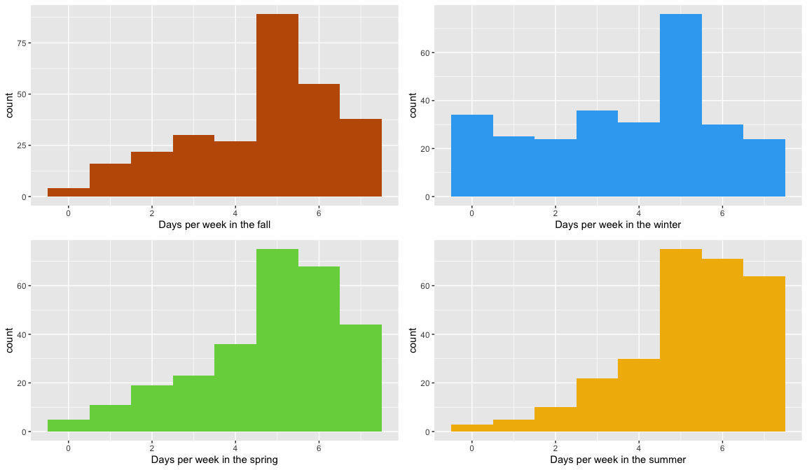
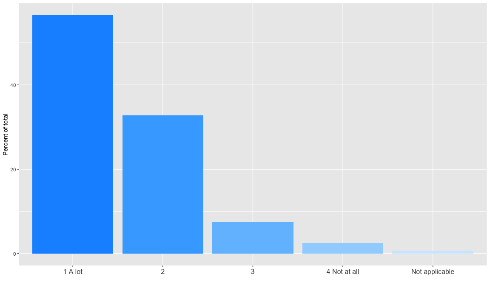
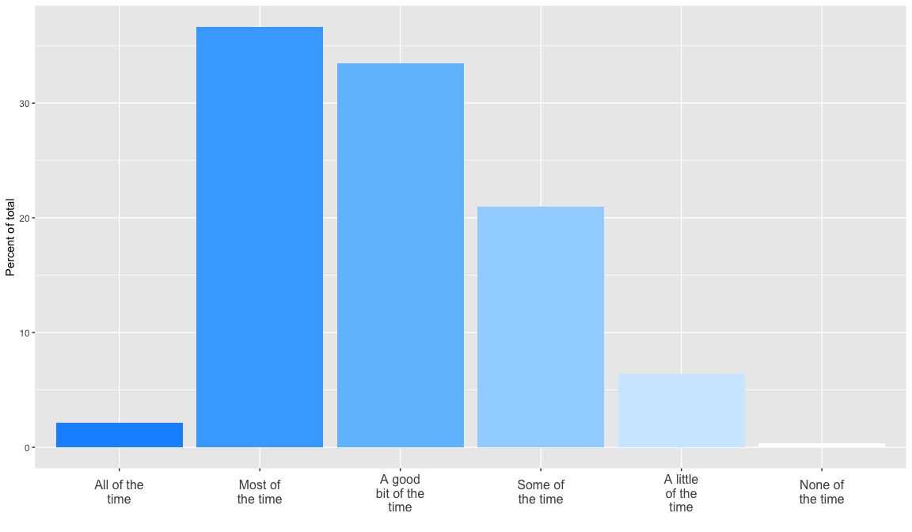

The INTErventions, Research, and Action in Cities Team (INTERACT) is a national research collaboration of scientists, urban planners, and engaged citizens uncovering how the design of our cities is shaping the health and wellbeing of Canadians (www.teaminteract.ca). INTERACT is conducting longitudinal, mixed-methods natural experiment studies in four Canadian cities, with the aim of providing evidence on the impacts of urban transformations on people's physical activity, social participation, and wellbeing, and inequalities in these outcomes. 

Victoria's All Ages and Abilities (AAA) Cycling Network introduces protected cycling infrastructure across the city, starting with the implementation of a 5.4km grid in the downtown core in 2018. Victoria's $7.75M commitment to the AAA Cycling Network is an important step in its bold journey to becoming one of the best small cities for cycling in the world.

People were eligible to participate if they lived in the Capital Region and biked at least once a month in the City of Victoria. Exclusion criteria across all sites were being younger than 18 years old, not being able to read or write English (or English or French in Montreal) well enough to answer an online survey and any intention to move out of the region in the next two years. Participants were recruited through social media, postering, media articles, partner networks, snowball sampling, and in-person events.

Participants were entered into a prize draw to incentivize their participation, and received a 10 dollar giftcard upon complemention of both the Health and VERITAS surveys. Those who contributed data through the smart phone app or the Sensedoc received an additional 10 dollar giftcard. 

# *Section 1: Transportation*

## Q1: How many bicycles are kept in your household?{.tabset}

### Adult bikes

```r
ggplot(d, aes(x = d$transp_bikes_adults)) + 
  geom_histogram(binwidth = 1, fill="#76D24A", na.rm = TRUE) + 
  xlab("Number of bicycles for adults") + 
##break value set for displaying integer values, which requires chekcing max value; can omit to use default scale 
  scale_x_continuous(breaks = c(0:20)) 
```

<!-- -->

```r
##print summary stats
summary(d$transp_bikes_adults)
```

```
##    Min. 1st Qu.  Median    Mean 3rd Qu.    Max. 
##   0.000   2.000   3.000   3.295   4.000  20.000
```

### Children bikes


```r
ggplot(d, aes(x = d$transp_bikes_kids)) + 
  geom_bar(binwidth = 1, fill="#76D24A", na.rm = TRUE) + xlab("Number of bicycles for children") + 
  scale_x_continuous(breaks= c(0:10))
```

<!-- -->

```r
summary(d$transp_bikes_kids)
```

```
##    Min. 1st Qu.  Median    Mean 3rd Qu.    Max. 
##  0.0000  0.0000  0.0000  0.6548  1.0000 10.0000
```

## Q2: On a scale of 1 to 5, with 1 being 'very safe' and 5 being 'very dangerous', overall, how safe do you think cycling is in your city? 


```r
#####PLOT DISTRIBUTION
##create Q2 response frequency table and convert to data frame
Q2 <- round(prop.table(table(factor(d$bike_safety, levels = 1:5)))*100,2)
Q2 <- as.data.frame(Q2)

##create response variable for plotting
Q2$response <- substring(row.names(Q2), 1)
Q2$response <- revalue(as.factor(Q2$response), c("1" = "Very safe", "2" = "Somewhat safe", "3" = "Neither safe nor unsafe", "4" = "Somewhat dangerous", "5" = "Very dangerous"))

##specify ggplot factor order for plot (default order is alphabetic)
Q2$plot <- factor(Q2$response, Q2$response)

##order responses as in Q2
p <- ggplot(Q2, aes(x = response, y = Freq, fill = response)) + theme(axis.text.x = element_text(size=12, angle=0, vjust = .6)  + scale_x_discrete(labels = function(plot) str_wrap(plot, width = 10)))

##get colors for plot (customizable, values can be specified from colorbrewer2.org, can also use scale fill palettes. See RColorBrewer documentation)
#cols <- c("#1a9641", "#a6d96a", "#ffffbf", "#fdae61", "#d7191c")

#create plot
p + geom_bar(aes(x = plot), data = Q2, stat = "identity") +
  scale_fill_manual(values = INTERACTPalette3) +
  guides(fill=FALSE) +
      ylab("Percent of total") +
      xlab("Perception of bicycle risk") +
      ggtitle("")
```

<!-- -->

```r
#####CREATE ASSOCIATED TABLE
##summarize number of responses in each category
Q2.tb <- as.factor(d$bike_safety)
Q2.tb <- summary(Q2.tb)
Q2.tb <- as.data.frame(Q2.tb)

##create response variable for table 
Q2.tb$Var1 <- substring(row.names(Q2.tb), 1)
Q2.tb$response <- revalue(as.factor(Q2.tb$Var1), c("1" = "Very safe", "2" = "Somewhat safe", "3" = "Neither safe nor unsafe", "4" = "Somewhat dangerous", "5" = "Very dangerous"))

##merge with frequency table from above
plot.Q2 <- merge(Q2, Q2.tb, by = "response")

plot.Q2 <- plot.Q2 %>% arrange(Var1.x)
##drop intermediate columns
plot.Q2 <- plot.Q2[-c(2, 4, 6)]

plot.Q2 <- setcolorder(plot.Q2, c("response", "Q2.tb", "Freq"))

##rename columns
colnames(plot.Q2) <- c("Response", "N", "Proportion")

##print table
kable(plot.Q2) %>%   kable_styling(bootstrap_options = "striped", full_width = T, position = "left")
```

<table class="table table-striped" style="">
 <thead>
  <tr>
   <th style="text-align:left;"> Response </th>
   <th style="text-align:right;"> N </th>
   <th style="text-align:right;"> Proportion </th>
  </tr>
 </thead>
<tbody>
  <tr>
   <td style="text-align:left;"> Very safe </td>
   <td style="text-align:right;"> 23 </td>
   <td style="text-align:right;"> 8.19 </td>
  </tr>
  <tr>
   <td style="text-align:left;"> Somewhat safe </td>
   <td style="text-align:right;"> 167 </td>
   <td style="text-align:right;"> 59.43 </td>
  </tr>
  <tr>
   <td style="text-align:left;"> Neither safe nor unsafe </td>
   <td style="text-align:right;"> 32 </td>
   <td style="text-align:right;"> 11.39 </td>
  </tr>
  <tr>
   <td style="text-align:left;"> Somewhat dangerous </td>
   <td style="text-align:right;"> 55 </td>
   <td style="text-align:right;"> 19.57 </td>
  </tr>
  <tr>
   <td style="text-align:left;"> Very dangerous </td>
   <td style="text-align:right;"> 4 </td>
   <td style="text-align:right;"> 1.42 </td>
  </tr>
</tbody>
</table>

## Q3: How often do you typically travel by bicycle during each season?


```r
d$bike_freq_a[d$bike_freq_a==-7] <- NA
d$bike_freq_b[d$bike_freq_b==-7] <- NA
d$bike_freq_c[d$bike_freq_c==-7] <- NA
d$bike_freq_d[d$bike_freq_d==-7] <- NA

d$bike_fall <- round(d$bike_freq_a/13)
d$bike_winter <- round(d$bike_freq_b/13)
d$bike_spring <- round(d$bike_freq_c/13)
d$bike_summer <- round(d$bike_freq_d/13)


fall <- ggplot(d, aes(x = d$bike_fall)) + geom_histogram (na.rm = TRUE, binwidth = 1, fill="#BF5B04") + xlab("Days per week in the fall")
winter <- ggplot(d, aes(x = d$bike_winter)) + geom_histogram (na.rm = TRUE, binwidth = 1, fill="#35AAF2") + xlab("Days per week in the winter")
spring <- ggplot(d, aes(x = d$bike_spring)) + geom_histogram (na.rm = TRUE, binwidth = 1, fill="#76D24A") + xlab("Days per week in the spring")
summer <- ggplot(d, aes(x = d$bike_summer)) + geom_histogram (na.rm = TRUE, binwidth = 1, fill="#F2B705") + xlab("Days per week in the summer")


grid.arrange(fall,winter,spring,summer)
```

<!-- -->

### Fall 

```r
summary(d$bike_fall)
```

```
##    Min. 1st Qu.  Median    Mean 3rd Qu.    Max. 
##   0.000   3.000   5.000   4.623   6.000   7.000
```
### Winter

```r
summary(d$bike_winter)
```

```
##    Min. 1st Qu.  Median    Mean 3rd Qu.    Max.    NA's 
##   0.000   2.000   4.000   3.689   5.000   7.000       1
```
### Spring

```r
summary(d$bike_spring)
```

```
##    Min. 1st Qu.  Median    Mean 3rd Qu.    Max. 
##   0.000   4.000   5.000   4.815   6.000   7.000
```
### Summer

```r
summary(d$bike_summer)
```

```
##    Min. 1st Qu.  Median    Mean 3rd Qu.    Max.    NA's 
##   0.000   4.750   5.000   5.214   6.000   7.000       1
```


## Q4: How often are your cycling trips made with children?


```r
bike.ch <- round(prop.table(table(factor(d$bike_children, levels = 1:4)))*100,2)
bike.ch <- as.data.frame(bike.ch)
bike.ch$response <- substring(row.names(bike.ch), 1)
bike.ch$response <- revalue(as.factor(bike.ch$response), c("1" = "Never", "2" = "Sometimes", "3" = "Often", "4" = "Always"))

bike.ch$plot <- factor(bike.ch$response, bike.ch$response)


ch <- ggplot(bike.ch, aes(x = response, y = Freq, fill = response)) + theme(axis.text.x  = element_text(size=12, angle=0, vjust=.6)) + scale_x_discrete(labels = function(plot) str_wrap(plot, width = 10)) +
  guides(fill = FALSE) +
  scale_fill_manual(values = INTERACTshortfade) +
      ylab("Percent of total") +
      xlab("Bicyle trips with children") +
      ggtitle("")

ch + geom_bar(aes(x = plot), data = bike.ch, stat = "identity") 
```

<!-- -->

```r
trips.ch <- as.factor(d$bike_children)
trips.ch <- summary(trips.ch)
trips.ch <- as.data.frame(trips.ch)
trips.ch$Var1 <- substring(row.names(trips.ch), 1)
trips.ch$response <- revalue(as.factor(trips.ch$Var1), c("1" = "Never", "2" = "Sometimes", "3" = "Often", "4" = "Always"))


plot.ch <- merge(bike.ch, trips.ch, by = "response")

plot.ch <- plot.ch[-c(4,6)]
plot.ch <- setcolorder(plot.ch, c("response", "trips.ch", "Freq", "Var1.x"))
plot.ch <- plot.ch %>% arrange(Var1.x)
plot.ch <- plot.ch[-c(4)]

colnames(plot.ch) <- c("Response", "N", "Proportion")

kable(plot.ch) %>%   kable_styling(bootstrap_options = "striped", full_width = T, position = "left")
```

<table class="table table-striped" style="">
 <thead>
  <tr>
   <th style="text-align:left;"> Response </th>
   <th style="text-align:right;"> N </th>
   <th style="text-align:right;"> Proportion </th>
  </tr>
 </thead>
<tbody>
  <tr>
   <td style="text-align:left;"> Never </td>
   <td style="text-align:right;"> 196 </td>
   <td style="text-align:right;"> 69.75 </td>
  </tr>
  <tr>
   <td style="text-align:left;"> Sometimes </td>
   <td style="text-align:right;"> 52 </td>
   <td style="text-align:right;"> 18.51 </td>
  </tr>
  <tr>
   <td style="text-align:left;"> Often </td>
   <td style="text-align:right;"> 29 </td>
   <td style="text-align:right;"> 10.32 </td>
  </tr>
  <tr>
   <td style="text-align:left;"> Always </td>
   <td style="text-align:right;"> 4 </td>
   <td style="text-align:right;"> 1.42 </td>
  </tr>
</tbody>
</table>

## Q5: Do you currently use any of the following roads when you bike in Victoria?{.tabset}
###  Cook St or Fifth St


```r
cook <- round(prop.table(table(factor(d$vicroads_a, levels = c("1", "2", "77"))))*100,2)
cook <- as.data.frame(cook)
cook$response <- substring(row.names(cook), 1)
cook$response <- revalue(as.factor(cook$response), c("1" = "Yes",  "2" = "No", "3" = "Don't know"))

cook$plot <- factor(cook$response, cook$response)

cook.plot <- ggplot(cook, aes(x = response, y = Freq, fill = plot)) + theme(axis.text.x  = element_text(size=12, angle=0, vjust=.6)) +
      guides(fill = FALSE) +
      scale_fill_manual(values = INTERACTPaletteYN) +
      ylab("Percent of total") +
      xlab("Response")

cook.plot + geom_bar(aes(x = plot), data = cook, stat = "identity") 
```

<!-- -->

```r
cook.tb <- as.factor(d$vicroads_a)
cook.tb <- summary(cook.tb)
cook.tb <- as.data.frame(cook.tb)
cook.tb$Var1 <- substring(row.names(cook.tb), 1)
cook.tb$response <- revalue(as.factor(cook.tb$Var1), c("1" = "Yes", "2" = "No", "77" = "Don't know"))

plot.cook <- merge(cook, cook.tb, by = "response")
plot.cook <- plot.cook[-c(2, 4, 6)]
plot.cook <- setcolorder(plot.cook, c("response", "cook.tb", "Freq"))
plot.cook$order <- c(3,2,1)
plot.cook <- plot.cook %>% arrange(order)
plot.cook <- plot.cook[-c(4)]
colnames(plot.cook) <- c("Response", "N", "Proportion")

kable(plot.cook) %>%   kable_styling(bootstrap_options = "striped", full_width = T, position = "left")
```

<table class="table table-striped" style="">
 <thead>
  <tr>
   <th style="text-align:left;"> Response </th>
   <th style="text-align:right;"> N </th>
   <th style="text-align:right;"> Proportion </th>
  </tr>
 </thead>
<tbody>
  <tr>
   <td style="text-align:left;"> Yes </td>
   <td style="text-align:right;"> 179 </td>
   <td style="text-align:right;"> 63.70 </td>
  </tr>
  <tr>
   <td style="text-align:left;"> No </td>
   <td style="text-align:right;"> 100 </td>
   <td style="text-align:right;"> 35.59 </td>
  </tr>
  <tr>
   <td style="text-align:left;"> Don't know </td>
   <td style="text-align:right;"> 2 </td>
   <td style="text-align:right;"> 0.71 </td>
  </tr>
</tbody>
</table>

### Fairfield Rd or Humboldt St


```r
ffield <- round(prop.table(table(factor(d$vicroads_b, levels = c("1", "2", "77"))))*100,2)
ffield <- as.data.frame(ffield)
ffield$response <- substring(row.names(ffield), 1)
ffield$response <- revalue(as.factor(ffield$response), c("1" = "Yes",  "2" = "No", "3" = "Don't know"))

ffield$plot <- factor(ffield$response, ffield$response)

ffield.plot <- ggplot(ffield, aes(x = response, y = Freq, fill = plot)) + theme(axis.text.x  = element_text(size=12, angle=0, vjust=.6)) +
      guides(fill = FALSE) +
      scale_fill_manual(values = INTERACTPaletteYN) +
      ylab("Percent of total") +
      xlab("Response")

ffield.plot + geom_bar(aes(x = plot), data = ffield, stat = "identity") 
```

<!-- -->

```r
ffield.tb <- as.factor(d$vicroads_b)
ffield.tb <- summary(ffield.tb)
ffield.tb <- as.data.frame(ffield.tb)
ffield.tb$Var1 <- substring(row.names(ffield.tb), 1)
ffield.tb$response <- revalue(as.factor(ffield.tb$Var1), c("1" = "Yes", "2" = "No", "77" = "Don't know"))

plot.ffield <- merge(ffield, ffield.tb, by = "response")
plot.ffield <- plot.ffield[-c(2, 4, 6)]
plot.ffield <- setcolorder(plot.ffield, c("response", "ffield.tb", "Freq"))
plot.ffield$order <- c(3,2,1)
plot.ffield <- plot.ffield %>% arrange(order)
plot.ffield <- plot.ffield[-c(4)]
colnames(plot.ffield) <- c("Response", "N", "Proportion")

kable(plot.ffield) %>%   kable_styling(bootstrap_options = "striped", full_width = T, position = "left")
```

<table class="table table-striped" style="">
 <thead>
  <tr>
   <th style="text-align:left;"> Response </th>
   <th style="text-align:right;"> N </th>
   <th style="text-align:right;"> Proportion </th>
  </tr>
 </thead>
<tbody>
  <tr>
   <td style="text-align:left;"> Yes </td>
   <td style="text-align:right;"> 140 </td>
   <td style="text-align:right;"> 49.82 </td>
  </tr>
  <tr>
   <td style="text-align:left;"> No </td>
   <td style="text-align:right;"> 139 </td>
   <td style="text-align:right;"> 49.47 </td>
  </tr>
  <tr>
   <td style="text-align:left;"> Don't know </td>
   <td style="text-align:right;"> 2 </td>
   <td style="text-align:right;"> 0.71 </td>
  </tr>
</tbody>
</table>

### Fort St


```r
fort <- round(prop.table(table(factor(d$vicroads_c, levels = c("1", "2", "77"))))*100,2)
fort <- as.data.frame(fort)
fort$response <- substring(row.names(fort), 1)
fort$response <- revalue(as.factor(fort$response), c("1" = "Yes",  "2" = "No", "3" = "Don't know"))

fort$plot <- factor(fort$response, fort$response)

fort.plot <- ggplot(fort, aes(x = response, y = Freq, fill = plot)) + theme(axis.text.x  = element_text(size=12, angle=0, vjust=.6)) +
      guides(fill = FALSE) +
      scale_fill_manual(values = INTERACTPaletteYN) +
      ylab("Percent of total") +
      xlab("")

fort.plot + geom_bar(aes(x = plot), data = fort, stat = "identity")
```

<!-- -->

```r
fort.tb <- as.factor(d$vicroads_c)
fort.tb <- summary(fort.tb)
fort.tb <- as.data.frame(fort.tb)
fort.tb$Var1 <- substring(row.names(fort.tb), 1)

##intermediate step to insert response values where zero respondents chose that answer
# nval.df <- c("0") 
# nval.df <- as.data.frame(nval.df)
# nval.df$fort.tb <- as.factor(nval.df$nval.df)
# nval.df$Var1 <- c( "77")
# nval.df <- nval.df[-c(1)]

##coerce inserted values into table
# fort.tb <- rbind(fort.tb, nval.df)
fort.tb$response <- revalue(as.factor(fort.tb$Var1), c("1" = "Yes", "2" = "No", "77" = "Don't know"))

plot.fort <- merge(fort, fort.tb, by = "response")
plot.fort <- plot.fort[-c(2, 4, 6)]
plot.fort <- setcolorder(plot.fort, c("response", "fort.tb", "Freq"))
plot.fort$order <- c(3, 2)
plot.fort <- plot.fort %>% arrange(order)
plot.fort <- plot.fort[-c(4)]
colnames(plot.fort) <- c("Response", "N", "Proportion")

kable(plot.fort) %>% kable_styling(bootstrap_options = "striped", full_width = T, position = "left")
```

<table class="table table-striped" style="">
 <thead>
  <tr>
   <th style="text-align:left;"> Response </th>
   <th style="text-align:right;"> N </th>
   <th style="text-align:right;"> Proportion </th>
  </tr>
 </thead>
<tbody>
  <tr>
   <td style="text-align:left;"> Yes </td>
   <td style="text-align:right;"> 219 </td>
   <td style="text-align:right;"> 77.94 </td>
  </tr>
  <tr>
   <td style="text-align:left;"> No </td>
   <td style="text-align:right;"> 62 </td>
   <td style="text-align:right;"> 22.06 </td>
  </tr>
</tbody>
</table>

### Government St


```r
gvt <- round(prop.table(table(factor(d$vicroads_d, levels = c("1", "2", "77"))))*100,2)
gvt <- as.data.frame(gvt)
gvt$response <- substring(row.names(gvt), 1)
gvt$response <- revalue(as.factor(gvt$response), c("1" = "Yes",  "2" = "No", "3" = "Don't know"))

gvt$plot <- factor(gvt$response, gvt$response)

 
gvt.plot <- ggplot(gvt, aes(x = response, y = Freq, fill = plot)) + theme(axis.text.x  = element_text(size=12, angle=0, vjust=.6)) +
      guides(fill = FALSE) +
      scale_fill_manual(values = INTERACTPaletteYN) +
      ylab("Percent of total") +
      xlab("")
      
gvt.plot + geom_bar(aes(x = plot), data = gvt, stat = "identity") 
```

<!-- -->

```r
gvt.tb <- as.factor(d$vicroads_d)
gvt.tb <- summary(gvt.tb)
gvt.tb <- as.data.frame(gvt.tb)
gvt.tb$Var1 <- substring(row.names(gvt.tb), 1)

gvt.tb$response <- revalue(as.factor(gvt.tb$Var1), c("1" = "Yes", "2" = "No", "77" = "Don't know"))

plot.gvt <- merge(gvt, gvt.tb, by = "response")
plot.gvt <- plot.gvt[-c(4, 6)]
plot.gvt <- setcolorder(plot.gvt, c("response", "gvt.tb", "Freq", "Var1.x"))
plot.gvt <- plot.gvt %>% arrange(Var1.x)
plot.gvt <- plot.gvt[-c(4)]
colnames(plot.gvt) <- c("Response", "N", "Proportion")

kable(plot.gvt) %>% kable_styling(bootstrap_options = "striped", full_width = T, position = "left")
```

<table class="table table-striped" style="">
 <thead>
  <tr>
   <th style="text-align:left;"> Response </th>
   <th style="text-align:right;"> N </th>
   <th style="text-align:right;"> Proportion </th>
  </tr>
 </thead>
<tbody>
  <tr>
   <td style="text-align:left;"> Yes </td>
   <td style="text-align:right;"> 214 </td>
   <td style="text-align:right;"> 76.16 </td>
  </tr>
  <tr>
   <td style="text-align:left;"> No </td>
   <td style="text-align:right;"> 67 </td>
   <td style="text-align:right;"> 23.84 </td>
  </tr>
</tbody>
</table>

### Haultain St or Kings Rd


```r
haultain <- round(prop.table(table(factor(d$vicroads_e, levels = c("1", "2", "77"))))*100,2)
haultain <- as.data.frame(haultain)
haultain$response <- substring(row.names(haultain), 1)
haultain$response <- revalue(as.factor(haultain$response), c("1" = "Yes",  "2" = "No", "3" = "Don't know"))

haultain$plot <- factor(haultain$response, haultain$response)


haultain.plot <- ggplot(haultain, aes(x = response, y = Freq, fill = plot)) + theme(axis.text.x  = element_text(size=12, angle=0, vjust=.6)) +
      guides(fill = FALSE) +
      scale_fill_manual(values = INTERACTPaletteYN) +
      ylab("Percent of total") +
      xlab("")
      
haultain.plot + geom_bar(aes(x = plot), data = haultain, stat = "identity") 
```

<!-- -->

```r
haultain.tb <- as.factor(d$vicroads_e)
haultain.tb <- summary(haultain.tb)
haultain.tb <- as.data.frame(haultain.tb)
haultain.tb$Var1 <- substring(row.names(haultain.tb), 1)
haultain.tb$response <- revalue(as.factor(haultain.tb$Var1), c("1" = "Yes", "2" = "No", "77" = "Don't know"))

plot.haultain <- merge(haultain, haultain.tb, by = "response")
plot.haultain <- plot.haultain[-c(2, 4, 6)]
plot.haultain <- setcolorder(plot.haultain, c("response", "haultain.tb", "Freq"))
plot.haultain$order <- c(3, 2, 1)
plot.haultain <- plot.haultain %>% arrange(order)
plot.haultain <- plot.haultain[-c(4)]
colnames(plot.haultain) <- c("Response", "N", "Proportion")

kable(plot.haultain) %>% kable_styling(bootstrap_options = "striped", full_width = T, position = "left")
```

<table class="table table-striped" style="">
 <thead>
  <tr>
   <th style="text-align:left;"> Response </th>
   <th style="text-align:right;"> N </th>
   <th style="text-align:right;"> Proportion </th>
  </tr>
 </thead>
<tbody>
  <tr>
   <td style="text-align:left;"> Yes </td>
   <td style="text-align:right;"> 165 </td>
   <td style="text-align:right;"> 58.72 </td>
  </tr>
  <tr>
   <td style="text-align:left;"> No </td>
   <td style="text-align:right;"> 111 </td>
   <td style="text-align:right;"> 39.50 </td>
  </tr>
  <tr>
   <td style="text-align:left;"> Don't know </td>
   <td style="text-align:right;"> 5 </td>
   <td style="text-align:right;"> 1.78 </td>
  </tr>
</tbody>
</table>

### Pandora Ave


```r
pand <- round(prop.table(table(factor(d$vicroads_f, levels = c("1", "2", "77"))))*100,2)
pand <- as.data.frame(pand)
pand$response <- substring(row.names(pand), 1)
pand$response <- revalue(as.factor(pand$response), c("1" = "Yes",  "2" = "No", "3" = "Don't know"))

pand$plot <- factor(pand$response, pand$response)

pand.plot <- ggplot(pand, aes(x = response, y = Freq, fill = plot)) + theme(axis.text.x  = element_text(size=12, angle=0, vjust=.6)) +
      guides(fill = FALSE) +
      scale_fill_manual(values = INTERACTPaletteYN) +
      ylab("Percent of total") +
      xlab("")
      
pand.plot + geom_bar(aes(x = plot), data = pand, stat = "identity") 
```

<!-- -->

```r
pand.tb <- as.factor(d$vicroads_f)
pand.tb <- summary(pand.tb)
pand.tb <- as.data.frame(pand.tb)
pand.tb$Var1 <- substring(row.names(pand.tb), 1)

nval.df <- c("0") #insert missing values 
nval.df <- as.data.frame(nval.df)
nval.df$pand.tb <- as.factor(nval.df$nval.df)
nval.df$Var1 <- c( "77")
nval.df <- nval.df[-c(1)]
pand.tb <- rbind(pand.tb, nval.df)
pand.tb$response <- revalue(as.factor(pand.tb$Var1), c("1" = "Yes", "2" = "No", "77" = "Don't know"))

plot.pand <- merge(pand, pand.tb, by = "response")
plot.pand <- plot.pand[-c(2, 4, 6)]
plot.pand <- setcolorder(plot.pand, c("response", "pand.tb", "Freq"))
plot.pand$order <- c(3, 2, 1)
plot.pand <- plot.pand %>% arrange(order)
plot.pand <- plot.pand[-c(4)]
colnames(plot.pand) <- c("Response", "N", "Proportion")

kable(plot.pand) %>% kable_styling(bootstrap_options = "striped", full_width = T, position = "left")
```

<table class="table table-striped" style="">
 <thead>
  <tr>
   <th style="text-align:left;"> Response </th>
   <th style="text-align:left;"> N </th>
   <th style="text-align:right;"> Proportion </th>
  </tr>
 </thead>
<tbody>
  <tr>
   <td style="text-align:left;"> Yes </td>
   <td style="text-align:left;"> 242 </td>
   <td style="text-align:right;"> 86.12 </td>
  </tr>
  <tr>
   <td style="text-align:left;"> No </td>
   <td style="text-align:left;"> 39 </td>
   <td style="text-align:right;"> 13.88 </td>
  </tr>
  <tr>
   <td style="text-align:left;"> Don't know </td>
   <td style="text-align:left;"> 0 </td>
   <td style="text-align:right;"> 0.00 </td>
  </tr>
</tbody>
</table>

### Shelbourne St or Begbie St


```r
shelb <- round(prop.table(table(factor(d$vicroads_g, levels = c("1", "2", "77"))))*100,2)
shelb <- as.data.frame(shelb)
shelb$response <- substring(row.names(shelb), 1)
shelb$response <- revalue(as.factor(shelb$response), c("1" = "Yes",  "2" = "No", "3" = "Don't know"))

shelb$plot <- factor(shelb$response, shelb$response)

shelb.plot <- ggplot(shelb, aes(x = response, y = Freq, fill = plot)) + theme(axis.text.x  = element_text(size=12, angle=0, vjust=.6)) +
      guides(fill = FALSE) +
      scale_fill_manual(values = INTERACTPaletteYN) +
      ylab("Percent of total") +
      xlab("")
      
shelb.plot + geom_bar(aes(x = plot), data = shelb, stat = "identity") 
```

<!-- -->

```r
shelb.tb <- as.factor(d$vicroads_g)
shelb.tb <- summary(shelb.tb)
shelb.tb <- as.data.frame(shelb.tb)
shelb.tb$Var1 <- substring(row.names(shelb.tb), 1)
shelb.tb$response <- revalue(as.factor(shelb.tb$Var1), c("1" = "Yes", "2" = "No", "77" = "Don't know"))

plot.shelb <- merge(shelb, shelb.tb, by = "response")
plot.shelb <- plot.shelb[-c(2, 4, 6)]
plot.shelb <- setcolorder(plot.shelb, c("response", "shelb.tb", "Freq"))
plot.shelb$order <- c(3, 2, 1)
plot.shelb <- plot.shelb %>% arrange(order)
plot.shelb <- plot.shelb[-c(4)]
colnames(plot.shelb) <- c("Response", "N", "Proportion")

kable(plot.shelb) %>% kable_styling(bootstrap_options = "striped", full_width = T, position = "left")
```

<table class="table table-striped" style="">
 <thead>
  <tr>
   <th style="text-align:left;"> Response </th>
   <th style="text-align:right;"> N </th>
   <th style="text-align:right;"> Proportion </th>
  </tr>
 </thead>
<tbody>
  <tr>
   <td style="text-align:left;"> Yes </td>
   <td style="text-align:right;"> 117 </td>
   <td style="text-align:right;"> 41.64 </td>
  </tr>
  <tr>
   <td style="text-align:left;"> No </td>
   <td style="text-align:right;"> 162 </td>
   <td style="text-align:right;"> 57.65 </td>
  </tr>
  <tr>
   <td style="text-align:left;"> Don't know </td>
   <td style="text-align:right;"> 2 </td>
   <td style="text-align:right;"> 0.71 </td>
  </tr>
</tbody>
</table>

### Harbour Rd, Wharf St or Belville St


```r
bellv <- round(prop.table(table(factor(d$vicroads_h, levels = c("1", "2", "77"))))*100,2)
bellv <- as.data.frame(bellv)
bellv$response <- substring(row.names(bellv), 1)
bellv$response <- revalue(as.factor(bellv$response), c("1" = "Yes",  "2" = "No", "3" = "Don't know"))

bellv$plot <- factor(bellv$response, bellv$response)

bellv.plot <- ggplot(bellv, aes(x = response, y = Freq, fill = plot)) + theme(axis.text.x  = element_text(size=12, angle=0, vjust=.6)) +
      guides(fill = FALSE) +
      scale_fill_manual(values = INTERACTPaletteYN) +
      ylab("Percent of total") +
      xlab("")
      
bellv.plot + geom_bar(aes(x = plot), data = bellv, stat = "identity") 
```

<!-- -->

```r
bellv.tb <- as.factor(d$vicroads_h)
bellv.tb <- summary(bellv.tb)
bellv.tb <- as.data.frame(bellv.tb)
bellv.tb$Var1 <- substring(row.names(bellv.tb), 1)
bellv.tb$response <- revalue(as.factor(bellv.tb$Var1), c("1" = "Yes", "2" = "No", "77" = "Don't know"))

plot.bellv <- merge(bellv, bellv.tb, by = "response")
plot.bellv <- plot.bellv[-c(2, 4, 6)]
plot.bellv <- setcolorder(plot.bellv, c("response", "bellv.tb", "Freq"))
plot.bellv$order <- c(3, 2, 1)
plot.bellv <- plot.bellv %>% arrange(order)
plot.bellv <- plot.bellv[-c(4)]
colnames(plot.bellv) <- c("Response", "N", "Proportion")

kable(plot.bellv) %>% kable_styling(bootstrap_options = "striped", full_width = T, position = "left")
```

<table class="table table-striped" style="">
 <thead>
  <tr>
   <th style="text-align:left;"> Response </th>
   <th style="text-align:right;"> N </th>
   <th style="text-align:right;"> Proportion </th>
  </tr>
 </thead>
<tbody>
  <tr>
   <td style="text-align:left;"> Yes </td>
   <td style="text-align:right;"> 220 </td>
   <td style="text-align:right;"> 78.29 </td>
  </tr>
  <tr>
   <td style="text-align:left;"> No </td>
   <td style="text-align:right;"> 59 </td>
   <td style="text-align:right;"> 21.00 </td>
  </tr>
  <tr>
   <td style="text-align:left;"> Don't know </td>
   <td style="text-align:right;"> 2 </td>
   <td style="text-align:right;"> 0.71 </td>
  </tr>
</tbody>
</table>

### Galloping Goose or the E&N Trail


```r
goose <- round(prop.table(table(factor(d$vicroads_i, levels = c("1", "2", "77"), exclude = NULL)))*100,2)
goose <- as.data.frame(goose)
goose$response <- substring(row.names(goose), 1)
goose$response <- revalue(as.factor(goose$response), c("1" = "Yes",  "2" = "No", "3" = "Don't know"))

goose$plot <- factor(goose$response, goose$response)

goose.plot <- ggplot(goose, aes(x = response, y = Freq, fill = plot)) + theme(axis.text.x  = element_text(size=12, angle=0, vjust=.6)) +
      guides(fill = FALSE) +
      scale_fill_manual(values = INTERACTPaletteYN) +
      ylab("Percent of total") +
      xlab("")
      
goose.plot + geom_bar(aes(x = plot), data = goose, stat = "identity") 
```

<!-- -->

```r
goose.tb <- as.factor(d$vicroads_i)
goose.tb <- summary(goose.tb)
goose.tb <- as.data.frame(goose.tb)
goose.tb$Var1 <- substring(row.names(goose.tb), 1)

nval.df <- c("0") #insert missing values 
nval.df <- as.data.frame(nval.df)
nval.df$goose.tb <- as.factor(nval.df$nval.df)
nval.df$Var1 <- c( "77")
nval.df <- nval.df[-c(1)]
goose.tb <- rbind(goose.tb, nval.df)
goose.tb$response <- revalue(as.factor(goose.tb$Var1), c("1" = "Yes", "2" = "No", "77" = "Don't know"))

plot.goose <- merge(goose, goose.tb, by = "response")
plot.goose <- plot.goose[-c(2, 4, 6)]
plot.goose <- setcolorder(plot.goose, c("response", "goose.tb", "Freq"))
plot.goose$order <- c(3, 2, 1)
plot.goose <- plot.goose %>% arrange(order)
plot.goose <- plot.goose[-c(4)]
colnames(plot.goose) <- c("Response", "N", "Proportion")

kable(plot.goose) %>% kable_styling(bootstrap_options = "striped", full_width = T, position = "left")
```

<table class="table table-striped" style="">
 <thead>
  <tr>
   <th style="text-align:left;"> Response </th>
   <th style="text-align:left;"> N </th>
   <th style="text-align:right;"> Proportion </th>
  </tr>
 </thead>
<tbody>
  <tr>
   <td style="text-align:left;"> Yes </td>
   <td style="text-align:left;"> 245 </td>
   <td style="text-align:right;"> 87.19 </td>
  </tr>
  <tr>
   <td style="text-align:left;"> No </td>
   <td style="text-align:left;"> 36 </td>
   <td style="text-align:right;"> 12.81 </td>
  </tr>
  <tr>
   <td style="text-align:left;"> Don't know </td>
   <td style="text-align:left;"> 0 </td>
   <td style="text-align:right;"> 0.00 </td>
  </tr>
</tbody>
</table>

## Q6: How much would you agree with the following statement: "I would like to travel by bicycle more than I do now"?


```r
bike.more <- round(prop.table(table(factor(d$bike_more, levels = c("1", "2", "3", "4", "77"))))*100,2)
bike.more <- as.data.frame(bike.more)
bike.more$group <- substring(row.names(bike.more), 1)
bike.more$group <- revalue(as.factor(bike.more$group), c("1" = "Strongly agree", "2" = "Somewhat agree", "3" = "Somewhat disagree", "4" = "Strongly disagree", "5" = "Don't know"))

bike.more$plot <- factor(bike.more$group, bike.more$group)

more <- ggplot(bike.more, aes(x = group, y = Freq, fill = group)) + theme(axis.text.x  = element_text(size=12, angle=0, vjust=.6) + scale_x_discrete(labels = function(plot) str_wrap(plot, width = 10))) 

more + geom_bar(aes(x = plot), data = bike.more, stat = "identity") +
  guides(fill = FALSE) +
  scale_fill_manual(values = INTERACTshortfade) +
      ylab("Percent of total") +
      xlab("Bicyle more") 
```

<!-- -->

```r
more.tb <- as.factor(d$bike_more)
more.tb <- summary(more.tb)
more.tb <- as.data.frame(more.tb)
more.tb$Var1 <- substring(row.names(more.tb), 1)
more.tb$group <- revalue(as.factor(more.tb$Var1), c("1" = "Strongly agree", "2" = "Somewhat agree", "3" = "Somewhat disagree", "4" = "Strongly disagree", "77" = "Don't know"))

more.plot <- merge(bike.more, more.tb, by = "group")
more.plot <- more.plot[-c(1:2, 6)]
more.plot <- setcolorder(more.plot, c("plot", "more.tb", "Freq"))
more.plot$order <- c(5, 2, 3, 1, 4)
more.plot <- more.plot %>% arrange(order)
more.plot <- more.plot[-c(4)]
colnames(more.plot) <- c("Response", "N", "Proportion")

kable(more.plot) %>% kable_styling(bootstrap_options = "striped", full_width = T, position = "left")
```

<table class="table table-striped" style="">
 <thead>
  <tr>
   <th style="text-align:left;"> Response </th>
   <th style="text-align:right;"> N </th>
   <th style="text-align:right;"> Proportion </th>
  </tr>
 </thead>
<tbody>
  <tr>
   <td style="text-align:left;"> Strongly agree </td>
   <td style="text-align:right;"> 109 </td>
   <td style="text-align:right;"> 38.79 </td>
  </tr>
  <tr>
   <td style="text-align:left;"> Somewhat agree </td>
   <td style="text-align:right;"> 126 </td>
   <td style="text-align:right;"> 44.84 </td>
  </tr>
  <tr>
   <td style="text-align:left;"> Somewhat disagree </td>
   <td style="text-align:right;"> 22 </td>
   <td style="text-align:right;"> 7.83 </td>
  </tr>
  <tr>
   <td style="text-align:left;"> Strongly disagree </td>
   <td style="text-align:right;"> 16 </td>
   <td style="text-align:right;"> 5.69 </td>
  </tr>
  <tr>
   <td style="text-align:left;"> Don't know </td>
   <td style="text-align:right;"> 8 </td>
   <td style="text-align:right;"> 2.85 </td>
  </tr>
</tbody>
</table>

## Q7: How comfortable would you feel biking in the following places?{.tabset}

###A path or trail that is physically separate from the street


```r
path <- round(prop.table(table(factor(d$bike_comf_a, levels = c("1", "2", "3", "4", "77"))))*100,2)
path <- as.data.frame(path)
path$response <- substring(row.names(path), 1)
path$response <- revalue(as.factor(path$response), c("1" = "Very uncomfortable",  "2" = "Somewhat uncomfortable", "3" = "Somewhat comfortable", "4" = "Very comfortable", "5" = "Don't know"))

path$plot <- factor(path$response, path$response)

cols <- c("#d7191c","#fdae61", "#a6d96a", "#1a9641", "grey")
path.plot <- ggplot(path, aes(x = response, y = Freq, fill = plot)) + theme(axis.text.x  = element_text(size=12, angle=0, vjust=.6)) +  scale_x_discrete(labels = function(plot) str_wrap(plot, width = 10)) +
      guides(fill = FALSE) +
      scale_fill_manual(values = cols) +
      ylab("Percent of total") +
      xlab("")
      
path.plot + geom_bar(aes(x = plot), data = path, stat = "identity") 
```

<!-- -->

```r
path.tb <- as.factor(d$bike_comf_a)
path.tb <- summary(path.tb)
path.tb <- as.data.frame(path.tb)
path.tb$Var1 <- substring(row.names(path.tb), 1)

path.tb$response <- revalue(as.factor(path.tb$Var1), c("1" = "Very uncomfortable", "2" = "Somewhat uncomfortable", "3" = "Somewhat comfortable", "4" = "Very comfortable", "77" = "Don't know"))

plot.path <- merge(path, path.tb, by = "response")
plot.path <- plot.path[-c(4, 6)]
plot.path <- setcolorder(plot.path, c("response", "path.tb", "Freq", "Var1.x"))
plot.path <- plot.path %>% arrange(Var1.x)
plot.path <- plot.path[-c(4)]
colnames(plot.path) <- c("Response", "N", "Proportion")

kable(plot.path) %>% kable_styling(bootstrap_options = "striped", full_width = T, position = "left")
```

<table class="table table-striped" style="">
 <thead>
  <tr>
   <th style="text-align:left;"> Response </th>
   <th style="text-align:right;"> N </th>
   <th style="text-align:right;"> Proportion </th>
  </tr>
 </thead>
<tbody>
  <tr>
   <td style="text-align:left;"> Very uncomfortable </td>
   <td style="text-align:right;"> 21 </td>
   <td style="text-align:right;"> 7.47 </td>
  </tr>
  <tr>
   <td style="text-align:left;"> Somewhat comfortable </td>
   <td style="text-align:right;"> 18 </td>
   <td style="text-align:right;"> 6.41 </td>
  </tr>
  <tr>
   <td style="text-align:left;"> Very comfortable </td>
   <td style="text-align:right;"> 242 </td>
   <td style="text-align:right;"> 86.12 </td>
  </tr>
</tbody>
</table>

### A quiet, residential street with traffic speeds of 30-40 km per hour


```r
res <- prop.table(table(factor(d$bike_comf_b, levels = c("1", "2", "3", "4", "77"))))*100
res <- as.data.frame(res)
res$response <- substring(row.names(res), 1)
res$response <- revalue(as.factor(res$response), c("1" = "Very uncomfortable",  "2" = "Somewhat uncomfortable", "3" = "Somewhat comfortable", "4" = "Very comfortable", "5" = "Don't know"))

res$plot <- factor(res$response, res$response)

cols <- c("#d7191c","#fdae61", "#a6d96a", "#1a9641", "grey")
res.plot <- ggplot(res, aes(x = response, y = Freq, fill = plot)) + theme(axis.text.x  = element_text(size=12, angle=0, vjust=.6)) + scale_x_discrete(labels = function(plot) str_wrap(plot, width = 10)) +
      guides(fill = FALSE) +
      scale_fill_manual(values = cols) +
      ylab("Percent of total") +
      xlab("")
      
res.plot + geom_bar(aes(x = plot), data = res, stat = "identity") 
```

<!-- -->

```r
res.tb <- as.factor(d$bike_comf_b)
res.tb <- summary(res.tb)
res.tb <- as.data.frame(res.tb)
res.tb$Var1 <- substring(row.names(res.tb), 1)

res.tb$response <- revalue(as.factor(res.tb$Var1), c("1" = "Very uncomfortable", "2" = "Somewhat uncomfortable", "3" = "Somewhat comfortable", "4" = "Very comfortable", "5" = "Don't know"))

plot.res <- merge(res, res.tb, by = "response")
plot.res <- plot.res[-c(4, 6)]
plot.res <- setcolorder(plot.res, c("response", "res.tb", "Freq", "Var1.x"))
plot.res <- plot.res %>% arrange(Var1.x)
plot.res <- plot.res[-c(4)]
colnames(plot.res) <- c("Response", "N", "Proportion")

kable(plot.res) %>% kable_styling(bootstrap_options = "striped", full_width = T, position = "left")
```

<table class="table table-striped" style="">
 <thead>
  <tr>
   <th style="text-align:left;"> Response </th>
   <th style="text-align:right;"> N </th>
   <th style="text-align:right;"> Proportion </th>
  </tr>
 </thead>
<tbody>
  <tr>
   <td style="text-align:left;"> Very uncomfortable </td>
   <td style="text-align:right;"> 21 </td>
   <td style="text-align:right;"> 7.473310 </td>
  </tr>
  <tr>
   <td style="text-align:left;"> Somewhat uncomfortable </td>
   <td style="text-align:right;"> 20 </td>
   <td style="text-align:right;"> 7.117438 </td>
  </tr>
  <tr>
   <td style="text-align:left;"> Somewhat comfortable </td>
   <td style="text-align:right;"> 87 </td>
   <td style="text-align:right;"> 30.960854 </td>
  </tr>
  <tr>
   <td style="text-align:left;"> Very comfortable </td>
   <td style="text-align:right;"> 153 </td>
   <td style="text-align:right;"> 54.448399 </td>
  </tr>
</tbody>
</table>

### A quiet residential street, with a 30 km per hour speed limit, bicycle route markings, wide speed bumps, and other things that slow down and discourage car traffic


```r
bkwy <- round(prop.table(table(factor(d$bike_comf_c, levels = c("1", "2", "3", "4", "77"))))*100,2)
bkwy <- as.data.frame(bkwy)
bkwy$response <- substring(row.names(bkwy), 1)
bkwy$response <- revalue(as.factor(bkwy$response), c("1" = "Very uncomfortable",  "2" = "Somewhat uncomfortable", "3" = "Somewhat comfortable", "4" = "Very comfortable", "5" = "Don't know"))

bkwy$plot <- factor(bkwy$response, bkwy$response)

cols <- c("#d7191c","#fdae61", "#a6d96a", "#1a9641", "grey")
bkwy.plot <- ggplot(bkwy, aes(x = response, y = Freq, fill = plot)) + theme(axis.text.x  = element_text(size=12, angle=0, vjust=.6)) + scale_x_discrete(labels = function(plot) str_wrap(plot, width = 10)) +
      guides(fill = FALSE) +
      scale_fill_manual(values = cols) +
      ylab("Percent of total") +
      xlab("")
      
bkwy.plot + geom_bar(aes(x = plot), data = bkwy, stat = "identity") 
```

<!-- -->

```r
bkwy.tb <- as.factor(d$bike_comf_c)
bkwy.tb <- summary(bkwy.tb)
bkwy.tb <- as.data.frame(bkwy.tb)
bkwy.tb$Var1 <- substring(row.names(bkwy.tb), 1)
bkwy.tb$response <- revalue(as.factor(bkwy.tb$Var1), c("1" = "Very uncomfortable", "2" = "Somewhat uncomfortable", "3" = "Somewhat comfortable", "4" = "Very comfortable", "77" = "Don't know"))


plot.bkwy <- merge(bkwy, bkwy.tb, by = "response")
plot.bkwy <- plot.bkwy[-c(4, 6)]
plot.bkwy <- setcolorder(plot.bkwy, c("response", "bkwy.tb", "Freq", "Var1.x"))
plot.bkwy <- plot.bkwy %>% arrange(Var1.x)
plot.bkwy <- plot.bkwy[-c(4)]
colnames(plot.bkwy) <- c("Response", "N", "Proportion")

kable(plot.bkwy) %>% kable_styling(bootstrap_options = "striped", full_width = T, position = "left")
```

<table class="table table-striped" style="">
 <thead>
  <tr>
   <th style="text-align:left;"> Response </th>
   <th style="text-align:right;"> N </th>
   <th style="text-align:right;"> Proportion </th>
  </tr>
 </thead>
<tbody>
  <tr>
   <td style="text-align:left;"> Very uncomfortable </td>
   <td style="text-align:right;"> 22 </td>
   <td style="text-align:right;"> 7.83 </td>
  </tr>
  <tr>
   <td style="text-align:left;"> Somewhat uncomfortable </td>
   <td style="text-align:right;"> 4 </td>
   <td style="text-align:right;"> 1.42 </td>
  </tr>
  <tr>
   <td style="text-align:left;"> Somewhat comfortable </td>
   <td style="text-align:right;"> 39 </td>
   <td style="text-align:right;"> 13.88 </td>
  </tr>
  <tr>
   <td style="text-align:left;"> Very comfortable </td>
   <td style="text-align:right;"> 215 </td>
   <td style="text-align:right;"> 76.51 </td>
  </tr>
  <tr>
   <td style="text-align:left;"> Don't know </td>
   <td style="text-align:right;"> 1 </td>
   <td style="text-align:right;"> 0.36 </td>
  </tr>
</tbody>
</table>

### A major urban or suburban street with four lanes, on-street parking, traffic speeds of 50-60 km per hour, and no bike lane


```r
major <- round(prop.table(table(factor(d$bike_comf_d, levels = c("1", "2", "3", "4", "77"))))*100,2)
major <- as.data.frame(major)
major$response <- substring(row.names(major), 1)
major$response <- revalue(as.factor(major$response), c("1" = "Very uncomfortable",  "2" = "Somewhat uncomfortable", "3" = "Somewhat comfortable", "4" = "Very comfortable", "5" = "Don't know"))

major$plot <- factor(major$response, major$response)

cols <- c("#d7191c","#fdae61", "#a6d96a", "#1a9641", "grey")
major.plot <- ggplot(major, aes(x = response, y = Freq, fill = plot)) + theme(axis.text.x  = element_text(size=12, angle=0, vjust=.6))  + scale_x_discrete(labels = function(plot) str_wrap(plot, width = 10)) +
      guides(fill = FALSE) +
      scale_fill_manual(values = cols) +
      ylab("Percent of total") +
      xlab("")
      
major.plot + geom_bar(aes(x = plot), data = major, stat = "identity") 
```

<!-- -->

```r
major.tb <- as.factor(d$bike_comf_d)
major.tb <- summary(major.tb)
major.tb <- as.data.frame(major.tb)
major.tb$Var1 <- substring(row.names(major.tb), 1)

# nval.df <- c("0") #insert missing values 
# nval.df <- as.data.frame(nval.df)
# nval.df$major.tb <- as.factor(nval.df$nval.df)
# nval.df$Var1 <- c( "77")
# nval.df <- nval.df[-c(1)]
# major.tb <- rbind(major.tb, nval.df)
major.tb$response <- revalue(as.factor(major.tb$Var1), c("1" = "Very uncomfortable", "2" = "Somewhat uncomfortable", "3" = "Somewhat comfortable", "4" = "Very comfortable", "77" = "Don't know"))

plot.major <- merge(major, major.tb, by = "response")
plot.major <- plot.major[-c(2, 4, 6)]
plot.major <- setcolorder(plot.major, c("response", "major.tb", "Freq"))
plot.major$order <- c(4, 2, 3, 1)
plot.major <- plot.major %>% arrange(order)
plot.major <- plot.major[-c(4)]
colnames(plot.major) <- c("Response", "N", "Proportion")

kable(plot.major) %>% kable_styling(bootstrap_options = "striped", full_width = T, position = "left")
```

<table class="table table-striped" style="">
 <thead>
  <tr>
   <th style="text-align:left;"> Response </th>
   <th style="text-align:right;"> N </th>
   <th style="text-align:right;"> Proportion </th>
  </tr>
 </thead>
<tbody>
  <tr>
   <td style="text-align:left;"> Very uncomfortable </td>
   <td style="text-align:right;"> 127 </td>
   <td style="text-align:right;"> 45.20 </td>
  </tr>
  <tr>
   <td style="text-align:left;"> Somewhat uncomfortable </td>
   <td style="text-align:right;"> 106 </td>
   <td style="text-align:right;"> 37.72 </td>
  </tr>
  <tr>
   <td style="text-align:left;"> Very comfortable </td>
   <td style="text-align:right;"> 9 </td>
   <td style="text-align:right;"> 3.20 </td>
  </tr>
  <tr>
   <td style="text-align:left;"> Somewhat comfortable </td>
   <td style="text-align:right;"> 39 </td>
   <td style="text-align:right;"> 13.88 </td>
  </tr>
</tbody>
</table>

### A major urban or suburban street with four lanes, on-street parking, traffic speeds of 50-60 km per hour, but with a striped bike lane added


```r
lane <- round(prop.table(table(factor(d$bike_comf_e, levels = c("1", "2", "3", "4", "77"))))*100,2)
lane <- as.data.frame(lane)
lane$response <- substring(row.names(lane), 1)
lane$response <- revalue(as.factor(lane$response), c("1" = "Very uncomfortable",  "2" = "Somewhat uncomfortable", "3" = "Somewhat comfortable", "4" = "Very comfortable", "5" = "Don't know"))

lane$plot <- factor(lane$response, lane$response)

cols <- c("#d7191c","#fdae61", "#a6d96a", "#1a9641", "grey")
lane.plot <- ggplot(lane, aes(x = response, y = Freq, fill = plot)) + theme(axis.text.x  = element_text(size=12, angle=0, vjust=.6))  + scale_x_discrete(labels = function(plot) str_wrap(plot, width = 10)) +
      guides(fill = FALSE) +
      scale_fill_manual(values = cols) +
      ylab("Percent of total") +
      xlab("")
      
lane.plot + geom_bar(aes(x = plot), data = lane, stat = "identity") 
```

<!-- -->

```r
lane.tb <- as.factor(d$bike_comf_e)
lane.tb <- summary(lane.tb)
lane.tb <- as.data.frame(lane.tb)
lane.tb$Var1 <- substring(row.names(lane.tb), 1)

lane.tb$response <- revalue(as.factor(lane.tb$Var1), c("1" = "Very uncomfortable", "2" = "Somewhat uncomfortable", "3" = "Somewhat comfortable", "4" = "Very comfortable", "77" = "Don't know"))

plot.lane <- merge(lane, lane.tb, by = "response")
plot.lane <- plot.lane[-c(4, 6)]
plot.lane <- setcolorder(plot.lane, c("response", "lane.tb", "Freq", "Var1.x"))
plot.lane <- plot.lane %>% arrange(Var1.x)
plot.lane <- plot.lane[-c(4)]
colnames(plot.lane) <- c("Response", "N", "Proportion")

kable(plot.lane) %>% kable_styling(bootstrap_options = "striped", full_width = T, position = "left")
```

<table class="table table-striped" style="">
 <thead>
  <tr>
   <th style="text-align:left;"> Response </th>
   <th style="text-align:right;"> N </th>
   <th style="text-align:right;"> Proportion </th>
  </tr>
 </thead>
<tbody>
  <tr>
   <td style="text-align:left;"> Very uncomfortable </td>
   <td style="text-align:right;"> 25 </td>
   <td style="text-align:right;"> 8.90 </td>
  </tr>
  <tr>
   <td style="text-align:left;"> Somewhat uncomfortable </td>
   <td style="text-align:right;"> 89 </td>
   <td style="text-align:right;"> 31.67 </td>
  </tr>
  <tr>
   <td style="text-align:left;"> Somewhat comfortable </td>
   <td style="text-align:right;"> 128 </td>
   <td style="text-align:right;"> 45.55 </td>
  </tr>
  <tr>
   <td style="text-align:left;"> Very comfortable </td>
   <td style="text-align:right;"> 39 </td>
   <td style="text-align:right;"> 13.88 </td>
  </tr>
</tbody>
</table>

### A major urban or suburban street with four lanes, on-street parking, traffic speeds of 50-60 km per hour, but with a wide bike lane physically separated from traffic by a raised curb, planters, or parked cars


```r
track <- round(prop.table(table(factor(d$bike_comf_f, levels = c("1", "2", "3", "4", "77"))))*100,2)
track <- as.data.frame(track)
track$response <- substring(row.names(track), 1)
track$response <- revalue(as.factor(track$response), c("1" = "Very uncomfortable",  "2" = "Somewhat uncomfortable", "3" = "Somewhat comfortable", "4" = "Very comfortable", "5" = "Don't know"))

track$plot <- factor(track$response, track$response)

cols <- c("#d7191c","#fdae61", "#a6d96a", "#1a9641", "grey")
track.plot <- ggplot(track, aes(x = response, y = Freq, fill = plot)) + theme(axis.text.x  = element_text(size=12, angle=0, vjust=.6))  + scale_x_discrete(labels = function(plot) str_wrap(plot, width = 10)) +
      guides(fill = FALSE) +
      scale_fill_manual(values = cols) +
      ylab("Percent of total") +
      xlab("")
      
track.plot + geom_bar(aes(x = plot), data = track, stat = "identity") 
```

<!-- -->

```r
track.tb <- as.factor(d$bike_comf_f)
track.tb <- summary(track.tb)
track.tb <- as.data.frame(track.tb)
track.tb$Var1 <- substring(row.names(track.tb), 1)
track.tb$response <- revalue(as.factor(track.tb$Var1), c("1" = "Very uncomfortable", "2" = "Somewhat uncomfortable", "3" = "Somewhat comfortable", "4" = "Very comfortable", "77" = "Don't know"))

plot.track <- merge(track, track.tb, by = "response")
plot.track <- plot.track[-c(2, 4, 6)]
plot.track <- setcolorder(plot.track, c("response", "track.tb", "Freq"))
plot.track$order <- c(5, 3, 2, 4, 1)
plot.track <- plot.track %>% arrange(order)
plot.track <- plot.track[-c(4)]
colnames(plot.track) <- c("Response", "N", "Proportion")

kable(plot.track) %>% kable_styling(bootstrap_options = "striped", full_width = T, position = "left")
```

<table class="table table-striped" style="">
 <thead>
  <tr>
   <th style="text-align:left;"> Response </th>
   <th style="text-align:right;"> N </th>
   <th style="text-align:right;"> Proportion </th>
  </tr>
 </thead>
<tbody>
  <tr>
   <td style="text-align:left;"> Very uncomfortable </td>
   <td style="text-align:right;"> 20 </td>
   <td style="text-align:right;"> 7.12 </td>
  </tr>
  <tr>
   <td style="text-align:left;"> Somewhat uncomfortable </td>
   <td style="text-align:right;"> 9 </td>
   <td style="text-align:right;"> 3.20 </td>
  </tr>
  <tr>
   <td style="text-align:left;"> Somewhat comfortable </td>
   <td style="text-align:right;"> 58 </td>
   <td style="text-align:right;"> 20.64 </td>
  </tr>
  <tr>
   <td style="text-align:left;"> Very comfortable </td>
   <td style="text-align:right;"> 191 </td>
   <td style="text-align:right;"> 67.97 </td>
  </tr>
  <tr>
   <td style="text-align:left;"> Don't know </td>
   <td style="text-align:right;"> 3 </td>
   <td style="text-align:right;"> 1.07 </td>
  </tr>
</tbody>
</table>

## Q8: Have you ever heard of the All Ages and Abilities (AAA) Network (formerly known as Biketoria)?


```r
AAA <- round(prop.table(table(factor(d$aaa_familiarity, levels = c("1", "2"))))*100,2)
AAA <- as.data.frame(AAA)
AAA$response <- substring(row.names(AAA), 1)
AAA$response <- revalue(as.factor(AAA$response), c("1" = "Yes",  "2" = "No"))

AAA$plot <- factor(AAA$response, AAA$response)

AAA.plot <- ggplot(AAA, aes(x = response, y = Freq, fill = plot)) + theme(axis.text.x  = element_text(size=12, angle=0, vjust=.6)) 

AAA.plot + geom_bar(aes(x = plot), data = AAA, stat = "identity") +
      guides(fill = FALSE) +
      scale_fill_manual(values = INTERACTPaletteYN) +
      ylab("Percent of total") +
      xlab("Response")
```

<!-- -->

```r
AAA.tb <- as.factor(d$aaa_familiarity)
AAA.tb <- summary(AAA.tb)
AAA.tb <- as.data.frame(AAA.tb)
AAA.tb$Var1 <- substring(row.names(AAA.tb), 1)
AAA.tb$response <- revalue(as.factor(AAA.tb$Var1), c("1" = "Yes", "2" = "No"))

plot.AAA <- merge(AAA, AAA.tb, by = "response")
plot.AAA <- plot.AAA[-c(2, 4, 6)]
plot.AAA <- setcolorder(plot.AAA, c("response", "AAA.tb", "Freq"))
plot.AAA$order <- c(2, 1)
plot.AAA <- plot.AAA %>% arrange(order)
plot.AAA <- plot.AAA[-c(4)]
colnames(plot.AAA) <- c("Response", "N", "Proportion")

kable(plot.AAA) %>% kable_styling(bootstrap_options = "striped", full_width = T, position = "left")
```

<table class="table table-striped" style="">
 <thead>
  <tr>
   <th style="text-align:left;"> Response </th>
   <th style="text-align:right;"> N </th>
   <th style="text-align:right;"> Proportion </th>
  </tr>
 </thead>
<tbody>
  <tr>
   <td style="text-align:left;"> Yes </td>
   <td style="text-align:right;"> 189 </td>
   <td style="text-align:right;"> 67.26 </td>
  </tr>
  <tr>
   <td style="text-align:left;"> No </td>
   <td style="text-align:right;"> 92 </td>
   <td style="text-align:right;"> 32.74 </td>
  </tr>
</tbody>
</table>

## Q9: Do you think that the All Ages and Abilities (AAA) Network is a good or bad idea for Victoria? It is a:


```r
aaa.idea <- round(prop.table(table(factor(d$aaa_idea, levels = c("1", "2", "3", "4")), exclude=NULL))*100,2)
aaa.idea <- as.data.frame(aaa.idea)
aaa.idea$response <- substring(row.names(aaa.idea), 1)
aaa.idea$response <- revalue(as.factor(aaa.idea$response), c("1" = "Very good idea",  "2" = "Somewhat good idea", "3" = "Somewhat bad idea", "4" = "Very bad idea", "5" = "Don't know"))

aaa.idea$plot <- factor(aaa.idea$response, aaa.idea$response)

aaa.idea.plot <- ggplot(aaa.idea, aes(x = response, y = Freq, fill = plot)) + theme(axis.text.x  = element_text(size=12, angle=0, vjust=.6))  + scale_x_discrete(labels = function(plot) str_wrap(plot, width = 10)) +
      guides(fill = FALSE) +
      scale_fill_manual(values = INTERACTshortfade)+
      ylab("Percent of total") +
      xlab("")
      
aaa.idea.plot + geom_bar(aes(x = plot), data = aaa.idea, stat = "identity") 
```

<!-- -->

```r
aaa.idea.tb <- as.factor(d$aaa_idea)
aaa.idea.tb <- summary(aaa.idea.tb)
aaa.idea.tb <- as.data.frame(aaa.idea.tb)
aaa.idea.tb$Var1 <- substring(row.names(aaa.idea.tb), 1)

nval.df <- c("0") #insert missing values 
nval.df <- as.data.frame(nval.df)
nval.df$aaa.idea.tb <- as.factor(nval.df$nval.df)
nval.df$Var1 <- c( "4")
nval.df <- nval.df[-c(1)]
aaa.idea.tb <- rbind(aaa.idea.tb, nval.df)

aaa.idea.tb$response <- revalue(as.factor(aaa.idea.tb$Var1), c("1" = "Very good idea",  "2" = "Somewhat good idea", "3" = "Somewhat bad idea", "4" = "Very bad idea", "77" = "Don't know"))

plot.aaa.idea <- merge(aaa.idea, aaa.idea.tb, by = "response")
plot.aaa.idea <- plot.aaa.idea[-c(4, 6)]
plot.aaa.idea <- setcolorder(plot.aaa.idea, c("response", "aaa.idea.tb", "Freq", "Var1.x"))
plot.aaa.idea <- plot.aaa.idea %>% arrange(Var1.x)
plot.aaa.idea <- plot.aaa.idea[-c(4)]
colnames(plot.aaa.idea) <- c("Response", "N", "Proportion")

kable(plot.aaa.idea) %>% kable_styling(bootstrap_options = "striped", full_width = T, position = "left")
```

<table class="table table-striped" style="">
 <thead>
  <tr>
   <th style="text-align:left;"> Response </th>
   <th style="text-align:left;"> N </th>
   <th style="text-align:right;"> Proportion </th>
  </tr>
 </thead>
<tbody>
  <tr>
   <td style="text-align:left;"> Very good idea </td>
   <td style="text-align:left;"> 243 </td>
   <td style="text-align:right;"> 86.48 </td>
  </tr>
  <tr>
   <td style="text-align:left;"> Somewhat good idea </td>
   <td style="text-align:left;"> 31 </td>
   <td style="text-align:right;"> 11.03 </td>
  </tr>
  <tr>
   <td style="text-align:left;"> Somewhat bad idea </td>
   <td style="text-align:left;"> 3 </td>
   <td style="text-align:right;"> 1.07 </td>
  </tr>
  <tr>
   <td style="text-align:left;"> Very bad idea </td>
   <td style="text-align:left;"> 1 </td>
   <td style="text-align:right;"> 0.36 </td>
  </tr>
  <tr>
   <td style="text-align:left;"> Very bad idea </td>
   <td style="text-align:left;"> 0 </td>
   <td style="text-align:right;"> 0.36 </td>
  </tr>
  <tr>
   <td style="text-align:left;"> Don't know </td>
   <td style="text-align:left;"> 3 </td>
   <td style="text-align:right;"> 1.07 </td>
  </tr>
</tbody>
</table>

## Q10: Will you likely cycle more in the future once the All Ages and Abilities (AAA) Network is built?


```r
bike.more <- round(prop.table(table(factor(d$aaa_bike_more, levels = c("1", "2"))))*100,2)
bike.more <- as.data.frame(bike.more)
bike.more$response <- substring(row.names(bike.more), 1)
bike.more$response <- revalue(as.factor(bike.more$response), c("1" = "Yes",  "2" = "No"))

bike.more$plot <- factor(bike.more$response, bike.more$response)

bike.more.plot <- ggplot(bike.more, aes(x = response, y = Freq, fill = plot)) + theme(axis.text.x  = element_text(size=12, angle=0, vjust=.6)) 

bike.more.plot + geom_bar(aes(x = plot), data = bike.more, stat = "identity") +
      guides(fill = FALSE) +
      scale_fill_manual(values = INTERACTPaletteYN) +
      ylab("Percent of total") +
      xlab("Response")
```

<!-- -->

```r
bike.more.tb <- as.factor(d$aaa_bike_more)
bike.more.tb <- summary(bike.more.tb)
bike.more.tb <- as.data.frame(bike.more.tb)
bike.more.tb$Var1 <- substring(row.names(bike.more.tb), 1)
bike.more.tb$response <- revalue(as.factor(bike.more.tb$Var1), c("1" = "Yes", "2" = "No"))

plot.bike.more <- merge(bike.more, bike.more.tb, by = "response")
plot.bike.more <- plot.bike.more[-c(2, 4, 6)]
plot.bike.more <- setcolorder(plot.bike.more, c("response", "bike.more.tb", "Freq"))
plot.bike.more$order <- c(2, 1)
plot.bike.more <- plot.bike.more %>% arrange(order)
plot.bike.more <- plot.bike.more[-c(4)]
colnames(plot.bike.more) <- c("Response", "N", "Proportion")

kable(plot.bike.more) %>% kable_styling(bootstrap_options = "striped", full_width = T, position = "left")
```

<table class="table table-striped" style="">
 <thead>
  <tr>
   <th style="text-align:left;"> Response </th>
   <th style="text-align:right;"> N </th>
   <th style="text-align:right;"> Proportion </th>
  </tr>
 </thead>
<tbody>
  <tr>
   <td style="text-align:left;"> Yes </td>
   <td style="text-align:right;"> 221 </td>
   <td style="text-align:right;"> 78.65 </td>
  </tr>
  <tr>
   <td style="text-align:left;"> No </td>
   <td style="text-align:right;"> 60 </td>
   <td style="text-align:right;"> 21.35 </td>
  </tr>
</tbody>
</table>

## Q11: Do you currently have a valid driver's license?


```r
license <- round(prop.table(table(factor(d$license, levels = c("1", "2"))))*100,2)
license <- as.data.frame(license)
license$response <- substring(row.names(license), 1)
license$response <- revalue(as.factor(license$response), c("1" = "Yes",  "2" = "No"))

license$plot <- factor(license$response, license$response)

license.plot <- ggplot(license, aes(x = response, y = Freq, fill = plot)) + theme(axis.text.x  = element_text(size=12, angle=0, vjust=.6)) 

license.plot + geom_bar(aes(x = plot), data = license, stat = "identity") +
      guides(fill = FALSE) +
      scale_fill_manual(values = INTERACTPaletteYN) +
      ylab("Percent of total") +
      xlab("Response")
```

<!-- -->

```r
license.tb <- as.factor(d$license)
license.tb <- summary(license.tb)
license.tb <- as.data.frame(license.tb)
license.tb$Var1 <- substring(row.names(license.tb), 1)
license.tb$response <- revalue(as.factor(license.tb$Var1), c("1" = "Yes", "2" = "No"))

plot.license <- merge(license, license.tb, by = "response")
plot.license <- plot.license[-c(2, 4, 6)]
plot.license <- setcolorder(plot.license, c("response", "license.tb", "Freq"))
plot.license$order <- c(2, 1)
plot.license <- plot.license %>% arrange(order)
plot.license <- plot.license[-c(4)]
colnames(plot.license) <- c("Response", "N", "Proportion")

kable(plot.license) %>% kable_styling(bootstrap_options = "striped", full_width = T, position = "left")
```

<table class="table table-striped" style="">
 <thead>
  <tr>
   <th style="text-align:left;"> Response </th>
   <th style="text-align:right;"> N </th>
   <th style="text-align:right;"> Proportion </th>
  </tr>
 </thead>
<tbody>
  <tr>
   <td style="text-align:left;"> Yes </td>
   <td style="text-align:right;"> 273 </td>
   <td style="text-align:right;"> 97.15 </td>
  </tr>
  <tr>
   <td style="text-align:left;"> No </td>
   <td style="text-align:right;"> 8 </td>
   <td style="text-align:right;"> 2.85 </td>
  </tr>
</tbody>
</table>

## Q12: Do you have access to a car?


```r
access <- round(prop.table(table(factor(d$car_access, levels = c("1", "2", "-7")), exclude=NULL))*100,2)
access <- as.data.frame(access)
access$response <- substring(row.names(access), 1)
access$response <- revalue(as.factor(access$response), c("1" = "Yes",  "2" = "No", "3" = "N/A"))

access$plot <- factor(access$response, access$response)

access.plot <- ggplot(access, aes(x = response, y = Freq, fill = plot)) + theme(axis.text.x  = element_text(size=12, angle=0, vjust=.6)) 

access.plot + geom_bar(aes(x = plot), data = access, stat = "identity") +
      guides(fill = FALSE) +
      scale_fill_manual(values = INTERACTPaletteYN) +
      ylab("Percent of total") +
      xlab("Response")
```

<!-- -->

```r
access.tb <- as.factor(d$car_access)
access.tb <- summary(access.tb)

access.tb <- as.data.frame(access.tb)
access.tb$Var1 <- substring(row.names(access.tb), 1)
access.tb$response <- revalue(as.factor(access.tb$Var1), c("1" = "Yes", "2" = "No", "-7" = "N/A"))

plot.access <- merge(access, access.tb, by = "response")
plot.access <- plot.access[-c(4, 6)]
plot.access <- setcolorder(plot.access, c("response", "access.tb", "Freq", "Var1.x"))
plot.access <- plot.access %>% arrange(Var1.x)
plot.access <- plot.access[-c(4)]
colnames(plot.access) <- c("Response", "N", "Proportion")

kable(plot.access) %>% kable_styling(bootstrap_options = "striped", full_width = T, position = "left")
```

<table class="table table-striped" style="">
 <thead>
  <tr>
   <th style="text-align:left;"> Response </th>
   <th style="text-align:right;"> N </th>
   <th style="text-align:right;"> Proportion </th>
  </tr>
 </thead>
<tbody>
  <tr>
   <td style="text-align:left;"> Yes </td>
   <td style="text-align:right;"> 255 </td>
   <td style="text-align:right;"> 90.75 </td>
  </tr>
  <tr>
   <td style="text-align:left;"> No </td>
   <td style="text-align:right;"> 18 </td>
   <td style="text-align:right;"> 6.41 </td>
  </tr>
  <tr>
   <td style="text-align:left;"> N/A </td>
   <td style="text-align:right;"> 8 </td>
   <td style="text-align:right;"> 2.85 </td>
  </tr>
</tbody>
</table>

## Q13: How many cars, trucks, or vans are kept in your household?


```r
d$cars_household[d$cars_household==-7] <- NA
ggplot(d, aes(x = d$cars_household)) + geom_bar(na.rm = TRUE, fill="#76D24A") + guides(fill = FALSE) +  xlab("Number of cars, trucks or vans in household")
```

<!-- -->

```r
summary(d$cars_household)
```

```
##    Min. 1st Qu.  Median    Mean 3rd Qu.    Max.    NA's 
##   0.000   1.000   1.000   1.306   2.000   4.000      26
```


## Q14: How much do you enjoy using each transportation mode?{.tabset}

### Walking


```r
#preferred_mode_a walking

preferred_mode_a <- round(prop.table(table(factor(d$preferred_mode_a, levels = c("1", "2", "3", "4", "5"))))*100,2)

preferred_mode_a <- as.data.frame(preferred_mode_a)
preferred_mode_a$group <- substring(row.names(preferred_mode_a), 1)
preferred_mode_a$group <- revalue(as.character(preferred_mode_a$group), c("1" = "1 A lot", "4" = "4 Not at all", "5" = "Not applicable"))

preferred_mode_a$plot <- factor(preferred_mode_a$group, preferred_mode_a$group)

preferred_mode_a.plot <- ggplot(preferred_mode_a, aes(x = group, y = Freq, fill = plot)) + theme(axis.text.x  = element_text(size=12, angle=0, vjust=.6)) +
      guides(fill = FALSE) +
      scale_fill_manual(values = INTERACTshortfade) +
      ylab("Percent of total") +
      xlab("")
      
preferred_mode_a.plot + geom_bar(aes(x = plot), data = preferred_mode_a, stat = "identity") 
```

<!-- -->

```r
preferred_mode_a.tb <- as.factor(d$preferred_mode_a)
preferred_mode_a.tb <- summary(preferred_mode_a.tb)
preferred_mode_a.tb <- as.data.frame(preferred_mode_a.tb)
preferred_mode_a.tb$Var1 <- substring(row.names(preferred_mode_a.tb), 1)
preferred_mode_a.tb$group <- revalue(as.character(preferred_mode_a.tb$Var1), c("1" = "1 A lot",  "2" = "2", "3" = "3", "4" = "4 Not at all", "5" = "Not applicable"))
plot.preferred_mode_a <- merge(preferred_mode_a, preferred_mode_a.tb, by = "group")
plot.preferred_mode_a <- plot.preferred_mode_a[-c(2, 4, 6)]
plot.preferred_mode_a <- setcolorder(plot.preferred_mode_a, c("group", "preferred_mode_a.tb", "Freq"))

colnames(plot.preferred_mode_a) <- c("Response", "N", "Proportion")

kable(plot.preferred_mode_a) %>%   kable_styling(bootstrap_options = "striped", full_width = T, position = "left") 
```

<table class="table table-striped" style="">
 <thead>
  <tr>
   <th style="text-align:left;"> Response </th>
   <th style="text-align:right;"> N </th>
   <th style="text-align:right;"> Proportion </th>
  </tr>
 </thead>
<tbody>
  <tr>
   <td style="text-align:left;"> 1 A lot </td>
   <td style="text-align:right;"> 159 </td>
   <td style="text-align:right;"> 56.58 </td>
  </tr>
  <tr>
   <td style="text-align:left;"> 2 </td>
   <td style="text-align:right;"> 92 </td>
   <td style="text-align:right;"> 32.74 </td>
  </tr>
  <tr>
   <td style="text-align:left;"> 3 </td>
   <td style="text-align:right;"> 21 </td>
   <td style="text-align:right;"> 7.47 </td>
  </tr>
  <tr>
   <td style="text-align:left;"> 4 Not at all </td>
   <td style="text-align:right;"> 7 </td>
   <td style="text-align:right;"> 2.49 </td>
  </tr>
  <tr>
   <td style="text-align:left;"> Not applicable </td>
   <td style="text-align:right;"> 2 </td>
   <td style="text-align:right;"> 0.71 </td>
  </tr>
</tbody>
</table>

### Biking


```r
#preferred_mode_b biking

preferred_mode_b <- round(prop.table(table(factor(d$preferred_mode_b, levels = c("1", "2", "3", "4", "5")), exclude=NULL))*100,2)
preferred_mode_b <- as.data.frame(preferred_mode_b)
preferred_mode_b$group <- substring(row.names(preferred_mode_b), 1)
preferred_mode_b$group <- revalue(as.character(preferred_mode_b$group), c("1" = "1 A lot", "4" = "4 Not at all", "5" = "Not applicable"))

preferred_mode_b$plot <- factor(preferred_mode_b$group, preferred_mode_b$group)

preferred_mode_b.plot <- ggplot(preferred_mode_b, aes(x = group, y = Freq, fill = plot)) + theme(axis.text.x  = element_text(size=12, angle=0, vjust=.6)) +
      guides(fill = FALSE) +
      scale_fill_manual(values = INTERACTshortfade) +
      ylab("Percent of total") +
      xlab("")
      
preferred_mode_b.plot + geom_bar(aes(x = plot), data = preferred_mode_b, stat = "identity") 
```

<!-- -->

```r
preferred_mode_b.tb <- as.factor(d$preferred_mode_b)
preferred_mode_b.tb <- summary(preferred_mode_b.tb)
preferred_mode_b.tb <- as.data.frame(preferred_mode_b.tb)
preferred_mode_b.tb$Var1 <- substring(row.names(preferred_mode_b.tb), 1)

nval.df <- c("0", "0") #insert missing values 
nval.df <- as.data.frame(nval.df)
nval.df$preferred_mode_b.tb <- as.factor(nval.df$nval.df)
nval.df$Var1 <- c( "4", "5")
nval.df <- nval.df[-c(1)]
preferred_mode_b.tb <- rbind(preferred_mode_b.tb, nval.df)

preferred_mode_b.tb$group <- revalue(as.character(preferred_mode_b.tb$Var1), c("1" = "1 A lot",  "2" = "2", "3" = "3", "4" = "4 Not at all", "5" = "Not applicable"))
plot.preferred_mode_b <- merge(preferred_mode_b, preferred_mode_b.tb, by = "group")
plot.preferred_mode_b <- plot.preferred_mode_b[-c(2, 4)]
plot.preferred_mode_b <- setcolorder(plot.preferred_mode_b, c("group", "preferred_mode_b.tb", "Freq", "Var1.y"))
plot.preferred_mode_b <- plot.preferred_mode_b[-c(4)]
colnames(plot.preferred_mode_b) <- c("Response", "N", "Proportion")

kable(plot.preferred_mode_b) %>%   kable_styling(bootstrap_options = "striped", full_width = T, position = "left") 
```

<table class="table table-striped" style="">
 <thead>
  <tr>
   <th style="text-align:left;"> Response </th>
   <th style="text-align:left;"> N </th>
   <th style="text-align:right;"> Proportion </th>
  </tr>
 </thead>
<tbody>
  <tr>
   <td style="text-align:left;"> 1 A lot </td>
   <td style="text-align:left;"> 248 </td>
   <td style="text-align:right;"> 88.26 </td>
  </tr>
  <tr>
   <td style="text-align:left;"> 2 </td>
   <td style="text-align:left;"> 30 </td>
   <td style="text-align:right;"> 10.68 </td>
  </tr>
  <tr>
   <td style="text-align:left;"> 3 </td>
   <td style="text-align:left;"> 3 </td>
   <td style="text-align:right;"> 1.07 </td>
  </tr>
  <tr>
   <td style="text-align:left;"> 4 Not at all </td>
   <td style="text-align:left;"> 0 </td>
   <td style="text-align:right;"> 0.00 </td>
  </tr>
  <tr>
   <td style="text-align:left;"> Not applicable </td>
   <td style="text-align:left;"> 0 </td>
   <td style="text-align:right;"> 0.00 </td>
  </tr>
</tbody>
</table>

### Public transit


```r
#preferred_mode_c public transit

preferred_mode_c <- round(prop.table(table(factor(d$preferred_mode_c, levels = c("1", "2", "3", "4", "5")), exclude=NULL))*100,2)
preferred_mode_c <- as.data.frame(preferred_mode_c)
preferred_mode_c$group <- substring(row.names(preferred_mode_c), 1)
preferred_mode_c$group <- revalue(as.character(preferred_mode_c$group), c("1" = "1 A lot", "4" = "4 Not at all", "5" = "Not applicable"))

preferred_mode_c$plot <- factor(preferred_mode_c$group, preferred_mode_c$group)

preferred_mode_c.plot <- ggplot(preferred_mode_c, aes(x = group, y = Freq, fill = plot)) + theme(axis.text.x  = element_text(size=12, angle=0, vjust=.6)) +
      guides(fill = FALSE) +
      scale_fill_manual(values = INTERACTshortfade) +
      ylab("Percent of total") +
      xlab("")
      
preferred_mode_c.plot + geom_bar(aes(x = plot), data = preferred_mode_c, stat = "identity") 
```

<!-- -->

```r
preferred_mode_c.tb <- as.factor(d$preferred_mode_c)
preferred_mode_c.tb <- summary(preferred_mode_c.tb)
preferred_mode_c.tb <- as.data.frame(preferred_mode_c.tb)
preferred_mode_c.tb$Var1 <- substring(row.names(preferred_mode_c.tb), 1)
preferred_mode_c.tb$group <- revalue(as.character(preferred_mode_c.tb$Var1), c("1" = "1 A lot",  "2" = "2", "3" = "3", "4" = "4 Not at all", "5" = "Not applicable"))
plot.preferred_mode_c <- merge(preferred_mode_c, preferred_mode_c.tb, by = "group")
plot.preferred_mode_c <- plot.preferred_mode_c[-c(2, 4, 6)]
plot.preferred_mode_c <- setcolorder(plot.preferred_mode_c, c("group", "preferred_mode_c.tb", "Freq"))

colnames(plot.preferred_mode_c) <- c("Response", "N", "Proportion")

kable(plot.preferred_mode_c) %>%   kable_styling(bootstrap_options = "striped", full_width = T, position = "left") 
```

<table class="table table-striped" style="">
 <thead>
  <tr>
   <th style="text-align:left;"> Response </th>
   <th style="text-align:right;"> N </th>
   <th style="text-align:right;"> Proportion </th>
  </tr>
 </thead>
<tbody>
  <tr>
   <td style="text-align:left;"> 1 A lot </td>
   <td style="text-align:right;"> 11 </td>
   <td style="text-align:right;"> 3.91 </td>
  </tr>
  <tr>
   <td style="text-align:left;"> 2 </td>
   <td style="text-align:right;"> 65 </td>
   <td style="text-align:right;"> 23.13 </td>
  </tr>
  <tr>
   <td style="text-align:left;"> 3 </td>
   <td style="text-align:right;"> 130 </td>
   <td style="text-align:right;"> 46.26 </td>
  </tr>
  <tr>
   <td style="text-align:left;"> 4 Not at all </td>
   <td style="text-align:right;"> 65 </td>
   <td style="text-align:right;"> 23.13 </td>
  </tr>
  <tr>
   <td style="text-align:left;"> Not applicable </td>
   <td style="text-align:right;"> 10 </td>
   <td style="text-align:right;"> 3.56 </td>
  </tr>
</tbody>
</table>

### Car


```r
#preferred_mode_d car

preferred_mode_d <- round(prop.table(table(factor(d$preferred_mode_d, levels = c("1", "2", "3", "4", "5")), exclude=NULL))*100,2)
preferred_mode_d <- as.data.frame(preferred_mode_d)
preferred_mode_d$group <- substring(row.names(preferred_mode_d), 1)
preferred_mode_d$group <- revalue(as.character(preferred_mode_d$group), c("1" = "1 A lot", "4" = "4 Not at all", "5" = "Not applicable"))

preferred_mode_d$plot <- factor(preferred_mode_d$group, preferred_mode_d$group)

preferred_mode_d.plot <- ggplot(preferred_mode_d, aes(x = group, y = Freq, fill = plot)) + theme(axis.text.x  = element_text(size=12, angle=0, vjust=.6)) +
      guides(fill = FALSE) +
      scale_fill_manual(values = INTERACTshortfade) +
      ylab("Percent of total") +
      xlab("")
      
preferred_mode_d.plot + geom_bar(aes(x = plot), data = preferred_mode_d, stat = "identity") 
```

<!-- -->

```r
preferred_mode_d.tb <- as.factor(d$preferred_mode_d)
preferred_mode_d.tb <- summary(preferred_mode_d.tb)
preferred_mode_d.tb <- as.data.frame(preferred_mode_d.tb)
preferred_mode_d.tb$Var1 <- substring(row.names(preferred_mode_d.tb), 1)
preferred_mode_d.tb$group <- revalue(as.character(preferred_mode_d.tb$Var1), c("1" = "1 A lot",  "2" = "2", "3" = "3", "4" = "4 Not at all", "5" = "Not applicable"))
plot.preferred_mode_d <- merge(preferred_mode_d, preferred_mode_d.tb, by = "group")
plot.preferred_mode_d <- plot.preferred_mode_d[-c(2, 4, 6)]
plot.preferred_mode_d <- setcolorder(plot.preferred_mode_d, c("group", "preferred_mode_d.tb", "Freq"))

colnames(plot.preferred_mode_d) <- c("Response", "N", "Proportion")

kable(plot.preferred_mode_d) %>%   kable_styling(bootstrap_options = "striped", full_width = T, position = "left") 
```

<table class="table table-striped" style="">
 <thead>
  <tr>
   <th style="text-align:left;"> Response </th>
   <th style="text-align:right;"> N </th>
   <th style="text-align:right;"> Proportion </th>
  </tr>
 </thead>
<tbody>
  <tr>
   <td style="text-align:left;"> 1 A lot </td>
   <td style="text-align:right;"> 31 </td>
   <td style="text-align:right;"> 11.03 </td>
  </tr>
  <tr>
   <td style="text-align:left;"> 2 </td>
   <td style="text-align:right;"> 98 </td>
   <td style="text-align:right;"> 34.88 </td>
  </tr>
  <tr>
   <td style="text-align:left;"> 3 </td>
   <td style="text-align:right;"> 111 </td>
   <td style="text-align:right;"> 39.50 </td>
  </tr>
  <tr>
   <td style="text-align:left;"> 4 Not at all </td>
   <td style="text-align:right;"> 35 </td>
   <td style="text-align:right;"> 12.46 </td>
  </tr>
  <tr>
   <td style="text-align:left;"> Not applicable </td>
   <td style="text-align:right;"> 6 </td>
   <td style="text-align:right;"> 2.14 </td>
  </tr>
</tbody>
</table>

### Motorcycle or scooter


```r
#preferred_mode_e motorcycle or scooter

preferred_mode_e <- round(prop.table(table(factor(d$preferred_mode_e, levels = c("1", "2", "3", "4", "5")), exclude=NULL))*100,2)
preferred_mode_e <- as.data.frame(preferred_mode_e)
preferred_mode_e$group <- substring(row.names(preferred_mode_e), 1)
preferred_mode_e$group <- revalue(as.character(preferred_mode_e$group), c("1" = "1 A lot", "4" = "4 Not at all", "5" = "Not applicable"))

preferred_mode_e$plot <- factor(preferred_mode_e$group, preferred_mode_e$group)

preferred_mode_e.plot <- ggplot(preferred_mode_e, aes(x = group, y = Freq, fill = plot)) + theme(axis.text.x  = element_text(size=12, angle=0, vjust=.6)) +
      guides(fill = FALSE) +
      scale_fill_manual(values = INTERACTshortfade) +
      ylab("Percent of total") +
      xlab("")
      
preferred_mode_e.plot + geom_bar(aes(x = plot), data = preferred_mode_e, stat = "identity") 
```

<!-- -->

```r
preferred_mode_e.tb <- as.factor(d$preferred_mode_e)
preferred_mode_e.tb <- summary(preferred_mode_e.tb)
preferred_mode_e.tb <- as.data.frame(preferred_mode_e.tb)
preferred_mode_e.tb$Var1 <- substring(row.names(preferred_mode_e.tb), 1)
preferred_mode_e.tb$group <- revalue(as.character(preferred_mode_e.tb$Var1), c("1" = "1 A lot",  "2" = "2", "3" = "3", "4" = "4 Not at all", "5" = "Not applicable"))
plot.preferred_mode_e <- merge(preferred_mode_e, preferred_mode_e.tb, by = "group")
plot.preferred_mode_e <- plot.preferred_mode_e[-c(2, 4, 6)]
plot.preferred_mode_e <- setcolorder(plot.preferred_mode_e, c("group", "preferred_mode_e.tb", "Freq"))

colnames(plot.preferred_mode_e) <- c("Response", "N", "Proportion")

kable(plot.preferred_mode_e) %>%   kable_styling(bootstrap_options = "striped", full_width = T, position = "left") 
```

<table class="table table-striped" style="">
 <thead>
  <tr>
   <th style="text-align:left;"> Response </th>
   <th style="text-align:right;"> N </th>
   <th style="text-align:right;"> Proportion </th>
  </tr>
 </thead>
<tbody>
  <tr>
   <td style="text-align:left;"> 1 A lot </td>
   <td style="text-align:right;"> 8 </td>
   <td style="text-align:right;"> 2.85 </td>
  </tr>
  <tr>
   <td style="text-align:left;"> 2 </td>
   <td style="text-align:right;"> 14 </td>
   <td style="text-align:right;"> 4.98 </td>
  </tr>
  <tr>
   <td style="text-align:left;"> 3 </td>
   <td style="text-align:right;"> 8 </td>
   <td style="text-align:right;"> 2.85 </td>
  </tr>
  <tr>
   <td style="text-align:left;"> 4 Not at all </td>
   <td style="text-align:right;"> 29 </td>
   <td style="text-align:right;"> 10.32 </td>
  </tr>
  <tr>
   <td style="text-align:left;"> Not applicable </td>
   <td style="text-align:right;"> 222 </td>
   <td style="text-align:right;"> 79.00 </td>
  </tr>
</tbody>
</table>

## Q15: Even if you do not personally use this mode of transportation, do you find cycling in your city to be. {.tabset}

### a. Safe? 

```r
# perception_cycling_a 

perception_cycling_a <- round(prop.table(table(factor(d$perception_cycling_a, levels = c("1", "2", "3", "4", "77")), exclude=NULL))*100,2)
perception_cycling_a <- as.data.frame(perception_cycling_a)
perception_cycling_a$group <- substring(row.names(perception_cycling_a), 1)
perception_cycling_a$group <- revalue(as.character(perception_cycling_a$group), c("1" = "1 A lot", "4" = "4 Not at all", "5" = "Not applicable"))

perception_cycling_a$plot <- factor(perception_cycling_a$group, perception_cycling_a$group)

perception_cycling_a.plot <- ggplot(perception_cycling_a, aes(x = group, y = Freq, fill = plot)) + theme(axis.text.x  = element_text(size=12, angle=0, vjust=.6)) +
      guides(fill = FALSE) +
      scale_fill_manual(values = INTERACTshortfade) +
      ylab("Percent of total") +
      xlab("")
      
perception_cycling_a.plot + geom_bar(aes(x = plot), data = perception_cycling_a, stat = "identity") 
```

<!-- -->

```r
perception_cycling_a.tb <- as.factor(d$perception_cycling_a)
perception_cycling_a.tb <- summary(perception_cycling_a.tb)
perception_cycling_a.tb <- as.data.frame(perception_cycling_a.tb)
perception_cycling_a.tb$Var1 <- substring(row.names(perception_cycling_a.tb), 1)

nval.df <- c("0") #insert missing values 
nval.df <- as.data.frame(nval.df)
nval.df$perception_cycling_a.tb <- as.factor(nval.df$nval.df)
nval.df$Var1 <- c( "77")
nval.df <- nval.df[-c(1)]
perception_cycling_a.tb <- rbind(perception_cycling_a.tb, nval.df)

perception_cycling_a.tb$group <- revalue(as.character(perception_cycling_a.tb$Var1), c("1" = "1 A lot",  "2" = "2", "3" = "3", "4" = "4 Not at all", "77" = "Not applicable"))
plot.perception_cycling_a <- merge(perception_cycling_a, perception_cycling_a.tb, by = "group")
plot.perception_cycling_a <- plot.perception_cycling_a[-c(2, 4, 6)]
plot.perception_cycling_a <- setcolorder(plot.perception_cycling_a, c("group", "perception_cycling_a.tb", "Freq"))

colnames(plot.perception_cycling_a) <- c("Response", "N", "Proportion")

kable(plot.perception_cycling_a) %>%   kable_styling(bootstrap_options = "striped", full_width = T, position = "left") 
```

<table class="table table-striped" style="">
 <thead>
  <tr>
   <th style="text-align:left;"> Response </th>
   <th style="text-align:left;"> N </th>
   <th style="text-align:right;"> Proportion </th>
  </tr>
 </thead>
<tbody>
  <tr>
   <td style="text-align:left;"> Not applicable </td>
   <td style="text-align:left;"> 0 </td>
   <td style="text-align:right;"> NaN </td>
  </tr>
</tbody>
</table>

### b. Reliable


```r
# perception_cycling_b

perception_cycling_b <- round(prop.table(table(factor(d$perception_cycling_b, levels = c("1", "2", "3", "4", "77")), exclude=NULL))*100,2)
perception_cycling_b <- as.data.frame(perception_cycling_b)
perception_cycling_b$group <- substring(row.names(perception_cycling_b), 1)
perception_cycling_b$group <- revalue(as.character(perception_cycling_b$group), c("1" = "1 A lot", "4" = "4 Not at all", "5" = "Not applicable"))

perception_cycling_b$plot <- factor(perception_cycling_b$group, perception_cycling_b$group)

perception_cycling_b.plot <- ggplot(perception_cycling_b, aes(x = group, y = Freq, fill = plot)) + theme(axis.text.x  = element_text(size=12, angle=0, vjust=.6)) +
      guides(fill = FALSE) +
      scale_fill_manual(values = INTERACTshortfade) +
      ylab("Percent of total") +
      xlab("")
      
perception_cycling_b.plot + geom_bar(aes(x = plot), data = perception_cycling_b, stat = "identity") 
```

<!-- -->

```r
perception_cycling_b.tb <- as.factor(d$perception_cycling_b)
perception_cycling_b.tb <- summary(perception_cycling_b.tb)
perception_cycling_b.tb <- as.data.frame(perception_cycling_b.tb)
perception_cycling_b.tb$Var1 <- substring(row.names(perception_cycling_b.tb), 1)

# nval.df <- c("0", "0") #insert missing values 
# nval.df <- as.data.frame(nval.df)
# nval.df$perception_cycling_b.tb <- as.factor(nval.df$nval.df)
# nval.df$Var1 <- c( "4", "77")
# nval.df <- nval.df[-c(1)]
# perception_cycling_b.tb <- rbind(perception_cycling_b.tb, nval.df)

perception_cycling_b.tb$group <- revalue(as.character(perception_cycling_b.tb$Var1), c("1" = "1 A lot",  "2" = "2", "3" = "3", "4" = "4 Not at all", "77" = "Not applicable"))
plot.perception_cycling_b <- merge(perception_cycling_b, perception_cycling_b.tb, by = "group")
plot.perception_cycling_b <- plot.perception_cycling_b[-c(2, 4, 6)]
plot.perception_cycling_b <- setcolorder(plot.perception_cycling_b, c("group", "perception_cycling_b.tb", "Freq"))

colnames(plot.perception_cycling_b) <- c("Response", "N", "Proportion")

kable(plot.perception_cycling_b) %>%   kable_styling(bootstrap_options = "striped", full_width = T, position = "left") 
```

<table class="table table-striped" style="">
 <thead>
  <tr>
   <th style="text-align:left;"> Response </th>
   <th style="text-align:right;"> N </th>
   <th style="text-align:right;"> Proportion </th>
  </tr>
 </thead>
<tbody>
  <tr>

  </tr>
</tbody>
</table>

### c. Practical?

```r
perception_cycling_c <- round(prop.table(table(factor(d$perception_cycling_c, levels = c("1", "2", "3", "4", "77")), exclude=NULL))*100,2)
perception_cycling_c <- as.data.frame(perception_cycling_c)
perception_cycling_c$group <- substring(row.names(perception_cycling_c), 1)
perception_cycling_c$group <- revalue(as.character(perception_cycling_c$group), c("1" = "1 A lot", "4" = "4 Not at all", "5" = "Not applicable"))

perception_cycling_c$plot <- factor(perception_cycling_c$group, perception_cycling_c$group)

perception_cycling_c.plot <- ggplot(perception_cycling_c, aes(x = group, y = Freq, fill = plot)) + theme(axis.text.x  = element_text(size=12, angle=0, vjust=.6)) +
      guides(fill = FALSE) +
      scale_fill_manual(values = INTERACTshortfade) +
      ylab("Percent of total") +
      xlab("")
      
perception_cycling_c.plot + geom_bar(aes(x = plot), data = perception_cycling_c, stat = "identity") 
```

<!-- -->

```r
perception_cycling_c.tb <- as.factor(d$perception_cycling_c)
perception_cycling_c.tb <- summary(perception_cycling_c.tb)
perception_cycling_c.tb <- as.data.frame(perception_cycling_c.tb)
perception_cycling_c.tb$Var1 <- substring(row.names(perception_cycling_c.tb), 1)

nval.df <- c("0") #insert missing values
nval.df <- as.data.frame(nval.df)
nval.df$perception_cycling_c.tb <- as.factor(nval.df$nval.df)
nval.df$Var1 <- c( "77")
nval.df <- nval.df[-c(1)]
perception_cycling_c.tb <- rbind(perception_cycling_c.tb, nval.df)

perception_cycling_c.tb$group <- revalue(as.character(perception_cycling_c.tb$Var1), c("1" = "1 A lot",  "2" = "2", "3" = "3", "4" = "4 Not at all", "77" = "Not applicable"))
plot.perception_cycling_c <- merge(perception_cycling_c, perception_cycling_c.tb, by = "group")
plot.perception_cycling_c <- plot.perception_cycling_c[-c(2, 4, 6)]
plot.perception_cycling_c <- setcolorder(plot.perception_cycling_c, c("group", "perception_cycling_c.tb", "Freq"))

colnames(plot.perception_cycling_c) <- c("Response", "N", "Proportion")

kable(plot.perception_cycling_c) %>%   kable_styling(bootstrap_options = "striped", full_width = T, position = "left") 
```

<table class="table table-striped" style="">
 <thead>
  <tr>
   <th style="text-align:left;"> Response </th>
   <th style="text-align:left;"> N </th>
   <th style="text-align:right;"> Proportion </th>
  </tr>
 </thead>
<tbody>
  <tr>
   <td style="text-align:left;"> Not applicable </td>
   <td style="text-align:left;"> 0 </td>
   <td style="text-align:right;"> NaN </td>
  </tr>
</tbody>
</table>

### d. Enjoyable? 

```r
perception_cycling_d <- round(prop.table(table(factor(d$perception_cycling_d, levels = c("1", "2", "3", "4", "77")), exclude=NULL))*100,2)
perception_cycling_d <- as.data.frame(perception_cycling_d)
perception_cycling_d$group <- substring(row.names(perception_cycling_d), 1)
perception_cycling_d$group <- revalue(as.character(perception_cycling_d$group), c("1" = "1 A lot", "4" = "4 Not at all", "5" = "Not applicable"))

perception_cycling_d$plot <- factor(perception_cycling_d$group, perception_cycling_d$group)

perception_cycling_d.plot <- ggplot(perception_cycling_d, aes(x = group, y = Freq, fill = plot)) + theme(axis.text.x  = element_text(size=12, angle=0, vjust=.6)) +
      guides(fill = FALSE) +
      scale_fill_manual(values = INTERACTshortfade) +
      ylab("Percent of total") +
      xlab("")
      
perception_cycling_d.plot + geom_bar(aes(x = plot), data = perception_cycling_d, stat = "identity") 
```

<!-- -->

```r
perception_cycling_d.tb <- as.factor(d$perception_cycling_d)
perception_cycling_d.tb <- summary(perception_cycling_d.tb)
perception_cycling_d.tb <- as.data.frame(perception_cycling_d.tb)
perception_cycling_d.tb$Var1 <- substring(row.names(perception_cycling_d.tb), 1)

nval.df <- c("0") #insert missing values
nval.df <- as.data.frame(nval.df)
nval.df$perception_cycling_d.tb <- as.factor(nval.df$nval.df)
nval.df$Var1 <- c( "77")
nval.df <- nval.df[-c(1)]
perception_cycling_d.tb <- rbind(perception_cycling_d.tb, nval.df)

perception_cycling_d.tb$group <- revalue(as.character(perception_cycling_d.tb$Var1), c("1" = "1 A lot",  "2" = "2", "3" = "3", "4" = "4 Not at all", "77" = "Not applicable"))
plot.perception_cycling_d <- merge(perception_cycling_d, perception_cycling_d.tb, by = "group")
plot.perception_cycling_d <- plot.perception_cycling_d[-c(2, 4, 6)]
plot.perception_cycling_d <- setcolorder(plot.perception_cycling_d, c("group", "perception_cycling_d.tb", "Freq"))

colnames(plot.perception_cycling_d) <- c("Response", "N", "Proportion")

kable(plot.perception_cycling_d) %>%   kable_styling(bootstrap_options = "striped", full_width = T, position = "left") 
```

<table class="table table-striped" style="">
 <thead>
  <tr>
   <th style="text-align:left;"> Response </th>
   <th style="text-align:left;"> N </th>
   <th style="text-align:right;"> Proportion </th>
  </tr>
 </thead>
<tbody>
  <tr>
   <td style="text-align:left;"> Not applicable </td>
   <td style="text-align:left;"> 0 </td>
   <td style="text-align:right;"> NaN </td>
  </tr>
</tbody>
</table>


### e. Affordable? 


```r
perception_cycling_e <- round(prop.table(table(factor(d$perception_cycling_e, levels = c("1", "2", "3", "4", "77")), exclude=NULL))*100,2)
perception_cycling_e <- as.data.frame(perception_cycling_e)
perception_cycling_e$group <- substring(row.names(perception_cycling_e), 1)
perception_cycling_e$group <- revalue(as.character(perception_cycling_e$group), c("1" = "1 A lot", "4" = "4 Not at all", "5" = "Not applicable"))

perception_cycling_e$plot <- factor(perception_cycling_e$group, perception_cycling_e$group)

perception_cycling_e.plot <- ggplot(perception_cycling_e, aes(x = group, y = Freq, fill = plot)) + theme(axis.text.x  = element_text(size=12, angle=0, vjust=.6)) +
      guides(fill = FALSE) +
      scale_fill_manual(values = INTERACTshortfade) +
      ylab("Percent of total") +
      xlab("")
      
perception_cycling_e.plot + geom_bar(aes(x = plot), data = perception_cycling_e, stat = "identity") 
```

<!-- -->

```r
perception_cycling_e.tb <- as.factor(d$perception_cycling_e)
perception_cycling_e.tb <- summary(perception_cycling_e.tb)
perception_cycling_e.tb <- as.data.frame(perception_cycling_e.tb)
perception_cycling_e.tb$Var1 <- substring(row.names(perception_cycling_e.tb), 1)

nval.df <- c("0", "0") #insert missing values
nval.df <- as.data.frame(nval.df)
nval.df$perception_cycling_e.tb <- as.factor(nval.df$nval.df)
nval.df$Var1 <- c( "4", "77")
nval.df <- nval.df[-c(1)]
perception_cycling_e.tb <- rbind(perception_cycling_e.tb, nval.df)

perception_cycling_e.tb$group <- revalue(as.character(perception_cycling_e.tb$Var1), c("1" = "1 A lot",  "2" = "2", "3" = "3", "4" = "4 Not at all", "77" = "Not applicable"))
plot.perception_cycling_e <- merge(perception_cycling_e, perception_cycling_e.tb, by = "group")
plot.perception_cycling_e <- plot.perception_cycling_e[-c(2, 4, 6)]
plot.perception_cycling_e <- setcolorder(plot.perception_cycling_e, c("group", "perception_cycling_e.tb", "Freq"))

colnames(plot.perception_cycling_e) <- c("Response", "N", "Proportion")

kable(plot.perception_cycling_e) %>%   kable_styling(bootstrap_options = "striped", full_width = T, position = "left") 
```

<table class="table table-striped" style="">
 <thead>
  <tr>
   <th style="text-align:left;"> Response </th>
   <th style="text-align:left;"> N </th>
   <th style="text-align:right;"> Proportion </th>
  </tr>
 </thead>
<tbody>
  <tr>
   <td style="text-align:left;"> 4 Not at all </td>
   <td style="text-align:left;"> 0 </td>
   <td style="text-align:right;"> NaN </td>
  </tr>
  <tr>
   <td style="text-align:left;"> Not applicable </td>
   <td style="text-align:left;"> 0 </td>
   <td style="text-align:right;"> NaN </td>
  </tr>
</tbody>
</table>


```r
carshare.df <- c("Car2Go", "Modo", "ZipCar", "Other") 
carshare.df <- as.data.frame(carshare.df)
carshare.df$Members <- c("21", "46", "5", "7")
as.numeric(carshare.df$Members)
colnames(carshare.df) <- c("Carshare", "N Respondents")
```

## Q16:Which car share services are you a member of?


```r
noshare <- round(prop.table(table(factor(d$car_share_5, levels = c("0", "1"))))*100,2)
noshare <- as.data.frame(noshare)
noshare$response <- substring(row.names(noshare), 1)
noshare$response <- revalue(as.factor(noshare$response), c("1" = "Member",  "2" = "Non-member"))

noshare$plot <- factor(noshare$response, noshare$response)


noshare.plot <- ggplot(noshare, aes(x = response, y = Freq, fill = plot)) + theme(axis.text.x  = element_text(angle=90, vjust=.6)) 

noshare.plot + geom_bar(aes(x = plot), data = noshare, stat = "identity") +
      guides(fill = FALSE) +
      scale_fill_manual(values = INTERACTPaletteYN) +
      ylab("Percent of total") +
      xlab("Response") +
      ggtitle("Car share membership")
```

<!-- -->

```r
noshare.tb <- as.factor(d$car_share_5)
noshare.tb <- summary(noshare.tb)
noshare.tb <- as.data.frame(noshare.tb)
noshare.tb$Var1 <- substring(row.names(noshare.tb), 1)
noshare.tb$response <- revalue(as.factor(noshare.tb$Var1), c("0" = "Member", "1" = "Non-member"))

plot.noshare <- merge(noshare, noshare.tb, by = "response")
plot.noshare <- plot.noshare[-c(2, 4, 6)]
plot.noshare <- setcolorder(plot.noshare, c("response", "noshare.tb", "Freq"))
plot.noshare$order <- c(1, 2)
plot.noshare <- plot.noshare %>% arrange(order)
plot.noshare <- plot.noshare[-c(4)]
colnames(plot.noshare) <- c("Response", "N", "Proportion")

kable(plot.noshare) %>% kable_styling(bootstrap_options = "striped", full_width = T, position = "left")
```

<table class="table table-striped" style="">
 <thead>
  <tr>
   <th style="text-align:left;"> Response </th>
   <th style="text-align:right;"> N </th>
   <th style="text-align:right;"> Proportion </th>
  </tr>
 </thead>
<tbody>
  <tr>
   <td style="text-align:left;"> Member </td>
   <td style="text-align:right;"> 58 </td>
   <td style="text-align:right;"> 20.64 </td>
  </tr>
  <tr>
   <td style="text-align:left;"> Non-member </td>
   <td style="text-align:right;"> 223 </td>
   <td style="text-align:right;"> 79.36 </td>
  </tr>
</tbody>
</table>

```r
kable(carshare.df) %>% kable_styling(bootstrap_options = "striped", full_width = T, position = "left")
```

<table class="table table-striped" style="">
 <thead>
  <tr>
   <th style="text-align:left;"> Carshare </th>
   <th style="text-align:left;"> N Respondents </th>
  </tr>
 </thead>
<tbody>
  <tr>
   <td style="text-align:left;"> Car2Go </td>
   <td style="text-align:left;"> 21 </td>
  </tr>
  <tr>
   <td style="text-align:left;"> Modo </td>
   <td style="text-align:left;"> 46 </td>
  </tr>
  <tr>
   <td style="text-align:left;"> ZipCar </td>
   <td style="text-align:left;"> 5 </td>
  </tr>
  <tr>
   <td style="text-align:left;"> Other </td>
   <td style="text-align:left;"> 7 </td>
  </tr>
</tbody>
</table>

## Q17: Are you a member of a bike advocacy group (e.g., Greater Victoria Cycling Coalition)?


```r
advocacy <- round(prop.table(table(factor(d$bike_advocacy, levels = c("1", "2"))))*100,2)
advocacy <- as.data.frame(advocacy)
advocacy$response <- substring(row.names(advocacy), 1)
advocacy$response <- revalue(as.factor(advocacy$response), c("1" = "Yes",  "2" = "No"))

advocacy$plot <- factor(advocacy$response, advocacy$response)

cols <- c("#31a354","#f03b20", "grey") 
advocacy.plot <- ggplot(advocacy, aes(x = response, y = Freq, fill = plot)) + theme(axis.text.x  = element_text(size=12, angle=0, vjust=.6)) 

advocacy.plot + geom_bar(aes(x = plot), data = advocacy, stat = "identity") +
      guides(fill = FALSE) +
      scale_fill_manual(values = INTERACTPaletteYN) +
      ylab("Percent of total") +
      xlab("Response")
```

<!-- -->

```r
advocacy.tb <- as.factor(d$bike_advocacy)
advocacy.tb <- summary(advocacy.tb)
advocacy.tb <- as.data.frame(advocacy.tb)
advocacy.tb$Var1 <- substring(row.names(advocacy.tb), 1)
advocacy.tb$response <- revalue(as.factor(advocacy.tb$Var1), c("1" = "Yes", "2" = "No"))

plot.advocacy <- merge(advocacy, advocacy.tb, by = "response")
plot.advocacy <- plot.advocacy[-c(2, 4, 6)]
plot.advocacy <- setcolorder(plot.advocacy, c("response", "advocacy.tb", "Freq"))
plot.advocacy$order <- c(2, 1)
plot.advocacy <- plot.advocacy %>% arrange(order)
plot.advocacy <- plot.advocacy[-c(4)]
colnames(plot.advocacy) <- c("Response", "N", "Proportion")

kable(plot.advocacy) %>% kable_styling(bootstrap_options = "striped", full_width = T, position = "left")
```

<table class="table table-striped" style="">
 <thead>
  <tr>
   <th style="text-align:left;"> Response </th>
   <th style="text-align:right;"> N </th>
   <th style="text-align:right;"> Proportion </th>
  </tr>
 </thead>
<tbody>
  <tr>
   <td style="text-align:left;"> Yes </td>
   <td style="text-align:right;"> 62 </td>
   <td style="text-align:right;"> 22.06 </td>
  </tr>
  <tr>
   <td style="text-align:left;"> No </td>
   <td style="text-align:right;"> 219 </td>
   <td style="text-align:right;"> 77.94 </td>
  </tr>
</tbody>
</table>

## Q18: Do you ride with a recreational cycling group or club (e.g., Tripleshot, TriStars)?


```r
group <- round(prop.table(table(factor(d$cycling_club, levels = c("1", "2"))))*100,2)
group <- as.data.frame(group)
group$response <- substring(row.names(group), 1)
group$response <- revalue(as.factor(group$response), c("1" = "Yes",  "2" = "No"))

group$plot <- factor(group$response, group$response)

group.plot <- ggplot(group, aes(x = response, y = Freq, fill = plot)) + theme(axis.text.x  = element_text(size=12, angle=0, vjust=.6)) 

group.plot + geom_bar(aes(x = plot), data = group, stat = "identity") +
      guides(fill = FALSE) +
      scale_fill_manual(values = INTERACTPaletteYN) +
      ylab("Percent of total") +
      xlab("Response")
```

<!-- -->

```r
group.tb <- as.factor(d$cycling_club)
group.tb <- summary(group.tb)
group.tb <- as.data.frame(group.tb)
group.tb$Var1 <- substring(row.names(group.tb), 1)

group.tb$response <- revalue(as.factor(group.tb$Var1), c("1" = "Yes", "2" = "No"))

plot.group <- merge(group, group.tb, by = "response")
plot.group <- plot.group[-c(2, 4, 6)]
plot.group <- setcolorder(plot.group, c("response", "group.tb", "Freq"))
plot.group$order <- c(2, 1)
plot.group <- plot.group %>% arrange(order)
plot.group <- plot.group[-c(4)]
colnames(plot.group) <- c("Response", "N", "Proportion")

kable(plot.group) %>% kable_styling(bootstrap_options = "striped", full_width = T, position = "left")
```

<table class="table table-striped" style="">
 <thead>
  <tr>
   <th style="text-align:left;"> Response </th>
   <th style="text-align:right;"> N </th>
   <th style="text-align:right;"> Proportion </th>
  </tr>
 </thead>
<tbody>
  <tr>
   <td style="text-align:left;"> Yes </td>
   <td style="text-align:right;"> 45 </td>
   <td style="text-align:right;"> 16.01 </td>
  </tr>
  <tr>
   <td style="text-align:left;"> No </td>
   <td style="text-align:right;"> 236 </td>
   <td style="text-align:right;"> 83.99 </td>
  </tr>
</tbody>
</table>


# *Section 2: Housing*

## Q19: Thinking about where you live now, are you:


```r
tenure <- round(prop.table(table(factor(d$house_tenure, levels = c("1", "2", "3", "4", "5", "77"))))*100,2)
tenure <- as.data.frame(tenure)
tenure$response <- substring(row.names(tenure), 1)
tenure$response <- revalue(as.factor(tenure$response), c("1" = "An owner", "2" = "A tenant", "3" = "Resident in a relative or friend's home", "4" = "Resident other than in a relative or friend's home", "5" = "Other", "6" = "Don't know"))

tenure$plot <- factor(tenure$response, tenure$response)

tenure.plot <- ggplot(tenure, aes(x = response, y = Freq, fill = plot)) + theme(axis.text.x  = element_text(size=12, angle=0, vjust=0.6)) + scale_x_discrete(labels = function(plot) str_wrap(plot, width = 10)) +
      guides(fill = FALSE) +
      scale_fill_manual(values = INTERACTPaletteSet) +
      ylab("Percent of total") +
      xlab("")
      
tenure.plot + geom_bar(aes(x = plot), data = tenure, stat = "identity") 
```

<!-- -->

```r
tenure.tb <- as.factor(d$house_tenure)
tenure.tb <- summary(tenure.tb)
tenure.tb <- as.data.frame(tenure.tb)
tenure.tb$Var1 <- substring(row.names(tenure.tb), 1)

nval.df <- c("0") #insert missing values 
nval.df <- as.data.frame(nval.df)
nval.df$tenure.tb <- as.factor(nval.df$nval.df)
nval.df$Var1 <- c("4")
nval.df <- nval.df[-c(1)]

tenure.tb <- rbind(tenure.tb, nval.df)

tenure.tb$response <- revalue(as.factor(tenure.tb$Var1), c("1" = "An owner", "2" = "A tenant", "3" = "Resident in a relative or friend's home", "4" = "Resident other than in a relative or friend's home", "5" = "Other", "77" = "Don't know"))

plot.tenure <- merge(tenure, tenure.tb, by = "response")
plot.tenure <- plot.tenure[-c(2, 4, 6)]
plot.tenure <- setcolorder(plot.tenure, c("response", "tenure.tb", "Freq"))
plot.tenure$order <- c(2, 1, 6, 5, 3, 4)
plot.tenure <- plot.tenure %>% arrange(order)
plot.tenure <- plot.tenure[-c(4)]
colnames(plot.tenure) <- c("Response", "N", "Proportion")

kable(plot.tenure)  %>% kable_styling(bootstrap_options = "striped", full_width = T, position = "left")
```

<table class="table table-striped" style="">
 <thead>
  <tr>
   <th style="text-align:left;"> Response </th>
   <th style="text-align:left;"> N </th>
   <th style="text-align:right;"> Proportion </th>
  </tr>
 </thead>
<tbody>
  <tr>
   <td style="text-align:left;"> An owner </td>
   <td style="text-align:left;"> 175 </td>
   <td style="text-align:right;"> 62.28 </td>
  </tr>
  <tr>
   <td style="text-align:left;"> A tenant </td>
   <td style="text-align:left;"> 91 </td>
   <td style="text-align:right;"> 32.38 </td>
  </tr>
  <tr>
   <td style="text-align:left;"> Resident other than in a relative or friend's home </td>
   <td style="text-align:left;"> 2 </td>
   <td style="text-align:right;"> 0.71 </td>
  </tr>
  <tr>
   <td style="text-align:left;"> Resident other than in a relative or friend's home </td>
   <td style="text-align:left;"> 0 </td>
   <td style="text-align:right;"> 0.71 </td>
  </tr>
  <tr>
   <td style="text-align:left;"> Resident in a relative or friend's home </td>
   <td style="text-align:left;"> 11 </td>
   <td style="text-align:right;"> 3.91 </td>
  </tr>
  <tr>
   <td style="text-align:left;"> Other </td>
   <td style="text-align:left;"> 2 </td>
   <td style="text-align:right;"> 0.71 </td>
  </tr>
</tbody>
</table>

## Q20: In what type of dwelling to you currently live? Is it:


```r
dwelling <- round(prop.table(table(factor(d$dwelling_type, levels = c("1", "2", "3", "4", "5", "6", "7", "8", "10", "77"))))*100,2)
dwelling <- as.data.frame(dwelling)
dwelling$response <- substring(row.names(dwelling), 1)
dwelling$response <- revalue(as.factor(dwelling$response), c("1" = "Single detached house", "2" = "Semi-detached house", "3" = "Row house",  "4" = "An apartment (or condo) in a duplex or triplex", "5" = "Apartment (or condo) in building with fewer than 5 storeys", "6" = "Apartment (or condo) in building with more than 5 storeys", "7" = "Mobile home/movable dwelling", "8" = "Senior's home", "9" = "Other", "10" = "Don't know"))

dwelling$plot <- factor(dwelling$response, dwelling$response)

cols <- c("#08306b", "#08519c", "#2171b5", "#4292c6", "#6baed6", "#9ecae1", "#c6dbef", "#deebf7", "#f7fbff", "grey")
dwelling.plot <- ggplot(dwelling, aes(x = response, y = Freq, fill = plot)) + theme(axis.text.x  = element_text(size=12, angle=0, vjust=.6)) + scale_x_discrete(labels = function(plot) str_wrap(plot, width = 10)) +
      guides(fill = FALSE) +
  scale_fill_manual (values = INTERACTPaletteSet) +
      ylab("Percent of total") +
      xlab("")
      
dwelling.plot + geom_bar(aes(x = plot), data = dwelling, stat = "identity") 
```

<!-- -->

```r
dwelling.tb <- as.factor(d$dwelling_type)
dwelling.tb <- summary(dwelling.tb)
dwelling.tb <- as.data.frame(dwelling.tb)
dwelling.tb$Var1 <- substring(row.names(dwelling.tb), 1)
                              
nval.df <- c("0", "0") #insert missing values 
nval.df <- as.data.frame(nval.df)
nval.df$dwelling.tb <- as.factor(nval.df$nval.df)
nval.df$Var1 <- c("8", "9")
nval.df <- nval.df[-c(1)]

dwelling.tb <- rbind(dwelling.tb, nval.df)

dwelling.tb$response <- revalue(as.factor(dwelling.tb$Var1), c("1" = "Single detached house", "2" = "Semi-detached house", "3" = "Row house",  "4" = "An apartment (or condo) in a duplex or triplex", "5" = "Apartment (or condo) in building with fewer than 5 storeys", "6" = "Apartment (or condo) in building with more than 5 storeys", "7" = "Mobile home/movable dwelling", "8" = "Senior's home", "10" = "Other", "77" = "Don't know"))
plot.dwelling <- merge(dwelling, dwelling.tb, by = "response")
plot.dwelling <- plot.dwelling[-c(4, 6)]
plot.dwelling <- setcolorder(plot.dwelling, c("response", "dwelling.tb", "Freq", "Var1.x"))
plot.dwelling <- plot.dwelling %>% arrange(Var1.x)
plot.dwelling <- plot.dwelling[-c(4)]
colnames(plot.dwelling) <- c("Response", "N", "Proportion")

kable(plot.dwelling)  %>% kable_styling(bootstrap_options = "striped", full_width = T, position = "left")
```

<table class="table table-striped" style="">
 <thead>
  <tr>
   <th style="text-align:left;"> Response </th>
   <th style="text-align:left;"> N </th>
   <th style="text-align:right;"> Proportion </th>
  </tr>
 </thead>
<tbody>
  <tr>
   <td style="text-align:left;"> Single detached house </td>
   <td style="text-align:left;"> 165 </td>
   <td style="text-align:right;"> 60.00 </td>
  </tr>
  <tr>
   <td style="text-align:left;"> Semi-detached house </td>
   <td style="text-align:left;"> 15 </td>
   <td style="text-align:right;"> 5.45 </td>
  </tr>
  <tr>
   <td style="text-align:left;"> Row house </td>
   <td style="text-align:left;"> 16 </td>
   <td style="text-align:right;"> 5.82 </td>
  </tr>
  <tr>
   <td style="text-align:left;"> An apartment (or condo) in a duplex or triplex </td>
   <td style="text-align:left;"> 15 </td>
   <td style="text-align:right;"> 5.45 </td>
  </tr>
  <tr>
   <td style="text-align:left;"> Apartment (or condo) in building with fewer than 5 storeys </td>
   <td style="text-align:left;"> 44 </td>
   <td style="text-align:right;"> 16.00 </td>
  </tr>
  <tr>
   <td style="text-align:left;"> Apartment (or condo) in building with more than 5 storeys </td>
   <td style="text-align:left;"> 19 </td>
   <td style="text-align:right;"> 6.91 </td>
  </tr>
  <tr>
   <td style="text-align:left;"> Mobile home/movable dwelling </td>
   <td style="text-align:left;"> 1 </td>
   <td style="text-align:right;"> 0.36 </td>
  </tr>
  <tr>
   <td style="text-align:left;"> Senior's home </td>
   <td style="text-align:left;"> 0 </td>
   <td style="text-align:right;"> 0.00 </td>
  </tr>
</tbody>
</table>

# *Section 3a: Physical Activity*

## Q21: During the last 7 days, on how many days did you do vigorous physical activities like heavy lifting, digging, heavy construction, or climbing up stairs as part of your work? Think about only those physical activities that you did for at least 10 minutes at a time.


```r
#work_vigpa

ggplot(d, aes(x = d$work_vigpa)) + geom_histogram(na.rm = TRUE, fill = "#1596FF") + xlab("N days vigorous job-related physical activity")
```

<!-- -->

```r
kable(data.frame(Days = 0:7, N = as.numeric(table(d$work_vigpa)), Percentage = round(as.numeric(prop.table(table(d$work_vigpa)))*100,2))) %>% kable_styling(bootstrap_options = "striped", full_width = T, position = "left")
```

<table class="table table-striped" style="">
 <thead>
  <tr>
   <th style="text-align:right;"> Days </th>
   <th style="text-align:right;"> N </th>
   <th style="text-align:right;"> Percentage </th>
  </tr>
 </thead>
<tbody>
  <tr>
   <td style="text-align:right;"> 0 </td>
   <td style="text-align:right;"> 210 </td>
   <td style="text-align:right;"> 74.73 </td>
  </tr>
  <tr>
   <td style="text-align:right;"> 1 </td>
   <td style="text-align:right;"> 16 </td>
   <td style="text-align:right;"> 5.69 </td>
  </tr>
  <tr>
   <td style="text-align:right;"> 2 </td>
   <td style="text-align:right;"> 8 </td>
   <td style="text-align:right;"> 2.85 </td>
  </tr>
  <tr>
   <td style="text-align:right;"> 3 </td>
   <td style="text-align:right;"> 11 </td>
   <td style="text-align:right;"> 3.91 </td>
  </tr>
  <tr>
   <td style="text-align:right;"> 4 </td>
   <td style="text-align:right;"> 10 </td>
   <td style="text-align:right;"> 3.56 </td>
  </tr>
  <tr>
   <td style="text-align:right;"> 5 </td>
   <td style="text-align:right;"> 14 </td>
   <td style="text-align:right;"> 4.98 </td>
  </tr>
  <tr>
   <td style="text-align:right;"> 6 </td>
   <td style="text-align:right;"> 4 </td>
   <td style="text-align:right;"> 1.42 </td>
  </tr>
  <tr>
   <td style="text-align:right;"> 7 </td>
   <td style="text-align:right;"> 8 </td>
   <td style="text-align:right;"> 2.85 </td>
  </tr>
</tbody>
</table>

## Q22: How much time did you usually spend on one of those days doing vigorous physical activities as part of your work?


```r
#work_vigpa_freq

d$work_vigpa_freq[d$work_vigpa_freq==-7] <- NA

ggplot(d, aes(x = d$work_vigpa_freq)) + geom_histogram(na.rm = TRUE, binwidth = 20, fill= "#35AAC2") + xlab("Minutes vigorous job-related physical activity") 
```

<!-- -->

```r
summary(d$work_vigpa_freq)
```

```
##    Min. 1st Qu.  Median    Mean 3rd Qu.    Max.    NA's 
##     0.0    60.0   120.0   152.8   240.0   480.0     211
```

## Q23: During the last 7 days, on how many days did you travel in a motor vehicle like a train, bus, car, or metro?


```r
#travel_motor

ggplot(d, aes(x = d$travel_motor)) + geom_histogram(na.rm = TRUE, fill="#1596FF") + xlab("N days")
```

<!-- -->

```r
kable(data.frame(Days = 0:7, N = as.numeric(table(d$travel_motor)), Percentage = round(as.numeric(prop.table(table(d$travel_motor)))*100,2))) %>% kable_styling(bootstrap_options = "striped", full_width = T, position = "left")
```

<table class="table table-striped" style="">
 <thead>
  <tr>
   <th style="text-align:right;"> Days </th>
   <th style="text-align:right;"> N </th>
   <th style="text-align:right;"> Percentage </th>
  </tr>
 </thead>
<tbody>
  <tr>
   <td style="text-align:right;"> 0 </td>
   <td style="text-align:right;"> 27 </td>
   <td style="text-align:right;"> 9.61 </td>
  </tr>
  <tr>
   <td style="text-align:right;"> 1 </td>
   <td style="text-align:right;"> 40 </td>
   <td style="text-align:right;"> 14.23 </td>
  </tr>
  <tr>
   <td style="text-align:right;"> 2 </td>
   <td style="text-align:right;"> 60 </td>
   <td style="text-align:right;"> 21.35 </td>
  </tr>
  <tr>
   <td style="text-align:right;"> 3 </td>
   <td style="text-align:right;"> 49 </td>
   <td style="text-align:right;"> 17.44 </td>
  </tr>
  <tr>
   <td style="text-align:right;"> 4 </td>
   <td style="text-align:right;"> 44 </td>
   <td style="text-align:right;"> 15.66 </td>
  </tr>
  <tr>
   <td style="text-align:right;"> 5 </td>
   <td style="text-align:right;"> 30 </td>
   <td style="text-align:right;"> 10.68 </td>
  </tr>
  <tr>
   <td style="text-align:right;"> 6 </td>
   <td style="text-align:right;"> 13 </td>
   <td style="text-align:right;"> 4.63 </td>
  </tr>
  <tr>
   <td style="text-align:right;"> 7 </td>
   <td style="text-align:right;"> 18 </td>
   <td style="text-align:right;"> 6.41 </td>
  </tr>
</tbody>
</table>

## Q24: How much time did you usually spend on one of those days travelling in a train, bus, car, metro, or other kind of motor vehicle?


```r
#travel_motor_freq

d$travel_motor_freq[d$travel_motor_freq==-7] <- NA
ggplot(d, aes(x = d$travel_motor_freq)) + geom_histogram(na.rm = TRUE, binwidth = 20, fill= "#35AAC2") + xlab("Minutes travel time") 
```

<!-- -->

```r
summary(d$travel_motor_freq)
```

```
##    Min. 1st Qu.  Median    Mean 3rd Qu.    Max.    NA's 
##    0.00   30.00   40.00   55.69   60.00  900.00      29
```

## Q25: During the last 7 days, on how many days did you bicycle for at least 10 minutes at a time to go from place to place?


```r
#travel_bike

ggplot(d, aes(x = d$travel_bike)) + geom_histogram(na.rm = TRUE, fill="#1596FF") + xlab("N days")
```

<!-- -->

```r
kable(data.frame(Days = 0:7, N = as.numeric(table(d$travel_bike)), Percentage = round(as.numeric(prop.table(table(d$travel_bike)))*100,2))) %>% kable_styling(bootstrap_options = "striped", full_width = T, position = "left")
```

<table class="table table-striped" style="">
 <thead>
  <tr>
   <th style="text-align:right;"> Days </th>
   <th style="text-align:right;"> N </th>
   <th style="text-align:right;"> Percentage </th>
  </tr>
 </thead>
<tbody>
  <tr>
   <td style="text-align:right;"> 0 </td>
   <td style="text-align:right;"> 8 </td>
   <td style="text-align:right;"> 2.85 </td>
  </tr>
  <tr>
   <td style="text-align:right;"> 1 </td>
   <td style="text-align:right;"> 13 </td>
   <td style="text-align:right;"> 4.63 </td>
  </tr>
  <tr>
   <td style="text-align:right;"> 2 </td>
   <td style="text-align:right;"> 13 </td>
   <td style="text-align:right;"> 4.63 </td>
  </tr>
  <tr>
   <td style="text-align:right;"> 3 </td>
   <td style="text-align:right;"> 30 </td>
   <td style="text-align:right;"> 10.68 </td>
  </tr>
  <tr>
   <td style="text-align:right;"> 4 </td>
   <td style="text-align:right;"> 35 </td>
   <td style="text-align:right;"> 12.46 </td>
  </tr>
  <tr>
   <td style="text-align:right;"> 5 </td>
   <td style="text-align:right;"> 76 </td>
   <td style="text-align:right;"> 27.05 </td>
  </tr>
  <tr>
   <td style="text-align:right;"> 6 </td>
   <td style="text-align:right;"> 41 </td>
   <td style="text-align:right;"> 14.59 </td>
  </tr>
  <tr>
   <td style="text-align:right;"> 7 </td>
   <td style="text-align:right;"> 65 </td>
   <td style="text-align:right;"> 23.13 </td>
  </tr>
</tbody>
</table>
## Q26: How much time did you usually spend on one of those days to bicycle from place to place?


```r
#travel_bike_freq

d$travel_bike_freq[d$travel_bike_freq==-7] <- NA
ggplot(d, aes(x = d$travel_bike_freq)) + geom_histogram(na.rm = TRUE, binwidth = 20, fill= "#35AAC2") + xlab("Minutes travel time") 
```

<!-- -->

```r
summary(d$travel_bike_freq)
```

```
##    Min. 1st Qu.  Median    Mean 3rd Qu.    Max.    NA's 
##    1.00   30.00   45.00   58.73   60.00  300.00      11
```

## Q27: During the last 7 days, on how many days did you walk for at least 10 minutes at a time to go from place to place?


```r
#travel_walk

ggplot(d, aes(x = d$travel_walk)) + geom_histogram(na.rm = TRUE, fill="#1596FF") + xlab("# of days in the last 7 days")
```

<!-- -->

```r
kable(data.frame(Days = 0:7, N = as.numeric(table(d$travel_walk)), Percentage = round(as.numeric(prop.table(table(d$travel_walk)))*100,2))) %>% kable_styling(bootstrap_options = "striped", full_width = T, position = "left")
```

<table class="table table-striped" style="">
 <thead>
  <tr>
   <th style="text-align:right;"> Days </th>
   <th style="text-align:right;"> N </th>
   <th style="text-align:right;"> Percentage </th>
  </tr>
 </thead>
<tbody>
  <tr>
   <td style="text-align:right;"> 0 </td>
   <td style="text-align:right;"> 40 </td>
   <td style="text-align:right;"> 14.23 </td>
  </tr>
  <tr>
   <td style="text-align:right;"> 1 </td>
   <td style="text-align:right;"> 29 </td>
   <td style="text-align:right;"> 10.32 </td>
  </tr>
  <tr>
   <td style="text-align:right;"> 2 </td>
   <td style="text-align:right;"> 40 </td>
   <td style="text-align:right;"> 14.23 </td>
  </tr>
  <tr>
   <td style="text-align:right;"> 3 </td>
   <td style="text-align:right;"> 43 </td>
   <td style="text-align:right;"> 15.30 </td>
  </tr>
  <tr>
   <td style="text-align:right;"> 4 </td>
   <td style="text-align:right;"> 25 </td>
   <td style="text-align:right;"> 8.90 </td>
  </tr>
  <tr>
   <td style="text-align:right;"> 5 </td>
   <td style="text-align:right;"> 31 </td>
   <td style="text-align:right;"> 11.03 </td>
  </tr>
  <tr>
   <td style="text-align:right;"> 6 </td>
   <td style="text-align:right;"> 12 </td>
   <td style="text-align:right;"> 4.27 </td>
  </tr>
  <tr>
   <td style="text-align:right;"> 7 </td>
   <td style="text-align:right;"> 61 </td>
   <td style="text-align:right;"> 21.71 </td>
  </tr>
</tbody>
</table>

## Q28: How much time did you usually spend on one of those days walking from place to place?


```r
#travel_walk_freq

d$travel_walk_freq[d$travel_walk_freq==-7] <- NA

ggplot(d, aes(x = d$travel_walk_freq)) + geom_histogram(na.rm = TRUE, binwidth = 20, fill= "#35AAC2") + xlab("Minutes travel time") 
```

<!-- -->

```r
summary(d$travel_walk_freq)
```

```
##    Min. 1st Qu.  Median    Mean 3rd Qu.    Max.    NA's 
##    10.0    20.0    30.0    41.4    60.0   300.0      42
```

# *Section 3b: Physical activity from recreation, sport and leisure*

## Q29: Not counting any walking for transportation that you have already mentioned, during the last 7 days, on how many days did you walk for at least 10 minutes at a time in your leisure time?


```r
#leisure_walk

ggplot(d, aes(x = d$leisure_walk)) + geom_histogram(na.rm = TRUE, fill="#1596FF") + xlab("N days")
```

<!-- -->

```r
kable(data.frame(Days = 0:7, N = as.numeric(table(d$leisure_walk)), Percentage = round(as.numeric(prop.table(table(d$leisure_walk))*100,2)))) %>% kable_styling(bootstrap_options = "striped", full_width = T, position = "left")
```

<table class="table table-striped" style="">
 <thead>
  <tr>
   <th style="text-align:right;"> Days </th>
   <th style="text-align:right;"> N </th>
   <th style="text-align:right;"> Percentage </th>
  </tr>
 </thead>
<tbody>
  <tr>
   <td style="text-align:right;"> 0 </td>
   <td style="text-align:right;"> 59 </td>
   <td style="text-align:right;"> 21 </td>
  </tr>
  <tr>
   <td style="text-align:right;"> 1 </td>
   <td style="text-align:right;"> 43 </td>
   <td style="text-align:right;"> 15 </td>
  </tr>
  <tr>
   <td style="text-align:right;"> 2 </td>
   <td style="text-align:right;"> 56 </td>
   <td style="text-align:right;"> 20 </td>
  </tr>
  <tr>
   <td style="text-align:right;"> 3 </td>
   <td style="text-align:right;"> 31 </td>
   <td style="text-align:right;"> 11 </td>
  </tr>
  <tr>
   <td style="text-align:right;"> 4 </td>
   <td style="text-align:right;"> 18 </td>
   <td style="text-align:right;"> 6 </td>
  </tr>
  <tr>
   <td style="text-align:right;"> 5 </td>
   <td style="text-align:right;"> 21 </td>
   <td style="text-align:right;"> 7 </td>
  </tr>
  <tr>
   <td style="text-align:right;"> 6 </td>
   <td style="text-align:right;"> 6 </td>
   <td style="text-align:right;"> 2 </td>
  </tr>
  <tr>
   <td style="text-align:right;"> 7 </td>
   <td style="text-align:right;"> 47 </td>
   <td style="text-align:right;"> 17 </td>
  </tr>
</tbody>
</table>

##Q30: How much time did you usually spend on one of those days walking in your leisure time?


```r
#leisure_walk_freq

d$leisure_walk_freq[d$leisure_walk_freq==-7] <- NA

ggplot(d, aes(x = d$leisure_walk_freq)) + geom_histogram(na.rm = TRUE, binwidth = 20, fill= "#35AAC2") + xlab("Minutes leisure time") 
```

<!-- -->

```r
summary(d$leisure_walk_freq)
```

```
##    Min. 1st Qu.  Median    Mean 3rd Qu.    Max.    NA's 
##    10.0    30.0    45.0    64.3    60.0   900.0      61
```

## Think about only those physical activities that you did for at least 10 minutes at a time, not counting any activity for transportation or work that you have already mentioned. 

## Q31: During the last 7 days, on how many days did you do vigorous physical activities like aerobics, running, fast bicycling, or fast swimming in your leisure time?


```r
#leisure_vigpa

ggplot(d, aes(x = d$leisure_vigpa)) + geom_histogram(na.rm = TRUE, fill="#1596FF") + xlab("N days")
```

<!-- -->

```r
kable(data.frame(Days = 0:7, N = as.numeric(table(d$leisure_vigpa)), Percentage = round(as.numeric(prop.table(table(d$leisure_vigpa))*100,2)))) %>% kable_styling(bootstrap_options = "striped", full_width = T, position = "left")
```

<table class="table table-striped" style="">
 <thead>
  <tr>
   <th style="text-align:right;"> Days </th>
   <th style="text-align:right;"> N </th>
   <th style="text-align:right;"> Percentage </th>
  </tr>
 </thead>
<tbody>
  <tr>
   <td style="text-align:right;"> 0 </td>
   <td style="text-align:right;"> 86 </td>
   <td style="text-align:right;"> 31 </td>
  </tr>
  <tr>
   <td style="text-align:right;"> 1 </td>
   <td style="text-align:right;"> 30 </td>
   <td style="text-align:right;"> 11 </td>
  </tr>
  <tr>
   <td style="text-align:right;"> 2 </td>
   <td style="text-align:right;"> 48 </td>
   <td style="text-align:right;"> 17 </td>
  </tr>
  <tr>
   <td style="text-align:right;"> 3 </td>
   <td style="text-align:right;"> 46 </td>
   <td style="text-align:right;"> 16 </td>
  </tr>
  <tr>
   <td style="text-align:right;"> 4 </td>
   <td style="text-align:right;"> 32 </td>
   <td style="text-align:right;"> 11 </td>
  </tr>
  <tr>
   <td style="text-align:right;"> 5 </td>
   <td style="text-align:right;"> 17 </td>
   <td style="text-align:right;"> 6 </td>
  </tr>
  <tr>
   <td style="text-align:right;"> 6 </td>
   <td style="text-align:right;"> 12 </td>
   <td style="text-align:right;"> 4 </td>
  </tr>
  <tr>
   <td style="text-align:right;"> 7 </td>
   <td style="text-align:right;"> 10 </td>
   <td style="text-align:right;"> 4 </td>
  </tr>
</tbody>
</table>

## Q32: How much time did you usually spend on one of those days doing vigorous physical activities in your leisure time?


```r
#leisure_vigpa_freq

d$leisure_vigpa_freq[d$leisure_vigpa_freq==-7] <- NA

ggplot(d, aes(x = d$leisure_vigpa_freq)) + geom_histogram(na.rm = TRUE, binwidth = 20, fill= "#35AAC2") + xlab("Minutes leisure time") 
```

<!-- -->

```r
summary(d$leisure_vigpa_freq)
```

```
##    Min. 1st Qu.  Median    Mean 3rd Qu.    Max.    NA's 
##    0.00   45.00   60.00   77.05  120.00  300.00      87
```

## Q33: During the last 7 days, on how many days did you do moderate physical activities like bicycling at a regular pace, swimming at a regular pace, or doubles tennis in your leisure time?


```r
#leisure_modpa

ggplot(d, aes(x = d$leisure_modpa)) + geom_histogram(na.rm = TRUE, fill="#1596FF") + xlab("N days")
```

<!-- -->

```r
kable(data.frame(Days = 0:7, N = as.numeric(table(d$leisure_modpa)), Percentage = round(as.numeric(prop.table(table(d$leisure_modpa))*100,2)))) %>% kable_styling(bootstrap_options = "striped", full_width = T, position = "left")
```

<table class="table table-striped" style="">
 <thead>
  <tr>
   <th style="text-align:right;"> Days </th>
   <th style="text-align:right;"> N </th>
   <th style="text-align:right;"> Percentage </th>
  </tr>
 </thead>
<tbody>
  <tr>
   <td style="text-align:right;"> 0 </td>
   <td style="text-align:right;"> 108 </td>
   <td style="text-align:right;"> 38 </td>
  </tr>
  <tr>
   <td style="text-align:right;"> 1 </td>
   <td style="text-align:right;"> 49 </td>
   <td style="text-align:right;"> 17 </td>
  </tr>
  <tr>
   <td style="text-align:right;"> 2 </td>
   <td style="text-align:right;"> 39 </td>
   <td style="text-align:right;"> 14 </td>
  </tr>
  <tr>
   <td style="text-align:right;"> 3 </td>
   <td style="text-align:right;"> 30 </td>
   <td style="text-align:right;"> 11 </td>
  </tr>
  <tr>
   <td style="text-align:right;"> 4 </td>
   <td style="text-align:right;"> 11 </td>
   <td style="text-align:right;"> 4 </td>
  </tr>
  <tr>
   <td style="text-align:right;"> 5 </td>
   <td style="text-align:right;"> 16 </td>
   <td style="text-align:right;"> 6 </td>
  </tr>
  <tr>
   <td style="text-align:right;"> 6 </td>
   <td style="text-align:right;"> 13 </td>
   <td style="text-align:right;"> 5 </td>
  </tr>
  <tr>
   <td style="text-align:right;"> 7 </td>
   <td style="text-align:right;"> 15 </td>
   <td style="text-align:right;"> 5 </td>
  </tr>
</tbody>
</table>

## Q34: How much time did you usually spend on one of those days doing moderate physical activities in your leisure time?


```r
#leisure_modpa_freq

d$leisure_modpa_freq[d$leisure_modpa_freq==-7] <- NA

ggplot(d, aes(x = d$leisure_modpa_freq)) + geom_histogram(na.rm = TRUE, binwidth = 20, fill= "#35AAC2") + xlab("Minutes leisure time") 
```

<!-- -->

```r
summary(d$leisure_modpa_freq)
```

```
##    Min. 1st Qu.  Median    Mean 3rd Qu.    Max.    NA's 
##   10.00   30.00   60.00   68.62   60.00  360.00     111
```

## Q35: During the last 7 days, how much time did you usually spend sitting on a weekday?


```r
#sit_weekday

ggplot(d, aes(x = d$sit_weekday/60)) + geom_histogram(na.rm = TRUE, binwidth = 1, fill= "#35AAC2") + xlab("Hours sitting, weekday") 
```

<!-- -->

```r
summary(d$sit_weekday)
```

```
##    Min. 1st Qu.  Median    Mean 3rd Qu.    Max.    NA's 
##    20.0   240.0   360.0   376.2   540.0   840.0       3
```

## Q36: During the last 7 days, how much time did you usually spend sitting on a weekend day?


```r
#sit_weekend

ggplot(d, aes(x = d$sit_weekend/60)) + geom_histogram(na.rm = TRUE, binwidth = 1, fill= "#35AAC2") + xlab("Hours sitting, weekend") 
```

<!-- -->

```r
summary(d$sit_weekend)
```

```
##    Min. 1st Qu.  Median    Mean 3rd Qu.    Max.    NA's 
##     2.0   120.0   240.0   229.3   300.0   840.0       2
```

# *Section 4: General Health*

## Q37: How tall are you?


```r
#height
#exclude outliers?

ggplot(d, aes(x = d$height)) + geom_histogram(na.rm = TRUE, binwidth = 2, fill="#76D24A") + xlab("Height (cm)") 
```

<!-- -->

```r
summary(d$height)
```

```
##    Min. 1st Qu.  Median    Mean 3rd Qu.    Max. 
##   155.0   165.0   170.0   172.2   178.0   201.0
```

## Q38: How much do you weigh?


```r
#weight

ggplot(d, aes(x = d$weight)) + geom_histogram(na.rm = TRUE, binwidth = 2, fill="#76D24A") + xlab("Weight (kg)") 
```

<!-- -->

```r
summary(d$weight)
```

```
##    Min. 1st Qu.  Median    Mean 3rd Qu.    Max. 
##    45.0    61.0    70.0    71.7    80.0   150.0
```


## Q39: In general, would you say your health is:


```r
#sf1
# Create proportional table
sf1 <- round(prop.table(table(d$sf1))*100,2)
sf1 <- as.data.frame(sf1)
sf1$group <- substring(rownames(sf1), 1)
# or use colnames(sf1)[1] <- "group" : 

# Change category values and transform in factor
## as.character(sf1$group) is because as.data.frame transform character into factor
sf1$group <- revalue(as.character(sf1$group), c("1" = "Excellent", "2" = "Very good", "3" = "Good", "4" = "Fair", "5" = "Poor"))

# Create plot
sf1$plot <- factor(sf1$group, sf1$group) ## Necessary to order x-axis in ggplot

sf1.plot <- ggplot(sf1, aes(x = group, y = Freq, fill = plot)) + theme(axis.text.x  = element_text(size= 12, angle=0, vjust=.6))  + scale_x_discrete(labels = function(plot) str_wrap(plot, width = 10)) +
      guides(fill = FALSE) +
      scale_fill_manual(values=INTERACTPalette3) +
      ylab("Percent of total") +
      xlab("")
      
sf1.plot + geom_histogram(aes(x = plot), data = sf1, stat = "identity")
```

<!-- -->

```r
# make a clean summary table 
## make a dataframe on count 
sf1.tb <- as.factor(d$sf1)
sf1.tb <- summary(sf1.tb)
sf1.tb <- as.data.frame(sf1.tb)
sf1.tb$Var1 <- substring(row.names(sf1.tb), 1)
sf1.tb$group <- revalue(as.character(sf1.tb$Var1), c("1" = "Excellent", "2" = "Very good", "3" = "Good", "4" = "Fair", "5" = "Poor"))

## merge with existing prop table data used for plot above 
## order doesn't work
plot.sf1.tb <- merge(sf1, sf1.tb, by = "group")
plot.sf1.tb <- plot.sf1.tb[-c(2, 4)]
plot.sf1.tb <- setcolorder(plot.sf1.tb, c("group", "sf1.tb", "Freq", "Var1.y"))
plot.sf1.tb <- plot.sf1.tb %>% arrange(Var1.y)
plot.sf1.tb <- plot.sf1.tb[-c(4)]
colnames(plot.sf1.tb) <- c("Response", "N", "Percentage")

kable(plot.sf1.tb) %>%   kable_styling(bootstrap_options = "striped", full_width = T, position = "left") 
```

<table class="table table-striped" style="">
 <thead>
  <tr>
   <th style="text-align:left;"> Response </th>
   <th style="text-align:right;"> N </th>
   <th style="text-align:right;"> Percentage </th>
  </tr>
 </thead>
<tbody>
  <tr>
   <td style="text-align:left;"> Excellent </td>
   <td style="text-align:right;"> 69 </td>
   <td style="text-align:right;"> 24.56 </td>
  </tr>
  <tr>
   <td style="text-align:left;"> Very good </td>
   <td style="text-align:right;"> 138 </td>
   <td style="text-align:right;"> 49.11 </td>
  </tr>
  <tr>
   <td style="text-align:left;"> Good </td>
   <td style="text-align:right;"> 60 </td>
   <td style="text-align:right;"> 21.35 </td>
  </tr>
  <tr>
   <td style="text-align:left;"> Fair </td>
   <td style="text-align:right;"> 13 </td>
   <td style="text-align:right;"> 4.63 </td>
  </tr>
  <tr>
   <td style="text-align:left;"> Poor </td>
   <td style="text-align:right;"> 1 </td>
   <td style="text-align:right;"> 0.36 </td>
  </tr>
</tbody>
</table>

## Q40: The following questions are about activities you might do during a typical day. Does your health now limit you in these activities? If so, how much? {.tabset}

### a. Moderate activities such as moving a table, pushing a vacuum cleaner, bowling, or playing golf


```r
sf2 <- round(prop.table(table(factor(d$sf2, levels = c("1", "2", "3")), exclude = NULL))*100,2)
sf2 <- as.data.frame(sf2)
sf2$group <- substring(row.names(sf2), 1)
sf2$group <- revalue(as.character(sf2$group), c("1" = "Yes, limited a lot",  "2" = "Yes, limited a little", "3" = "No, not at all"))

sf2$plot <- factor(sf2$group, sf2$group)

sf2.plot <- ggplot(sf2, aes(x = group, y = Freq, fill = plot)) + theme(axis.text.x  = element_text(size= 12, angle=0, vjust=.6))  + scale_x_discrete(labels = function(plot) str_wrap(plot, width = 10)) +
      guides(fill = FALSE) +
      scale_fill_manual(values=INTERACTshorterfade) +
      ylab("Percent of total") +
      xlab("")
sf2.plot + geom_histogram(aes(x = plot), data = sf2, stat = "identity")
```

<!-- -->

```r
sf2.tb <- as.factor(d$sf2)
sf2.tb <- summary(sf2.tb)
sf2.tb <- as.data.frame(sf2.tb)
sf2.tb$Var1 <- substring(row.names(sf2.tb), 1)
sf2.tb$group <- revalue(as.character(sf2.tb$Var1), c("1" = "Yes, limited a lot",  "2" = "Yes, limited a little", "3" = "No, not at all"))
plot.sf2.tb <- merge(sf2, sf2.tb, by = "group")
plot.sf2.tb <- plot.sf2.tb[-c(2, 4, 6)]
plot.sf2.tb <- setcolorder(plot.sf2.tb, c("group", "sf2.tb", "Freq"))
plot.sf2.tb$order <- c(3, 2, 1)
plot.sf2.tb <- plot.sf2.tb %>% arrange(order)
plot.sf2.tb <- plot.sf2.tb[-c(4)]
colnames(plot.sf2.tb) <- c("Response", "N", "Percentage")

kable(plot.sf2.tb) %>%   kable_styling(bootstrap_options = "striped", full_width = T, position = "left")
```

<table class="table table-striped" style="">
 <thead>
  <tr>
   <th style="text-align:left;"> Response </th>
   <th style="text-align:right;"> N </th>
   <th style="text-align:right;"> Percentage </th>
  </tr>
 </thead>
<tbody>
  <tr>
   <td style="text-align:left;"> Yes, limited a lot </td>
   <td style="text-align:right;"> 3 </td>
   <td style="text-align:right;"> 1.07 </td>
  </tr>
  <tr>
   <td style="text-align:left;"> Yes, limited a little </td>
   <td style="text-align:right;"> 20 </td>
   <td style="text-align:right;"> 7.12 </td>
  </tr>
  <tr>
   <td style="text-align:left;"> No, not at all </td>
   <td style="text-align:right;"> 258 </td>
   <td style="text-align:right;"> 91.81 </td>
  </tr>
</tbody>
</table>

### b. Climbing several flights of stairs


```r
# sf3 

sf3 <- round(prop.table(table(factor(d$sf3, levels = c("1", "2", "3")), exclude = NULL))*100,2)
sf3 <- as.data.frame(sf3)
sf3$group <- substring(row.names(sf3), 1)
sf3$group <- revalue(as.character(sf3$group), c("1" = "Yes, limited a lot",  "2" = "Yes, limited a little", "3" = "No, not at all"))

sf3$plot <- factor(sf3$group, sf3$group)

sf3.plot <- ggplot(sf3, aes(x = group, y = Freq, fill = plot)) + theme(axis.text.x  = element_text(size= 12, angle=0, vjust=.6))  + scale_x_discrete(labels = function(plot) str_wrap(plot, width = 10)) +
      guides(fill = FALSE) +
      scale_fill_manual(values=INTERACTshorterfade) +
      ylab("Percent of total") +
      xlab("")
      
sf3.plot + geom_histogram(aes(x = plot), data = sf3, stat = "identity") 
```

<!-- -->

```r
# summary table

sf3.tb <- as.factor(d$sf3)
sf3.tb <- summary(sf3.tb)
sf3.tb <- as.data.frame(sf3.tb)
sf3.tb$Var1 <- substring(row.names(sf3.tb), 1)
sf3.tb$group <- revalue(as.character(sf3.tb$Var1), c("1" = "Yes, limited a lot",  "2" = "Yes, limited a little", "3" = "No, not at all"))
plot.sf3.tb <- merge(sf3, sf3.tb, by = "group")
plot.sf3.tb <- plot.sf3.tb[-c(2, 4, 6)]
plot.sf3.tb <- setcolorder(plot.sf3.tb, c("group", "sf3.tb", "Freq"))
plot.sf3.tb$order <- c(3, 2, 1)
plot.sf3.tb <- plot.sf3.tb %>% arrange(order)
plot.sf3.tb <- plot.sf3.tb[-c(4)]
colnames(plot.sf3.tb) <- c("Response", "N", "Percentage")

kable(plot.sf3.tb) %>%   kable_styling(bootstrap_options = "striped", full_width = T, position = "left")
```

<table class="table table-striped" style="">
 <thead>
  <tr>
   <th style="text-align:left;"> Response </th>
   <th style="text-align:right;"> N </th>
   <th style="text-align:right;"> Percentage </th>
  </tr>
 </thead>
<tbody>
  <tr>
   <td style="text-align:left;"> Yes, limited a lot </td>
   <td style="text-align:right;"> 5 </td>
   <td style="text-align:right;"> 1.78 </td>
  </tr>
  <tr>
   <td style="text-align:left;"> Yes, limited a little </td>
   <td style="text-align:right;"> 20 </td>
   <td style="text-align:right;"> 7.12 </td>
  </tr>
  <tr>
   <td style="text-align:left;"> No, not at all </td>
   <td style="text-align:right;"> 256 </td>
   <td style="text-align:right;"> 91.10 </td>
  </tr>
</tbody>
</table>

## Q41: During the past 4 weeks, have you had any of the following problems with your work or other regular daily activities as a result of your physical health? {.tabset}

### a. Accomplished less than you would like


```r
#sf4 

sf4<- round(prop.table(table(factor(d$sf4, levels = c("1", "2")), exclude = NULL))*100,2)
sf4 <- as.data.frame(sf4)
sf4$group <- substring(row.names(sf4), 1)
sf4$group <- revalue(as.character(sf4$group), c("1" = "Yes",  "2" = "No"))

sf4$plot <- factor(sf4$group, sf4$group)

sf4.plot <- ggplot(sf4, aes(x = group, y = Freq, fill = plot)) + theme(axis.text.x  = element_text(size= 12, angle=0, vjust=.6))  + scale_x_discrete(labels = function(plot) str_wrap(plot, width = 10)) 

sf4.plot + geom_histogram(aes(x = plot), data = sf4, stat = "identity") +
      guides(fill = FALSE) +
      scale_fill_manual(values=INTERACTPaletteYN) +
      ylab("Percent of total") +
      xlab("Response")
```

<!-- -->

```r
sf4.tb <- as.factor(d$sf4)
sf4.tb <- summary(sf4.tb)
sf4.tb <- as.data.frame(sf4.tb)
sf4.tb$Var1 <- substring(row.names(sf4.tb), 1)
sf4.tb$group <- revalue(as.character(sf4.tb$Var1), c("1" = "Yes", "2" = "No"))
plot.sf4.tb <- merge(sf4, sf4.tb, by = "group")
plot.sf4.tb <- plot.sf4.tb[-c(2, 4, 6)]
plot.sf4.tb <- setcolorder(plot.sf4.tb, c("group", "sf4.tb", "Freq"))
plot.sf4.tb$order <- c(2, 1)
plot.sf4.tb <- plot.sf4.tb %>% arrange(order)
plot.sf4.tb <- plot.sf4.tb[-c(4)]
colnames(plot.sf4.tb) <- c("Response", "N", "Percentage")

kable(plot.sf4.tb) %>%   kable_styling(bootstrap_options = "striped", full_width = T, position = "left")
```

<table class="table table-striped" style="">
 <thead>
  <tr>
   <th style="text-align:left;"> Response </th>
   <th style="text-align:right;"> N </th>
   <th style="text-align:right;"> Percentage </th>
  </tr>
 </thead>
<tbody>
  <tr>
   <td style="text-align:left;"> Yes </td>
   <td style="text-align:right;"> 58 </td>
   <td style="text-align:right;"> 20.64 </td>
  </tr>
  <tr>
   <td style="text-align:left;"> No </td>
   <td style="text-align:right;"> 223 </td>
   <td style="text-align:right;"> 79.36 </td>
  </tr>
</tbody>
</table>

### b. Were limited in the kind of work or other activities


```r
#sf5
sf5<- round(prop.table(table(factor(d$sf5, levels = c("1", "2")), exclude = NULL))*100,2)
sf5 <- as.data.frame(sf5)
sf5$group <- substring(row.names(sf5), 1)
sf5$group <- revalue(as.character(sf5$group), c("1" = "Yes",  "2" = "No"))

sf5$plot <- factor(sf5$group, sf5$group)

sf5.plot <- ggplot(sf5, aes(x = group, y = Freq, fill = plot)) + theme(axis.text.x  = element_text(size= 12, angle=0, vjust=.6))  + scale_x_discrete(labels = function(plot) str_wrap(plot, width = 10)) 

sf5.plot + geom_histogram(aes(x = plot), data = sf5, stat = "identity") +
      guides(fill = FALSE) +
      scale_fill_manual(values=INTERACTPaletteYN) +
      ylab("Percent of total") +
      xlab("Response")
```

<!-- -->

```r
sf5.tb <- as.factor(d$sf5)
sf5.tb <- summary(sf5.tb)
sf5.tb <- as.data.frame(sf5.tb)
sf5.tb$Var1 <- substring(row.names(sf5.tb), 1)
sf5.tb$group <- revalue(as.character(sf5.tb$Var1), c("1" = "Yes", "2" = "No"))
plot.sf5.tb <- merge(sf5, sf5.tb, by = "group")
plot.sf5.tb <- plot.sf5.tb[-c(2, 4, 6)]
plot.sf5.tb <- setcolorder(plot.sf5.tb, c("group", "sf5.tb", "Freq"))
plot.sf5.tb$order <- c(2, 1)
plot.sf5.tb <- plot.sf5.tb %>% arrange(order)
plot.sf5.tb <- plot.sf5.tb[-c(4)]
colnames(plot.sf5.tb) <- c("Response", "N", "Percentage")

kable(plot.sf5.tb) %>%   kable_styling(bootstrap_options = "striped", full_width = T, position = "left")
```

<table class="table table-striped" style="">
 <thead>
  <tr>
   <th style="text-align:left;"> Response </th>
   <th style="text-align:right;"> N </th>
   <th style="text-align:right;"> Percentage </th>
  </tr>
 </thead>
<tbody>
  <tr>
   <td style="text-align:left;"> Yes </td>
   <td style="text-align:right;"> 47 </td>
   <td style="text-align:right;"> 16.73 </td>
  </tr>
  <tr>
   <td style="text-align:left;"> No </td>
   <td style="text-align:right;"> 234 </td>
   <td style="text-align:right;"> 83.27 </td>
  </tr>
</tbody>
</table>

## Q42: During the past 4 weeks, have you had any of the following problems with your work or other regular daily activities as a result of any emotional problems (such as feeling depressed or anxious)? {.tabset}

### a. Accomplished less than you would like


```r
#sf6

sf6<- round(prop.table(table(factor(d$sf6, levels = c("1", "2")), exclude = NULL))*100,2)
sf6 <- as.data.frame(sf6)
sf6$group <- substring(row.names(sf6), 1)
sf6$group <- revalue(as.character(sf6$group), c("1" = "Yes",  "2" = "No"))

sf6$plot <- factor(sf6$group, sf6$group)

sf6.plot <- ggplot(sf6, aes(x = group, y = Freq, fill = plot)) + theme(axis.text.x  = element_text(size= 12, angle=0, vjust=.6))  + scale_x_discrete(labels = function(plot) str_wrap(plot, width = 10)) 

sf6.plot + geom_histogram(aes(x = plot), data = sf6, stat = "identity") +
      guides(fill = FALSE) +
      scale_fill_manual(values=INTERACTPaletteYN) +
      ylab("Percent of total") +
      xlab("Response")
```

<!-- -->

```r
# summary table

sf6.tb <- as.factor(d$sf6)
sf6.tb <- summary(sf6.tb)
sf6.tb <- as.data.frame(sf6.tb)
sf6.tb$Var1 <- substring(row.names(sf6.tb), 1)
sf6.tb$group <- revalue(as.character(sf6.tb$Var1), c("1" = "Yes", "2" = "No"))
plot.sf6.tb <- merge(sf6, sf6.tb, by = "group")
plot.sf6.tb <- plot.sf6.tb[-c(2, 4, 6)]
plot.sf6.tb <- setcolorder(plot.sf6.tb, c("group", "sf6.tb", "Freq"))
plot.sf6.tb$order <- c(2, 1)
plot.sf6.tb <- plot.sf6.tb %>% arrange(order)
plot.sf6.tb <- plot.sf6.tb[-c(4)]
colnames(plot.sf6.tb) <- c("Response", "N", "Percentage")

kable(plot.sf6.tb) %>%   kable_styling(bootstrap_options = "striped", full_width = T, position = "left")
```

<table class="table table-striped" style="">
 <thead>
  <tr>
   <th style="text-align:left;"> Response </th>
   <th style="text-align:right;"> N </th>
   <th style="text-align:right;"> Percentage </th>
  </tr>
 </thead>
<tbody>
  <tr>
   <td style="text-align:left;"> Yes </td>
   <td style="text-align:right;"> 64 </td>
   <td style="text-align:right;"> 22.78 </td>
  </tr>
  <tr>
   <td style="text-align:left;"> No </td>
   <td style="text-align:right;"> 217 </td>
   <td style="text-align:right;"> 77.22 </td>
  </tr>
</tbody>
</table>

### b. Did work or activities less carefully than usual


```r
#sf7

sf7<- round(prop.table(table(factor(d$sf7, levels = c("1", "2")), exclude = NULL))*100,2)
sf7 <- as.data.frame(sf7)
sf7$group <- substring(row.names(sf7), 1)
sf7$group <- revalue(as.character(sf7$group), c("1" = "Yes",  "2" = "No"))

sf7$plot <- factor(sf7$group, sf7$group)

sf7.plot <- ggplot(sf7, aes(x = group, y = Freq, fill = plot)) + theme(axis.text.x  = element_text(size= 12, angle=0, vjust=.6))  + scale_x_discrete(labels = function(plot) str_wrap(plot, width = 10)) 

sf7.plot + geom_histogram(aes(x = plot), data = sf7, stat = "identity") +
      guides(fill = FALSE) +
      scale_fill_manual(values=INTERACTPaletteYN) +
      ylab("Percent of total") +
      xlab("Response")
```

<!-- -->

```r
sf7.tb <- as.factor(d$sf7)
sf7.tb <- summary(sf7.tb)
sf7.tb <- as.data.frame(sf7.tb)
sf7.tb$Var1 <- substring(row.names(sf7.tb), 1)
sf7.tb$group <- revalue(as.character(sf7.tb$Var1), c("1" = "Yes", "2" = "No"))
plot.sf7.tb <- merge(sf7, sf7.tb, by = "group")
plot.sf7.tb <- plot.sf7.tb[-c(2, 4, 6)]
plot.sf7.tb <- setcolorder(plot.sf7.tb, c("group", "sf7.tb", "Freq"))
plot.sf7.tb$order <- c(2, 1)
plot.sf7.tb <- plot.sf7.tb %>% arrange(order)
plot.sf7.tb <- plot.sf7.tb[-c(4)]
colnames(plot.sf7.tb) <- c("Response", "N", "Percentage")

kable(plot.sf7.tb) %>%   kable_styling(bootstrap_options = "striped", full_width = T, position = "left")
```

<table class="table table-striped" style="">
 <thead>
  <tr>
   <th style="text-align:left;"> Response </th>
   <th style="text-align:right;"> N </th>
   <th style="text-align:right;"> Percentage </th>
  </tr>
 </thead>
<tbody>
  <tr>
   <td style="text-align:left;"> Yes </td>
   <td style="text-align:right;"> 52 </td>
   <td style="text-align:right;"> 18.51 </td>
  </tr>
  <tr>
   <td style="text-align:left;"> No </td>
   <td style="text-align:right;"> 229 </td>
   <td style="text-align:right;"> 81.49 </td>
  </tr>
</tbody>
</table>

## Q43: During the past 4 weeks, how much did pain interfere with your normal work (including work outside the home and housework)?


```r
#sf8

sf8 <- round(prop.table(table(factor(d$sf8, levels = c("1", "2", "3", "4", "5")), exclude = NULL))*100,2)
sf8 <- as.data.frame(sf8)
sf8$group <- substring(row.names(sf8), 1)
sf8$group <- revalue(as.character(sf8$group), c("1" = "Not at all",  "2" = "Slightly", "3" = "Moderately", "4" =  "Quite a bit", "5" = "Extremely"))

sf8$plot <- factor(sf8$group, sf8$group)

sf8.plot <- ggplot(sf8, aes(x = group, y = Freq, fill = plot)) + theme(axis.text.x  = element_text(size= 12, angle=0, vjust=.6))  + scale_x_discrete(labels = function(plot) str_wrap(plot, width = 10)) +
      guides(fill = FALSE) +
      scale_fill_manual(values=rev(INTERACTshortfade)) +
      ylab("Percent of total") +
      xlab("")
      
sf8.plot + geom_histogram(aes(x = plot), data = sf8, stat = "identity") 
```

<!-- -->

```r
sf8.tb <- as.factor(d$sf8)
sf8.tb <- summary(sf8.tb)
sf8.tb <- as.data.frame(sf8.tb)
sf8.tb$Var1 <- substring(row.names(sf8.tb), 1)
sf8.tb$group <- revalue(as.character(sf8.tb$Var1), c("1" = "Not at all",  "2" = "Slightly", "3" = "Moderately", "4" =  "Quite a bit", "5" = "Extremely"))
plot.sf8 <- merge(sf8, sf8.tb, by = "group")
plot.sf8 <- plot.sf8[-c(2, 4, 6)]
plot.sf8 <- setcolorder(plot.sf8, c("group", "sf8.tb", "Freq"))
plot.sf8$order <- c(5,3,1,4,2)
plot.sf8 <- plot.sf8 %>% arrange(order)
plot.sf8 <- plot.sf8[-c(4)]
colnames(plot.sf8) <- c("Response", "N", "Percentage")

kable(plot.sf8) %>%   kable_styling(bootstrap_options = "striped", full_width = T, position = "left")
```

<table class="table table-striped" style="">
 <thead>
  <tr>
   <th style="text-align:left;"> Response </th>
   <th style="text-align:right;"> N </th>
   <th style="text-align:right;"> Percentage </th>
  </tr>
 </thead>
<tbody>
  <tr>
   <td style="text-align:left;"> Not at all </td>
   <td style="text-align:right;"> 176 </td>
   <td style="text-align:right;"> 62.63 </td>
  </tr>
  <tr>
   <td style="text-align:left;"> Slightly </td>
   <td style="text-align:right;"> 75 </td>
   <td style="text-align:right;"> 26.69 </td>
  </tr>
  <tr>
   <td style="text-align:left;"> Moderately </td>
   <td style="text-align:right;"> 18 </td>
   <td style="text-align:right;"> 6.41 </td>
  </tr>
  <tr>
   <td style="text-align:left;"> Quite a bit </td>
   <td style="text-align:right;"> 9 </td>
   <td style="text-align:right;"> 3.20 </td>
  </tr>
  <tr>
   <td style="text-align:left;"> Extremely </td>
   <td style="text-align:right;"> 3 </td>
   <td style="text-align:right;"> 1.07 </td>
  </tr>
</tbody>
</table>

## Q44: How much of the time during the past 4 weeks. {.tabset}

### a. Have you felt calm and peaceful?

```r
#sf9 

sf9 <- round(prop.table(table(factor(d$sf9, levels = c("1", "2", "3", "4", "5", "6")), exclude = NULL))*100,2)
sf9 <- as.data.frame(sf9)
sf9$group <- substring(row.names(sf9), 1)
sf9$group <- revalue(as.character(sf9$group), c("1" = "All of the time",  "2" = "Most of the time", "3" = "A good bit of the time", "4" =  "Some of the time", "5" = "A little of the time", "6" = "None of the time"))

sf9$plot <- factor(sf9$group, sf9$group)

sf9.plot <- ggplot(sf9, aes(x = group, y = Freq, fill = plot)) + theme(axis.text.x  = element_text(size= 12, angle=0, vjust=.6))  + scale_x_discrete(labels = function(plot) str_wrap(plot, width = 10)) +
      guides(fill = FALSE) +
      scale_fill_manual(values=INTERACTshortfade) +
      ylab("Percent of total") +
      xlab("")
      
sf9.plot + geom_histogram(aes(x = plot), data = sf9, stat = "identity") 
```

<!-- -->

```r
sf9.tb <- as.factor(d$sf9)
sf9.tb <- summary(sf9.tb)
sf9.tb <- as.data.frame(sf9.tb)
sf9.tb$Var1 <- substring(row.names(sf9.tb), 1)

sf9.tb$group <- revalue(as.character(sf9.tb$Var1), c("1" = "All of the time",  "2" = "Most of the time", "3" = "A good bit of the time", "4" =  "Some of the time", "5" = "A little of the time", "6" = "None of the time"))
plot.sf9 <- merge(sf9, sf9.tb, by = "group")
plot.sf9 <- plot.sf9[-c(4, 6)]
plot.sf9 <- setcolorder(plot.sf9, c("group", "sf9.tb", "Freq", "Var1.x"))
plot.sf9 <- plot.sf9 %>% arrange(Var1.x)
plot.sf9 <- plot.sf9[-c(4)]
colnames(plot.sf9) <- c("Response", "N", "Percentage")

kable(plot.sf9) %>%   kable_styling(bootstrap_options = "striped", full_width = T, position = "left")
```

<table class="table table-striped" style="">
 <thead>
  <tr>
   <th style="text-align:left;"> Response </th>
   <th style="text-align:right;"> N </th>
   <th style="text-align:right;"> Percentage </th>
  </tr>
 </thead>
<tbody>
  <tr>
   <td style="text-align:left;"> All of the time </td>
   <td style="text-align:right;"> 6 </td>
   <td style="text-align:right;"> 2.14 </td>
  </tr>
  <tr>
   <td style="text-align:left;"> Most of the time </td>
   <td style="text-align:right;"> 103 </td>
   <td style="text-align:right;"> 36.65 </td>
  </tr>
  <tr>
   <td style="text-align:left;"> A good bit of the time </td>
   <td style="text-align:right;"> 94 </td>
   <td style="text-align:right;"> 33.45 </td>
  </tr>
  <tr>
   <td style="text-align:left;"> Some of the time </td>
   <td style="text-align:right;"> 59 </td>
   <td style="text-align:right;"> 21.00 </td>
  </tr>
  <tr>
   <td style="text-align:left;"> A little of the time </td>
   <td style="text-align:right;"> 18 </td>
   <td style="text-align:right;"> 6.41 </td>
  </tr>
  <tr>
   <td style="text-align:left;"> None of the time </td>
   <td style="text-align:right;"> 1 </td>
   <td style="text-align:right;"> 0.36 </td>
  </tr>
</tbody>
</table>

### b. Did you have a lot of energy?


```r
sf10 <- round(prop.table(table(factor(d$sf10, levels = c("1", "2", "3", "4", "5", "6")), exclude = NULL))*100,2)
sf10 <- as.data.frame(sf10)
sf10$group <- substring(row.names(sf10), 1)
sf10$group <- revalue(as.character(sf10$group), c("1" = "All of the time",  "2" = "Most of the time", "3" = "A good bit of the time", "4" =  "Some of the time", "5" = "A little of the time", "6" = "None of the time"))

sf10$plot <- factor(sf10$group, sf10$group)

sf10.plot <- ggplot(sf10, aes(x = group, y = Freq, fill = plot)) + theme(axis.text.x  = element_text(size= 12, angle=0, vjust=.6))  + scale_x_discrete(labels = function(plot) str_wrap(plot, width = 10)) +
      guides(fill = FALSE) +
      scale_fill_manual(values=INTERACTfade) +
      ylab("Percent of total") +
      xlab("")
      
sf10.plot + geom_histogram(aes(x = plot), data = sf10, stat = "identity") 
```

<!-- -->

```r
sf10.tb <- as.factor(d$sf10)
sf10.tb <- summary(sf10.tb)
sf10.tb <- as.data.frame(sf10.tb)
sf10.tb$Var1 <- substring(row.names(sf10.tb), 1)
sf10.tb$group <- revalue(as.character(sf10.tb$Var1), c("1" = "All of the time",  "2" = "Most of the time", "3" = "A good bit of the time", "4" =  "Some of the time", "5" = "A little of the time", "6" = "None of the time"))
plot.sf10 <- merge(sf10, sf10.tb, by = "group")
plot.sf10 <- plot.sf10[-c(2, 4, 6)]
plot.sf10 <- setcolorder(plot.sf10, c("group", "sf10.tb", "Freq"))
plot.sf10$order <- c(3,5,1,2,6,4)
plot.sf10 <- plot.sf10 %>% arrange(order)
plot.sf10 <- plot.sf10[-c(4)]
colnames(plot.sf10) <- c("Response", "N", "Percentage")

kable(plot.sf10) %>%   kable_styling(bootstrap_options = "striped", full_width = T, position = "left")
```

<table class="table table-striped" style="">
 <thead>
  <tr>
   <th style="text-align:left;"> Response </th>
   <th style="text-align:right;"> N </th>
   <th style="text-align:right;"> Percentage </th>
  </tr>
 </thead>
<tbody>
  <tr>
   <td style="text-align:left;"> All of the time </td>
   <td style="text-align:right;"> 10 </td>
   <td style="text-align:right;"> 3.56 </td>
  </tr>
  <tr>
   <td style="text-align:left;"> Most of the time </td>
   <td style="text-align:right;"> 137 </td>
   <td style="text-align:right;"> 48.75 </td>
  </tr>
  <tr>
   <td style="text-align:left;"> A good bit of the time </td>
   <td style="text-align:right;"> 69 </td>
   <td style="text-align:right;"> 24.56 </td>
  </tr>
  <tr>
   <td style="text-align:left;"> Some of the time </td>
   <td style="text-align:right;"> 47 </td>
   <td style="text-align:right;"> 16.73 </td>
  </tr>
  <tr>
   <td style="text-align:left;"> A little of the time </td>
   <td style="text-align:right;"> 15 </td>
   <td style="text-align:right;"> 5.34 </td>
  </tr>
  <tr>
   <td style="text-align:left;"> None of the time </td>
   <td style="text-align:right;"> 2 </td>
   <td style="text-align:right;"> 0.71 </td>
  </tr>
</tbody>
</table>

### c. Have you felt downhearted and blue?


```r
#check all of the time is 0 

#sf11

sf11 <- round(prop.table(table(factor(d$sf11, levels = c("1", "2", "3", "4", "5", "6")), exclude = NULL))*100,2)
sf11 <- as.data.frame(sf11)
sf11$group <- substring(row.names(sf11), 1)
sf11$group <- revalue(as.character(sf11$group), c("1" = "All of the time",  "2" = "Most of the time", "3" = "A good bit of the time", "4" =  "Some of the time", "5" = "A little of the time", "6" = "None of the time"))

sf11$plot <- factor(sf11$group, sf11$group)

sf11.plot <- ggplot(sf11, aes(x = group, y = Freq, fill = plot)) + theme(axis.text.x  = element_text(size= 12, angle=0, vjust=.6))  + scale_x_discrete(labels = function(plot) str_wrap(plot, width = 10)) +
      guides(fill = FALSE) +
      scale_fill_manual(values=INTERACTfade) +
      ylab("Percent of total") +
      xlab("")
      
sf11.plot + geom_histogram(aes(x = plot), data = sf11, stat = "identity") 
```

<!-- -->

```r
sf11.tb <- as.factor(d$sf11)
sf11.tb <- summary(sf11.tb)
sf11.tb <- as.data.frame(sf11.tb)
sf11.tb$Var1 <- substring(row.names(sf11.tb), 1)

nval.df <- c("0") #insert missing values
nval.df <- as.data.frame(nval.df)
nval.df$sf11.tb <- as.factor(nval.df$nval.df)
nval.df$Var1 <- c("1")
nval.df <- nval.df[-c(1)]

sf11.tb <- rbind(sf11.tb, nval.df)

sf11.tb$group <- revalue(as.character(sf11.tb$Var1), c("1" = "All of the time",  "2" = "Most of the time", "3" = "A good bit of the time", "4" =  "Some of the time", "5" = "A little of the time", "6" = "None of the time"))
plot.sf11 <- merge(sf11, sf11.tb, by = "group")
plot.sf11 <- plot.sf11[-c(2, 4)]
plot.sf11 <- setcolorder(plot.sf11, c("group", "sf11.tb", "Freq", "Var1.y"))
plot.sf11 <- plot.sf11 %>% arrange(Var1.y)
plot.sf11 <- plot.sf11[-c(4)]
colnames(plot.sf11) <- c("Response", "N", "Percentage")

kable(plot.sf11) %>%   kable_styling(bootstrap_options = "striped", full_width = T, position = "left")
```

<table class="table table-striped" style="">
 <thead>
  <tr>
   <th style="text-align:left;"> Response </th>
   <th style="text-align:left;"> N </th>
   <th style="text-align:right;"> Percentage </th>
  </tr>
 </thead>
<tbody>
  <tr>
   <td style="text-align:left;"> All of the time </td>
   <td style="text-align:left;"> 0 </td>
   <td style="text-align:right;"> 0.00 </td>
  </tr>
  <tr>
   <td style="text-align:left;"> Most of the time </td>
   <td style="text-align:left;"> 2 </td>
   <td style="text-align:right;"> 0.71 </td>
  </tr>
  <tr>
   <td style="text-align:left;"> A good bit of the time </td>
   <td style="text-align:left;"> 14 </td>
   <td style="text-align:right;"> 4.98 </td>
  </tr>
  <tr>
   <td style="text-align:left;"> Some of the time </td>
   <td style="text-align:left;"> 59 </td>
   <td style="text-align:right;"> 21.00 </td>
  </tr>
  <tr>
   <td style="text-align:left;"> A little of the time </td>
   <td style="text-align:left;"> 137 </td>
   <td style="text-align:right;"> 48.75 </td>
  </tr>
  <tr>
   <td style="text-align:left;"> None of the time </td>
   <td style="text-align:left;"> 68 </td>
   <td style="text-align:right;"> 24.20 </td>
  </tr>
</tbody>
</table>

## Q45: During the past 4 weeks, how much of the time has your physical health or emotional problems interfered with your social activities (like visiting friends, relatives, etc.)? 


```r
#sf12

sf12 <- round(prop.table(table(factor(d$sf12, levels = c("1", "2", "3", "4", "5", "6")), exclude = NULL))*100,2)
sf12 <- as.data.frame(sf12)
sf12$group <- substring(row.names(sf12), 1)
sf12$group <- revalue(as.character(sf12$group), c("1" = "All of the time",  "2" = "Most of the time", "3" = "A good bit of the time", "4" =  "Some of the time", "5" = "A little of the time", "6" = "None of the time"))

sf12$plot <- factor(sf12$group, sf12$group)

sf12.plot <- ggplot(sf12, aes(x = group, y = Freq, fill = plot)) + theme(axis.text.x  = element_text(size= 12, angle=0, vjust=.6))  + scale_x_discrete(labels = function(plot) str_wrap(plot, width = 10)) +
      guides(fill = FALSE) +
      scale_fill_manual(values=INTERACTshortfade) +
      ylab("Percent of total") +
      xlab("")
      
sf12.plot + geom_histogram(aes(x = plot), data = sf12, stat = "identity") 
```

<!-- -->

```r
sf12.tb <- as.factor(d$sf12)
sf12.tb <- summary(sf12.tb)
sf12.tb <- as.data.frame(sf12.tb)
sf12.tb$Var1 <- substring(row.names(sf12.tb), 1)
sf12.tb$group <- revalue(as.character(sf12.tb$Var1), c("1" = "All of the time",  "2" = "Most of the time", "3" = "A good bit of the time", "4" =  "Some of the time", "5" = "A little of the time", "6" = "None of the time"))
plot.sf12 <- merge(sf12, sf12.tb, by = "group")
plot.sf12 <- plot.sf12[-c(2, 4, 6)]
plot.sf12 <- setcolorder(plot.sf12, c("group", "sf12.tb", "Freq"))
plot.sf12$order <- c(3,5,1,2,4)
plot.sf12 <- plot.sf12 %>% arrange(order)
plot.sf12 <- plot.sf12[-c(4)]
colnames(plot.sf12) <- c("Response", "N", "Percentage")

kable(plot.sf12) %>%   kable_styling(bootstrap_options = "striped", full_width = T, position = "left")
```

<table class="table table-striped" style="">
 <thead>
  <tr>
   <th style="text-align:left;"> Response </th>
   <th style="text-align:right;"> N </th>
   <th style="text-align:right;"> Percentage </th>
  </tr>
 </thead>
<tbody>
  <tr>
   <td style="text-align:left;"> All of the time </td>
   <td style="text-align:right;"> 2 </td>
   <td style="text-align:right;"> 0.71 </td>
  </tr>
  <tr>
   <td style="text-align:left;"> None of the time </td>
   <td style="text-align:right;"> 176 </td>
   <td style="text-align:right;"> 62.63 </td>
  </tr>
  <tr>
   <td style="text-align:left;"> A good bit of the time </td>
   <td style="text-align:right;"> 12 </td>
   <td style="text-align:right;"> 4.27 </td>
  </tr>
  <tr>
   <td style="text-align:left;"> Some of the time </td>
   <td style="text-align:right;"> 23 </td>
   <td style="text-align:right;"> 8.19 </td>
  </tr>
  <tr>
   <td style="text-align:left;"> A little of the time </td>
   <td style="text-align:right;"> 68 </td>
   <td style="text-align:right;"> 24.20 </td>
  </tr>
</tbody>
</table>

# *Section 5: Personal Well-being* 

# These questions need to be redone. 

## Q46: Thinking about your own life and personal circumstances, how satisfied are you.{.tabset}

### a. With your life as a whole? 

```{}
d$pwb_a
## check attention n=0 for 10

pwb_vic_a <- round(prop.table(table(factor(d$pwb_vic_a, levels = c("1", "2", "3", "4", "5", "6", "7", "8", "9", "10")), exclude = NULL))*100,2)


pwb_vic_a <- as.data.frame(pwb_vic_a)
pwb_vic_a$group <- substring(row.names(pwb_vic_a), 1)
pwb_vic_a$group <- revalue(as.character(pwb_vic_a$group), c("1" = "1- Completely satisfied", "10" = "10-Completely dissatisfied"))

pwb_vic_a$plot <- factor(pwb_vic_a$group, pwb_vic_a$group)
pwb_vic_a.plot <- ggplot(pwb_vic_a, aes(x = group, y = Freq, fill = plot)) + theme(axis.text.x  = element_text(size= 12, angle=0, vjust=.6))  + scale_x_discrete(labels = function(plot) str_wrap(plot, width = 10)) +
      guides(fill = FALSE) +
      scale_fill_manual(values = rev(INTERACTfade)) +
      ylab("Percent of total") +
      xlab("")

View(d$pwb_vic_a)
      
pwb_vic_a.plot + geom_histogram(aes(x = plot), data = pwb_vic_a, stat = "identity") 

pwb_vic_a.tb <- as.factor(d$pwb_vic_a)
pwb_vic_a.tb <- summary(pwb_vic_a.tb)
pwb_vic_a.tb <- as.data.frame(pwb_vic_a.tb)
pwb_vic_a.tb$Var1 <- substring(row.names(pwb_vic_a.tb), 1)

nval.df <- c("0") #insert missing values 
nval.df <- as.data.frame(nval.df)
nval.df$pwb_vic_a.tb <- as.factor(nval.df$nval.df)
nval.df$Var1 <- c("10")
nval.df <- nval.df[-c(1)]

pwb_vic_a.tb <- rbind(pwb_vic_a.tb, nval.df)
                           
pwb_vic_a.tb$group <- revalue(as.character(pwb_vic_a.tb$Var1), c("1" = "1- Completely satisfied", "10" = "10-Completely dissatisfied"))

plot.pwb_vic_a <- merge(pwb_vic_a, pwb_vic_a.tb, by = "group")
plot.pwb_vic_a <- plot.pwb_vic_a[-c(2, 4, 6)]
plot.pwb_vic_a <- setcolorder(plot.pwb_vic_a, c("group", "pwb_vic_a.tb", "Freq"))
plot.pwb_vic_a$order <- c(1, 10, 2, 3, 4, 5, 6, 7, 8, 9)
plot.pwb_vic_a <- plot.pwb_vic_a %>% arrange(order)
plot.pwb_vic_a <- plot.pwb_vic_a[-c(4)]
colnames(plot.pwb_vic_a) <- c("Response", "N", "Percentage")

kable(plot.pwb_vic_a) %>%   kable_styling(bootstrap_options = "striped", full_width = T, position = "left")

```

### b. With your standard of living?

```{}

#pwb_vic_b

pwb_vic_b <- round(prop.table(table(factor(d$pwb_vic_b, levels= c(1:10))))*100,2)

pwb_vic_b <- as.data.frame(pwb_vic_b)
pwb_vic_b$group <- substring(row.names(pwb_vic_b), 1)
pwb_vic_b$group <- revalue(as.character(pwb_vic_b$group), c("1" = "1- Completely satisfied", "10" = "10-Completely dissatisfied"))

pwb_vic_b$plot <- factor(pwb_vic_b$group, pwb_vic_b$group)
pwb_vic_b.plot <- ggplot(pwb_vic_b, aes(x = group, y = Freq, fill = plot)) + theme(axis.text.x  = element_text(size= 12, angle=0, vjust=.6))  + scale_x_discrete(labels = function(plot) str_wrap(plot, width = 10)) +
      guides(fill = FALSE) +
      scale_fill_manual(values = rev(INTERACTfade)) +
      ylab("Percent of total") +
      xlab("")

      
pwb_vic_b.plot + geom_histogram(aes(x = plot), data = pwb_vic_b, stat = "identity") 

pwb_vic_b.tb <- as.factor(d$pwb_vic_b)
pwb_vic_b.tb <- summary(pwb_vic_b.tb)
pwb_vic_b.tb <- as.data.frame(pwb_vic_b.tb)
pwb_vic_b.tb$Var1 <- substring(row.names(pwb_vic_b.tb), 1)


nval.df <- c("0") #insert missing values 
nval.df <- as.data.frame(nval.df)
nval.df$pwb_vic_b.tb <- as.factor(nval.df$nval.df)
nval.df$Var1 <- c("10")
nval.df <- nval.df[-c(1)]

pwb_vic_b.tb <- rbind(pwb_vic_b.tb, nval.df)
                           
pwb_vic_b.tb$group <- revalue(as.character(pwb_vic_b.tb$Var1), c("1" = "1- Completely satisfied", "10" = "10-Completely dissatisfied"))

plot.pwb_vic_b <- merge(pwb_vic_b, pwb_vic_b.tb, by = "group")
plot.pwb_vic_b <- plot.pwb_vic_b[-c(4, 6)]
plot.pwb_vic_b <- setcolorder(plot.pwb_vic_b, c("group", "pwb_vic_b.tb", "Freq", "Var1.x"))
plot.pwb_vic_b <- plot.pwb_vic_b %>% arrange(Var1.x)
plot.pwb_vic_b <- plot.pwb_vic_b[-c(4)]
colnames(plot.pwb_vic_b) <- c("Response", "N", "Percentage")

kable(plot.pwb_vic_b) %>%   kable_styling(bootstrap_options = "striped", full_width = T, position = "left")
```

### c. With your health?


```{}
#pwb_vic_c

pwb_vic_c <- round(prop.table(table(factor(d$pwb_vic_c, levels= c(1:10))))*100,2)

pwb_vic_c <- as.data.frame(pwb_vic_c)
pwb_vic_c$group <- substring(row.names(pwb_vic_c), 1)
pwb_vic_c$group <- revalue(as.character(pwb_vic_c$group), c("1" = "1- Completely satisfied", "10" = "10-Completely dissatisfied"))

pwb_vic_c$plot <- factor(pwb_vic_c$group, pwb_vic_c$group)
pwb_vic_c.plot <- ggplot(pwb_vic_c, aes(x = group, y = Freq, fill = plot)) + theme(axis.text.x  = element_text(size= 12, angle=0, vjust=.6))  + scale_x_discrete(labels = function(plot) str_wrap(plot, width = 10)) +
      guides(fill = FALSE) +
      scale_fill_manual(values = rev(INTERACTfade)) +
      ylab("Percent of total") +
      xlab("")

      
pwb_vic_c.plot + geom_histogram(aes(x = plot), data = pwb_vic_c, stat = "identity") 

pwb_vic_c.tb <- as.factor(d$pwb_vic_c)
pwb_vic_c.tb <- summary(pwb_vic_c.tb)
pwb_vic_c.tb <- as.data.frame(pwb_vic_c.tb)
pwb_vic_c.tb$Var1 <- substring(row.names(pwb_vic_c.tb), 1)

nval.df <- c("0") #insert missing values 
nval.df <- as.data.frame(nval.df)
nval.df$pwb_vic_c.tb <- as.factor(nval.df$nval.df)
nval.df$Var1 <- c("10")
nval.df <- nval.df[-c(1)]

pwb_vic_c.tb <- rbind(pwb_vic_c.tb, nval.df)
                           
pwb_vic_c.tb$group <- revalue(as.character(pwb_vic_c.tb$Var1), c("1" = "1- Completely satisfied", "10" = "10-Completely dissatisfied"))

plot.pwb_vic_c <- merge(pwb_vic_c, pwb_vic_c.tb, by = "group")
plot.pwb_vic_c <- plot.pwb_vic_c[-c(2, 4, 6)]
plot.pwb_vic_c <- setcolorder(plot.pwb_vic_c, c("group", "pwb_vic_c.tb", "Freq"))
plot.pwb_vic_c$order <- c(1, 10, 2, 3, 4, 5, 6, 7, 8, 9)
plot.pwb_vic_c <- plot.pwb_vic_c %>% arrange(order)
plot.pwb_vic_c <- plot.pwb_vic_c[-c(4)]
colnames(plot.pwb_vic_c) <- c("Response", "N", "Percentage")

kable(plot.pwb_vic_c) %>%   kable_styling(bootstrap_options = "striped", full_width = T, position = "left")
```

### d. With what you are achieving in life?

```{}
#pwb_vic_d

pwb_vic_d <- round(prop.table(table(factor(d$pwb_vic_d, levels=c(1:10))))*100,2)

pwb_vic_d <- as.data.frame(pwb_vic_d)
pwb_vic_d$group <- substring(row.names(pwb_vic_d), 1)
pwb_vic_d$group <- revalue(as.character(pwb_vic_d$group), c("1" = "1- Completely satisfied", "10" = "10-Completely dissatisfied"))

pwb_vic_d$plot <- factor(pwb_vic_d$group, pwb_vic_d$group)
pwb_vic_d.plot <- ggplot(pwb_vic_d, aes(x = group, y = Freq, fill = plot)) + theme(axis.text.x  = element_text(size= 12, angle=0, vjust=.6))  + scale_x_discrete(labels = function(plot) str_wrap(plot, width = 10)) +
      guides(fill = FALSE) +
      scale_fill_manual(values = rev(INTERACTfade)) +
      ylab("Percent of total") +
      xlab("")

      
pwb_vic_d.plot + geom_histogram(aes(x = plot), data = pwb_vic_d, stat = "identity") 

pwb_vic_d.tb <- as.factor(d$pwb_vic_d)
pwb_vic_d.tb <- summary(pwb_vic_d.tb)
pwb_vic_d.tb <- as.data.frame(pwb_vic_d.tb)
pwb_vic_d.tb$Var1 <- substring(row.names(pwb_vic_d.tb), 1)
                           
pwb_vic_d.tb$group <- revalue(as.character(pwb_vic_d.tb$Var1), c("1" = "1- Completely satisfied", "10" = "10-Completely dissatisfied"))

plot.pwb_vic_d <- merge(pwb_vic_d, pwb_vic_d.tb, by = "group")
plot.pwb_vic_d <- plot.pwb_vic_d[-c(4, 6)]
plot.pwb_vic_d <- setcolorder(plot.pwb_vic_d, c("group", "pwb_vic_d.tb", "Freq", "Var1.x"))
plot.pwb_vic_d <- plot.pwb_vic_d %>% arrange(Var1.x)
plot.pwb_vic_d <- plot.pwb_vic_d[-c(4)]
colnames(plot.pwb_vic_d) <- c("Response", "N", "Percentage")

kable(plot.pwb_vic_d) %>%   kable_styling(bootstrap_options = "striped", full_width = T, position = "left")
```

### e. With your personal relationships?


```{}
#pwb_vic_e

pwb_vic_e <- round(prop.table(table(factor(d$pwb_vic_e, levels=c(1:10))))*100,2)

pwb_vic_e <- as.data.frame(pwb_vic_e)
pwb_vic_e$group <- substring(row.names(pwb_vic_e), 1)
pwb_vic_e$group <- revalue(as.character(pwb_vic_e$group), c("1" = "1- Completely satisfied", "10" = "10-Completely dissatisfied"))

pwb_vic_e$plot <- factor(pwb_vic_e$group, pwb_vic_e$group)
pwb_vic_e.plot <- ggplot(pwb_vic_e, aes(x = group, y = Freq, fill = plot)) + theme(axis.text.x  = element_text(size= 12, angle=0, vjust=.6))  + scale_x_discrete(labels = function(plot) str_wrap(plot, width = 10)) +
      guides(fill = FALSE) +
      scale_fill_manual(values = rev(INTERACTfade)) +
      ylab("Percent of total") +
      xlab("")

      
pwb_vic_e.plot + geom_histogram(aes(x = plot), data = pwb_vic_e, stat = "identity") 

pwb_vic_e.tb <- as.factor(d$pwb_vic_e)
pwb_vic_e.tb <- summary(pwb_vic_e.tb)
pwb_vic_e.tb <- as.data.frame(pwb_vic_e.tb)
pwb_vic_e.tb$Var1 <- substring(row.names(pwb_vic_e.tb), 1)

pwb_vic_e.tb$group <- revalue(as.character(pwb_vic_e.tb$Var1), c("1" = "1- Completely satisfied", "10" = "10-Completely dissatisfied"))

plot.pwb_vic_e <- merge(pwb_vic_e, pwb_vic_e.tb, by = "group")
plot.pwb_vic_e <- plot.pwb_vic_e[-c(2, 4, 6)]
plot.pwb_vic_e <- setcolorder(plot.pwb_vic_e, c("group", "pwb_vic_e.tb", "Freq"))
plot.pwb_vic_e$order <- c(1, 10, 2, 3, 4, 5, 6, 7, 8, 9)
plot.pwb_vic_e <- plot.pwb_vic_e %>% arrange(order)
plot.pwb_vic_e <- plot.pwb_vic_e[-c(4)]
colnames(plot.pwb_vic_e) <- c("Response", "N", "Percentage")

kable(plot.pwb_vic_e) %>%   kable_styling(bootstrap_options = "striped", full_width = T, position = "left")
```
### f. With how safe you feel?


```{}
#pwb_vic_f

pwb_vic_f <- round(prop.table(table(factor(d$pwb_vic_f, levels = c("1", "2", "3", "4", "5", "6", "7", "8", "9", "10")), exclude = NULL))*100,2)

pwb_vic_f <- as.data.frame(pwb_vic_f)
pwb_vic_f$group <- substring(row.names(pwb_vic_f), 1)
pwb_vic_f$group <- revalue(as.character(pwb_vic_f$group), c("1" = "1- Completely satisfied", "10" = "10-Completely dissatisfied"))

pwb_vic_f$plot <- factor(pwb_vic_f$group, pwb_vic_f$group)
pwb_vic_f.plot <- ggplot(pwb_vic_f, aes(x = group, y = Freq, fill = plot)) + theme(axis.text.x  = element_text(size= 12, angle=0, vjust=.6))  + scale_x_discrete(labels = function(plot) str_wrap(plot, width = 10)) +
      guides(fill = FALSE) +
      scale_fill_manual(values = rev(INTERACTfade)) +
      ylab("Percent of total") +
      xlab("")

      
pwb_vic_f.plot + geom_histogram(aes(x = plot), data = pwb_vic_f, stat = "identity") 


pwb_vic_f.tb <- as.factor(d$pwb_vic_f)
pwb_vic_f.tb <- summary(pwb_vic_f.tb)
pwb_vic_f.tb <- as.data.frame(pwb_vic_f.tb)
pwb_vic_f.tb$Var1 <- substring(row.names(pwb_vic_f.tb), 1)

nval.df <- c("0") #insert missing values
nval.df <- as.data.frame(nval.df)
nval.df$pwb_vic_f.tb <- as.factor(nval.df$nval.df)
nval.df$Var1 <- c("7")
nval.df <- nval.df[-c(1)]

pwb_vic_f.tb <- rbind(pwb_vic_f.tb, nval.df)

                           
pwb_vic_f.tb$group <- revalue(as.character(pwb_vic_f.tb$Var1), c("1" = "1- Completely satisfied", "10" = "10-Completely dissatisfied"))

plot.pwb_vic_f <- merge(pwb_vic_f, pwb_vic_f.tb, by = "group")
plot.pwb_vic_f <- plot.pwb_vic_f[-c(4, 6)]
plot.pwb_vic_f <- setcolorder(plot.pwb_vic_f, c("group", "pwb_vic_f.tb", "Freq", "Var1.x"))
plot.pwb_vic_f <- plot.pwb_vic_f %>% arrange(Var1.x)
plot.pwb_vic_f <- plot.pwb_vic_f[-c(4)]
colnames(plot.pwb_vic_f) <- c("Response", "N", "Percentage")

kable(plot.pwb_vic_f) %>%   kable_styling(bootstrap_options = "striped", full_width = T, position = "left")
```
### g. With feeling part of your community?

```{}
#pwb_vic_g
pwb_vic_g <- round(prop.table(table(factor(d$pwb_vic_g, levels=c(1:10))))*100,2)

pwb_vic_g <- as.data.frame(pwb_vic_g)
pwb_vic_g$group <- substring(row.names(pwb_vic_g), 1)
pwb_vic_g$group <- revalue(as.character(pwb_vic_g$group), c("1" = "1- Completely satisfied", "10" = "10-Completely dissatisfied"))

pwb_vic_g$plot <- factor(pwb_vic_g$group, pwb_vic_g$group)
pwb_vic_g.plot <- ggplot(pwb_vic_g, aes(x = group, y = Freq, fill = plot)) + theme(axis.text.x  = element_text(size= 12, angle=0, vjust=.6))  + scale_x_discrete(labels = function(plot) str_wrap(plot, width = 10)) +
      guides(fill = FALSE) +
      scale_fill_manual(values = rev(INTERACTfade)) +
      ylab("Percent of total") +
      xlab("")

      
pwb_vic_g.plot + geom_histogram(aes(x = plot), data = pwb_vic_g, stat = "identity") 

pwb_vic_g.tb <- as.factor(d$pwb_vic_g)
pwb_vic_g.tb <- summary(pwb_vic_g.tb)
pwb_vic_g.tb <- as.data.frame(pwb_vic_g.tb)
pwb_vic_g.tb$Var1 <- substring(row.names(pwb_vic_g.tb), 1)
                           
pwb_vic_g.tb$group <- revalue(as.character(pwb_vic_g.tb$Var1), c("1" = "1- Completely satisfied", "10" = "10-Completely dissatisfied"))

plot.pwb_vic_g <- merge(pwb_vic_g, pwb_vic_g.tb, by = "group")
plot.pwb_vic_g <- plot.pwb_vic_g[-c( 4, 6)]
plot.pwb_vic_g <- setcolorder(plot.pwb_vic_g, c("group", "pwb_vic_g.tb", "Freq", "Var1.x"))
plot.pwb_vic_g <- plot.pwb_vic_g %>% arrange(Var1.x)
plot.pwb_vic_g <- plot.pwb_vic_g[-c(4)]
colnames(plot.pwb_vic_g) <- c("Response", "N", "Percentage")

kable(plot.pwb_vic_g) %>%   kable_styling(bootstrap_options = "striped", full_width = T, position = "left")
```

### h. With your future security?

```{}
#pwb_vic_h

pwb_vic_h <- round(prop.table(table(factor(d$pwb_vic_h, levels = c("1", "2", "3", "4", "5", "6", "7", "8", "9", "10")), exclude = NULL))*100,2)

pwb_vic_h <- as.data.frame(pwb_vic_h)
pwb_vic_h$group <- substring(row.names(pwb_vic_h), 1)
pwb_vic_h$group <- revalue(as.character(pwb_vic_h$group), c("1" = "1- Completely satisfied", "10" = "10-Completely dissatisfied"))

pwb_vic_h$plot <- factor(pwb_vic_h$group, pwb_vic_h$group)
pwb_vic_h.plot <- ggplot(pwb_vic_h, aes(x = group, y = Freq, fill = plot)) + theme(axis.text.x  = element_text(size= 12, angle=0, vjust=.6))  + scale_x_discrete(labels = function(plot) str_wrap(plot, width = 10)) +
      guides(fill = FALSE) +
      scale_fill_manual(values = rev(INTERACTfade)) +
      ylab("Percent of total") +
      xlab("")

      
pwb_vic_h.plot + geom_histogram(aes(x = plot), data = pwb_vic_h, stat = "identity") 

pwb_vic_h.tb <- as.factor(d$pwb_vic_h)
pwb_vic_h.tb <- summary(pwb_vic_h.tb)
pwb_vic_h.tb <- as.data.frame(pwb_vic_h.tb)
pwb_vic_h.tb$Var1 <- substring(row.names(pwb_vic_h.tb), 1)
                           
pwb_vic_h.tb$group <- revalue(as.character(pwb_vic_h.tb$Var1), c("1" = "1- Completely satisfied", "10" = "10-Completely dissatisfied"))

plot.pwb_vic_h <- merge(pwb_vic_h, pwb_vic_h.tb, by = "group")
plot.pwb_vic_h <- plot.pwb_vic_h[-c(2, 4, 6)]
plot.pwb_vic_h <- setcolorder(plot.pwb_vic_h, c("group", "pwb_vic_h.tb", "Freq"))
plot.pwb_vic_h$order <- c(1, 10, 2, 3, 4, 5, 6, 7, 8, 9)
plot.pwb_vic_h <- plot.pwb_vic_h %>% arrange(order)
plot.pwb_vic_h <- plot.pwb_vic_h[-c(4)]
colnames(plot.pwb_vic_h) <- c("Response", "N", "Percentage")

kable(plot.pwb_vic_h) %>%   kable_styling(bootstrap_options = "striped", full_width = T, position = "left")
```

### i. With your spirituality or religion?

```{}
#pwb_vic_i

pwb_vic_i <- round(prop.table(table(factor(d$pwb_vic_i, levels= c(1:10))))*100,2)

pwb_vic_i <- as.data.frame(pwb_vic_i)
pwb_vic_i$group <- substring(row.names(pwb_vic_i), 1)
pwb_vic_i$group <- revalue(as.character(pwb_vic_i$group), c("1" = "1- Completely satisfied", "10" = "10-Completely dissatisfied"))

pwb_vic_i$plot <- factor(pwb_vic_i$group, pwb_vic_i$group)
pwb_vic_i.plot <- ggplot(pwb_vic_i, aes(x = group, y = Freq, fill = plot)) + theme(axis.text.x  = element_text(size= 12, angle=0, vjust=.6))  + scale_x_discrete(labels = function(plot) str_wrap(plot, width = 10)) +
      guides(fill = FALSE) +
      scale_fill_manual(values = rev(INTERACTfade)) +
      ylab("Percent of total") +
      xlab("")

      
pwb_vic_i.plot + geom_histogram(aes(x = plot), data = pwb_vic_i, stat = "identity") 


pwb_vic_i.tb <- as.factor(d$pwb_vic_i)
pwb_vic_i.tb <- summary(pwb_vic_i.tb)
pwb_vic_i.tb <- as.data.frame(pwb_vic_i.tb)
pwb_vic_i.tb$Var1 <- substring(row.names(pwb_vic_i.tb), 1)

nval.df <- c("0") #insert missing values 
nval.df <- as.data.frame(nval.df)
nval.df$pwb_vic_i.tb <- as.factor(nval.df$nval.df)
nval.df$Var1 <- c("9")
nval.df <- nval.df[-c(1)]

pwb_vic_i.tb <- rbind(pwb_vic_i.tb, nval.df)

pwb_vic_i.tb$group <- revalue(as.character(pwb_vic_i.tb$Var1), c("1" = "1- Completely satisfied", "10" = "10-Completely dissatisfied"))

plot.pwb_vic_i <- merge(pwb_vic_i, pwb_vic_i.tb, by = "group")
plot.pwb_vic_i <- plot.pwb_vic_i[-c(4, 6)]
plot.pwb_vic_i <- setcolorder(plot.pwb_vic_i, c("group", "pwb_vic_i.tb", "Freq", "Var1.x"))
plot.pwb_vic_i <- plot.pwb_vic_i %>% arrange(Var1.x)
plot.pwb_vic_i <- plot.pwb_vic_i[-c(4)]
colnames(plot.pwb_vic_i) <- c("Response", "N", "Percentage")

kable(plot.pwb_vic_i) %>%   kable_styling(bootstrap_options = "striped", full_width = T, position = "left")
```


## Q47: In general, I consider myself:

```{}
#gwb_a

gwb_a <- round(prop.table(table(factor(d$gwb_a, levels=c(1:7))))*100,2)
gwb_a <- as.data.frame(gwb_a)
gwb_a$group <- substring(row.names(gwb_a), 1)
gwb_a$group <- revalue(as.character(gwb_a$group), c("1" = "1- Not a very happy person", "7" = "7- A very happy person"))
gwb_a$plot <- factor(gwb_a$group, gwb_a$group)

p <- ggplot(gwb_a, aes(x=group, y=Freq, fill=plot)) + theme(axis.text.x  = element_text(size= 12, angle=0, vjust=.6))  + scale_x_discrete(labels = function(plot) str_wrap(plot, width = 10)) #order responses as in gwb_a

p + geom_histogram(aes(x = plot), data = gwb_a, stat = "identity") +
  scale_fill_manual(values=rev(INTERACTfade)) +
  guides(fill=FALSE)+
      ylab("Percent of total") +
      xlab("")

gwb_a.tb <- as.factor(d$gwb_a)
gwb_a.tb <- summary(gwb_a.tb)
gwb_a.tb <- as.data.frame(gwb_a.tb)
gwb_a.tb$Var1 <- substring(row.names(gwb_a.tb), 1)

# nval.df <- c("0") #insert missing values 
# nval.df <- as.data.frame(nval.df)
# nval.df$gwb_a.tb <- as.factor(nval.df$nval.df)
# nval.df$Var1 <- c("1")
# nval.df <- nval.df[-c(1)]
# 
# gwb_a.tb <- rbind(gwb_a.tb, nval.df)

gwb_a.tb$group <- revalue(as.character(gwb_a.tb$Var1), c("1" = "1- Not a very happy person", "7" = "7- A very happy person"))

plot.gwb_a <- merge(gwb_a, gwb_a.tb, by = "group")
plot.gwb_a <- plot.gwb_a[-c(2, 4, 6)]
plot.gwb_a <- setcolorder(plot.gwb_a, c("group", "gwb_a.tb", "Freq"))
colnames(plot.gwb_a) <- c("Response", "N", "Percentage")

kable(plot.gwb_a) %>%   kable_styling(bootstrap_options = "striped", full_width = T, position = "left")
```

## Q48: Compared with most of my peers, I consider myself:

```{}
#gwb_b

gwb_b <- round(prop.table(table(factor(d$gwb_b)))*100,2)
gwb_b <- as.data.frame(gwb_b)
gwb_b$group <- substring(row.names(gwb_b), 1)
gwb_b$group <- revalue(as.character(gwb_b$group), c("1" = "1- Less happy", "7" = "7- More happy"))
gwb_b$plot <- factor(gwb_b$group, gwb_b$group)

p <- ggplot(gwb_b, aes(x=group, y=Freq, fill=plot)) + theme(axis.text.x  = element_text(size= 12, angle=0, vjust=.6))  + scale_x_discrete(labels = function(plot) str_wrap(plot, width = 10)) 

p + geom_histogram(aes(x = plot), data = gwb_b, stat = "identity") +
  scale_fill_manual(values=rev(INTERACTfade)) +
  guides(fill=FALSE)+
      ylab("Percent of total") +
      xlab("") 

gwb_b.tb <- as.factor(d$gwb_b)
gwb_b.tb <- summary(gwb_b.tb)
gwb_b.tb <- as.data.frame(gwb_b.tb)
gwb_b.tb$Var1 <- substring(row.names(gwb_b.tb), 1)
gwb_b.tb$group <- revalue(as.character(gwb_b.tb$Var1), c("1" = "1- Less happy", "7" = "7- More happy"))

plot.gwb_b <- merge(gwb_b, gwb_b.tb, by = "group")
plot.gwb_b <- plot.gwb_b[-c(2, 4, 6)]
plot.gwb_b <- setcolorder(plot.gwb_b, c("group", "gwb_b.tb", "Freq"))
colnames(plot.gwb_b) <- c("Response", "N", "Percentage")

kable(plot.gwb_b) %>%   kable_styling(bootstrap_options = "striped", full_width = T, position = "left")
```

## Q49: Some people are generally very happy. They enjoy life regardless of what is going on, getting the most out of everything. To what extent does this characterization describe you?

```{}

#gwb_c

gwb_c <- round(prop.table(table(factor(d$gwb_c)))*100,2)
gwb_c <- as.data.frame(gwb_c)
gwb_c$group <- substring(row.names(gwb_c), 1)
gwb_c$group <- revalue(as.character(gwb_c$group), c("1" = "1- Not at all", "7" = "7- A great deal"))
gwb_c$plot <- factor(gwb_c$group, gwb_c$group)

p <- ggplot(gwb_c, aes(x=group, y=Freq, fill=plot)) + theme(axis.text.x  = element_text(size= 12, angle=0, vjust=.6))  + scale_x_discrete(labels = function(plot) str_wrap(plot, width = 10)) 

p + geom_histogram(aes(x = plot), data = gwb_c, stat = "identity") +
  scale_fill_manual(values=rev(INTERACTfade)) +
  guides(fill=FALSE)+
      ylab("Percent of total") +
      xlab("") 

gwb_c.tb <- as.factor(d$gwb_c)
gwb_c.tb <- summary(gwb_c.tb)
gwb_c.tb <- as.data.frame(gwb_c.tb)
gwb_c.tb$Var1 <- substring(row.names(gwb_c.tb), 1)
gwb_c.tb$group <- revalue(as.character(gwb_c.tb$Var1), c("1" = "1- Not at all", "7" = "7- A great deal"))

plot.gwb_c <- merge(gwb_c, gwb_c.tb, by = "group")
plot.gwb_c <- plot.gwb_c[-c(2, 4, 6)]
plot.gwb_c <- setcolorder(plot.gwb_c, c("group", "gwb_c.tb", "Freq"))
colnames(plot.gwb_c) <- c("Response", "N", "Percentage")

kable(plot.gwb_c) %>%   kable_styling(bootstrap_options = "striped", full_width = T, position = "left")

```
## Q50: Some people are generally not very happy. Although they are not depressed, they never seem as happy as they might be. To what extent does this characterization describe you?
```{}

#gwb_d

gwb_d <- round(prop.table(table(factor(d$gwb_d, levels = 1:7)))*100,2)
gwb_d <- as.data.frame(gwb_d)
gwb_d$group <- substring(row.names(gwb_d), 1)
gwb_d$group <- revalue(as.character(gwb_d$group), c("1" = "1- Not at all", "7" = "7- A great deal"))
gwb_d$plot <- factor(gwb_d$group, gwb_d$group)

p <- ggplot(gwb_d, aes(x=group, y=Freq, fill=plot)) + theme(axis.text.x  = element_text(size= 12, angle=0, vjust=.6))  + scale_x_discrete(labels = function(plot) str_wrap(plot, width = 10)) 

p + geom_histogram(aes(x = plot), data = gwb_d, stat = "identity") +
  scale_fill_manual(values=rev(INTERACTfade)) +
  guides(fill=FALSE)+
      ylab("Percent of total") +
      xlab("")

gwb_d.tb <- as.factor(d$gwb_d)
gwb_d.tb <- summary(gwb_d.tb)
gwb_d.tb <- as.data.frame(gwb_d.tb)
gwb_d.tb$Var1 <- substring(row.names(gwb_d.tb), 1)
gwb_d.tb$group <- revalue(as.character(gwb_d.tb$Var1), c("1" = "1- Not at all", "7" = "7- A great deal"))

plot.gwb_d <- merge(gwb_d, gwb_d.tb, by = "group")
plot.gwb_d <- plot.gwb_d[-c(2, 4, 6)]
plot.gwb_d <- setcolorder(plot.gwb_d, c("group", "gwb_d.tb", "Freq"))
colnames(plot.gwb_d) <- c("Response", "N", "Percentage")

kable(plot.gwb_d) %>%   kable_styling(bootstrap_options = "striped", full_width = T, position = "left")

```


## Q51: The next questions are about how you feel about different aspects of your life. For each one, tell us how often you feel that way. {.tabset}

### a. How often do you feel that you lack companionship?

```{}
#loneliness_a

loneliness_a <- round(prop.table(table(factor(d$loneliness_a, levels = 1:3)))*100,2)
loneliness_a <- as.data.frame(loneliness_a)
loneliness_a$group <- substring(row.names(loneliness_a), 1)
loneliness_a$group <- revalue(as.character(loneliness_a$group), c("1" = "Hardly ever", "2" = "Some of the time", "3" = "Often"))
loneliness_a$plot <- factor(loneliness_a$group, loneliness_a$group)

p <- ggplot(loneliness_a, aes(x=group, y=Freq, fill=plot)) + theme(axis.text.x  = element_text(size= 12, angle=0, vjust=.6))  + scale_x_discrete(labels = function(plot) str_wrap(plot, width = 10)) 

p + geom_histogram(aes(x = plot), data = loneliness_a, stat = "identity") +  
  scale_fill_manual(values=rev(INTERACTshorterfade)) +
  guides(fill=FALSE) +
      ylab("Percent of total") +
      xlab("")

loneliness_a.tb <- as.factor(d$loneliness_a)
loneliness_a.tb <- summary(loneliness_a.tb)
loneliness_a.tb <- as.data.frame(loneliness_a.tb)
loneliness_a.tb$Var1 <- substring(row.names(loneliness_a.tb), 1)
loneliness_a.tb$group <- revalue(as.character(loneliness_a.tb$Var1), c("1" = "Hardly ever", "2" = "Some of the time", "3" = "Often"))

plot.loneliness_a <- merge(loneliness_a, loneliness_a.tb, by = "group")
plot.loneliness_a <- plot.loneliness_a[-c(2, 4, 6)]
plot.loneliness_a <- setcolorder(plot.loneliness_a, c("group", "loneliness_a.tb", "Freq"))
plot.loneliness_a$order <- c(1, 3, 2)
plot.loneliness_a <- plot.loneliness_a %>% arrange(order)
plot.loneliness_a <- plot.loneliness_a[-c(4)]
colnames(plot.loneliness_a) <- c("Response", "N", "Percentage")

kable(plot.loneliness_a) %>%   kable_styling(bootstrap_options = "striped", full_width = T, position = "left")
```

### b. How often do you feel left out?

```{}

#loneliness_b
loneliness_b <- round(prop.table(table(factor(d$loneliness_b, levels = 1:3)))*100,2)
loneliness_b <- as.data.frame(loneliness_b)
loneliness_b$group <- substring(row.names(loneliness_b), 1)
loneliness_b$group <- revalue(as.character(loneliness_b$group), c("1" = "Hardly ever", "2" = "Some of the time", "3" = "Often"))
loneliness_b$plot <- factor(loneliness_b$group, loneliness_b$group)

p <- ggplot(loneliness_b, aes(x=group, y=Freq, fill=plot)) + theme(axis.text.x  = element_text(size= 12, angle=0, vjust=.6))  + scale_x_discrete(labels = function(plot) str_wrap(plot, width = 10)) 

p + geom_histogram(aes(x = plot), data = loneliness_b, stat = "identity") +
  scale_fill_manual(values=rev(INTERACTshorterfade)) +
  guides(fill=FALSE)+
      ylab("Percent of total") +
      xlab("")

loneliness_b.tb <- as.factor(d$loneliness_b)
loneliness_b.tb <- summary(loneliness_b.tb)
loneliness_b.tb <- as.data.frame(loneliness_b.tb)
loneliness_b.tb$Var1 <- substring(row.names(loneliness_b.tb), 1)
loneliness_b.tb$group <- revalue(as.character(loneliness_b.tb$Var1), c("1" = "Hardly ever", "2" = "Some of the time", "3" = "Often"))

plot.loneliness_b <- merge(loneliness_b, loneliness_b.tb, by = "group")
plot.loneliness_b <- plot.loneliness_b[-c(2, 4, 6)]
plot.loneliness_b <- setcolorder(plot.loneliness_b, c("group", "loneliness_b.tb", "Freq"))
plot.loneliness_b$order <- c(1, 3, 2)
plot.loneliness_b <- plot.loneliness_b %>% arrange(order)
plot.loneliness_b <- plot.loneliness_b[-c(4)]
colnames(plot.loneliness_b) <- c("Response", "N", "Percentage")

kable(plot.loneliness_b) %>%   kable_styling(bootstrap_options = "striped", full_width = T, position = "left")
```

### c. How often do you feel isolated from others?

```{}
#loneliness_c
loneliness_c <- round(prop.table(table(factor(d$loneliness_c, levels = 1:3)))*100,2)
loneliness_c <- as.data.frame(loneliness_c)
loneliness_c$group <- substring(row.names(loneliness_c), 1)
loneliness_c$group <- revalue(as.character(loneliness_c$group), c("1" = "Hardly ever", "2" = "Some of the time", "3" = "Often"))
loneliness_c$plot <- factor(loneliness_c$group, loneliness_c$group)

p <- ggplot(loneliness_c, aes(x=group, y=Freq, fill=plot)) + theme(axis.text.x  = element_text(size= 12, angle=0, vjust=.6))  + scale_x_discrete(labels = function(plot) str_wrap(plot, width = 10)) 

p + geom_histogram(aes(x = plot), data = loneliness_c, stat = "identity") +
  scale_fill_manual(values=rev(INTERACTshorterfade)) +
  guides(fill=FALSE)+
      ylab("Percent of total") +
      xlab("")

loneliness_c.tb <- as.factor(d$loneliness_c)
loneliness_c.tb <- summary(loneliness_c.tb)
loneliness_c.tb <- as.data.frame(loneliness_c.tb)
loneliness_c.tb$Var1 <- substring(row.names(loneliness_c.tb), 1)
loneliness_c.tb$group <- revalue(as.character(loneliness_c.tb$Var1), c("1" = "Hardly ever", "2" = "Some of the time", "3" = "Often"))

plot.loneliness_c <- merge(loneliness_c, loneliness_c.tb, by = "group")
plot.loneliness_c <- plot.loneliness_c[-c(2, 4, 6)]
plot.loneliness_c <- setcolorder(plot.loneliness_c, c("group", "loneliness_c.tb", "Freq"))
plot.loneliness_c$order <- c(1, 3, 2)
plot.loneliness_c <- plot.loneliness_c %>% arrange(order)
plot.loneliness_c <- plot.loneliness_c[-c(4)]
colnames(plot.loneliness_c) <- c("Response", "N", "Percentage")

kable(plot.loneliness_c) %>%   kable_styling(bootstrap_options = "striped", full_width = T, position = "left")
```


# *Section 5: Social Participation*

## Q52: How would you describe your sense of belonging to your local community? Would you say it is: 

```{}

#belonging

## Plot
### Data preparation
belonging <- round(prop.table(table(factor(d$belonging)))*100,2)
belonging <- as.data.frame(belonging)
belonging$group <- substring(row.names(belonging), 1)
belonging$group <- revalue(as.character(belonging$group), c("1" = "Very strong", "2" = "Somewhat strong", "3" = "Somewhat weak", "4" = "Very weak", "5" ="I don't know"))
belonging$group <- factor(belonging$group, belonging$group)

p <- ggplot(belonging, aes(x=group, y=Freq, fill=group)) + theme(axis.text.x  = element_text(size= 12, angle=0, vjust=.6))  + scale_x_discrete(labels = function(plot) str_wrap(plot, width = 10)) 

p + geom_histogram(aes(x = group), data = belonging, stat = "identity") +
    scale_fill_manual(values=INTERACTshortfade) +
  guides(fill=FALSE)+
      ylab("Percent of total") +
      xlab("Sense of belonging")

## Table
kable(data.frame(Response = c("Very strong", "Somewhat strong", "Somewhat weak", "Very weak", "I don't know"),
           Frequence = as.numeric(table(d$belonging)), Percentage = round(as.numeric(prop.table(table(d$belonging)))*100,2))) %>%   kable_styling(bootstrap_options = "striped", full_width = T, position = "left")

```

## Q53: How often do you: {.tabset}

### a. Say hello to a neighbour?


```r
#spat_a

#per week
ggplot(d, aes(x = d$spat_a/52.1429)) + 
  geom_histogram(binwidth = 1, na.rm = TRUE, fill="#1596FF") + xlab("Times per week")
```

<!-- -->

```r
summary(d$spat_a/52.1429)
```

```
##     Min.  1st Qu.   Median     Mean  3rd Qu.     Max. 
##   0.0000   0.0000   0.9973   5.9906   4.9863 698.0816
```

### b. Stop and have a chat with a neighbour?


```r
#spat_b

#per week
ggplot(d, aes(x = d$spat_b/52.1429)) + 
  geom_histogram(binwidth = 1, na.rm = TRUE, fill="#1596FF") + xlab("Times per week")
```

<!-- -->

```r
summary(d$spat_b/52.1429)
```

```
##     Min.  1st Qu.   Median     Mean  3rd Qu.     Max. 
##   0.0000   0.0000   0.2301   2.8338   0.9973 349.0408
```

### c. Visit a neighbour, or receive a visit from a neighbour?


```r
#spat_c

#per week
ggplot(d, aes(x = d$spat_c/52.1429)) + 
  geom_histogram(binwidth = 1, na.rm = TRUE, fill="#1596FF") + xlab("Times per week")
```

<!-- -->

```r
summary(d$spat_c/52.1429)
```

```
##    Min. 1st Qu.  Median    Mean 3rd Qu.    Max.    NA's 
##  0.0000  0.0000  0.0000  0.3068  0.2301  6.9808       1
```

### d. Go somewhere (e.g., to a shop; to a restaurant), together with a neighbour?


```r
#spat_d

#per week
ggplot(d, aes(x = d$spat_d/52.1429)) + 
  geom_histogram(binwidth = 1, na.rm = TRUE, fill="#1596FF") + xlab("Times per week")
```

<!-- -->

```r
summary(d$spat_d/52.1429)
```

```
##     Min.  1st Qu.   Median     Mean  3rd Qu.     Max.     NA's 
##  0.00000  0.00000  0.00000  0.17822  0.01918 13.96163        1
```

### e. Ask help/advice from or do you help/give advice to a neighbour yourself?

```r
#spat_e

#per week
ggplot(d, aes(x = d$spat_e/52.1429)) + 
  geom_histogram(binwidth = 1, na.rm = TRUE, fill="#1596FF") + xlab("Times per week")
```

<!-- -->

```r
summary(d$spat_e/52.1429)
```

```
##    Min. 1st Qu.  Median    Mean 3rd Qu.    Max.    NA's 
##  0.0000  0.0000  0.0000  0.2388  0.2301  5.9836       1
```


## Q54: Thinking about your neighbourhood, how would you rate the following statements? {.tabset}

### a. This is a close-knit neighbourhood


```r
# plot spat2_a

spat2_a <- round(prop.table(table(factor(d$spat2_a)))*100,2)
spat2_a <- as.data.frame(spat2_a)
spat2_a$group <- substring(row.names(spat2_a), 1)
spat2_a$group <- revalue(as.character(spat2_a$group), c("1"="Strongly disagree", "2"="Somewhat disagree", "3"="Neither agree or disagree", "4"="Somewhat agree", "5"= "Strongly agree"))
spat2_a$plot <- factor(spat2_a$group, spat2_a$group)

p <- ggplot(spat2_a, aes(x=group, y=Freq, fill=plot)) + theme(axis.text.x  = element_text(size= 12, angle=0, vjust=.6))  + scale_x_discrete(labels = function(plot) str_wrap(plot, width = 10)) 

p + geom_histogram(aes(x = plot), data = spat2_a, stat = "identity") +
  scale_fill_manual(values=rev(INTERACTPalette3)) +
  guides(fill=FALSE)+
      ylab("Percent of total") +
      xlab("")+
      theme(plot.title = element_text(size=16))
```

<!-- -->

```r
spat2_a.tb <- as.factor(d$spat2_a)
spat2_a.tb <- summary(spat2_a.tb)
spat2_a.tb <- as.data.frame(spat2_a.tb)
spat2_a.tb$Var1 <- substring(row.names(spat2_a.tb), 1)
spat2_a.tb$group <- revalue(as.character(spat2_a.tb$Var1), c("1"="Strongly disagree", "2"="Somewhat disagree", "3"="Neither agree or disagree", "4"="Somewhat agree", "5"= "Strongly agree"))

plot.spat2_a.tb <- merge(spat2_a, spat2_a.tb, by = "group")
plot.spat2_a.tb <- plot.spat2_a.tb[-c(2, 4, 6)]
plot.spat2_a.tb <- setcolorder(plot.spat2_a.tb, c("group", "spat2_a.tb", "Freq"))

plot.spat2_a.tb$order <- c(3,4,2,5,1)
plot.spat2_a.tb <- plot.spat2_a.tb %>% arrange(order)
plot.spat2_a.tb <- plot.spat2_a.tb[-c(4)]
colnames(plot.spat2_a.tb) <- c("Response", "N", "Percentage")

kable(plot.spat2_a.tb) %>%   kable_styling(bootstrap_options = "striped", full_width = T, position = "left")
```

<table class="table table-striped" style="">
 <thead>
  <tr>
   <th style="text-align:left;"> Response </th>
   <th style="text-align:right;"> N </th>
   <th style="text-align:right;"> Percentage </th>
  </tr>
 </thead>
<tbody>
  <tr>
   <td style="text-align:left;"> Strongly disagree </td>
   <td style="text-align:right;"> 10 </td>
   <td style="text-align:right;"> 5.99 </td>
  </tr>
  <tr>
   <td style="text-align:left;"> Somewhat disagree </td>
   <td style="text-align:right;"> 35 </td>
   <td style="text-align:right;"> 20.96 </td>
  </tr>
  <tr>
   <td style="text-align:left;"> Neither agree or disagree </td>
   <td style="text-align:right;"> 70 </td>
   <td style="text-align:right;"> 41.92 </td>
  </tr>
  <tr>
   <td style="text-align:left;"> Somewhat agree </td>
   <td style="text-align:right;"> 43 </td>
   <td style="text-align:right;"> 25.75 </td>
  </tr>
  <tr>
   <td style="text-align:left;"> Strongly agree </td>
   <td style="text-align:right;"> 9 </td>
   <td style="text-align:right;"> 5.39 </td>
  </tr>
</tbody>
</table>

### b. People generally do not get along


```r
# plot spat2_b

spat2_b <- round(prop.table(table(factor(d$spat2_b)))*100,2)
spat2_b <- as.data.frame(spat2_b)
spat2_b$group <- substring(row.names(spat2_b), 1)
spat2_b$group <- revalue(as.character(spat2_b$group), c("1"="Strongly disagree", "2"="Somewhat disagree", "3"="Neither agree or disagree", "4"="Somewhat agree", "5"= "Strongly agree"))
spat2_b$plot <- factor(spat2_b$group, spat2_b$group)

p <- ggplot(spat2_b, aes(x=group, y=Freq, fill=plot)) + theme(axis.text.x  = element_text(size= 12, angle=0, vjust=.6))  + scale_x_discrete(labels = function(plot) str_wrap(plot, width = 10)) 

p + geom_histogram(aes(x = plot), data = spat2_b, stat = "identity") +
  scale_fill_manual(values=rev(INTERACTPalette3)) +
  guides(fill=FALSE)+
      ylab("Percent of total") +
      xlab("") +
      theme(plot.title = element_text(size=16))
```

<!-- -->

```r
spat2_b.tb <- as.factor(d$spat2_b)
spat2_b.tb <- summary(spat2_b.tb)
spat2_b.tb <- as.data.frame(spat2_b.tb)
spat2_b.tb$Var1 <- substring(row.names(spat2_b.tb), 1)
spat2_b.tb$group <- revalue(as.character(spat2_b.tb$Var1), c("1"="Strongly disagree", "2"="Somewhat disagree", "3"="Neither agree or disagree", "4"="Somewhat agree", "5"= "Strongly agree"))

plot.spat2_b.tb <- merge(spat2_b, spat2_b.tb, by = "group")
plot.spat2_b.tb <- plot.spat2_b.tb[-c(2, 4, 6)]
plot.spat2_b.tb <- setcolorder(plot.spat2_b.tb, c("group", "spat2_b.tb", "Freq"))

plot.spat2_b.tb$order <- c(3,4,2,5,1)
plot.spat2_b.tb <- plot.spat2_b.tb %>% arrange(order)
plot.spat2_b.tb <- plot.spat2_b.tb[-c(4)]
colnames(plot.spat2_b.tb) <- c("Response", "N", "Percentage")

kable(plot.spat2_b.tb) %>%   kable_styling(bootstrap_options = "striped", full_width = T, position = "left")
```

<table class="table table-striped" style="">
 <thead>
  <tr>
   <th style="text-align:left;"> Response </th>
   <th style="text-align:right;"> N </th>
   <th style="text-align:right;"> Percentage </th>
  </tr>
 </thead>
<tbody>
  <tr>
   <td style="text-align:left;"> Strongly disagree </td>
   <td style="text-align:right;"> 67 </td>
   <td style="text-align:right;"> 40.12 </td>
  </tr>
  <tr>
   <td style="text-align:left;"> Somewhat disagree </td>
   <td style="text-align:right;"> 63 </td>
   <td style="text-align:right;"> 37.72 </td>
  </tr>
  <tr>
   <td style="text-align:left;"> Neither agree or disagree </td>
   <td style="text-align:right;"> 26 </td>
   <td style="text-align:right;"> 15.57 </td>
  </tr>
  <tr>
   <td style="text-align:left;"> Somewhat agree </td>
   <td style="text-align:right;"> 9 </td>
   <td style="text-align:right;"> 5.39 </td>
  </tr>
  <tr>
   <td style="text-align:left;"> Strongly agree </td>
   <td style="text-align:right;"> 2 </td>
   <td style="text-align:right;"> 1.20 </td>
  </tr>
</tbody>
</table>

### c. People are willing to help neighbours


```r
# plot spat2_c
spat2_c <- round(prop.table(table(factor(d$spat2_c)))*100,2)
spat2_c <- as.data.frame(spat2_c)
spat2_c$group <- substring(row.names(spat2_c), 1)
spat2_c$group <- revalue(as.character(spat2_c$group), c("1"="Strongly disagree", "2"="Somewhat disagree", "3"="Neither agree or disagree", "4"="Somewhat agree", "5"= "Strongly agree"))
spat2_c$plot <- factor(spat2_c$group, spat2_c$group)

p <- ggplot(spat2_c, aes(x=group, y=Freq, fill=plot)) + theme(axis.text.x  = element_text(size= 12, angle=0, vjust=.6))  + scale_x_discrete(labels = function(plot) str_wrap(plot, width = 10)) 

p + geom_histogram(aes(x = plot), data = spat2_c, stat = "identity") +
  scale_fill_manual(values=rev(INTERACTPalette3)) +
  guides(fill=FALSE)+
      ylab("Percent of total") +
      xlab("") +
      theme(plot.title = element_text(size=16))
```

<!-- -->

```r
spat2_c.tb <- as.factor(d$spat2_c)
spat2_c.tb <- summary(spat2_c.tb)
spat2_c.tb <- as.data.frame(spat2_c.tb)
spat2_c.tb$Var1 <- substring(row.names(spat2_c.tb), 1)
spat2_c.tb$group <- revalue(as.character(spat2_c.tb$Var1), c("1"="Strongly disagree", "2"="Somewhat disagree", "3"="Neither agree or disagree", "4"="Somewhat agree", "5"= "Strongly agree"))

plot.spat2_c.tb <- merge(spat2_c, spat2_c.tb, by = "group")
plot.spat2_c.tb <- plot.spat2_c.tb[-c(2, 4, 6)]
plot.spat2_c.tb <- setcolorder(plot.spat2_c.tb, c("group", "spat2_c.tb", "Freq"))

plot.spat2_c.tb$order <- c(3,4,2,5,1)
plot.spat2_c.tb <- plot.spat2_c.tb %>% arrange(order)
plot.spat2_c.tb <- plot.spat2_c.tb[-c(4)]
colnames(plot.spat2_c.tb) <- c("Response", "N", "Percentage")

kable(plot.spat2_c.tb) %>%   kable_styling(bootstrap_options = "striped", full_width = T, position = "left")
```

<table class="table table-striped" style="">
 <thead>
  <tr>
   <th style="text-align:left;"> Response </th>
   <th style="text-align:right;"> N </th>
   <th style="text-align:right;"> Percentage </th>
  </tr>
 </thead>
<tbody>
  <tr>
   <td style="text-align:left;"> Strongly disagree </td>
   <td style="text-align:right;"> 2 </td>
   <td style="text-align:right;"> 1.20 </td>
  </tr>
  <tr>
   <td style="text-align:left;"> Somewhat disagree </td>
   <td style="text-align:right;"> 6 </td>
   <td style="text-align:right;"> 3.59 </td>
  </tr>
  <tr>
   <td style="text-align:left;"> Neither agree or disagree </td>
   <td style="text-align:right;"> 43 </td>
   <td style="text-align:right;"> 25.75 </td>
  </tr>
  <tr>
   <td style="text-align:left;"> Somewhat agree </td>
   <td style="text-align:right;"> 88 </td>
   <td style="text-align:right;"> 52.69 </td>
  </tr>
  <tr>
   <td style="text-align:left;"> Strongly agree </td>
   <td style="text-align:right;"> 28 </td>
   <td style="text-align:right;"> 16.77 </td>
  </tr>
</tbody>
</table>

### d. People do not share same values


```r
# plot spat2_d

spat2_d <- round(prop.table(table(factor(d$spat2_d)))*100,2)
spat2_d <- as.data.frame(spat2_d)
spat2_d$group <- substring(row.names(spat2_d), 1)
spat2_d$group <- revalue(as.character(spat2_d$group), c("1"="Strongly disagree", "2"="Somewhat disagree", "3"="Neither agree or disagree", "4"="Somewhat agree", "5"= "Strongly agree"))
spat2_d$plot <- factor(spat2_d$group, spat2_d$group)

p <- ggplot(spat2_d, aes(x=group, y=Freq, fill=plot)) + theme(axis.text.x  = element_text(size= 12, angle=0, vjust=.6))  + scale_x_discrete(labels = function(plot) str_wrap(plot, width = 10)) 

p + geom_histogram(aes(x = plot), data = spat2_d, stat = "identity") +
  scale_fill_manual(values=rev(INTERACTPalette3)) +
  guides(fill=FALSE)+
      ylab("Percent of total") +
      xlab("") +
      theme(plot.title = element_text(size=16))
```

<!-- -->

```r
spat2_d.tb <- as.factor(d$spat2_d)
spat2_d.tb <- summary(spat2_d.tb)
spat2_d.tb <- as.data.frame(spat2_d.tb)
spat2_d.tb$Var1 <- substring(row.names(spat2_d.tb), 1)
spat2_d.tb$group <- revalue(as.character(spat2_d.tb$Var1), c("1"="Strongly disagree", "2"="Somewhat disagree", "3"="Neither agree or disagree", "4"="Somewhat agree", "5"= "Strongly agree"))

plot.spat2_d.tb <- merge(spat2_d, spat2_d.tb, by = "group")
plot.spat2_d.tb <- plot.spat2_d.tb[-c(2, 4, 6)]
plot.spat2_d.tb <- setcolorder(plot.spat2_d.tb, c("group", "spat2_d.tb", "Freq"))

plot.spat2_d.tb$order <- c(3,4,2,5,1)
plot.spat2_d.tb <- plot.spat2_d.tb %>% arrange(order)
plot.spat2_d.tb <- plot.spat2_d.tb[-c(4)]
colnames(plot.spat2_d.tb) <- c("Response", "N", "Percentage")

kable(plot.spat2_d.tb) %>%   kable_styling(bootstrap_options = "striped", full_width = T, position = "left")
```

<table class="table table-striped" style="">
 <thead>
  <tr>
   <th style="text-align:left;"> Response </th>
   <th style="text-align:right;"> N </th>
   <th style="text-align:right;"> Percentage </th>
  </tr>
 </thead>
<tbody>
  <tr>
   <td style="text-align:left;"> Strongly disagree </td>
   <td style="text-align:right;"> 23 </td>
   <td style="text-align:right;"> 13.77 </td>
  </tr>
  <tr>
   <td style="text-align:left;"> Somewhat disagree </td>
   <td style="text-align:right;"> 67 </td>
   <td style="text-align:right;"> 40.12 </td>
  </tr>
  <tr>
   <td style="text-align:left;"> Neither agree or disagree </td>
   <td style="text-align:right;"> 60 </td>
   <td style="text-align:right;"> 35.93 </td>
  </tr>
  <tr>
   <td style="text-align:left;"> Somewhat agree </td>
   <td style="text-align:right;"> 13 </td>
   <td style="text-align:right;"> 7.78 </td>
  </tr>
  <tr>
   <td style="text-align:left;"> Strongly agree </td>
   <td style="text-align:right;"> 4 </td>
   <td style="text-align:right;"> 2.40 </td>
  </tr>
</tbody>
</table>

### e. People can be trusted


```r
# plot spat2_e

spat2_e <- round(prop.table(table(factor(d$spat2_e)))*100,2)
spat2_e <- as.data.frame(spat2_e)
spat2_e$group <- substring(row.names(spat2_e), 1)
spat2_e$group <- revalue(as.character(spat2_e$group), c("1"="Strongly disagree", "2"="Somewhat disagree", "3"="Neither agree or disagree", "4"="Somewhat agree", "5"= "Strongly agree"))
spat2_e$plot <- factor(spat2_e$group, spat2_e$group)

p <- ggplot(spat2_e, aes(x=group, y=Freq, fill=plot)) + theme(axis.text.x  = element_text(size= 12, angle=0, vjust=.6))  + scale_x_discrete(labels = function(plot) str_wrap(plot, width = 10)) 

p + geom_histogram(aes(x = plot), data = spat2_e, stat = "identity") +
  scale_fill_manual(values=rev(INTERACTPalette3)) +
  guides(fill=FALSE)+
      ylab("Percent of total") +
      xlab("") +
      theme(plot.title = element_text(size=16))
```

<!-- -->

```r
spat2_e.tb <- as.factor(d$spat2_e)
spat2_e.tb <- summary(spat2_e.tb)
spat2_e.tb <- as.data.frame(spat2_e.tb)
spat2_e.tb$Var1 <- substring(row.names(spat2_e.tb), 1)
spat2_e.tb$group <- revalue(as.character(spat2_e.tb$Var1), c("1"="Strongly disagree", "2"="Somewhat disagree", "3"="Neither agree or disagree", "4"="Somewhat agree", "5"= "Strongly agree"))

plot.spat2_e.tb <- merge(spat2_e, spat2_e.tb, by = "group")
plot.spat2_e.tb <- plot.spat2_e.tb[-c(2, 4, 6)]
plot.spat2_e.tb <- setcolorder(plot.spat2_e.tb, c("group", "spat2_e.tb", "Freq"))

plot.spat2_e.tb$order <- c(3,4,2,5,1)
plot.spat2_e.tb <- plot.spat2_e.tb %>% arrange(order)
plot.spat2_e.tb <- plot.spat2_e.tb[-c(4)]
colnames(plot.spat2_e.tb) <- c("Response", "N", "Percentage")

kable(plot.spat2_e.tb) %>%   kable_styling(bootstrap_options = "striped", full_width = T, position = "left")
```

<table class="table table-striped" style="">
 <thead>
  <tr>
   <th style="text-align:left;"> Response </th>
   <th style="text-align:right;"> N </th>
   <th style="text-align:right;"> Percentage </th>
  </tr>
 </thead>
<tbody>
  <tr>
   <td style="text-align:left;"> Strongly disagree </td>
   <td style="text-align:right;"> 3 </td>
   <td style="text-align:right;"> 1.80 </td>
  </tr>
  <tr>
   <td style="text-align:left;"> Somewhat disagree </td>
   <td style="text-align:right;"> 7 </td>
   <td style="text-align:right;"> 4.19 </td>
  </tr>
  <tr>
   <td style="text-align:left;"> Neither agree or disagree </td>
   <td style="text-align:right;"> 27 </td>
   <td style="text-align:right;"> 16.17 </td>
  </tr>
  <tr>
   <td style="text-align:left;"> Somewhat agree </td>
   <td style="text-align:right;"> 95 </td>
   <td style="text-align:right;"> 56.89 </td>
  </tr>
  <tr>
   <td style="text-align:left;"> Strongly agree </td>
   <td style="text-align:right;"> 35 </td>
   <td style="text-align:right;"> 20.96 </td>
  </tr>
</tbody>
</table>

## Q55: If you lost a wallet or purse that contained two hundred dollars, how likely is it to be returned with the money in it, if it was found: {.tabset}

### a. By someone who lives close by? Would it be:


```r
#spat3_a

spat3_a <- round(prop.table(table(factor(d$spat3_a)))*100,2)
spat3_a <- as.data.frame(spat3_a)
spat3_a$group <- substring(row.names(spat3_a), 1)
spat3_a$group <- revalue(as.character(spat3_a$group), c("1"="Very likely", "2"="Somewhat likely", "3"="Not at all likely", "4"="I don't know"))
spat3_a$plot <- factor(spat3_a$group, spat3_a$group)

p <- ggplot(spat3_a, aes(x=group, y=Freq, fill=plot)) + theme(axis.text.x  = element_text(size= 12, angle=0, vjust=.6))  + scale_x_discrete(labels = function(plot) str_wrap(plot, width = 10)) 

p + geom_histogram(aes(x = plot), data = spat3_a, stat = "identity") +
      scale_fill_manual(values = INTERACTPalette3) +
      guides(fill=FALSE)+
      ylab("Percent of total") +
      xlab("") +
      theme(plot.title = element_text(size=16))
```

<!-- -->

```r
# make a clean summary table 
## make a dataframe on count 
spat3_a.tb <- as.factor(d$spat3_a)
spat3_a.tb <- summary(spat3_a.tb)
spat3_a.tb <- as.data.frame(spat3_a.tb)
spat3_a.tb$Var1 <- substring(row.names(spat3_a.tb), 1)
spat3_a.tb$group <- revalue(as.character(spat3_a.tb$Var1), c("1"="Very likely", "2"="Somewhat likely", "3"="Not at all likely", "77"="I don't know"))


## merge with existing prop table data used for plot above 
plot.spat3_a.tb <- merge(spat3_a, spat3_a.tb, by = "group")
plot.spat3_a.tb <- plot.spat3_a.tb[-c(2, 4, 6)]
plot.spat3_a.tb <- setcolorder(plot.spat3_a.tb, c("group", "spat3_a.tb", "Freq"))

plot.spat3_a.tb$order <- c(3,2,1)
plot.spat3_a.tb <- plot.spat3_a.tb %>% arrange(order)
plot.spat3_a.tb <- plot.spat3_a.tb[-c(4)]
colnames(plot.spat3_a.tb) <- c("Response", "N", "Percentage")

kable(plot.spat3_a.tb) %>%   kable_styling(bootstrap_options = "striped", full_width = T, position = "left")
```

<table class="table table-striped" style="">
 <thead>
  <tr>
   <th style="text-align:left;"> Response </th>
   <th style="text-align:right;"> N </th>
   <th style="text-align:right;"> Percentage </th>
  </tr>
 </thead>
<tbody>
  <tr>
   <td style="text-align:left;"> Very likely </td>
   <td style="text-align:right;"> 83 </td>
   <td style="text-align:right;"> 49.70 </td>
  </tr>
  <tr>
   <td style="text-align:left;"> Somewhat likely </td>
   <td style="text-align:right;"> 66 </td>
   <td style="text-align:right;"> 39.52 </td>
  </tr>
  <tr>
   <td style="text-align:left;"> Not at all likely </td>
   <td style="text-align:right;"> 6 </td>
   <td style="text-align:right;"> 3.59 </td>
  </tr>
</tbody>
</table>

### b. By a complete stranger? Would it be:


```r
#spat3_b
spat3_b <- round(prop.table(table(factor(d$spat3_b)))*100,2)
spat3_b <- as.data.frame(spat3_b)
spat3_b$group <- substring(row.names(spat3_b), 1)
spat3_b$group <- revalue(as.character(spat3_b$group), c("1"="Very likely", "2"="Somewhat likely", "3"="Not at all likely", "4"="I don't know"))
spat3_b$plot <- factor(spat3_b$group, spat3_b$group)

p <- ggplot(spat3_b, aes(x=group, y=Freq, fill=plot)) + theme(axis.text.x  = element_text(size= 12, angle=0, vjust=.6))  + scale_x_discrete(labels = function(plot) str_wrap(plot, width = 10)) 

p + geom_histogram(aes(x = plot), data = spat3_b, stat = "identity") +
      scale_fill_manual(values = INTERACTPalette3) +
  guides(fill=FALSE)+
      ylab("Percent of total") +
      xlab("") +
      theme(plot.title = element_text(size=16))
```

<!-- -->

```r
# make a clean summary table 
## make a dataframe on count 
spat3_b.tb <- as.factor(d$spat3_b)
spat3_b.tb <- summary(spat3_b.tb)
spat3_b.tb <- as.data.frame(spat3_b.tb)
spat3_b.tb$Var1 <- substring(row.names(spat3_b.tb), 1)
spat3_b.tb$group <- revalue(as.character(spat3_b.tb$Var1), c("1"="Very likely", "2"="Somewhat likely", "3"="Not at all likely", "77"="I don't know"))

## merge with existing prop table data used for plot above 
plot.spat3_b.tb <- merge(spat3_b, spat3_b.tb, by = "group")
plot.spat3_b.tb <- plot.spat3_b.tb[-c(2, 4, 6)]
plot.spat3_b.tb <- setcolorder(plot.spat3_b.tb, c("group", "spat3_b.tb", "Freq"))

plot.spat3_b.tb$order <- c(3,2,1)
plot.spat3_b.tb <- plot.spat3_b.tb %>% arrange(order)
plot.spat3_b.tb <- plot.spat3_b.tb[-c(4)]
colnames(plot.spat3_b.tb) <- c("Response", "N", "Percentage")

kable(plot.spat3_b.tb) %>%   kable_styling(bootstrap_options = "striped", full_width = T, position = "left")
```

<table class="table table-striped" style="">
 <thead>
  <tr>
   <th style="text-align:left;"> Response </th>
   <th style="text-align:right;"> N </th>
   <th style="text-align:right;"> Percentage </th>
  </tr>
 </thead>
<tbody>
  <tr>
   <td style="text-align:left;"> Very likely </td>
   <td style="text-align:right;"> 8 </td>
   <td style="text-align:right;"> 4.79 </td>
  </tr>
  <tr>
   <td style="text-align:left;"> Somewhat likely </td>
   <td style="text-align:right;"> 93 </td>
   <td style="text-align:right;"> 55.69 </td>
  </tr>
  <tr>
   <td style="text-align:left;"> Not at all likely </td>
   <td style="text-align:right;"> 46 </td>
   <td style="text-align:right;"> 27.54 </td>
  </tr>
</tbody>
</table>

## Q56: Here are some questions about your satisfaction with the neighbourhood in which you live. Please indicate your satisfaction with each item.How satisfied are you with... {.tabset}

### a. your neighbourhood as a good place to live?


```r
#neighb_a

neighb_a <- round(prop.table(table(factor(d$neighb_a)))*100,2)
neighb_a <- as.data.frame(neighb_a)
neighb_a$group <- substring(row.names(neighb_a), 1)
neighb_a$group <- revalue(as.character(neighb_a$group), c("1" = "Strongly satisfied", "2" = "Satisfied", "3" = "Neither satisfied nor dissatisfied", "4" = "Dissatisfied", "5" = "Strongly dissatisfied"))

neighb_a$plot <- factor(neighb_a$group, neighb_a$group)
neighb_a.plot <- ggplot(neighb_a, aes(x = group, y = Freq, fill = plot)) + theme(axis.text.x  = element_text(size= 12, angle=0, vjust=.6))  + scale_x_discrete(labels = function(plot) str_wrap(plot, width = 10)) +
      guides(fill = FALSE) +
      scale_fill_manual(values = INTERACTPalette3) +
      ylab("Percent of total") +
      xlab("")
      
neighb_a.plot + geom_histogram(aes(x = plot), data = neighb_a, stat = "identity") 
```

<!-- -->

```r
# make a clean summary table 
## make a dataframe on count 
neighb_a.tb <- as.factor(d$neighb_a)
neighb_a.tb <- summary(neighb_a.tb)
neighb_a.tb <- as.data.frame(neighb_a.tb)
neighb_a.tb$Var1 <- substring(row.names(neighb_a.tb), 1)
neighb_a.tb$group <- revalue(as.character(neighb_a.tb$Var1), c("1" = "Strongly satisfied", "2" = "Satisfied", "3" = "Neither satisfied nor dissatisfied", "4" = "Dissatisfied", "5" = "Strongly dissatisfied"))


## merge with existing prop table data used for plot above 
plot.neighb_a.tb <- merge(neighb_a, neighb_a.tb, by = "group")
plot.neighb_a.tb <- plot.neighb_a.tb[-c(2, 4, 6)]
plot.neighb_a.tb <- setcolorder(plot.neighb_a.tb, c("group", "neighb_a.tb", "Freq"))

plot.neighb_a.tb$order <- c(4,3,2,5,1)
plot.neighb_a.tb <- plot.neighb_a.tb %>% arrange(order)
plot.neighb_a.tb <- plot.neighb_a.tb[-c(4)]
colnames(plot.neighb_a.tb) <- c("Response", "N", "Percentage")

kable(plot.neighb_a.tb) %>%   kable_styling(bootstrap_options = "striped", full_width = T, position = "left")
```

<table class="table table-striped" style="">
 <thead>
  <tr>
   <th style="text-align:left;"> Response </th>
   <th style="text-align:right;"> N </th>
   <th style="text-align:right;"> Percentage </th>
  </tr>
 </thead>
<tbody>
  <tr>
   <td style="text-align:left;"> Strongly satisfied </td>
   <td style="text-align:right;"> 129 </td>
   <td style="text-align:right;"> 45.91 </td>
  </tr>
  <tr>
   <td style="text-align:left;"> Satisfied </td>
   <td style="text-align:right;"> 123 </td>
   <td style="text-align:right;"> 43.77 </td>
  </tr>
  <tr>
   <td style="text-align:left;"> Neither satisfied nor dissatisfied </td>
   <td style="text-align:right;"> 19 </td>
   <td style="text-align:right;"> 6.76 </td>
  </tr>
  <tr>
   <td style="text-align:left;"> Dissatisfied </td>
   <td style="text-align:right;"> 9 </td>
   <td style="text-align:right;"> 3.20 </td>
  </tr>
  <tr>
   <td style="text-align:left;"> Strongly dissatisfied </td>
   <td style="text-align:right;"> 1 </td>
   <td style="text-align:right;"> 0.36 </td>
  </tr>
</tbody>
</table>

### b. the number of people you know in your neighbourhood? 


```r
#neighb_b

neighb_b <- round(prop.table(table(factor(d$neighb_b)))*100,2)
neighb_b <- as.data.frame(neighb_b)
neighb_b$group <- substring(row.names(neighb_b), 1)
neighb_b$group <- revalue(as.character(neighb_b$group), c("1" = "Strongly satisfied", "2" = "Satisfied", "3" = "Neither satisfied nor dissatisfied", "4" = "Dissatisfied", "5" = "Strongly dissatisfied"))

neighb_b$plot <- factor(neighb_b$group, neighb_b$group)
neighb_b.plot <- ggplot(neighb_b, aes(x = group, y = Freq, fill = plot)) + theme(axis.text.x  = element_text(size= 12, angle=0, vjust=.6))  + scale_x_discrete(labels = function(plot) str_wrap(plot, width = 10)) +
      guides(fill = FALSE) +
      scale_fill_manual(values = INTERACTPalette3) +
      ylab("Percent of total") +
      xlab("")
      
neighb_b.plot + geom_histogram(aes(x = plot), data = neighb_b, stat = "identity") 
```

<!-- -->

```r
# make a clean summary table 
## make a dataframe on count 
neighb_b.tb <- as.factor(d$neighb_b)
neighb_b.tb <- summary(neighb_b.tb)
neighb_b.tb <- as.data.frame(neighb_b.tb)
neighb_b.tb$Var1 <- substring(row.names(neighb_b.tb), 1)
neighb_b.tb$group <- revalue(as.character(neighb_b.tb$Var1), c("1" = "Strongly satisfied", "2" = "Satisfied", "3" = "Neither satisfied nor dissatisfied", "4" = "Dissatisfied", "5" = "Strongly dissatisfied"))

## merge with existing prop table data used for plot above 
plot.neighb_b.tb <- merge(neighb_b, neighb_b.tb, by = "group")
plot.neighb_b.tb <- plot.neighb_b.tb[-c(2, 4, 6)]
plot.neighb_b.tb <- setcolorder(plot.neighb_b.tb, c("group", "neighb_b.tb", "Freq"))

plot.neighb_b.tb$order <- c(4,3,2,5,1)
plot.neighb_b.tb <- plot.neighb_b.tb %>% arrange(order)
plot.neighb_b.tb <- plot.neighb_b.tb[-c(4)]
colnames(plot.neighb_b.tb) <- c("Response", "N", "Percentage")

kable(plot.neighb_b.tb) %>%   kable_styling(bootstrap_options = "striped", full_width = T, position = "left")
```

<table class="table table-striped" style="">
 <thead>
  <tr>
   <th style="text-align:left;"> Response </th>
   <th style="text-align:right;"> N </th>
   <th style="text-align:right;"> Percentage </th>
  </tr>
 </thead>
<tbody>
  <tr>
   <td style="text-align:left;"> Strongly satisfied </td>
   <td style="text-align:right;"> 40 </td>
   <td style="text-align:right;"> 14.23 </td>
  </tr>
  <tr>
   <td style="text-align:left;"> Satisfied </td>
   <td style="text-align:right;"> 112 </td>
   <td style="text-align:right;"> 39.86 </td>
  </tr>
  <tr>
   <td style="text-align:left;"> Neither satisfied nor dissatisfied </td>
   <td style="text-align:right;"> 84 </td>
   <td style="text-align:right;"> 29.89 </td>
  </tr>
  <tr>
   <td style="text-align:left;"> Dissatisfied </td>
   <td style="text-align:right;"> 41 </td>
   <td style="text-align:right;"> 14.59 </td>
  </tr>
  <tr>
   <td style="text-align:left;"> Strongly dissatisfied </td>
   <td style="text-align:right;"> 4 </td>
   <td style="text-align:right;"> 1.42 </td>
  </tr>
</tbody>
</table>

### c. the ethnic diversity of your neighbourhood? 


```r
#neighb_c

neighb_c <- round(prop.table(table(factor(d$neighb_c)))*100,2)
neighb_c <- as.data.frame(neighb_c)
neighb_c$group <- substring(row.names(neighb_c), 1)
neighb_c$group <- revalue(as.character(neighb_c$group), c("1" = "Strongly satisfied", "2" = "Satisfied", "3" = "Neither satisfied nor dissatisfied", "4" = "Dissatisfied", "5" = "Strongly dissatisfied"))

neighb_c$plot <- factor(neighb_c$group, neighb_c$group)

neighb_c.plot <- ggplot(neighb_c, aes(x = group, y = Freq, fill = plot)) + theme(axis.text.x  = element_text(size= 12, angle=0, vjust=.6))  + scale_x_discrete(labels = function(plot) str_wrap(plot, width = 10)) +
      guides(fill = FALSE) +
      scale_fill_manual(values = INTERACTPalette3) +
      ylab("Percent of total") +
      xlab("")
      
neighb_c.plot + geom_histogram(aes(x = plot), data = neighb_c, stat = "identity") 
```

<!-- -->

```r
# make a clean summary table 
## make a dataframe on count 
neighb_c.tb <- as.factor(d$neighb_c)
neighb_c.tb <- summary(neighb_c.tb)
neighb_c.tb <- as.data.frame(neighb_c.tb)
neighb_c.tb$Var1 <- substring(row.names(neighb_c.tb), 1)
neighb_c.tb$group <- revalue(as.character(neighb_c.tb$Var1), c("1" = "Strongly satisfied", "2" = "Satisfied", "3" = "Neither satisfied nor dissatisfied", "4" = "Dissatisfied", "5" = "Strongly dissatisfied"))

## merge with existing prop table data used for plot above 
plot.neighb_c.tb <- merge(neighb_c, neighb_c.tb, by = "group")
plot.neighb_c.tb <- plot.neighb_c.tb[-c(2, 4, 6)]
plot.neighb_c.tb <- setcolorder(plot.neighb_c.tb, c("group", "neighb_c.tb", "Freq"))

plot.neighb_c.tb$order <- c(4,3,2,5,1)
plot.neighb_c.tb <- plot.neighb_c.tb %>% arrange(order)
plot.neighb_c.tb <- plot.neighb_c.tb[-c(4)]
colnames(plot.neighb_c.tb) <- c("Response", "N", "Percentage")

kable(plot.neighb_c.tb) %>%   kable_styling(bootstrap_options = "striped", full_width = T, position = "left")
```

<table class="table table-striped" style="">
 <thead>
  <tr>
   <th style="text-align:left;"> Response </th>
   <th style="text-align:right;"> N </th>
   <th style="text-align:right;"> Percentage </th>
  </tr>
 </thead>
<tbody>
  <tr>
   <td style="text-align:left;"> Strongly satisfied </td>
   <td style="text-align:right;"> 27 </td>
   <td style="text-align:right;"> 9.61 </td>
  </tr>
  <tr>
   <td style="text-align:left;"> Satisfied </td>
   <td style="text-align:right;"> 79 </td>
   <td style="text-align:right;"> 28.11 </td>
  </tr>
  <tr>
   <td style="text-align:left;"> Neither satisfied nor dissatisfied </td>
   <td style="text-align:right;"> 127 </td>
   <td style="text-align:right;"> 45.20 </td>
  </tr>
  <tr>
   <td style="text-align:left;"> Dissatisfied </td>
   <td style="text-align:right;"> 40 </td>
   <td style="text-align:right;"> 14.23 </td>
  </tr>
  <tr>
   <td style="text-align:left;"> Strongly dissatisfied </td>
   <td style="text-align:right;"> 8 </td>
   <td style="text-align:right;"> 2.85 </td>
  </tr>
</tbody>
</table>

### d. your neighbourhood as a good place to raise children


```r
#neighb_d

neighb_d <- round(prop.table(table(factor(d$neighb_d)))*100,2)
neighb_d <- as.data.frame(neighb_d)
neighb_d$group <- substring(row.names(neighb_d), 1)
neighb_d$group <- revalue(as.character(neighb_d$group), c("1" = "Strongly satisfied", "2" = "Satisfied", "3" = "Neither satisfied nor dissatisfied", "4" = "Dissatisfied", "5" = "Strongly dissatisfied"))

neighb_d$plot <- factor(neighb_d$group, neighb_d$group)

neighb_d.plot <- ggplot(neighb_d, aes(x = group, y = Freq, fill = plot)) + theme(axis.text.x  = element_text(size= 12, angle=0, vjust=.6))  + scale_x_discrete(labels = function(plot) str_wrap(plot, width = 10)) +
      guides(fill = FALSE) +
      scale_fill_manual(values = INTERACTPalette3) +
      ylab("Percent of total") +
      xlab("")
      
neighb_d.plot + geom_histogram(aes(x = plot), data = neighb_d, stat = "identity") 
```

<!-- -->

```r
# make a clean summary table 
## make a dataframe on count 
neighb_d.tb <- as.factor(d$neighb_d)
neighb_d.tb <- summary(neighb_d.tb)
neighb_d.tb <- as.data.frame(neighb_d.tb)
neighb_d.tb$Var1 <- substring(row.names(neighb_d.tb), 1)
neighb_d.tb$group <- revalue(as.character(neighb_d.tb$Var1), c("1" = "Strongly satisfied", "2" = "Satisfied", "3" = "Neither satisfied nor dissatisfied", "4" = "Dissatisfied", "5" = "Strongly dissatisfied"))


## merge with existing prop table data used for plot above 
plot.neighb_d.tb <- merge(neighb_d, neighb_d.tb, by = "group")
plot.neighb_d.tb <- plot.neighb_d.tb[-c(2, 4, 6)]
plot.neighb_d.tb <- setcolorder(plot.neighb_d.tb, c("group", "neighb_d.tb", "Freq"))

plot.neighb_d.tb$order <- c(4,3,2,5,1)
plot.neighb_d.tb <- plot.neighb_d.tb %>% arrange(order)
plot.neighb_d.tb <- plot.neighb_d.tb[-c(4)]
colnames(plot.neighb_d.tb) <- c("Response", "N", "Percentage")

kable(plot.neighb_d.tb) %>%   kable_styling(bootstrap_options = "striped", full_width = T, position = "left")
```

<table class="table table-striped" style="">
 <thead>
  <tr>
   <th style="text-align:left;"> Response </th>
   <th style="text-align:right;"> N </th>
   <th style="text-align:right;"> Percentage </th>
  </tr>
 </thead>
<tbody>
  <tr>
   <td style="text-align:left;"> Strongly satisfied </td>
   <td style="text-align:right;"> 80 </td>
   <td style="text-align:right;"> 28.47 </td>
  </tr>
  <tr>
   <td style="text-align:left;"> Satisfied </td>
   <td style="text-align:right;"> 115 </td>
   <td style="text-align:right;"> 40.93 </td>
  </tr>
  <tr>
   <td style="text-align:left;"> Neither satisfied nor dissatisfied </td>
   <td style="text-align:right;"> 74 </td>
   <td style="text-align:right;"> 26.33 </td>
  </tr>
  <tr>
   <td style="text-align:left;"> Dissatisfied </td>
   <td style="text-align:right;"> 10 </td>
   <td style="text-align:right;"> 3.56 </td>
  </tr>
  <tr>
   <td style="text-align:left;"> Strongly dissatisfied </td>
   <td style="text-align:right;"> 2 </td>
   <td style="text-align:right;"> 0.71 </td>
  </tr>
</tbody>
</table>

# *Section 7: Neighbourhood Selection*

## Q57: Before moving into your current dwelling, when you were looking for a neighbourhood to live in, to what extent were the following characteristics important? Please report your perspectives, even if the neighbourhood where you currently live does not have these characteristics {.tabset}

### a. Good access to public transportation


```r
#neigh_pref_a

neigh_pref_a <- round(prop.table(table(factor(d$neigh_pref_a)))*100,2)
neigh_pref_a <- as.data.frame(neigh_pref_a)
neigh_pref_a$group <- substring(row.names(neigh_pref_a), 1)
neigh_pref_a$group <- revalue(as.character(neigh_pref_a$group), c("1" = "Very important", "2" = "Somewhat important", "3" = "Not very important", "4" = "Not important at all", "5" = "I don't know"))
neigh_pref_a$plot <- factor(neigh_pref_a$group, neigh_pref_a$group)

p <- ggplot(neigh_pref_a, aes(x=group, y=Freq, fill=plot)) + theme(axis.text.x  = element_text(size= 12, angle=0, vjust=.6))  + scale_x_discrete(labels = function(plot) str_wrap(plot, width = 10)) 

p + geom_histogram(aes(x = plot), data = neigh_pref_a, stat = "identity") +
  scale_fill_manual(values=INTERACTshortfade) +
  guides(fill=FALSE)+
  ylab("Percent of total")
```

<!-- -->

```r
# make a clean summary table 
## make a dataframe on count 
neigh_pref_a.tb <- as.factor(d$neigh_pref_a)
neigh_pref_a.tb <- summary(neigh_pref_a.tb)
neigh_pref_a.tb <- as.data.frame(neigh_pref_a.tb)
neigh_pref_a.tb$Var1 <- substring(row.names(neigh_pref_a.tb), 1)
neigh_pref_a.tb$group <- revalue(as.character(neigh_pref_a.tb$Var1), c("1" = "Very important", "2" = "Somewhat important", "3" = "Not very important", "4" = "Not important at all", "77" = "I don't know"))


## merge with existing prop table data used for plot above 
plot.neigh_pref_a.tb <- merge(neigh_pref_a, neigh_pref_a.tb, by = "group")
plot.neigh_pref_a.tb <- plot.neigh_pref_a.tb[-c(2, 4, 6)]
plot.neigh_pref_a.tb <- setcolorder(plot.neigh_pref_a.tb, c("group", "neigh_pref_a.tb", "Freq"))

plot.neigh_pref_a.tb$order <- c(5,4,3,2,1)
plot.neigh_pref_a.tb <- plot.neigh_pref_a.tb %>% arrange(order)
plot.neigh_pref_a.tb <- plot.neigh_pref_a.tb[-c(4)]
colnames(plot.neigh_pref_a.tb) <- c("Response", "N", "Percentage")

kable(plot.neigh_pref_a.tb) %>%   kable_styling(bootstrap_options = "striped", full_width = T, position = "left")
```

<table class="table table-striped" style="">
 <thead>
  <tr>
   <th style="text-align:left;"> Response </th>
   <th style="text-align:right;"> N </th>
   <th style="text-align:right;"> Percentage </th>
  </tr>
 </thead>
<tbody>
  <tr>
   <td style="text-align:left;"> Very important </td>
   <td style="text-align:right;"> 101 </td>
   <td style="text-align:right;"> 35.94 </td>
  </tr>
  <tr>
   <td style="text-align:left;"> Somewhat important </td>
   <td style="text-align:right;"> 101 </td>
   <td style="text-align:right;"> 35.94 </td>
  </tr>
  <tr>
   <td style="text-align:left;"> Not very important </td>
   <td style="text-align:right;"> 52 </td>
   <td style="text-align:right;"> 18.51 </td>
  </tr>
  <tr>
   <td style="text-align:left;"> Not important at all </td>
   <td style="text-align:right;"> 26 </td>
   <td style="text-align:right;"> 9.25 </td>
  </tr>
  <tr>
   <td style="text-align:left;"> I don't know </td>
   <td style="text-align:right;"> 1 </td>
   <td style="text-align:right;"> 0.36 </td>
  </tr>
</tbody>
</table>

### b. Sufficient parks and green spaces


```r
#neigh_pref_b

neigh_pref_b <- round(prop.table(table(factor(d$neigh_pref_b)))*100,2)
neigh_pref_b <- as.data.frame(neigh_pref_b)
neigh_pref_b$group <- substring(row.names(neigh_pref_b), 1)
neigh_pref_b$group <- revalue(as.character(neigh_pref_b$group), c("1" = "Very important", "2" = "Somewhat important", "3" = "Not very important", "4" = "Not important at all", "5" = "I don't know"))
neigh_pref_b$plot <- factor(neigh_pref_b$group, neigh_pref_b$group)

p <- ggplot(neigh_pref_b, aes(x=group, y=Freq, fill=plot)) + theme(axis.text.x  = element_text(size= 12, angle=0, vjust=.6))  + scale_x_discrete(labels = function(plot) str_wrap(plot, width = 10)) 

p + geom_histogram(aes(x = plot), data = neigh_pref_b, stat = "identity") +
  scale_fill_manual(values=INTERACTshortfade)+
  guides(fill=FALSE)+
  ylab("Percent of total") +
  xlab("")
```

<!-- -->

```r
# make a clean summary table 
## make a dataframe on count 
neigh_pref_b.tb <- as.factor(d$neigh_pref_b)
neigh_pref_b.tb <- summary(neigh_pref_b.tb)
neigh_pref_b.tb <- as.data.frame(neigh_pref_b.tb)
neigh_pref_b.tb$Var1 <- substring(row.names(neigh_pref_b.tb), 1)
neigh_pref_b.tb$group <- revalue(as.character(neigh_pref_b.tb$Var1), c("1" = "Very important", "2" = "Somewhat important", "3" = "Not very important", "4" = "Not important at all", "77" = "I don't know"))

## merge with existing prop table data used for plot above 
plot.neigh_pref_b.tb <- merge(neigh_pref_b, neigh_pref_b.tb, by = "group")
plot.neigh_pref_b.tb <- plot.neigh_pref_b.tb[-c(2, 4, 6)]
plot.neigh_pref_b.tb <- setcolorder(plot.neigh_pref_b.tb, c("group", "neigh_pref_b.tb", "Freq"))

plot.neigh_pref_b.tb$order <- c(5,4,3,2,1)
plot.neigh_pref_b.tb <- plot.neigh_pref_b.tb %>% arrange(order)
plot.neigh_pref_b.tb <- plot.neigh_pref_b.tb[-c(4)]
colnames(plot.neigh_pref_b.tb) <- c("Response", "N", "Percentage")

kable(plot.neigh_pref_b.tb) %>%   kable_styling(bootstrap_options = "striped", full_width = T, position = "left")
```

<table class="table table-striped" style="">
 <thead>
  <tr>
   <th style="text-align:left;"> Response </th>
   <th style="text-align:right;"> N </th>
   <th style="text-align:right;"> Percentage </th>
  </tr>
 </thead>
<tbody>
  <tr>
   <td style="text-align:left;"> Very important </td>
   <td style="text-align:right;"> 173 </td>
   <td style="text-align:right;"> 61.57 </td>
  </tr>
  <tr>
   <td style="text-align:left;"> Somewhat important </td>
   <td style="text-align:right;"> 92 </td>
   <td style="text-align:right;"> 32.74 </td>
  </tr>
  <tr>
   <td style="text-align:left;"> Not very important </td>
   <td style="text-align:right;"> 11 </td>
   <td style="text-align:right;"> 3.91 </td>
  </tr>
  <tr>
   <td style="text-align:left;"> Not important at all </td>
   <td style="text-align:right;"> 4 </td>
   <td style="text-align:right;"> 1.42 </td>
  </tr>
  <tr>
   <td style="text-align:left;"> I don't know </td>
   <td style="text-align:right;"> 1 </td>
   <td style="text-align:right;"> 0.36 </td>
  </tr>
</tbody>
</table>

### c. Sufficient shops and services

```r
#neigh_pref_c

neigh_pref_c <- round(prop.table(table(factor(d$neigh_pref_c)))*100,2)
neigh_pref_c <- as.data.frame(neigh_pref_c)
neigh_pref_c$group <- substring(row.names(neigh_pref_c), 1)
neigh_pref_c$group <- revalue(as.character(neigh_pref_c$group), c("1" = "Very important", "2" = "Somewhat important", "3" = "Not very important", "4" = "Not important at all", "5" = "I don't know"))
neigh_pref_c$plot <- factor(neigh_pref_c$group, neigh_pref_c$group)

p <- ggplot(neigh_pref_c, aes(x=group, y=Freq, fill=plot)) + theme(axis.text.x  = element_text(size= 12, angle=0, vjust=.6))  + scale_x_discrete(labels = function(plot) str_wrap(plot, width = 10)) 

p + geom_histogram(aes(x = plot), data = neigh_pref_c, stat = "identity") +
  scale_fill_manual(values=INTERACTshortfade) +
  guides(fill=FALSE)+
  ylab("Percent of total") +
  xlab("") 
```

<!-- -->

```r
# make a clean summary table 
## make a dataframe on count 
neigh_pref_c.tb <- as.factor(d$neigh_pref_c)
neigh_pref_c.tb <- summary(neigh_pref_c.tb)
neigh_pref_c.tb <- as.data.frame(neigh_pref_c.tb)
neigh_pref_c.tb$Var1 <- substring(row.names(neigh_pref_c.tb), 1)
neigh_pref_c.tb$group <- revalue(as.character(neigh_pref_c.tb$Var1), c("1" = "Very important", "2" = "Somewhat important", "3" = "Not very important", "4" = "Not important at all", "77" = "I don't know"))


## merge with existing prop table data used for plot above 
plot.neigh_pref_c.tb <- merge(neigh_pref_c, neigh_pref_c.tb, by = "group")
plot.neigh_pref_c.tb <- plot.neigh_pref_c.tb[-c(2, 4, 6)]
plot.neigh_pref_c.tb <- setcolorder(plot.neigh_pref_c.tb, c("group", "neigh_pref_c.tb", "Freq"))

plot.neigh_pref_c.tb$order <- c(4,3,2,1)
plot.neigh_pref_c.tb <- plot.neigh_pref_c.tb %>% arrange(order)
plot.neigh_pref_c.tb <- plot.neigh_pref_c.tb[-c(4)]
colnames(plot.neigh_pref_c.tb) <- c("Response", "N", "Percentage")

kable(plot.neigh_pref_c.tb) %>%   kable_styling(bootstrap_options = "striped", full_width = T, position = "left")
```

<table class="table table-striped" style="">
 <thead>
  <tr>
   <th style="text-align:left;"> Response </th>
   <th style="text-align:right;"> N </th>
   <th style="text-align:right;"> Percentage </th>
  </tr>
 </thead>
<tbody>
  <tr>
   <td style="text-align:left;"> Very important </td>
   <td style="text-align:right;"> 108 </td>
   <td style="text-align:right;"> 38.43 </td>
  </tr>
  <tr>
   <td style="text-align:left;"> Somewhat important </td>
   <td style="text-align:right;"> 132 </td>
   <td style="text-align:right;"> 46.98 </td>
  </tr>
  <tr>
   <td style="text-align:left;"> Not very important </td>
   <td style="text-align:right;"> 32 </td>
   <td style="text-align:right;"> 11.39 </td>
  </tr>
  <tr>
   <td style="text-align:left;"> Not important at all </td>
   <td style="text-align:right;"> 9 </td>
   <td style="text-align:right;"> 3.20 </td>
  </tr>
</tbody>
</table>

### d. Proximity to doctors, a pharmacy or other health services


```r
#neigh_pref_d

neigh_pref_d <- round(prop.table(table(factor(d$neigh_pref_d)))*100,2)
neigh_pref_d <- as.data.frame(neigh_pref_d)
neigh_pref_d$group <- substring(row.names(neigh_pref_d), 1)
neigh_pref_d$group <- revalue(as.character(neigh_pref_d$group), c("1" = "Very important", "2" = "Somewhat important", "3" = "Not very important", "4" = "Not important at all", "5" = "I don't know"))
neigh_pref_d$plot <- factor(neigh_pref_d$group, neigh_pref_d$group)

p <- ggplot(neigh_pref_d, aes(x=group, y=Freq, fill=plot)) + theme(axis.text.x  = element_text(size= 12, angle=0, vjust=.6))  + scale_x_discrete(labels = function(plot) str_wrap(plot, width = 10)) 

p + geom_histogram(aes(x = plot), data = neigh_pref_d, stat = "identity") +
  scale_fill_manual(values=INTERACTshortfade) +
  guides(fill=FALSE)+
  ylab("Percent of total") +
  xlab("") 
```

<!-- -->

```r
# make a clean summary table 
## make a dataframe on count 
neigh_pref_d.tb <- as.factor(d$neigh_pref_d)
neigh_pref_d.tb <- summary(neigh_pref_d.tb)
neigh_pref_d.tb <- as.data.frame(neigh_pref_d.tb)
neigh_pref_d.tb$Var1 <- substring(row.names(neigh_pref_d.tb), 1)
neigh_pref_d.tb$group <- revalue(as.character(neigh_pref_d.tb$Var1), c("1" = "Very important", "2" = "Somewhat important", "3" = "Not very important", "4" = "Not important at all", "77" = "I don't know"))


## merge with existing prop table data used for plot above 
plot.neigh_pref_d.tb <- merge(neigh_pref_d, neigh_pref_d.tb, by = "group")
plot.neigh_pref_d.tb <- plot.neigh_pref_d.tb[-c(2, 4, 6)]
plot.neigh_pref_d.tb <- setcolorder(plot.neigh_pref_d.tb, c("group", "neigh_pref_d.tb", "Freq"))

plot.neigh_pref_d.tb$order <- c(5,4,3,2,1)
plot.neigh_pref_d.tb <- plot.neigh_pref_d.tb %>% arrange(order)
plot.neigh_pref_d.tb <- plot.neigh_pref_d.tb[-c(4)]
colnames(plot.neigh_pref_d.tb) <- c("Response", "N", "Percentage")

kable(plot.neigh_pref_d.tb)%>%   kable_styling(bootstrap_options = "striped", full_width = T, position = "left")
```

<table class="table table-striped" style="">
 <thead>
  <tr>
   <th style="text-align:left;"> Response </th>
   <th style="text-align:right;"> N </th>
   <th style="text-align:right;"> Percentage </th>
  </tr>
 </thead>
<tbody>
  <tr>
   <td style="text-align:left;"> Very important </td>
   <td style="text-align:right;"> 26 </td>
   <td style="text-align:right;"> 9.25 </td>
  </tr>
  <tr>
   <td style="text-align:left;"> Somewhat important </td>
   <td style="text-align:right;"> 109 </td>
   <td style="text-align:right;"> 38.79 </td>
  </tr>
  <tr>
   <td style="text-align:left;"> Not very important </td>
   <td style="text-align:right;"> 106 </td>
   <td style="text-align:right;"> 37.72 </td>
  </tr>
  <tr>
   <td style="text-align:left;"> Not important at all </td>
   <td style="text-align:right;"> 39 </td>
   <td style="text-align:right;"> 13.88 </td>
  </tr>
  <tr>
   <td style="text-align:left;"> I don't know </td>
   <td style="text-align:right;"> 1 </td>
   <td style="text-align:right;"> 0.36 </td>
  </tr>
</tbody>
</table>

### e. A good knowledge of the neighbourhood


```r
#neigh_pref_e

neigh_pref_e <- round(prop.table(table(factor(d$neigh_pref_e)))*100,2)
neigh_pref_e <- as.data.frame(neigh_pref_e)
neigh_pref_e$group <- substring(row.names(neigh_pref_e), 1)
neigh_pref_e$group <- revalue(as.character(neigh_pref_e$group), c("1" = "Very important", "2" = "Somewhat important", "3" = "Not very important", "4" = "Not important at all", "5" = "I don't know"))
neigh_pref_e$plot <- factor(neigh_pref_e$group, neigh_pref_e$group)

p <- ggplot(neigh_pref_e, aes(x=group, y=Freq, fill=plot)) + theme(axis.text.x  = element_text(size= 12, angle=0, vjust=.6))  + scale_x_discrete(labels = function(plot) str_wrap(plot, width = 10)) 

p + geom_histogram(aes(x = plot), data = neigh_pref_e, stat = "identity") +
  scale_fill_manual(values=INTERACTshortfade) +
  guides(fill=FALSE)+
  ylab("Percent of total") +
  xlab("")
```

<!-- -->

```r
# make a clean summary table 
## make a dataframe on count 
neigh_pref_e.tb <- as.factor(d$neigh_pref_e)
neigh_pref_e.tb <- summary(neigh_pref_e.tb)
neigh_pref_e.tb <- as.data.frame(neigh_pref_e.tb)
neigh_pref_e.tb$Var1 <- substring(row.names(neigh_pref_e.tb), 1)
neigh_pref_e.tb$group <- revalue(as.character(neigh_pref_e.tb$Var1), c("1" = "Very important", "2" = "Somewhat important", "3" = "Not very important", "4" = "Not important at all", "77" = "I don't know"))


## merge with existing prop table data used for plot above 
plot.neigh_pref_e.tb <- merge(neigh_pref_e, neigh_pref_e.tb, by = "group")
plot.neigh_pref_e.tb <- plot.neigh_pref_e.tb[-c(2, 4, 6)]
plot.neigh_pref_e.tb <- setcolorder(plot.neigh_pref_e.tb, c("group", "neigh_pref_e.tb", "Freq"))

plot.neigh_pref_e.tb$order <- c(5,4,3,2,1)
plot.neigh_pref_e.tb <- plot.neigh_pref_e.tb %>% arrange(order)
plot.neigh_pref_e.tb <- plot.neigh_pref_e.tb[-c(4)]
colnames(plot.neigh_pref_e.tb) <- c("Response", "N", "Percentage")

kable(plot.neigh_pref_e.tb)%>%   kable_styling(bootstrap_options = "striped", full_width = T, position = "left")
```

<table class="table table-striped" style="">
 <thead>
  <tr>
   <th style="text-align:left;"> Response </th>
   <th style="text-align:right;"> N </th>
   <th style="text-align:right;"> Percentage </th>
  </tr>
 </thead>
<tbody>
  <tr>
   <td style="text-align:left;"> Very important </td>
   <td style="text-align:right;"> 56 </td>
   <td style="text-align:right;"> 19.93 </td>
  </tr>
  <tr>
   <td style="text-align:left;"> Somewhat important </td>
   <td style="text-align:right;"> 133 </td>
   <td style="text-align:right;"> 47.33 </td>
  </tr>
  <tr>
   <td style="text-align:left;"> Not very important </td>
   <td style="text-align:right;"> 69 </td>
   <td style="text-align:right;"> 24.56 </td>
  </tr>
  <tr>
   <td style="text-align:left;"> Not important at all </td>
   <td style="text-align:right;"> 21 </td>
   <td style="text-align:right;"> 7.47 </td>
  </tr>
  <tr>
   <td style="text-align:left;"> I don't know </td>
   <td style="text-align:right;"> 2 </td>
   <td style="text-align:right;"> 0.71 </td>
  </tr>
</tbody>
</table>

### f. Presence of relatives, friends or acquaintances


```r
#neigh_pref_f

neigh_pref_f <- round(prop.table(table(factor(d$neigh_pref_f)))*100,2)
neigh_pref_f <- as.data.frame(neigh_pref_f)
neigh_pref_f$group <- substring(row.names(neigh_pref_f), 1)
neigh_pref_f$group <- revalue(as.character(neigh_pref_f$group), c("1" = "Very important", "2" = "Somewhat important", "3" = "Not very important", "4" = "Not important at all", "5" = "I don't know"))
neigh_pref_f$plot <- factor(neigh_pref_f$group, neigh_pref_f$group)

p <- ggplot(neigh_pref_f, aes(x=group, y=Freq, fill=plot)) + theme(axis.text.x  = element_text(size= 12, angle=0, vjust=.6))  + scale_x_discrete(labels = function(plot) str_wrap(plot, width = 10)) 

p + geom_histogram(aes(x = plot), data = neigh_pref_f, stat = "identity") +
  scale_fill_manual(values=INTERACTshortfade) +
  guides(fill=FALSE)+
  ylab("Percent of total") +
  xlab("") 
```

<!-- -->

```r
# make a clean summary table 
## make a dataframe on count 
neigh_pref_f.tb <- as.factor(d$neigh_pref_f)
neigh_pref_f.tb <- summary(neigh_pref_f.tb)
neigh_pref_f.tb <- as.data.frame(neigh_pref_f.tb)
neigh_pref_f.tb$Var1 <- substring(row.names(neigh_pref_f.tb), 1)
neigh_pref_f.tb$group <- revalue(as.character(neigh_pref_f.tb$Var1), c("1" = "Very important", "2" = "Somewhat important", "3" = "Not very important", "4" = "Not important at all", "77" = "I don't know"))


## merge with existing prop table data used for plot above 
plot.neigh_pref_f.tb <- merge(neigh_pref_f, neigh_pref_f.tb, by = "group")
plot.neigh_pref_f.tb <- plot.neigh_pref_f.tb[-c(2, 4, 6)]
plot.neigh_pref_f.tb <- setcolorder(plot.neigh_pref_f.tb, c("group", "neigh_pref_f.tb", "Freq"))

plot.neigh_pref_f.tb$order <- c(5,4,3,2,1)
plot.neigh_pref_f.tb <- plot.neigh_pref_f.tb %>% arrange(order)
plot.neigh_pref_f.tb <- plot.neigh_pref_f.tb[-c(4)]
colnames(plot.neigh_pref_f.tb) <- c("Response", "N", "Percentage")

kable(plot.neigh_pref_f.tb)%>%   kable_styling(bootstrap_options = "striped", full_width = T, position = "left")
```

<table class="table table-striped" style="">
 <thead>
  <tr>
   <th style="text-align:left;"> Response </th>
   <th style="text-align:right;"> N </th>
   <th style="text-align:right;"> Percentage </th>
  </tr>
 </thead>
<tbody>
  <tr>
   <td style="text-align:left;"> Very important </td>
   <td style="text-align:right;"> 40 </td>
   <td style="text-align:right;"> 14.23 </td>
  </tr>
  <tr>
   <td style="text-align:left;"> Somewhat important </td>
   <td style="text-align:right;"> 97 </td>
   <td style="text-align:right;"> 34.52 </td>
  </tr>
  <tr>
   <td style="text-align:left;"> Not very important </td>
   <td style="text-align:right;"> 80 </td>
   <td style="text-align:right;"> 28.47 </td>
  </tr>
  <tr>
   <td style="text-align:left;"> Not important at all </td>
   <td style="text-align:right;"> 60 </td>
   <td style="text-align:right;"> 21.35 </td>
  </tr>
  <tr>
   <td style="text-align:left;"> I don't know </td>
   <td style="text-align:right;"> 4 </td>
   <td style="text-align:right;"> 1.42 </td>
  </tr>
</tbody>
</table>

### g. A neighbourhood where it is pleasant to walk


```r
#neigh_pref_g

neigh_pref_g <- round(prop.table(table(factor(d$neigh_pref_g)))*100,2)
neigh_pref_g <- as.data.frame(neigh_pref_g)
neigh_pref_g$group <- substring(row.names(neigh_pref_g), 1)
neigh_pref_g$group <- revalue(as.character(neigh_pref_g$group), c("1" = "Very important", "2" = "Somewhat important", "3" = "Not very important", "4" = "Not important at all", "5" = "I don't know"))
neigh_pref_g$plot <- factor(neigh_pref_g$group, neigh_pref_g$group)

p <- ggplot(neigh_pref_g, aes(x=group, y=Freq, fill=plot)) + theme(axis.text.x  = element_text(size= 12, angle=0, vjust=.6))  + scale_x_discrete(labels = function(plot) str_wrap(plot, width = 10)) 

p + geom_histogram(aes(x = plot), data = neigh_pref_g, stat = "identity") +
  scale_fill_manual(values=INTERACTshortfade) +
  guides(fill=FALSE)+
  ylab("Percent of total") +
  xlab("") 
```

<!-- -->

```r
# make a clean summary table 
## make a dataframe on count 
neigh_pref_g.tb <- as.factor(d$neigh_pref_g)
neigh_pref_g.tb <- summary(neigh_pref_g.tb)
neigh_pref_g.tb <- as.data.frame(neigh_pref_g.tb)
neigh_pref_g.tb$Var1 <- substring(row.names(neigh_pref_g.tb), 1)
neigh_pref_g.tb$group <- revalue(as.character(neigh_pref_g.tb$Var1), c("1" = "Very important", "2" = "Somewhat important", "3" = "Not very important", "4" = "Not important at all", "77" = "I don't know"))

## merge with existing prop table data used for plot above 
plot.neigh_pref_g.tb <- merge(neigh_pref_g, neigh_pref_g.tb, by = "group")
plot.neigh_pref_g.tb <- plot.neigh_pref_g.tb[-c(2, 4, 6)]
plot.neigh_pref_g.tb <- setcolorder(plot.neigh_pref_g.tb, c("group", "neigh_pref_g.tb", "Freq"))

plot.neigh_pref_g.tb$order <- c(5,4,3,2, 1)
plot.neigh_pref_g.tb <- plot.neigh_pref_g.tb %>% arrange(order)
plot.neigh_pref_g.tb <- plot.neigh_pref_g.tb[-c(4)]
colnames(plot.neigh_pref_g.tb) <- c("Response", "N", "Percentage")

kable(plot.neigh_pref_g.tb)%>%   kable_styling(bootstrap_options = "striped", full_width = T, position = "left")
```

<table class="table table-striped" style="">
 <thead>
  <tr>
   <th style="text-align:left;"> Response </th>
   <th style="text-align:right;"> N </th>
   <th style="text-align:right;"> Percentage </th>
  </tr>
 </thead>
<tbody>
  <tr>
   <td style="text-align:left;"> Very important </td>
   <td style="text-align:right;"> 181 </td>
   <td style="text-align:right;"> 64.41 </td>
  </tr>
  <tr>
   <td style="text-align:left;"> Somewhat important </td>
   <td style="text-align:right;"> 85 </td>
   <td style="text-align:right;"> 30.25 </td>
  </tr>
  <tr>
   <td style="text-align:left;"> Not very important </td>
   <td style="text-align:right;"> 9 </td>
   <td style="text-align:right;"> 3.20 </td>
  </tr>
  <tr>
   <td style="text-align:left;"> Not important at all </td>
   <td style="text-align:right;"> 5 </td>
   <td style="text-align:right;"> 1.78 </td>
  </tr>
  <tr>
   <td style="text-align:left;"> I don't know </td>
   <td style="text-align:right;"> 1 </td>
   <td style="text-align:right;"> 0.36 </td>
  </tr>
</tbody>
</table>

### h. A neighbourhood where it is practical to move around by car (ease of parking, low traffic, good access by car)


```r
#neigh_pref_h

neigh_pref_h <- round(prop.table(table(factor(d$neigh_pref_h)))*100,2)
neigh_pref_h <- as.data.frame(neigh_pref_h)
neigh_pref_h$group <- substring(row.names(neigh_pref_h), 1)
neigh_pref_h$group <- revalue(as.character(neigh_pref_h$group), c("1" = "Very important", "2" = "Somewhat important", "3" = "Not very important", "4" = "Not important at all", "5" = "I don't know"))
neigh_pref_h$plot <- factor(neigh_pref_h$group, neigh_pref_h$group)

p <- ggplot(neigh_pref_h, aes(x=group, y=Freq, fill=plot)) + theme(axis.text.x  = element_text(size= 12, angle=0, vjust=.6))  + scale_x_discrete(labels = function(plot) str_wrap(plot, width = 10)) 

p + geom_histogram(aes(x = plot), data = neigh_pref_h, stat = "identity") +
  scale_fill_manual(values=INTERACTshortfade) +
  guides(fill=FALSE)+
  ylab("Percent of total") +
  xlab("") 
```

<!-- -->

```r
# make a clean summary table 
## make a dataframe on count 
neigh_pref_h.tb <- as.factor(d$neigh_pref_h)
neigh_pref_h.tb <- summary(neigh_pref_h.tb)
neigh_pref_h.tb <- as.data.frame(neigh_pref_h.tb)
neigh_pref_h.tb$Var1 <- substring(row.names(neigh_pref_h.tb), 1)
neigh_pref_h.tb$group <- revalue(as.character(neigh_pref_h.tb$Var1), c("1" = "Very important", "2" = "Somewhat important", "3" = "Not very important", "4" = "Not important at all", "77" = "I don't know"))

## merge with existing prop table data used for plot above 
plot.neigh_pref_h.tb <- merge(neigh_pref_h, neigh_pref_h.tb, by = "group")
plot.neigh_pref_h.tb <- plot.neigh_pref_h.tb[-c(2, 4, 6)]
plot.neigh_pref_h.tb <- setcolorder(plot.neigh_pref_h.tb, c("group", "neigh_pref_h.tb", "Freq"))

plot.neigh_pref_h.tb$order <- c(5,4,3,2,1)
plot.neigh_pref_h.tb <- plot.neigh_pref_h.tb %>% arrange(order)
plot.neigh_pref_h.tb <- plot.neigh_pref_h.tb[-c(4)]
colnames(plot.neigh_pref_h.tb) <- c("Response", "N", "Percentage")

kable(plot.neigh_pref_h.tb)%>%   kable_styling(bootstrap_options = "striped", full_width = T, position = "left")
```

<table class="table table-striped" style="">
 <thead>
  <tr>
   <th style="text-align:left;"> Response </th>
   <th style="text-align:right;"> N </th>
   <th style="text-align:right;"> Percentage </th>
  </tr>
 </thead>
<tbody>
  <tr>
   <td style="text-align:left;"> Very important </td>
   <td style="text-align:right;"> 18 </td>
   <td style="text-align:right;"> 6.41 </td>
  </tr>
  <tr>
   <td style="text-align:left;"> Somewhat important </td>
   <td style="text-align:right;"> 76 </td>
   <td style="text-align:right;"> 27.05 </td>
  </tr>
  <tr>
   <td style="text-align:left;"> Not very important </td>
   <td style="text-align:right;"> 97 </td>
   <td style="text-align:right;"> 34.52 </td>
  </tr>
  <tr>
   <td style="text-align:left;"> Not important at all </td>
   <td style="text-align:right;"> 89 </td>
   <td style="text-align:right;"> 31.67 </td>
  </tr>
  <tr>
   <td style="text-align:left;"> I don't know </td>
   <td style="text-align:right;"> 1 </td>
   <td style="text-align:right;"> 0.36 </td>
  </tr>
</tbody>
</table>

# *Section 9: Demographics*

## Q65: What is your current gender identity?


```r
#gender 

gender <- round(prop.table(table(factor(d$gender_vic, levels = c("[1]", "[2]", "[3]", "[4]", "[5]", "[6]"))))*100,2)
gender <- as.data.frame(gender)
gender$response <- substring(row.names(gender), 1)
gender$response <- revalue(as.factor(gender$response), c("[1]"="Man","[2]"="Woman","[3]"="Trans man", "[4]"="Trans woman", "[5]"="Genderqueer/Gender non-conforming", "[6]"="Different identity"))

gender$response <- factor(gender$response, gender$response)

p <- ggplot(gender, aes(x = response, y = Freq, fill = response)) + theme(axis.text.x = element_text(size=12, angle=0, vjust = .6)) + scale_x_discrete(labels = function(plot) str_wrap(plot, width = 10)) 

p + geom_histogram(aes(x = response), data = gender, stat = "identity") +
  scale_fill_manual(values = INTERACTPaletteSet) +
  guides(fill=FALSE) +
      ylab("Percent of total") +
      xlab("Gender") 
```

<!-- -->

```r
gender.tb <- as.factor(d$gender) 
gender.tb <- summary(gender.tb)
gender.tb <- as.data.frame(gender.tb)
gender.tb$Var1 <- substring(row.names(gender.tb), 1)


nval.df <- c("0", "0") #insert missing values
nval.df <- as.data.frame(nval.df)
nval.df$gender.tb <- as.factor(nval.df$nval.df)
nval.df$Var1 <- c("3", "4")
nval.df <- nval.df[-c(1)]

gender.tb <- rbind(gender.tb, nval.df)

gender.tb$response <- revalue(as.character(gender.tb$Var1), c("1"="Man","2"="Woman","3"="Trans man", "4"="Trans woman", "5"="Genderqueer/Gender non-conforming", "6"="Different identity"))

plot.gender <- merge(gender, gender.tb, by = "response")
plot.gender <- plot.gender[-c(5)]
plot.gender <- setcolorder(plot.gender, c("response", "gender.tb", "Freq", "Var1.x"))

plot.gender <- plot.gender %>% arrange(Var1.x)
plot.gender <- plot.gender[-c(4)]
colnames(plot.gender) <- c("Response", "N", "Percentage")


kable(plot.gender) %>%   kable_styling(bootstrap_options = "striped", full_width = T, position = "left")
```

<table class="table table-striped" style="">
 <thead>
  <tr>
   <th style="text-align:left;"> Response </th>
   <th style="text-align:left;"> N </th>
   <th style="text-align:right;"> Percentage </th>
  </tr>
 </thead>
<tbody>
  <tr>

  </tr>
</tbody>
</table>

## Q66: What sex were you assigned at birth?

```{}
# Sex

sex <- prop.table(table(factor(d$sex_vic, levels = 1:3)))*100
sex <- as.data.frame(sex)
sex$response <- substring(row.names(sex), 1)
sex$response <- revalue(as.factor(sex$response), c("1" = "Male", "2" = "Female", "3" = "Other"))

sex$response <- factor(sex$response, sex$response)

p <- ggplot(sex, aes(x = response, y = Freq, fill = response)) + theme(axis.text.x = element_text(size=12, angle=0, vjust = .6))  + scale_x_discrete(labels = function(plot) str_wrap(plot, width = 10)) 

p + geom_histogram(aes(x = response), data = sex, stat = "identity") +
 scale_fill_manual(values = INTERACTPaletteSet) +
  guides(fill=FALSE) +
      ylab("Percent of total") +
      xlab("Sex") 

## Table- 
kable(data.frame(Response = c("Male","Female"),
           Frequence = as.numeric(table(d$sex)), 
           Percentage = round(as.numeric(prop.table(table(d$sex)))*100,2))) %>%  kable_styling(bootstrap_options = "striped", full_width = T, position = "left")   
```

## Q67: What is your marital status? Are you...


```r
#marital_status 

marital <- prop.table(table(factor(d$marital_status, levels = c("1", "2", "3", "4"))))*100
marital <- as.data.frame(marital)
marital$group <- substring(row.names(marital), 1)
marital$group <- revalue(as.character(marital$group), c("1" = "Single", "2" = "Married/commonlaw", "3" = "Separated/divorced", "4" = "Widowed"))

marital$plot <- factor(marital$group, marital$group)

marital.plot <- ggplot(marital, aes(x = group, y = Freq, fill = plot)) + theme(axis.text.x  = element_text(size= 12, angle=0, vjust=.6))  + scale_x_discrete(labels = function(plot) str_wrap(plot, width = 10)) +
      guides(fill = FALSE) +
      scale_fill_manual(values = INTERACTPaletteSet)  +
      ylab("Percent of total") +
      xlab("")
      
marital.plot + geom_histogram(aes(x = plot), data = marital, stat = "identity") 
```

<!-- -->

```r
## Table- 
kable(data.frame(Response = c("Single", "Married/commonlaw", "Separated/divorced", "Widowed"),
           Frequence = as.numeric(table(d$marital_status)), Percentage = round(as.numeric(prop.table(table(d$marital_status)))*100,2))) %>%  kable_styling(bootstrap_options = "striped", full_width = T, position = "left")   
```

<table class="table table-striped" style="">
 <thead>
  <tr>
   <th style="text-align:left;"> Response </th>
   <th style="text-align:right;"> Frequence </th>
   <th style="text-align:right;"> Percentage </th>
  </tr>
 </thead>
<tbody>
  <tr>
   <td style="text-align:left;"> Single </td>
   <td style="text-align:right;"> 54 </td>
   <td style="text-align:right;"> 19.22 </td>
  </tr>
  <tr>
   <td style="text-align:left;"> Married/commonlaw </td>
   <td style="text-align:right;"> 202 </td>
   <td style="text-align:right;"> 71.89 </td>
  </tr>
  <tr>
   <td style="text-align:left;"> Separated/divorced </td>
   <td style="text-align:right;"> 23 </td>
   <td style="text-align:right;"> 8.19 </td>
  </tr>
  <tr>
   <td style="text-align:left;"> Widowed </td>
   <td style="text-align:right;"> 2 </td>
   <td style="text-align:right;"> 0.71 </td>
  </tr>
</tbody>
</table>

## Q68: Do you have children?


```r
#children

children <- prop.table(table(factor(d$children, levels = c("1", "2"))))*100
children <- as.data.frame(children)
children$group <- substring(row.names(children), 1)
children$group <- revalue(as.character(children$group), c("1" = "Yes",  "2" = "No"))

children$plot <- factor(children$group, children$group)

children.plot <- ggplot(children, aes(x = group, y = Freq, fill = plot)) + theme(axis.text.x  = element_text(size= 12, angle=0, vjust=.6))  + scale_x_discrete(labels = function(plot) str_wrap(plot, width = 10)) #order responses as in t5

children.plot + geom_histogram(aes(x = plot), data = children, stat = "identity") +
      guides(fill = FALSE) +
      scale_fill_manual(values = INTERACTPaletteYN) +
      ylab("Percent of total") +
      xlab("Response")
```

<!-- -->

```r
## Table- 
kable(data.frame(Response = c("Yes", "No"),
           Frequence = as.numeric(table(d$children)), Percentage = round(as.numeric(prop.table(table(d$children)))*100,2))) %>%  kable_styling(bootstrap_options = "striped", full_width = T, position = "left")   
```

<table class="table table-striped" style="">
 <thead>
  <tr>
   <th style="text-align:left;"> Response </th>
   <th style="text-align:right;"> Frequence </th>
   <th style="text-align:right;"> Percentage </th>
  </tr>
 </thead>
<tbody>
  <tr>
   <td style="text-align:left;"> Yes </td>
   <td style="text-align:right;"> 151 </td>
   <td style="text-align:right;"> 53.74 </td>
  </tr>
  <tr>
   <td style="text-align:left;"> No </td>
   <td style="text-align:right;"> 130 </td>
   <td style="text-align:right;"> 46.26 </td>
  </tr>
</tbody>
</table>

## Q69: How many children do you have?


```r
#living_children

d$living_children[d$living_children==-7] <- NA

living_children <- round(prop.table(table(factor(d$living_children)))*100,2)
living_children <- as.data.frame(living_children)
living_children <- as.data.frame(living_children)
living_children$answer <- substring(row.names(living_children), 1)
living_children$answer <- revalue(as.character(living_children$answer))

living_children$plot <- factor(living_children$answer, living_children$answer)

living_children.plot <- ggplot(living_children, aes(x = answer, y = Freq, fill = plot, na.rm = TRUE)) + theme(axis.text.x  = element_text(size= 12, angle=0, vjust=.6))  + scale_x_discrete(labels = function(plot) str_wrap(plot, width = 10)) 

living_children.plot + geom_histogram(aes(x = plot), data = living_children, stat = "identity") +
guides(fill = FALSE) +
  scale_fill_manual(values = INTERACTPalette3)+
  ylab("Percent of total") +
  xlab("Response")
```

<!-- -->

```r
living_children.tb <- data.frame(Response = c("1", "2", "3", "4", "5", "6"),
           Frequence = as.numeric(table(d$living_children)), Percentage = round(as.numeric(prop.table(table(d$living_children)))*100,2)) 


kable(living_children.tb) %>%  kable_styling(bootstrap_options = "striped", full_width = T, position = "left")    
```

<table class="table table-striped" style="">
 <thead>
  <tr>
   <th style="text-align:left;"> Response </th>
   <th style="text-align:right;"> Frequence </th>
   <th style="text-align:right;"> Percentage </th>
  </tr>
 </thead>
<tbody>
  <tr>
   <td style="text-align:left;"> 1 </td>
   <td style="text-align:right;"> 39 </td>
   <td style="text-align:right;"> 25.83 </td>
  </tr>
  <tr>
   <td style="text-align:left;"> 2 </td>
   <td style="text-align:right;"> 84 </td>
   <td style="text-align:right;"> 55.63 </td>
  </tr>
  <tr>
   <td style="text-align:left;"> 3 </td>
   <td style="text-align:right;"> 23 </td>
   <td style="text-align:right;"> 15.23 </td>
  </tr>
  <tr>
   <td style="text-align:left;"> 4 </td>
   <td style="text-align:right;"> 2 </td>
   <td style="text-align:right;"> 1.32 </td>
  </tr>
  <tr>
   <td style="text-align:left;"> 5 </td>
   <td style="text-align:right;"> 2 </td>
   <td style="text-align:right;"> 1.32 </td>
  </tr>
  <tr>
   <td style="text-align:left;"> 6 </td>
   <td style="text-align:right;"> 1 </td>
   <td style="text-align:right;"> 0.66 </td>
  </tr>
</tbody>
</table>

## Q70: What is your current living arrangement? Do you live {.tabset}

### Alone


```r
#d$living_arrange_1[d$living_arrange_1==-7] <- NA

living_arrange_1 <- round(prop.table(table(factor(d$living_arrange_1)))*100,2)
living_arrange_1 <- as.data.frame(living_arrange_1)
living_arrange_1$group <- substring(row.names(living_arrange_1), 1)
living_arrange_1$group <- revalue(as.character(living_arrange_1$group), c("1" = "With other people",  "2" = "Alone"))

living_arrange_1$plot <- factor(living_arrange_1$group, living_arrange_1$group)

living_arrange_1.plot <- ggplot(living_arrange_1, aes(x = group, y = Freq, fill = group)) + theme(axis.text.x  = element_text(size= 12, angle=0, vjust=.6))  + scale_x_discrete(labels = function(plot) str_wrap(plot, width = 10)) 

living_arrange_1.plot + geom_histogram(aes(x = group), data = living_arrange_1, stat = "identity") +
      guides(fill = FALSE) +
      scale_fill_manual(values = INTERACTPaletteYN) +
      ylab("Percent of total") +
      xlab("Response")
```

<!-- -->

```r
## Table- 
kable(data.frame(Response = c("With other people", "Alone"),
           Frequence = as.numeric(table(d$living_arrange_1)), Percentage = round(as.numeric(prop.table(table(d$living_arrange_1)))*100,2))) %>%  kable_styling(bootstrap_options = "striped", full_width = T, position = "left")   
```

<table class="table table-striped" style="">
 <thead>
  <tr>
   <th style="text-align:left;"> Response </th>
   <th style="text-align:right;"> Frequence </th>
   <th style="text-align:right;"> Percentage </th>
  </tr>
 </thead>
<tbody>
  <tr>
   <td style="text-align:left;"> With other people </td>
   <td style="text-align:right;"> 237 </td>
   <td style="text-align:right;"> 84.34 </td>
  </tr>
  <tr>
   <td style="text-align:left;"> Alone </td>
   <td style="text-align:right;"> 44 </td>
   <td style="text-align:right;"> 15.66 </td>
  </tr>
</tbody>
</table>

### With other people 

_Participants could choose multiple answers_


```r
#living_arrange  

# Create a vector with variable names
response = paste0("living_arrange_", 2:7)

# Empty vector to stor output
living_arrange_prop <- c()

# Calculate univariate proportions
for(i in response){
  living_arrange_prop[i] <- sum(d[,i]) / nrow(d)
}

# Transform
living_arrange_prop <- as.data.frame(living_arrange_prop)
living_arrange_prop$Response <- c("With a spouse (or partner)","With children","With grandchildren","With relatives or siblings?", "With friends", "With other people")

living_arrange_prop$plot<- factor(living_arrange_prop$Response, living_arrange_prop$Response)

ggplot(living_arrange_prop, aes(x = plot, y = living_arrange_prop)) + geom_bar(stat = "identity", fill = "#76D24A") + xlab("") + ylab("Percentage of participants who selected this answer") + theme(axis.text.x  = element_text(size=12, angle=0, vjust=.6)) + scale_x_discrete(labels = function(plot) str_wrap(plot, width = 10))
```

<!-- -->

```r
living_arrange_prop$living_arrange_prop <- round(living_arrange_prop$living_arrange_prop*100,2)
living_arrange_prop$count <- c(sum(d$living_arrange_2), sum(d$living_arrange_3), sum(d$living_arrange_4),sum(d$living_arrange_5), sum(d$living_arrange_6), sum(d$living_arrange_7))

living_arrange_prop <- setcolorder(living_arrange_prop, c("Response", "count", "living_arrange_prop"))

colnames(living_arrange_prop) <- c("Response", "Count", "Percentage of participants who selected this answer")

living_arrange_prop <- living_arrange_prop[-c(4)]
kable(living_arrange_prop) %>% kable_styling(bootstrap_options = "striped", full_width = T, position = "left")  
```

<table class="table table-striped" style="">
 <thead>
  <tr>
   <th style="text-align:left;">   </th>
   <th style="text-align:left;"> Response </th>
   <th style="text-align:right;"> Count </th>
   <th style="text-align:right;"> Percentage of participants who selected this answer </th>
  </tr>
 </thead>
<tbody>
  <tr>
   <td style="text-align:left;"> living_arrange_2 </td>
   <td style="text-align:left;"> With a spouse (or partner) </td>
   <td style="text-align:right;"> 207 </td>
   <td style="text-align:right;"> 73.67 </td>
  </tr>
  <tr>
   <td style="text-align:left;"> living_arrange_3 </td>
   <td style="text-align:left;"> With children </td>
   <td style="text-align:right;"> 88 </td>
   <td style="text-align:right;"> 31.32 </td>
  </tr>
  <tr>
   <td style="text-align:left;"> living_arrange_4 </td>
   <td style="text-align:left;"> With grandchildren </td>
   <td style="text-align:right;"> 2 </td>
   <td style="text-align:right;"> 0.71 </td>
  </tr>
  <tr>
   <td style="text-align:left;"> living_arrange_5 </td>
   <td style="text-align:left;"> With relatives or siblings? </td>
   <td style="text-align:right;"> 13 </td>
   <td style="text-align:right;"> 4.63 </td>
  </tr>
  <tr>
   <td style="text-align:left;"> living_arrange_6 </td>
   <td style="text-align:left;"> With friends </td>
   <td style="text-align:right;"> 13 </td>
   <td style="text-align:right;"> 4.63 </td>
  </tr>
  <tr>
   <td style="text-align:left;"> living_arrange_7 </td>
   <td style="text-align:left;"> With other people </td>
   <td style="text-align:right;"> 10 </td>
   <td style="text-align:right;"> 3.56 </td>
  </tr>
</tbody>
</table>

## Q71: How many children under the age of 16 live in your household?


```r
#children_household

ggplot(d, aes(x = d$children_household)) + geom_bar(na.rm = TRUE,fill="#76D24A", binwidth = 1) + xlab("Number of children under 16 in household")
```

<!-- -->

```r
summary(d$children_household)
```

```
##    Min. 1st Qu.  Median    Mean 3rd Qu.    Max. 
##  0.0000  0.0000  0.0000  0.4626  1.0000  3.0000
```

## Q72: How many adults aged 16 or older live in your household including yourself?


```r
ggplot(d, aes(x = d$adults_household)) + geom_bar(na.rm = TRUE,fill="#76D24A", binwidth = 1) + xlab("Number of adults in household")
```

<!-- -->

```r
summary(d$children_household)
```

```
##    Min. 1st Qu.  Median    Mean 3rd Qu.    Max. 
##  0.0000  0.0000  0.0000  0.4626  1.0000  3.0000
```

## Q75: When did you move to your current residence?


```r
#residence

residence <- as.integer(format(as.Date(d$residence),"%Y"))
time <- 2019 - residence

ggplot(d, aes(x = time)) + geom_histogram(na.rm=TRUE, binwidth = 1, fill="#76D24A") + xlab("Years since moving to current residence") 
```

<!-- -->

```r
summary(time)
```

```
##    Min. 1st Qu.  Median    Mean 3rd Qu.    Max. 
##   2.000   3.000   6.000   8.562  11.000  39.000
```

## Q76: Were you born in Canada?


```r
#born_can
born_can <- prop.table(table(factor(d$born_can, levels = c("1", "2"))))*100
born_can <- as.data.frame(born_can)
born_can$group <- substring(row.names(born_can), 1)
born_can$group <- revalue(as.character(born_can$group), c("1" = "Yes",  "2" = "No"))

born_can$plot <- factor(born_can$group, born_can$group)

born_can.plot <- ggplot(born_can, aes(x = group, y = Freq, fill = plot)) + theme(axis.text.x  = element_text(size= 12, angle=0, vjust=.6))  + scale_x_discrete(labels = function(plot) str_wrap(plot, width = 10)) 

born_can.plot + geom_histogram(aes(x = plot), data = born_can, stat = "identity") +
      guides(fill = FALSE) +
      scale_fill_manual(values = INTERACTPaletteYN) +
      ylab("Percent of total") +
      xlab("Response")
```

<!-- -->

```r
## Table- 

born_can.tb <- data.frame(Response = c("Yes", "No"),
                          Frequence = as.numeric(table(d$born_can)), 
                          Percentage = round(as.numeric(prop.table(table(d$born_can)))*100,2))


kable(born_can.tb) %>%  kable_styling(bootstrap_options = "striped", full_width = T, position = "left")   
```

<table class="table table-striped" style="">
 <thead>
  <tr>
   <th style="text-align:left;"> Response </th>
   <th style="text-align:right;"> Frequence </th>
   <th style="text-align:right;"> Percentage </th>
  </tr>
 </thead>
<tbody>
  <tr>
   <td style="text-align:left;"> Yes </td>
   <td style="text-align:right;"> 209 </td>
   <td style="text-align:right;"> 74.38 </td>
  </tr>
  <tr>
   <td style="text-align:left;"> No </td>
   <td style="text-align:right;"> 72 </td>
   <td style="text-align:right;"> 25.62 </td>
  </tr>
</tbody>
</table>

## Q77: When did you move to Canada?


```r
#move_can 

d$move_can[d$move_can==-7] <- NA
ggplot(d, aes(x = d$move_can)) + geom_histogram (na.rm=TRUE, binwidth = 1, fill="#76D24A") + xlab("Year of move to Canada")
```

<!-- -->

```r
summary(d$move_can)
```

```
##    Min. 1st Qu.  Median    Mean 3rd Qu.    Max.    NA's 
##    1946    1973    1988    1986    2002    2017     209
```

## Q78: Which category best describes your annual household income, taking into account all sources of income?


```r
income <- round(prop.table(table(factor(d$income, levels = c("1", "2", "3", "4", "5", "6", "7", "8", "9", "10", "11", "77"))))*100,2)
income <- as.data.frame(income)
income$group <- substring(row.names(income), 1)
income$group <- revalue(as.character(income$group), c("1" = "No income", "2" = "$1 to $9,999", "3" = "$10,000 to $14,999", "4" = "$15,000 to $19,999", "5" = "$20,000 to $29,999", "6" = "$30,000 to $39,999", "7" = "$40,000 to $49,999", "8" = "$50,000 to $99,999", "9" = "$100,000 to $149,999", "10" = " $150,000 to $199,999", "11" = "$200,000 or more", "12" = "Don't know/prefer no answer"))

income$plot <- factor(income$group, income$group)

income.plot <- ggplot(income, aes(x = group, y = Freq, fill = plot)) + theme(axis.text.x  = element_text(size= 12, angle=0, vjust=.6))  + scale_x_discrete(labels = function(plot) str_wrap(plot, width = 10)) +
      guides(fill = FALSE) +
      scale_fill_manual(values = rev(INTERACTfade)) +
      ylab("Percent of total") +
      xlab("")

income.plot + geom_histogram(aes(x = plot), data = income, stat = "identity")
```

<!-- -->

```r
income.tb <- as.factor(d$income)
income.tb <- summary(income.tb)
income.tb <- as.data.frame(income.tb)
income.tb$Var1 <- substring(row.names(income.tb), 1)

nval.df <- c("0") #insert missing values
nval.df <- as.data.frame(nval.df)
nval.df$income.tb <- as.factor(nval.df$nval.df)
nval.df$Var1 <- c("1")
nval.df <- nval.df[-c(1)]

income.tb <- rbind(income.tb, nval.df)


income.tb$group <- revalue(as.character(income.tb$Var1), c("1" = "No income", "2" = "$1 to $9,999", "3" = "$10,000 to $14,999", "4" = "$15,000 to $19,999", "5" = "$20,000 to $29,999", "6" = "$30,000 to $39,999", "7" = "$40,000 to $49,999", "8" = "$50,000 to $99,999", "9" = "$100,000 to $149,999", "10" = " $150,000 to $199,999", "11" = "$200,000 or more", "77" = "Don't know/prefer no answer"))

## merge with existing prop table data used for plot above 
plot.income.tb <- merge(income, income.tb, by = "group")
plot.income.tb <- plot.income.tb[-c(4, 6)]
plot.income.tb <- setcolorder(plot.income.tb, c("group", "income.tb", "Freq", "Var1.x"))

plot.income.tb <- plot.income.tb %>% arrange(Var1.x)
plot.income.tb <- plot.income.tb[-c(4)]
colnames(plot.income.tb) <- c("Response", "N", "Percentage")


kable(plot.income.tb) %>%   kable_styling(bootstrap_options = "striped", full_width = T, position = "left")
```

<table class="table table-striped" style="">
 <thead>
  <tr>
   <th style="text-align:left;"> Response </th>
   <th style="text-align:left;"> N </th>
   <th style="text-align:right;"> Percentage </th>
  </tr>
 </thead>
<tbody>
  <tr>
   <td style="text-align:left;"> No income </td>
   <td style="text-align:left;"> 0 </td>
   <td style="text-align:right;"> 0.00 </td>
  </tr>
  <tr>
   <td style="text-align:left;"> $1 to $9,999 </td>
   <td style="text-align:left;"> 3 </td>
   <td style="text-align:right;"> 1.07 </td>
  </tr>
  <tr>
   <td style="text-align:left;"> $10,000 to $14,999 </td>
   <td style="text-align:left;"> 2 </td>
   <td style="text-align:right;"> 0.71 </td>
  </tr>
  <tr>
   <td style="text-align:left;"> $15,000 to $19,999 </td>
   <td style="text-align:left;"> 5 </td>
   <td style="text-align:right;"> 1.78 </td>
  </tr>
  <tr>
   <td style="text-align:left;"> $20,000 to $29,999 </td>
   <td style="text-align:left;"> 9 </td>
   <td style="text-align:right;"> 3.20 </td>
  </tr>
  <tr>
   <td style="text-align:left;"> $30,000 to $39,999 </td>
   <td style="text-align:left;"> 11 </td>
   <td style="text-align:right;"> 3.91 </td>
  </tr>
  <tr>
   <td style="text-align:left;"> $40,000 to $49,999 </td>
   <td style="text-align:left;"> 16 </td>
   <td style="text-align:right;"> 5.69 </td>
  </tr>
  <tr>
   <td style="text-align:left;"> $50,000 to $99,999 </td>
   <td style="text-align:left;"> 107 </td>
   <td style="text-align:right;"> 38.08 </td>
  </tr>
  <tr>
   <td style="text-align:left;"> $100,000 to $149,999 </td>
   <td style="text-align:left;"> 65 </td>
   <td style="text-align:right;"> 23.13 </td>
  </tr>
  <tr>
   <td style="text-align:left;"> $150,000 to $199,999 </td>
   <td style="text-align:left;"> 34 </td>
   <td style="text-align:right;"> 12.10 </td>
  </tr>
  <tr>
   <td style="text-align:left;"> $200,000 or more </td>
   <td style="text-align:left;"> 9 </td>
   <td style="text-align:right;"> 3.20 </td>
  </tr>
  <tr>
   <td style="text-align:left;"> Don't know/prefer no answer </td>
   <td style="text-align:left;"> 20 </td>
   <td style="text-align:right;"> 7.12 </td>
  </tr>
</tbody>
</table>

## Q79: To what extent does this annual household income allow you to satisfy your household's needs?


```r
#income_needs
income_needs <- round(prop.table(table(factor(d$income_needs, levels = c("1", "2", "3", "4", "77"))))*100,2)
income_needs <- as.data.frame(income_needs)
income_needs$group <- substring(row.names(income_needs), 1)
income_needs$group <- revalue(as.character(income_needs$group), c("1" = "Very well", "2" = "Well", "3" = "Not so well", "4" = "Not at all", "5" = "Don't know/prefer no answer"))

income_needs$group <- factor(income_needs$group, income_needs$group)

income_needs.plot <- ggplot(income_needs, aes(x = group, y = Freq, fill = group)) + theme(axis.text.x  = element_text(size= 12, angle=0, vjust=.6))  + scale_x_discrete(labels = function(plot) str_wrap(plot, width = 10)) +
      guides(fill = FALSE) +
      scale_fill_manual(values=INTERACTshortfade) +
      ylab("Percent of total") +
      xlab("")
      
income_needs.plot + geom_histogram(aes(x = group), data = income_needs, stat = "identity") 
```

<!-- -->

```r
## Table- 
income_needs.tb <- data.frame(Response = c("Very well", "Well", "Not so well", "Not at all", "Don't know/prefer no answer"),
           Frequence = as.numeric(table(d$income_needs)), Percentage = round(as.numeric(prop.table(table(d$income_needs)))*100,2))

kable(income_needs.tb) %>%   kable_styling(bootstrap_options = "striped", full_width = T, position = "left")
```

<table class="table table-striped" style="">
 <thead>
  <tr>
   <th style="text-align:left;"> Response </th>
   <th style="text-align:right;"> Frequence </th>
   <th style="text-align:right;"> Percentage </th>
  </tr>
 </thead>
<tbody>
  <tr>
   <td style="text-align:left;"> Very well </td>
   <td style="text-align:right;"> 108 </td>
   <td style="text-align:right;"> 38.43 </td>
  </tr>
  <tr>
   <td style="text-align:left;"> Well </td>
   <td style="text-align:right;"> 124 </td>
   <td style="text-align:right;"> 44.13 </td>
  </tr>
  <tr>
   <td style="text-align:left;"> Not so well </td>
   <td style="text-align:right;"> 33 </td>
   <td style="text-align:right;"> 11.74 </td>
  </tr>
  <tr>
   <td style="text-align:left;"> Not at all </td>
   <td style="text-align:right;"> 5 </td>
   <td style="text-align:right;"> 1.78 </td>
  </tr>
  <tr>
   <td style="text-align:left;"> Don't know/prefer no answer </td>
   <td style="text-align:right;"> 11 </td>
   <td style="text-align:right;"> 3.91 </td>
  </tr>
</tbody>
</table>

## Q80: What is your highest education level?


```r
#education
education <- prop.table(table(factor(d$education, levels = c("1", "2", "3", "4","5", "77"))))*100
education <- as.data.frame(education)
education$group <- substring(row.names(education), 1)
education$group <- revalue(as.character(education$group), c("1" = "Primary/Elementary school", "2" = "Secondary school", "3" = "Trade/Technical school or college diploma", "4" = "University degree", "5" = "Graduate degree", "6" ="I don't know/Prefer not to answer"))

education$group <- factor(education$group, education$group)

education.plot <- ggplot(education, aes(x = group, y = Freq, fill = group)) + theme(axis.text.x  = element_text(size= 12, angle=0, vjust=.6))  + scale_x_discrete(labels = function(plot) str_wrap(plot, width = 10)) +
      guides(fill = FALSE) +
      scale_fill_manual(values=rev(INTERACTshortfade))  +
      ylab("Percent of total") +
      xlab("")
      
education.plot + geom_histogram(aes(x = group), data = education, stat = "identity") 
```

<!-- -->

```r
#table 
education.tb <- as.factor(d$education)
education.tb <- summary(education.tb)
education.tb <- as.data.frame(education.tb)
education.tb$Var1 <- substring(row.names(education.tb), 1)

nval.df <- c("0", "0") #insert missing values
nval.df <- as.data.frame(nval.df)
nval.df$education.tb <- as.factor(nval.df$nval.df)
nval.df$Var1 <- c("1", "6")
nval.df <- nval.df[-c(1)]

education.tb <- rbind(education.tb, nval.df)

education.tb$group <- revalue(as.character(education.tb$Var1), c("1" = "Primary/Elementary school", "2" = "Secondary school", "3" = "Trade/Technical school or college diploma", "4" = "University degree", "5" = "Graduate degree", "77" ="I don't know/Prefer not to answer"))

## merge with existing prop table data used for plot above 
plot.education.tb <- merge(education, education.tb, by = "group")
plot.education.tb <- plot.education.tb %>% arrange(Var1.x)
plot.education.tb <- plot.education.tb[-c(2,5)]
plot.education.tb <- setcolorder(plot.education.tb, c("group", "education.tb", "Freq"))
colnames(plot.education.tb) <- c("Response", "N", "Percentage")

kable(plot.education.tb) %>%   kable_styling(bootstrap_options = "striped", full_width = T, position = "left")
```

<table class="table table-striped" style="">
 <thead>
  <tr>
   <th style="text-align:left;"> Response </th>
   <th style="text-align:left;"> N </th>
   <th style="text-align:right;"> Percentage </th>
  </tr>
 </thead>
<tbody>
  <tr>
   <td style="text-align:left;"> Primary/Elementary school </td>
   <td style="text-align:left;"> 0 </td>
   <td style="text-align:right;"> NaN </td>
  </tr>
</tbody>
</table>

## Q81: What is your current employment status?


```r
#employment
employment <- prop.table(table(factor(d$employment, levels = c("1", "2", "3", "4","5", "6"))))*100
employment <- as.data.frame(employment)
employment$group <- substring(row.names(employment), 1)
employment$group <- revalue(as.character(employment$group), c("1" = "Retired and not working", "2" = "Employed full-time", "3" = "Employed part-time", "4" = "Unemployed and looking for work", "5" = "Unemployed and not looking for work", "6" ="Other"))

employment$group <- factor(employment$group, employment$group)

employment.plot <- ggplot(employment, aes(x = group, y = Freq, fill = group)) + theme(axis.text.x  = element_text(size= 12, angle=0, vjust=.6))  + scale_x_discrete(labels = function(plot) str_wrap(plot, width = 10)) +
      guides(fill = FALSE) +
      scale_fill_manual(values=INTERACTPaletteSet)  +
      ylab("Percent of total") +
      xlab("")
      
employment.plot + geom_histogram(aes(x = group), data = employment, stat = "identity") 
```

<!-- -->

```r
#table 
employment.tb <- as.factor(d$employment)
employment.tb <- summary(employment.tb)
employment.tb <- as.data.frame(employment.tb)
employment.tb$Var1 <- substring(row.names(employment.tb), 1)

nval.df <- c("0") #insert missing values
nval.df <- as.data.frame(nval.df)
nval.df$employment.tb <- as.factor(nval.df$nval.df)
nval.df$Var1 <- c("5")
nval.df <- nval.df[-c(1)]

employment.tb <- rbind(employment.tb, nval.df)

employment.tb$group <- revalue(as.character(employment.tb$Var1), c("1" = "Retired and not working", "2" = "Employed full-time", "3" = "Employed part-time", "4" = "Unemployed and looking for work", "5" = "Unemployed and not looking for work", "6" ="Other"))

## merge with existing prop table data used for plot above 
plot.employment.tb <- merge(employment, employment.tb, by = "group")
plot.employment.tb <- plot.employment.tb %>% arrange(Var1.x)
plot.employment.tb <- plot.employment.tb[-c(2,5)]
plot.employment.tb <- setcolorder(plot.employment.tb, c("group", "employment.tb", "Freq"))
colnames(plot.employment.tb) <- c("Response", "N", "Percentage")

kable(plot.employment.tb) %>%   kable_styling(bootstrap_options = "striped", full_width = T, position = "left")
```

<table class="table table-striped" style="">
 <thead>
  <tr>
   <th style="text-align:left;"> Response </th>
   <th style="text-align:left;"> N </th>
   <th style="text-align:right;"> Percentage </th>
  </tr>
 </thead>
<tbody>
  <tr>
   <td style="text-align:left;"> Unemployed and not looking for work </td>
   <td style="text-align:left;"> 0 </td>
   <td style="text-align:right;"> NaN </td>
  </tr>
</tbody>
</table>


### Age distribution
```{}

# Create empty variable to store categorized age
d$age_cat <- NA

# Categorize age variable
d[d$age %in% c(18:24),"age_cat"] <- "18-24"
d[d$age %in% c(25:34),"age_cat"] <- "25-34"
d[d$age %in% c(35:44),"age_cat"] <- "35-44"
d[d$age %in% c(45:54),"age_cat"] <- "45-54"
d[d$age %in% c(55:64),"age_cat"] <- "55-64"
d[d$age %in% c(65:74),"age_cat"] <- "65-74"
d[d$age %in% c(75:100),"age_cat"] <-"75+"


# Plot age category bar chart
ggplot(data = d, aes(x = age_cat)) +
  geom_bar(fill = "#76D24A", aes(y = (..count..)/sum(..count..))) +
  labs(x = "Age", y = "Percent of total") +
  theme_bw()

#Create count table 
age <- data.frame(Ages = names(table(d$age_cat)),
                    count = as.vector(table(d$age_cat)),
                    Percentage =as.vector(round(prop.table(table(d$age_cat))*100,2)))
# Print table
kable(age)  %>%   kable_styling(bootstrap_options = "striped", full_width = T, position = "left")

########################### returning 

# # Create empty variable to store categorized age
# o$age_cat <- NA
# 
# #Categorize age variable
# o[o$age %in% c(18:24),"age_cat"] <- "18-24"
# o[o$age %in% c(25:34),"age_cat"] <- "25-34"
# o[o$age %in% c(35:44),"age_cat"] <- "35-44"
# o[o$age %in% c(45:54),"age_cat"] <- "45-54"
# o[o$age %in% c(55:64),"age_cat"] <- "55-64"
# o[o$age %in% c(65:74),"age_cat"] <- "65-74"
# o[o$age %in% c(75:100),"age_cat"] <-"75+"
# 
# 
# # Plot age category bar chart
# ggplot(data = o, aes(x = age_cat)) +
#   geom_bar(fill = "#76D24A", aes(y = (..count..)/sum(..count..))) +
#   labs(x = "Age", y = "Percent of total") +
#   theme_bw()
# 
# #Create count table 
# age <- data.frame(Ages = names(table(o$age_cat)),
#                     count = as.vector(table(o$age_cat)),
#                     Percentage =as.vector(round(prop.table(table(o$age_cat))*100,2)))
# # Print table
# kable(age)  %>%   kable_styling(bootstrap_options = "striped", full_width = T, position = "left")

```` 

